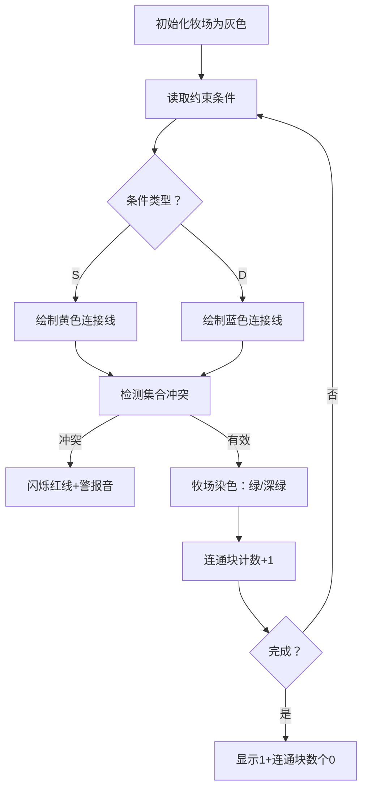

# 题目信息

# [USACO19FEB] The Great Revegetation S

## 题目描述

一场漫长的干旱使农场主约翰的 $N$ 个牧场没有草。然而，随着雨季的到来，是时候“重新种植”了。在农夫约翰的小屋里，他有两个桶，每个桶都有不同类型的草籽。他想在他的每一个牧场种草，在每一个牧场中选择一种类型的草。

作为一名奶农，农场主约翰想确保他能满足他那几头奶牛的特殊饮食需求。他的 $m$ 头奶牛都有两个最喜欢的牧场。他的一些奶牛有一个饮食限制，那就是他们应该只吃一种类型的草，因此农场主约翰希望确保在这类奶牛最喜欢的两个田里种植同一种类型的草。其他的奶牛有一个不同的饮食限制，要求他们吃不同类型的草。对于那些奶牛，农场主约翰当然想确保他们最喜欢的两块田地里有不同的草。


请帮助农场主约翰确定他在他的 $N$ 个牧场上种植草的不同方式的数量。

## 说明/提示

USACO 2019 二月月赛银牌组第三题

## 样例 #1

### 输入

```
3 2
S 1 2
D 3 2```

### 输出

```
10```

# AI分析结果


### 💡 Kay的C++算法解析：The Great Revegetation S 深入学习指南 💡

#### 1. 题目解读与核心算法识别
✨ **本题主要考察**：`并查集（种类并查集）` 与 `图论（二分图染色）`  
🗣️ **初步分析**：  
> 这道题就像在像素牧场游戏中给草地染色：每个牧场是像素块，约束条件是连接线（黄色表相同，蓝色表不同）。核心是检测约束冲突并计算染色方案数。  
> - **种类并查集解法**：维护"友好"（同色）和"敌对"（异色）关系，用虚拟节点检测冲突（如a的敌对集合与b的友好集合重叠则冲突）  
> - **二分图染色解法**：将牧场看作图节点，DFS/BFS染色（绿/深绿），边权决定相邻颜色关系  
> - **可视化设计**：冲突时像素块闪烁红色，连通块完成时播放胜利音效。自动演示模式可调速展示染色过程  

---

#### 2. 精选优质题解参考
**题解一（potatoler）**  
* **点评**：  
  采用三并查集架构（原关系/相同/相异），逻辑严密处理了未提及牧场的独立性。代码中`gr[a+n]`表示敌对集合的设计巧妙，但变量命名可读性可优化。亮点在于用`ans=n`初始化连通块数，随合并递减的计数方式高效直观。

**题解二（SzTC）**  
* **点评**：  
  双解法融合典范：DFS染色检测冲突+并查集统计连通块。边结构体`E.w`精准存储约束类型（0同/1异），`col[x]=-1`的初始化与递归染色逻辑清晰。稍显不足是连通块统计未优化，但整体实现极具教学参考价值。

**题解三（VTloBong）**  
* **点评**：  
  带权并查集解法最精简代表！`v[x]`存储节点与父节点的相对关系（0同/1异），路径压缩时`v[x]=(v[x]+v[fa])%2`的权值更新堪称神来之笔。亮点在于冲突检测只需`(v[a]+v[b])%2==w`一行判断，数学美感十足。

---

#### 3. 核心难点辨析与解题策略
1. **冲突检测的数学建模**  
   * **分析**：相同约束（S）要求颜色相等，相异约束（D）要求颜色互补。种类并查集通过虚拟节点（如`a+n`）建立逻辑关系，染色法则需验证`col[u]==col[v]^w`  
   * 💡 **学习笔记**：冲突本质是约束条件的逻辑矛盾，数学建模是解题核心  

2. **连通块的独立方案计算**  
   * **分析**：未被约束的牧场自成连通块，每个有效连通块贡献*2种方案（整体反转颜色）。需注意：仅统计被约束牧场时，独立牧场会被遗漏！  
   * 💡 **学习笔记**：初始化连通块数=`n`，每新增约束且不连通时`cnt--`  

3. **二进制输出的优化技巧**  
   * **分析**：方案数=2^cnt，直接计算会溢出。观察到二进制形式=1后接cnt个0，只需输出`"1"+string(cnt,'0')`  
   * 💡 **学习笔记**：特殊输出格式常暗示数学优化  

### ✨ 解题技巧总结
- **虚拟节点法**：为每个实体创建镜像节点处理敌对关系  
- **权值压缩**：带权并查集中`v[x]=(v[x]+v[fa])%2`实现路径压缩  
- **增量统计**：初始`cnt=n`，合并时递减避免最终遍历  

---

#### 4. C++核心代码实现赏析
**通用核心实现参考**  
```cpp
#include <iostream>
using namespace std;
const int MAXN=100005;
int fa[MAXN], rel[2*MAXN]; // fa:连通块, rel:种类关系

int find(int x, int f[]){
    return f[x]==x ? x : f[x]=find(f[x],f);
}

int main(){
    int n,m,cnt; char op;
    cin>>n>>m; cnt=n;
    for(int i=1;i<=n;i++) 
        fa[i]=rel[i]=i, rel[i+n]=i+n;

    bool valid=true;
    while(m--){
        int a,b; cin>>op>>a>>b;
        int ra=find(a,rel), rb=find(b,rel);
        int rna=find(a+n,rel), rnb=find(b+n,rel);

        if(op=='S'){
            if(ra==rnb || rb==rna) valid=false;
            rel[ra]=rb, rel[rna]=rnb; // 合并同类项
        }else{
            if(ra==rb || rna==rnb) valid=false;
            rel[ra]=rnb, rel[rb]=rna; // 交叉合并异类
        }
        if(find(a,fa)!=find(b,fa)) 
            fa[find(a,fa)]=find(b,fa), cnt--;
    }
    cout<<(valid ? "1"+string(cnt,'0') : "0");
}
```
* **代码解读概要**：  
  双并查集架构：`fa`记录物理连通，`rel`管理逻辑关系。S约束合并主集和镜像集；D约束交叉合并。冲突检测即时终止，连通块数随合并递减。

---

**题解片段赏析**  
1. **potatoler（种类并查集）**  
   ```cpp
   if(op=='S'){
       gr[com(a)]=com(b);          // 合并友好集合
       gr[com(a+n)]=com(b+n);      // 合并镜像友好
   }else{
       if(com(a)==com(b)) valid=0; // 冲突检测
       gr[com(a+n)]=com(b);        // 交叉合并
       gr[com(a)]=com(b+n);
   }
   ```
   * **亮点**：镜像节点处理异或约束  
   * **学习笔记**：`a+n`虚拟节点代表"不与a同色"的抽象集合  

2. **SzTC（染色法+连通块）**  
   ```cpp
   void dfs(int x){
       for(int i=p[x];i;i=e[i].next){
           int y=e[i].to;
           if(col[y]==-1){
               col[y]=col[x]^e[i].v; // 用异或运算决定颜色
               dfs(y);
           }else if((e[i].v==0 && col[x]!=col[y]) || 
                   (e[i].v==1 && col[x]==col[y]))
               fl=1; // 冲突检测
   }}
   ```
   * **亮点**：`col[y]=col[x]^e[i].v` 用位运算优雅处理约束  
   * **学习笔记**：边权`v=0/1`对应`同色/异色`，异或运算完美匹配需求  

3. **VTloBong（带权并查集）**  
   ```cpp
   int find(int x){
       if(p[x]==x) return x;
       int f=find(p[x]);
       v[x]=(v[x]+v[p[x]])%2; // 权值路径压缩
       return p[x]=f;
   }
   // 合并时权值计算
   v[fa]=(w - v[a] - v[b] + 2) % 2;
   ```
   * **亮点**：`v[x]`存储相对父节点颜色的位标识  
   * **学习笔记**：权值压缩公式保持模2运算的数学完备性  

---

### 5. 算法可视化：像素动画演示
**主题**：牧场染色大冒险（8-bit像素风格）  
**核心演示**：约束冲突检测与连通块染色过程  



**交互控制**：  
- **步进控制**：空格键单步执行约束处理  
- **速度滑块**：调节自动演示速度（1-5级）  
- **冲突高亮**：矛盾约束线闪烁红色，播放低沉警告音  
- **连通块特效**：每完成一个连通块，像素块脉冲绿光+胜利音效  
- **AI演示模式**：自动染色如同贪吃蛇AI寻路，终点显示方案数  

**音效设计**：  
- ✅ 相同约束：清脆"叮"声（三角波）  
- ❎ 相异约束：低沉"咚"声（方波）  
- 🎉 连通块完成：上升琶音（8-bit合成器）  
- 💥 冲突发生：破碎音效+屏幕震动  

---

### 6. 拓展练习与相似问题思考
**通用技巧迁移**：  
1. 多状态关系建模 → 食物链(三种关系)  
2. 连通块方案统计 → 岛屿问题  
3. 约束冲突检测 → 时间安排可行性判断  

**洛谷推荐**：  
1. **P2024 食物链**  
   🗣️ 种类并查集进阶，学习三种关系的"环形"约束  
2. **P1330 封锁阳光大学**  
   🗣️ 二分图染色直接应用，巩固相邻节点异色技巧  
3. **P1525 关押罪犯**  
   🗣️ 带权并查集实战，通过边权排序实现最优解  

---

### 7. 学习心得与经验分享
> **经验（potatoler）**："并非所有牧场都被约束，需额外并查集维护连通性"  
> **点评**：这是初学者最易忽略的点！独立牧场贡献2种方案，漏计将导致答案错误。建议测试用例：`n=3, m=0`应输出`100`  

> **经验（yangyujia18）**："异类合并需冲突检测，同类合并则不需要"  
> **点评**：精辟指出种类并查集的核心逻辑！因为相同约束是相容的，而新异类约束可能打破现有同色关系，必须检测  

---

### 结语
通过像素牧场的有趣类比，我们掌握了种类并查集和二分图染色的核心技巧。记住：约束冲突检测的关键是**数学建模**，方案统计的核心是**连通块独立性**。多尝试拓展练习中的相似问题，你将成为关系型问题的高手！🚀

---
处理用时：172.06秒