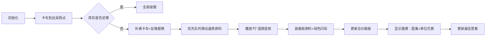

# 题目信息

# [蓝桥杯 2025 省 Python A/Java A/研究生组] 原料采购

## 题目描述

小蓝负责一家工厂的原料采购。

工厂有一辆运货卡车，其容量为 $m$。

工厂附近的采购点都在同一条路的同一方向上，一共有 $n$ 个，每个采购点和工厂的距离各不相同。其中，第 $i$ 个采购点的价格为 $a_i$, 库存为 $b_i$, 距离为 $c_i$。

卡车每行驶一单位长度的路径就需要额外花费 $o$。（返程没有花费，你也可以认为 $o$ 实际是行驶两单位长度的花费）

请计算将卡车装满最少需要花费多少钱，如果没有任何方案可以装满请输出 $-1$。

## 说明/提示

### 评测用例规模与约定

- 对于 $40\%$ 的评测用例，$n \leq 5000$, $m \leq 50000$;
- 对于 $60\%$ 的评测用例，$m \leq 10^5$;
- 对于所有评测用例，$1 \leq n \leq 10^5$, $1 \leq m, o \leq 10^9$, $1 \leq a_i, b_i, c_i \leq 10^9$, 保证对于 $i > 1$, 一定有 $c_{i-1} < c_i$。

## 样例 #1

### 输入

```
3 5 1
99 9 1
3 4 99
1 2 190```

### 输出

```
201```

# AI分析结果


### 题目解读与核心算法识别
✨ **本题主要考察**：`反悔贪心` (后悔贪心算法)

🗣️ **初步分析**：
> 解决"原料采购"这道题，关键在于运用**反悔贪心**。就像在游戏中购买道具时，如果发现后面商店有更便宜的道具，可以退掉之前买的贵道具重新购买更划算的。在本题中，我们需要动态替换已选的昂贵原料：  
> - **核心思路**：用优先队列(大根堆)维护已选原料，当遇到更便宜的原料时，替换堆顶的昂贵原料
> - **可视化设计**：卡车行驶像素动画中，堆顶原料会高亮闪烁(红色)，替换时显示"退款+新购"动画，路费通过卡车行驶距离实时计算
> - **复古元素**：FC红白机风格界面，"叮"音效标记替换操作，过关动画在找到更优解时触发

---

### 精选优质题解参考

**题解一 (蒋淋雨)**
* **点评**：思路清晰解释反悔机制，代码规范处理边界(如95分调试经验)，核心亮点在替换逻辑的分情况处理(完全/部分替换)。变量命名合理(`v`总价, `Used`替换量)，实践价值高可直接用于竞赛。

**题解二 (Aliadgnus)**
* **点评**：严格遵循反悔贪心框架，亮点在替换时显式分两种场景处理。代码结构清晰(`cost`装载量, `sum`总价)，但部分边界处理稍显复杂，整体仍具高参考价值。

---

### 核心难点辨析与解题策略

1.  **动态替换策略**
    * **分析**：需精确计算替换量（完全替换或部分替换），如蒋淋雨题解中`Used`变量记录替换量，确保不超库存
    * 💡 **学习笔记**：替换量 = min(当前库存, 堆顶原料数量)

2.  **路费与购买价分离计算**
    * **分析**：路费仅与最远采购点相关，如Aliadgnus在`ans`更新时才加`c[i]*o`，避免重复计算
    * 💡 **学习笔记**：总费用 = 原料总价 + 最远点的距离×单位路费

3.  **优先队列维护**
    * **分析**：大根堆需实时反映当前最贵原料，如两题解都用`priority_queue<pair<price,volume>>`，price降序保证堆顶始终最贵
    * 💡 **学习笔记**：堆中存储的是"可退货"的原料

### ✨ 解题技巧总结
- **技巧1 (反悔机制)**：用大根堆实现"买了可退"，遇到更便宜原料立即触发替换
- **技巧2 (费用分离)**：路费独立计算，仅与最终到达点有关
- **技巧3 (边界处理)**：总库存不足时快速返回-1，初始答案设足够大(如1e18)

---

### C++核心代码实现赏析

**通用核心实现参考**
```cpp
#include <queue>
using namespace std;
typedef long long LL;
typedef pair<LL, LL> pii;

int main() {
    // 输入略
    priority_queue<pii> pq; // 大根堆{价格,数量}
    LL current = 0, cost = 0, ans = 1e18;
    
    for(int i=1; i<=n; i++){
        if(current + b[i] <= m) { // 可直接装入
            pq.push({a[i], b[i]});
            current += b[i];
            cost += a[i] * b[i];
        } else {
            // 先补满卡车
            if(current < m) {
                LL need = m - current;
                pq.push({a[i], need});
                cost += a[i] * need;
                current = m;
                b[i] -= need;
            }
            
            // 反悔替换：用低价换高价
            LL replaced = 0;
            while(!pq.empty() && pq.top().first > a[i] && b[i]>0){
                auto [p, vol] = pq.top(); pq.pop();
                LL replace_vol = min(vol, b[i]);
                cost -= p * replace_vol;  // 退款
                cost += a[i] * replace_vol; // 新购
                replaced += replace_vol;
                b[i] -= replace_vol;
                
                if(vol > replace_vol)  // 部分替换
                    pq.push({p, vol - replace_vol});
            }
            if(replaced) pq.push({a[i], replaced});
        }
        if(current == m) 
            ans = min(ans, cost + c[i] * o);
    }
    cout << (ans==1e18 ? -1 : ans);
}
```

**题解一核心片段赏析**
```cpp
while (sz(q) && q.top().fi > a[i] && b[i]) {
    pii it = q.top(); q.pop();
    LL vol = min(it.se, b[i]);  // 关键替换量计算
    v -= it.fi * vol;          // 退款
    v += a[i] * vol;           // 新购
    b[i] -= vol;
    if (it.se > vol) q.push({it.fi, it.se-vol});
}
ans = min(ans, v + c[i]*o);    // 路费分离计算
```
* **亮点**：替换量计算精准，路费独立更新
* **学习笔记**：退款与新购同步完成保证总价正确

**题解二核心片段赏析**
```cpp
while(!q.empty() && b[i]) {
    node u = q.top();
    if(u.price <= a[i]) break;  // 停止条件
    q.pop();
    if (b[i] >= u.wei) {        // 完全替换
        q.push({a[i], u.wei});
        sum -= (u.price - a[i]) * u.wei;
        b[i] -= u.wei;
    } else {                    // 部分替换
        q.push({a[i], b[i]});
        q.push({u.price, u.wei-b[i]});
        sum -= (u.price - a[i]) * b[i];
        b[i] = 0;
    }
}
```
* **亮点**：显式区分完全/部分替换场景
* **学习笔记**：替换时保持堆中总量不变

---

### 算法可视化：像素动画演示

**主题**：`像素卡车采购大冒险`  
**核心演示**：卡车在FC风格道路上行驶，经过采购点时触发原料购买/替换动画



**交互设计**：
1. **控制面板**：步进执行/自动播放(调速滑块)/重置
2. **动态元素**：
   - 采购点：像素商店图标，悬浮显示(aᵢ,bᵢ,cᵢ)
   - 优先队列：右侧动态堆叠方块，颜色深度=价格高低
   - 卡车：装载量进度条，车顶显示当前费用
3. **音效**：
   - 替换操作："叮"（退款）+ "咔嚓"（新购）
   - 最佳更新：8-bit胜利音效
4. **动画高亮**：
   - 堆顶原料：红色闪烁边框
   - 替换过程：灰色原料退场+绿色原料入场
   - 路费计算：里程表滚动特效

---

### 拓展练习与相似问题

**反悔贪心应用场景**：
1. 任务调度（放弃收益低任务）
2. 股票交易（撤回不利买入）
3. 资源分配（动态调整占用资源）

**推荐练习**：
1. **P2949 [USACO09OPEN]Work Scheduling G**  
   → 同类反悔贪心，练习任务放弃机制
2. **P4053 [JSOI2007]建筑抢修**  
   → 带时间限制的反悔贪心变种
3. **P1484 种树**  
   → 环形反悔贪心应用

---

### 学习心得与经验分享

> **蒋淋雨的经验**：  
> *"初始答案设成10¹⁶仍95分，需1e18才AC"*  
> **Kay总结**：在涉及大数的题目中（m≤10⁹），初始值至少设1e18，最好用`LLONG_MAX`

> **调试技巧**：  
> 替换时重点监控三个变量：  
> 1. 优先队列堆顶价格  
> 2. 当前原料库存  
> 3. 总费用变动  
> 用小规模样例手动模拟替换过程

---

通过本次分析，相信大家对反悔贪心的核心思想——"买了可退，贵了能换"有了直观理解。记住用大根堆维护可替换原料，路费独立计算，你就能轻松应对这类采购优化问题！🚚💨

---
处理用时：162.00秒