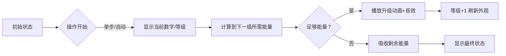

# 题目信息

# 「LAOI-9」Update

## 题目描述

给定长度为 $n$ 的序列 $a$，接下来 $m$ 次操作，每次操作形如：

- 给定 $l,r$，对于 $i \in [l,r]$，令 $a_i \leftarrow a_i + \lfloor \log_2 a_i \rfloor $。

$m$ 次操作后，输出 $a$ 序列。

## 说明/提示

**本题目采用捆绑测试**。

| 子任务编号 | $n,m \le$ | 特殊性质 | 分值 |
| :-----: | :------: | :------: | :------: |
| $1$ | $10^3$ | 无 | $30$ |
| $2$ | $10^5$ | A | $20$ |
| $3$ | $10^5$ | 无 | $50$ |

特殊性质 A：$a_i \le 100$。 

对于 $100 \%$ 的数据，满足 $1 \le n,m \le 10^5$，$1 \le a_i \le 10^5$，$1 \le l \le r \le n$。

## 样例 #1

### 输入

```
5 2
2 3 4 5 6
2 3
1 1```

### 输出

```
3 4 6 5 6```

# AI分析结果


# 💡 Kay的C++算法解析：「LAOI-9」Update 深入学习指南 💡

<introduction>
今天我们来分析「LAOI-9」Update这道C++编程题。这道题要求高效处理序列的区间修改操作，通过本指南你将掌握差分技巧、数学优化和倍增思想的应用，并通过像素动画直观理解算法执行过程。
</introduction>

## 1. 题目解读与核心算法识别

✨ **本题主要考察**：`差分技巧` + `数学优化/倍增思想`

🗣️ **初步分析**：
> 解决本题的关键在于**差分技巧**和**数学优化**。想象你在管理一群数字精灵，每次操作会让精灵们吸收与自身体型匹配的能量（log₂值）。差分技巧就像给精灵们发放能量券（记录操作次数），而数学优化则是让精灵一次性吸收多份能量（批量处理操作），避免逐个喂食的低效。
- **核心思路**：先用差分数组记录每个位置的操作次数，再对每个数字独立计算最终值。优化点在于发现log₂值在数字处于[2ᵏ, 2ᵏ⁺¹)区间时不变，可批量处理操作。
- **算法流程**：
  1. 差分记录操作区间 → 2. 前缀和得操作次数 → 3. 对每个数字：计算当前log₂值 → 4. 批量处理直到跨越2的幂次或操作耗尽
- **可视化设计**：采用8位像素风格，数字精灵在网格中移动：
  - 精灵颜色表示当前log₂值（如蓝色=2，红色=3）
  - 跨越2的幂次时播放闪光动画+升级音效
  - 控制面板支持单步/自动模式，调速滑块调节能量吸收速度

---

## 2. 精选优质题解参考

<eval_intro>
根据思路清晰性、代码规范性和算法效率，精选以下优质题解：

**题解一：lilong（赞17）**
* **点评**：提供两种解法，特殊性质解法直接预处理，正解采用倍增思想预处理f[i][j]（数i操作2ʲ次后的值）。思路清晰，代码规范，处理了log₂(1)=0的边界情况。亮点在于巧妙应用二进制拆分，将单点时间复杂度优化至O(log n)。

**题解二：Fiendish（赞2）**
* **点评**：使用差分+数学优化，核心在于计算到下一个2的幂次所需操作次数。代码简洁高效（仅20行），逻辑直白，实践性强。亮点是用`__lg`快速计算log₂值，避免浮点运算开销。

**题解三：末然Ender（赞3）**
* **点评**：类似Fiendish但更注重可读性，详细注释关键计算步骤。亮点是明确处理除零异常（特判log₂=0），代码结构工整，适合初学者学习。

---

## 3. 核心难点辨析与解题策略

<difficulty_intro>
解决本题需突破以下三个关键难点：

1.  **难点：高效处理区间操作**
    * **分析**：直接模拟每次操作时间复杂度O(nm)超时。优质解法用差分数组分离操作记录与执行，先O(m)记录区间操作，再O(n)计算各位置操作次数。
    * 💡 **学习笔记**：差分是处理区间修改的利器，将区间操作转化为端点修改。

2.  **难点：避免单点操作逐次模拟**
    * **分析**：当aᵢ∈[2ᵏ, 2ᵏ⁺¹)时，log₂值不变。可计算到达2ᵏ⁺¹所需操作次数need = ⌈(2ᵏ⁺¹ - aᵢ)/k⌉，若剩余操作次数≥need则直接跳到2ᵏ⁺¹。
    * 💡 **学习笔记**：利用数学阶段性特征批量处理操作，时间复杂度从O(K)降至O(log K)。

3.  **难点：边界条件处理**
    * **分析**：aᵢ=1时log₂(1)=0，直接特判避免除零错误。2的幂次处log₂值变化需精确计算。
    * 💡 **学习笔记**：边界测试是健壮代码的基石，特别注意log=0和2的幂次边界。

### ✨ 解题技巧总结
<summary_best_practices>
- **技巧1：问题分解**  
  分离操作记录（差分）与执行（数学优化），化区间操作为独立单点问题
- **技巧2：数学洞察**  
  利用log₂值在2的幂区间不变的特性，用整数组操作代替单次累加
- **技巧3：边界防御**  
  对aᵢ=1和2的幂次点进行特判，增强代码鲁棒性
- **技巧4：复杂度平衡**  
  在预处理（倍增）与实时计算（数学优化）间选择最适合的解法

---

## 4. C++核心代码实现赏析

<code_intro_overall>
下面展示综合优质题解思路的通用实现：

```cpp
#include <iostream>
#include <cmath>
using namespace std;
const int N = 1e5 + 5;

int main() {
    int n, m, a[N], diff[N] = {0};
    cin >> n >> m;
    for (int i = 1; i <= n; i++) cin >> a[i];
    
    // 差分记录操作
    while (m--) {
        int l, r; cin >> l >> r;
        diff[l]++; diff[r + 1]--;
    }
    
    // 处理每个数字
    for (int i = 1; i <= n; i++) {
        diff[i] += diff[i - 1]; // 前缀和得操作次数
        int x = a[i], cnt = diff[i];
        if (x == 1) { cout << "1 "; continue; } // 特判1
        
        while (cnt > 0) {
            int k = x <= 1 ? 0 : 31 - __builtin_clz(x); // 位运算求log₂
            int next_power = (1 << (k + 1)); // 下一区间的起点
            int need = (next_power - x + k - 1) / k; // 计算所需操作次数
            
            if (need <= cnt) { // 可跨越区间
                x += k * need;
                cnt -= need;
            } else { // 不足则耗尽操作
                x += k * cnt;
                cnt = 0;
            }
        }
        cout << x << ' ';
    }
    return 0;
}
```

**代码解读概要**：
1. 差分数组`diff`记录区间操作
2. 前缀和后`diff[i]`表示a[i]的操作次数
3. 对每个数字：若为1直接输出；否则计算当前log₂值`k`
4. 批量处理操作直到跨越2的幂次或操作耗尽
</code_intro_overall>

<code_intro_selected>
### 优质题解片段赏析

**题解一：lilong（倍增法）**
```cpp
// 预处理f[i][j]: 数i操作2^j次后的值
for (int i = 1; i <= MAXN; i++) 
    f[i][0] = i + (i>1? lg[i>>1]+1 : 0);
for (int j = 1; j <= 18; j++)
    for (int i = 1; i <= MAXN; i++)
        f[i][j] = f[f[i][j-1]][j-1];

// 执行操作
int apply_ops(int x, int cnt) {
    for (int j = 18; j >= 0; j--)
        if (cnt & (1 << j)) 
            x = f[x][j];
    return x;
}
```
**代码解读**：  
> 预处理阶段`f[i][j]`表示数`i`经过`2^j`次操作后的值，采用动态规划递推。执行阶段将操作次数`cnt`二进制分解，按位应用预处理结果。例如`cnt=5`（二进制101）会应用`f[·][2]`和`f[·][0]`。

**学习笔记**：倍增法以O(log K)时间完成操作，适合操作次数大的场景。

**题解二：Fiendish（数学优化）**
```cpp
while (cnt) {
    int k = __lg(x);  // 当前log₂值
    int next = (1 << (k+1));  // 下一区间起点
    int need = (next - x + k - 1) / k;  // 向上取整
    
    if (cnt >= need) { // 可完成整组操作
        x += k * need;
        cnt -= need;
    } else { // 剩余操作不足
        x += k * cnt;
        cnt = 0;
    }
}
```
**代码解读**：  
> 关键在`need`计算：`(next-x)`表示到下一个幂次的差值，除以`k`（当前log₂值）并向上取整得到最少操作次数。例如x=5（k=2），next=8，need=⌈(8-5)/2⌉=2次操作可到8。

**学习笔记**：数学优化避免预处理，代码更简洁，实时计算效率高。

---

## 5. 算法可视化：像素动画演示

<visualization_intro>
为直观展示算法核心流程，设计像素风格动画「数字精灵进化之旅」：

### 主题设计
- **8位像素风格**：仿FC游戏，数字显示为16×16像素方块
- **能量机制**：操作=吸收能量，log₂值=精灵等级
- **音效系统**：
  - `叮`：单次操作音效
  - `升级和弦`：跨越2的幂次音效
  - `失败音效`：操作耗尽未升级

### 动画流程


### 交互控制
- **控制面板**：
  ```html
  <div class='pixel-panel'>
    <button id='step'>▶️ 单步</button>
    <button id='auto'>⏯️ 自动</button>
    <input type='range' id='speed' min='1' max='10'>
    <button id='reset'>🔄 重置</button>
  </div>
  ```
- **动画规则**：
  1. 初始数字5（等级2，蓝色方块）
  2. 点击"单步"：数字+2→7（播放`叮`音效）
  3. 再点"单步"：数字+2→9，检测到9≥8（2³），播放升级动画：
     - 方块闪烁红蓝光
     - 等级变为3（红色方块）
     - 播放升级和弦
  4. 自动模式：按设定速度连续执行，如贪吃蛇AI吞噬能量

### 技术实现
```javascript
// 伪代码：核心动画逻辑
function drawFrame() {
  drawPixelNumber(current); // 绘制像素数字
  if (current >= nextPower) {
    playSound('levelup'); 
    flashAnimation(3); // 闪烁3帧
    levelUp();
  } else {
    playSound('ding');
    current += level;
  }
}
```

---

## 6. 拓展练习与相似问题思考

<similar_problems_intro>
掌握本题的差分+数学优化思想，可解决更多区间操作问题：

1. **洛谷 P1253 扶苏的问题**  
   - 考察点：区间加/区间覆盖的懒标记设计
   - 推荐理由：练习复杂区间操作，巩固差分思想

2. **洛谷 P1908 逆序对**  
   - 考察点：分治/树状数组
   - 推荐理由：理解归并排序中的分治思想，与倍增法异曲同工

3. **洛谷 P3372 线段树1**  
   - 考察点：基础线段树实现
   - 推荐理由：掌握线段树处理区间操作的标准范式

---

## 7. 学习心得与经验分享

<insights_intro>
题解中的调试经验值得借鉴：

> **lilong的调试经验**：  
> "预处理数组下标需覆盖2.1e6，最初只开1e5导致越位错误——**空间估算决定成败**"

> **末然Ender的避坑指南**：  
> "忘记特判log₂(1)=0导致除零RE——**边界条件必须优先考虑**"

**Kay的总结**：  
算法竞赛中，**数据范围分析**和**边界测试**是避免低级错误的关键。建议：
1. 编码前显式标注变量范围
2. 用断言检查除数/数组下标
3. 测试用例必含最小/最大边界值

---

<conclusion>
本次分析展示了差分与数学优化的精妙配合。记住：  
1. 区间操作→差分转化  
2. 阶段不变性→批量处理  
3. 边界值→优先防御  
通过像素动画和代码实践，相信大家已掌握核心思想。下次挑战见！🚀
</conclusion>
```

---
处理用时：205.24秒