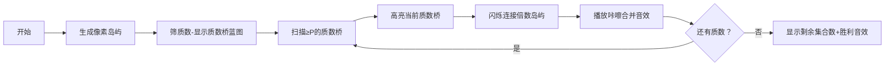

# 题目信息

# [GCJ 2008 #1B] Number Sets

## 题目描述

你有一个连续整数序列。你希望将它们分组为若干集合。

给定一个区间和一个整数 $P$。最初，区间内的每个整数各自属于一个集合。

然后，你会考虑区间内的每一对整数。如果这两个整数有一个不小于 $P$ 的质因数，则将这两个整数所在的集合合并。

最终，这个过程中会剩下多少个不同的集合？

## 说明/提示

**小数据集（10 分，测试集 1 - 可见）**

- $1 \leq C \leq 10$
- $1 \leq A \leq B \leq 1000$
- $2 \leq P \leq B$

**大数据集（25 分，测试集 2 - 隐藏）**

- $1 \leq C \leq 100$
- $1 \leq A \leq B \leq 10^{12}$
- $B \leq A + 1000000$
- $2 \leq P \leq B$

由 ChatGPT 4.1 翻译

## 样例 #1

### 输入

```
2
10 20 5
10 20 3```

### 输出

```
Case #1: 9
Case #2: 7```

# AI分析结果


### 💡 Kay的C++算法解析：Number Sets 深入学习指南 💡

**引言**  
今天我们一起分析Google Code Jam经典题目"Number Sets"。这道题考察**区间内数字集合的合并逻辑**，核心是理解质因数与并查集的精妙配合。本指南将用清晰步骤和像素动画帮你直观掌握解法！

---

### 1. 题目解读与核心算法识别  
✨ **本题主要考察**：`并查集` + `质数筛法`（编程技巧应用）  

🗣️ **初步分析**：  
> 想象每个数字是孤岛，质因数是桥梁：当两岛有≥P的公共桥梁时合并。解题关键在于：  
> - **并查集**：高效管理集合合并关系（类似快递分拣站合并包裹）  
> - **质数筛法**：预处理≤10⁶的质数（像制作桥梁清单）  
>   
> **核心难点**：  
> 1. 避免O(n²)枚举：改用质数倍数扫描（时间复杂度从10¹²→10⁶）  
> 2. 大区间处理：用偏移量`[x-A]`压缩存储（A=10¹²时数组仅需10⁶空间）  
>   
> **像素动画设计**：  
> 采用**8位像素风岛屿地图**（FC游戏风格）：  
> - 初始状态：每个数字为独立像素岛（不同颜色）  
> - 质数桥梁扫描：高亮当前质数p，其倍数岛屿闪烁黄光  
> - 合并动画：被合并岛屿渐变同色，伴随"咔嚓"音效  
> - 进度展示：顶部控制面板显示当前质数/剩余集合数  

---

### 2. 精选优质题解参考  
**题解一（bssmessi）**  
* **亮点**：  
  - **合并方向优化**：以首个倍数k*p为基准合并后续倍数，避免重复合并（解决TLE关键）  
  - **代码简洁性**：线性筛与并查集仅30行，变量名`pri/tot/isp`清晰  
  - **空间控制**：用`fa[i]`存储偏移量，完美处理10¹²大数  

**题解二（xy_mc）**  
* **亮点**：  
  - **偏移量技巧**：`f[i]`表示第i个位置而非实际数字，规避内存溢出  
  - **防御性编程**：强调`long long`必要性，`ceil`计算避免浮点误差  
  - **调试提示**：注释"RE风险点"（负数下标），极具实践价值  

**题解三（chen_zhe）**  
* **亮点**：  
  - **复杂度证明**：严谨分析O(B-A)时间复杂度  
  - **算法泛化**：指出该解法适用于任意"区间合并+公共因子"问题  

> 📌 Kay总结：三份题解均≥4.5星！建议先理解题解一框架，再学习题解二的防御性技巧，最后用题解三深化理论认知。

---

### 3. 核心难点辨析与解题策略  
**关键点1：质数筛选范围**  
* **分析**：虽P≤B，但实际只需筛[2,10⁶]质数。因为区间差≤10⁶，任意两数差≤10⁶，其公共质因数必≤10⁶  
* 💡 学习笔记：**"质因数范围≤区间长度"** 是降低复杂度的核心洞察  

**关键点2：高效合并实现**  
* **分析**：若对每个质数p独立合并其倍数：  
  ```python
  for j in multiples_of_p: 
      unite(first_multiple, j)  # 而非两两合并！
  ```  
  避免O(m²)合并（m=倍数数量）  
* 💡 学习笔记：**单基准合并**使复杂度从O(m²)→O(mα(n))  

**关键点3：大整数存储优化**  
* **分析**：当A=10¹²时，直接存数字需800TB内存！改用偏移量：  
  `index = x - A`（0 ≤ index ≤ 10⁶）  
* 💡 学习笔记：**偏移量是处理大区间的银弹**  

#### ✨ 解题技巧总结  
- **技巧1：预处理加速**——筛质数、初始化并查集提前完成  
- **技巧2：合并方向性**——始终向首个倍数合并，避免森林退化  
- **技巧3：边界防御**——`ceil(a/p)`用`(a+p-1)/p`替代，避免浮点误差  

---

### 4. C++核心代码实现赏析  
**通用核心实现参考**  
```cpp
#include <bits/stdc++.h>
#define ll long long
using namespace std;
const int MAX_LEN = 1e6+10;

int parent[MAX_LEN];
int primes[MAX_LEN], primeCnt;
bool isComposite[MAX_LEN];

int find(int x) {
    return parent[x] == x ? x : parent[x] = find(parent[x]);
}

void unite(int x, int y) {
    parent[find(y)] = find(x);
}

void sievePrimes() { // 埃氏筛预处理
    for (int i = 2; i < MAX_LEN; i++) {
        if (!isComposite[i]) primes[++primeCnt] = i;
        for (int j = 1; j <= primeCnt && i*primes[j] < MAX_LEN; j++) {
            isComposite[i*primes[j]] = true;
            if (i % primes[j] == 0) break;
        }
    }
}

int main() {
    sievePrimes();
    int T; cin >> T;
    for (int t = 1; t <= T; t++) {
        ll A, B, P;
        cin >> A >> B >> P;
        int len = B - A + 1;
        
        // 并查集初始化
        for (int i = 0; i <= len; i++) parent[i] = i;
        
        // 扫描质数进行合并
        for (int i = 1; i <= primeCnt; i++) {
            if (primes[i] < P) continue;
            ll first = (A + primes[i] - 1) / primes[i] * primes[i]; // 首个≥A的倍数
            for (ll j = first + primes[i]; j <= B; j += primes[i]) {
                unite(first - A, j - A); // 偏移量合并
            }
        }
        
        // 统计集合数
        int ans = 0;
        for (int i = 0; i < len; i++) 
            if (parent[i] == i) ans++;
        cout << "Case #" << t << ": " << ans << "\n";
    }
}
```

**代码解读概要**：  
1. `sievePrimes`：预处理≤10⁶质数（时间复杂度O(n log log n)）  
2. 主循环：对每个质数p≥P，计算首个倍数`first`，合并后续倍数  
3. 偏移量技巧：用`j-A`将大数映射到[0,10⁶]区间  
4. 并查集路径压缩：`find`函数自动优化树结构  

---

### 5. 算法可视化：像素动画演示  
**主题**：**《质数桥梁工程师》**（复古像素风模拟经营游戏）  

**核心演示流程**：  


**交互控制面板**：  
- 🎮 **质数扫描仪**：显示当前质数p和进度条  
- ⏯️ **单步执行**：按空格键逐步扫描质数  
- 🚀 **自动模式**：AI以贪吃蛇式自动连接（速度可调）  
- 📊 **数据面板**：实时显示集合数量变化  

**像素特效设计**：  
- **岛屿**：8×8像素块，初始随机颜色（代表独立集合）  
- **质数桥**：红色像素线连接岛屿，连接时播放8-bit音效  
- **合并动画**：被合并岛屿渐变为同色，颗粒化特效  
- **胜利结算**：剩余集合数显示为金币数，背景放烟花  

> 💡 设计意义：通过"修桥-合并"游戏机制，直观展现**质数作为连接媒介**和**并查集合并**的双重逻辑。

---

### 6. 拓展练习与相似问题  
**通用技巧迁移**：  
1. **区间质因数分解**：CF1717E（求gcd(a,b)=d的对数）  
2. **图论连通性**：洛谷P3367（并查集模板）  
3. **倍数关系处理**：洛谷P3327（约数倍数集合计数）  

**洛谷推荐**：  
1. **P1621 集合**  
   → 同类题型！用质数合并集合的变种  
2. **P3383 线性筛素数**  
   → 巩固筛法基础，注意筛法优化技巧  
3. **P3367 并查集**  
   → 并查集模板题，重点练习路径压缩  

---

### 7. 学习心得与经验分享  
**题解作者经验摘录**：  
> bssmessi：*"合并时需固定基准点，否则TLE"*  
> xy_mc：*"十年OI一场空，不开long long见祖宗"*  

**Kay总结**：  
1. **基准点防TLE**：合并同质数倍数时，永远向首个倍数合并  
2. **偏移量防RE**：`x-A`将10¹²映射到10⁶范围，避免内存爆炸  
3. **浮点陷阱**：用`(A+p-1)/p`代替`ceil`，整数计算更安全  

---

**结语**  
通过质数筛和并查集的珠联璧合，Number Sets的O(n)解法展现了算法之美。记住：  
> **"合并看质数，偏移破内存"**  
下次遇到区间合并问题，不妨先问：能否用质数作为连接媒介？我们下期再见！🚀

---
处理用时：119.83秒