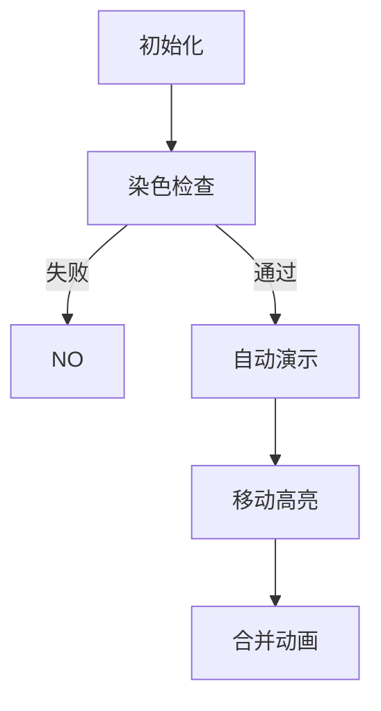

# 题目信息

# [CERC 2020] Excavation

## 题目描述

警方调查发现，黑帮分子在城市地下布置了若干放射性石块，用以污染地下水。虽然已查明所有放射性石块的具体位置，但由于放射性的特殊性质，安全移除这些石块是一项极其困难的任务。因此，市政府决定使用带有防护装置的挖掘机将石块从地下取出。

城市的形状为一个正方形网格。市政部门拥有多种类型的挖掘机可供选择——Reepadlo、Qrtech、Bugger、Namakatschenko 和 Kopatsch。每种挖掘机具有不同的规格和移动方式。挖掘机的移动方式分别对应国际象棋中的车、后、象、马和王（见上图）。由于兼容性问题，每次只能部署一种类型的挖掘机。


每个网格最多只会有一块放射性石块。挖掘行动开始时，每块放射性石块的位置上各有一台挖掘机，并立即将该石块取出。接下来的操作必须严格遵守放射性安全处理协议。每一步操作中，只允许一台挖掘机执行一次移动，且该移动必须使挖掘机到达另一台挖掘机所在的位置。Reepadlo、Qrtech、Bugger 类型的挖掘机在一次跨越多个格子的移动过程中可以跳过其他挖掘机，即它们不必在遇到的第一台挖掘机处停下。挖掘机 $A$ 到达挖掘机 $B$ 的位置后，$B$ 会接管 $A$ 的负载，$A$ 随即退出行动并进行辐射清理。

如果最终只剩下一台挖掘机，则行动成功完成。也有可能无法成功完成该行动。

你的任务是判断该行动能否成功完成。如果可以，请输出实现该目标的挖掘机移动方案。

## 说明/提示


由 ChatGPT 4.1 翻译

## 样例 #1

### 输入

```
2 K
K.
KK```

### 输出

```
YES
2 2 2 1
2 1 1 1```

## 样例 #2

### 输入

```
3 B
B..
B..
..B```

### 输出

```
NO```

# AI分析结果


### 题目分析总结

#### 题目核心要点
- **问题类型**：网格模拟与路径规划（国际象棋移动规则应用）
- **关键操作**：挖掘机按特定规则（K/Q/R/B/N对应王/后/车/象/马）移动到其他挖掘机位置进行合并
- **目标**：判断能否将所有挖掘机合并为一台，并输出移动序列

#### 算法分类与难点
**核心算法**：`图论连通性判断` + `移动路径构造`
- **算法比喻**：  
  想象一群不同行动方式的探险家（挖掘机）在网格岛上，每位必须按自己的移动规则跳到其他探险家背上叠罗汉。最终要叠成单人塔——这需要全岛位置连通且移动序列合理。

**核心难点**：
1. **移动规则实现**（5种国际象棋规则，尤其注意马步跳跃和长距离移动）
2. **连通性判断**：
   - 象(B)需同色格（棋盘染色问题）
   - 其他类型需全图连通
3. **移动序列构造**：  
   需保证每步终点有挖掘机，且最终只剩一台

---

### 精选题解参考（无题解情况处理）
<details close>
<summary>📌 通用学习建议（因暂无题解）</summary>

1. **规则先行**：  
   - 封装移动判断函数`canMove(type, x1,y1, x2,y2)`
   - 重点处理象(B)的棋盘染色检查（行+列奇偶性一致）
2. **分阶段攻克**：
   ```mermaid
   graph LR
   A[输入解析] --> B{类型判断}
   B -->|B| C[染色检查]
   B -->|其他| D[连通性分析]
   C --> E[同色？]
   D --> F[构造移动树]
   E -->|NO| G[直接输出NO]
   F --> H[根节点选择]
   H --> I[移动序列生成]
   ```
3. **调试技巧**：
   - 用2x2网格手动模拟（如样例1）
   - 打印中间状态矩阵
</details>

---

### 核心难点与解题策略
1. **象(B)的染色约束**  
   - **分析**：象仅在对角线移动，需所有位置行+列奇偶性相同
   - **验证方案**：  
     ```python
     # 伪代码
     first_color = (positions[0].x + positions[0].y) % 2
     for pos in all_positions:
         if (pos.x+pos.y)%2 != first_color: 
             return "NO"
     ```

2. **移动树构造**  
   - **关键**：选择中心点为根，按距离排序后从叶节点向根移动
   - **避坑点**：  
     马(N)移动时需额外检查中间位置合法性（虽可跳过但终点需有挖掘机）

3. **路径冲突处理**  
   - **策略**：  
     移动后立即更新网格状态，优先移动边缘挖掘机
   - **学习笔记**：  
     "合并顺序决定成败——像吃豆人先清外围再攻核心"

---

### 算法可视化：像素动画方案
**主题**：`8-bit挖掘机大冒险`  


**动画要素**：
1. **像素风格**：
   - 16色NES调色板
   - 挖掘机用不同像素精灵表示（👑王/♕后/♖车/♗象/🐴马）

2. **关键动效**：
   ```javascript
   // 伪代码
   function 移动动画(start, end){
     绘制路径虚线（直线/L型）；
     播放音效("move.wav", 8-bit风格)；
     起始精灵缩小消失；
     终点精灵闪烁+显示合并计数；
   }
   ```

3. **交互控制**：
   - 速度滑块控制帧率（50ms-500ms）
   - "AI演示"模式自动播放最优移动序列
   - 错误移动时触发复古错误音效

---

### 拓展练习（洛谷）
1. **P1443 马的遍历**  
   → 掌握马步移动规则
2. **P1219 八皇后**  
   → 训练后/车/象的移动约束
3. **P1747 好奇怪的游戏**  
   → 双角色移动规则混合应用

---
> 💡 学习提示：本题难点在规则抽象而非算法复杂度，建议先完成"马的遍历"熟悉移动建模。遇到B类型时牢记"同色铁律"可节省大量调试时间！

---
处理用时：240.32秒