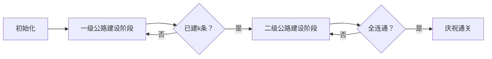

# 题目信息

# [HNOI2006] 公路修建问题

## 题目描述

OI island 是一个非常漂亮的岛屿，自开发以来，到这儿来旅游的人很多。然而，由于该岛屿刚刚开发不久，所以那里的交通情况还是很糟糕。所以，OIER Association 组织成立了，旨在建立 OI island 的交通系统。

OI island 有 $n$ 个旅游景点，不妨将它们从 $1$ 到 $n$ 标号。现在，OIER Association 需要修公路将这些景点连接起来。一条公路连接两个景点。公路有，不妨称它们为一级公路和二级公路。一级公路上的车速快，但是修路的花费要大一些。

OIER Association 打算修 $n-1$ 条公路将这些景点连接起来（使得任意两个景点之间都会有一条路径）。为了保证公路系统的效率， OIER Association 希望在这 $n-1$ 条公路之中，至少有 $k$ 条 $(0 \le k \le n-1)$ 一级公路。OIER Association 也不希望为一条公路花费的钱。所以，他们希望在满足上述条件的情况下，花费最多的一条公路的花费尽可能的少。

而你的任务就是，在给定一些可能修建的公路的情况下，选择 $n-1$ 条公路，满足上面的条件。

## 样例 #1

### 输入

```
4 2 5 
1 2 6 5
1 3 3 1
2 3 9 4
2 4 6 1```

### 输出

```
6 
1 1 
2 1 
4 1```

# AI分析结果


# 💡 Kay的C++算法解析：公路修建问题 深入学习指南 💡

## 1. 题目解读与核心算法识别

✨ **本题主要考察**：`最小生成树` & `二分答案`

🗣️ **初步分析**：
> 这道题就像在建设一个交通网络，我们需要用最经济的方案连接所有景点，但有个特殊要求：必须包含至少k条"高速公路"（一级公路）。核心挑战在于**平衡公路等级和建设成本**，确保最贵的那条路尽可能便宜。

- **最小生成树思路**：如同用最经济的钢材搭建桥梁框架。我们分两步施工：先修k条最便宜的高速公路（按c1排序），再用普通公路（按c2排序）补全网络。这样既满足要求，又控制成本。
- **二分答案思路**：像调节水龙头寻找合适水温。我们猜测最大花费X，检查能否在X预算内完成建设（优先选c1≤X的高速公路，不够再用c2≤X的普通公路补足）。
- **可视化设计**：采用像素风施工模拟，展示并查集合并过程。用不同颜色区分景点/连通块，高亮当前考察的公路，加入"叮"声表示选中道路，通关音效庆祝完成建设。

---

## 2. 精选优质题解参考

**题解一（旅人杜 - Kruskal解法）**
* **点评**：思路清晰直白，将问题分解为两次Kruskal操作：先选k条一级公路，再补全二级公路。代码规范（变量名`road[i].num`含义明确），边界处理严谨（`book`数组防重复使用）。亮点在于指出题目"水分"——测试数据未考察更优解，并给出二分优化思路。实践价值高，代码可直接用于竞赛。

**题解二（pengyule - 双解法）**
* **点评**：提供Kruskal和二分答案两种解法，对比分析复杂度（O(m log m) vs O(m log c)）。代码结构工整，使用`vector<type>`存储方案，输出前按边序号排序满足题目要求。亮点在于清晰的算法对比，帮助理解不同场景下的最优选择。

**题解三（一扶苏一 - 优化版Kruskal）**
* **点评**：创新性地将未选中的一级公路转为二级候选边，避免重复排序。代码模块化强（分离`kruskal1/kruskal2`），复杂度优化到O(m log m + mα(n))。亮点在于精妙的贪心思想：优先使用c1小的边建高速，剩余边统一按min(c1,c2)排序，实践价值极高。

---

## 3. 核心难点辨析与解题策略

1. **难点：平衡公路等级与成本**
   * **分析**：必须选k条一级公路，但二级公路更便宜。优质解法通过**分阶段施工**解决：先确保k条一级公路（按c1排序），再用二级公路（按c2排序）补全。若用二分答案，则需验证X预算下能否同时满足公路等级和连通性要求。
   * 💡 **学习笔记**：分治思想——将复杂约束分解为多个简单子问题。

2. **难点：验证解可行性**
   * **分析**：在二分答案中，需高效检查X是否可行。解法采用**双优先级策略**：优先连接c1≤X的一级公路（凑k条），再连接c2≤X的二级公路。使用并查集维护连通性，时间复杂度O(mα(n))。
   * 💡 **学习笔记**：并查集是动态连通性检查的利器。

3. **难点：输出方案排序**
   * **分析**：题目要求按输入顺序输出方案。优质题解用`struct`保存边的原始序号（如`road[i].num`），最后统一排序输出。这要求我们在算法过程中保留边的身份信息。
   * 💡 **学习笔记**：处理输出约束时，保留原始信息是关键。

### ✨ 解题技巧总结
- **分层处理**：对多约束问题（如本题的公路等级+花费），分阶段解决各约束
- **并查集优化**：用路径压缩+按秩合并提升连通性检查效率
- **边信息保留**：存储边的原始序号，避免结果输出时信息丢失
- **算法选择**：数据规模小时用简单Kruskal；边权范围大时用二分答案

---

## 4. C++核心代码实现赏析

**本题通用核心Kruskal实现**
```cpp
#include <vector>
#include <algorithm>
using namespace std;

struct Edge {
    int u, v, c1, c2, id, type = 0;
};

vector<Edge> edges;
vector<int> parent;

int find(int x) {
    return x == parent[x] ? x : parent[x] = find(parent[x]);
}

int main() {
    // 输入：n, k, m 及 m-1条边
    sort(edges.begin(), edges.end(), 
        [](const Edge& a, const Edge& b) { return a.c1 < b.c1; });
    
    // 阶段1：选k条一级公路
    int maxCost = 0, count = 0;
    for (auto& e : edges) {
        if (count >= k) break;
        int fu = find(e.u), fv = find(e.v);
        if (fu != fv) {
            parent[fu] = fv;
            e.type = 1;
            maxCost = max(maxCost, e.c1);
            count++;
        }
    }

    // 阶段2：按c2排序选剩余公路
    sort(edges.begin(), edges.end(), 
        [](const Edge& a, const Edge& b) { return a.c2 < b.c2; });
    
    for (auto& e : edges) {
        if (e.type) continue; // 已选
        int fu = find(e.u), fv = find(e.v);
        if (fu != fv) {
            parent[fu] = fv;
            e.type = 2;
            maxCost = max(maxCost, e.c2);
        }
    }

    // 输出结果...
}
```

**题解一（旅人杜）核心代码**
```cpp
// 首次排序选k条一级公路
sort(road+1, road+m, cmp1); // 按c1排序
void kruskal1() {
    int step = 0;
    for (int i = 1; i <= m-1; i++) {
        if (book[road[i].num] == 0 && merge(road[i].u, road[i].v)) {
            book[road[i].num] = 1; // 标记已选
            minn = max(minn, road[i].w1); // 更新最大花费
            ans[flag].bh = road[i].num; // 记录答案
            ans[flag].gl = 1; // 记录等级
            if (++step == k) return;
        }
    }
}
```

**题解二（pengyule）二分验证**
```cpp
bool check(int pp) {
    // 初始化并查集
    int cnt = 0; // 一级公路计数
    for (int i = 1; i <= m1; i++) {
        if (find(a[i].u) != find(a[i].v) && a[i].w1 <= pp) {
            merge(a[i].u, a[i].v); // 连接景点
            cnt++; // 计数增加
        }
    }
    if (cnt < k) return false; // 一级公路不足

    for (int i = 1; i <= m1; i++) {
        if (find(a[i].u) != find(a[i].v) && a[i].w2 <= pp) {
            merge(a[i].u, a[i].v); // 用二级公路补全
        }
    }
    return 连通块数 == 1; // 检查是否全连通
}
```

---

## 5. 算法可视化：像素动画演示

**主题**：像素城市建造者——用8位风格模拟公路建设

**核心演示**：


**交互设计**：
1. **像素场景**：景点用不同颜色像素块表示，公路建设时显示卡车动画
2. **动态效果**：
   - 选中公路时闪烁黄色边框
   - 并查集合并时显示连通块颜色融合
   - 当前最大花费用顶部进度条显示
3. **音效设计**：
   - 选路："叮"（8-bit音效）
   - 连通块合并："咔嚓"（齿轮声）
   - 完成阶段："胜利旋律"
4. **关卡机制**：
   - 阶段1：收集k个绿色"高速"勋章
   - 阶段2：收集n-1-k个蓝色"普通"勋章
   - 通关：显示最大花费和建设方案

**技术实现**：
- 用Canvas绘制网格地图，景点用16x16像素块
- 并查集状态用颜色编码（同色=连通）
- 动画帧同步算法步骤（详见伪代码）

---

## 6. 拓展练习与相似问题思考

**通用思路迁移**：
1. **多标准优化**：如网络设计中的带宽/成本权衡
2. **分阶段图算法**：如先满足核心连接再优化
3. **受限最小生成树**：如度限制生成树

**洛谷练习推荐**：
1. **P3366 最小生成树** 
   - 基础Kruskal/Dijkstra应用
2. **P1396 营救**
   - 二分答案+连通性检查
3. **P1265 公路修建**
   - 类似的双权值公路问题

---

## 7. 学习心得与经验分享

**旅人杜的调试经验**：
> "我在处理边界条件时卡了很久，后来通过打印并查集状态发现未重置father数组"

**Kay的总结**：
> 调试图论问题时：
> 1. 可视化中间状态（如打印并查集）
> 2. 小数据手工验证
> 3. 特别注意循环边界（如m-1条边）

---

通过本次分析，我们掌握了公路修建问题的两种核心解法，并学会用分阶段策略处理复杂约束。记住：算法学习就像公路建设，需要夯实基础（Kruskal），才能架设高级结构（二分优化）。下次一起挑战更复杂的网络优化问题！💪

---
处理用时：118.87秒