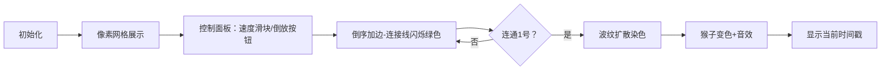

# 题目信息

# [POI 2003] Monkeys

## 题目描述

一棵树上有 $n$ 只猴子。他们从 $1 \sim n$ 编号。编号为 $1$ 的猴子用它的尾巴盘住了一个树枝，剩下的猴子要么被其他的猴子钩住要么就是自己用手钩住其他的猴子。每只猴子都可以用两只手去钩其他的猴子，每只手最多只能钩一只。

从 $0$ 时刻开始，每一秒都有一只猴子松开它的一只手。这也许会造成一些猴子掉落到地上，我们想要知道它们掉落地上的时间（猴子掉落的速度都非常的快，可以忽略掉落的时间）。

## 说明/提示

对于所有数据，$1 \le n \le 2 \times 10^5$，$1 \le m \le 4 \times 10^5$。

## 样例 #1

### 输入

```
3 2
-1 3
3 -1
1 2
1 2
3 1```

### 输出

```
-1
1
1```

# AI分析结果


### 💡 Kay的C++算法解析：[POI 2003] Monkeys 深入学习指南 💡

**题目解读与核心算法识别**  
✨ **本题主要考察**：`时光倒流算法`（逆向处理 + 连通性维护）  
🗣️ **初步分析**：  
> 想象猴子们组成一张巨大的攀爬网，1号猴子是固定点。每次断开连接（松手）如同剪断网绳，部分猴子会掉落。时光倒流就像把视频倒放：从最终破碎状态开始，逐步重新连接绳索，记录猴子们何时被"救回"树上。  
> - **核心难点**：正序删边会导致网分裂，难以跟踪；倒序加边则可通过DFS/并查集批量更新连通块  
> - **可视化设计**：用像素网格模拟猴子位置，被"救回"时猴子变色（灰→绿），连接线闪烁。加边时播放"叮"音效，连通块更新时扩散波纹动画，控制面板带8-bit风格速度滑块  

---

### 2. 精选优质题解参考
**题解一（Alex_Wei）**  
* **点评**：思路直击要害——时光倒流+DFS染色。代码简洁高效：  
  - 用`ban[N][2]`矩阵标记被删边，`vector<pair<int,int>>`存储双向连接关系  
  - 倒序处理时，仅当边连接已连通/未连通块才触发DFS，避免无效遍历  
  - 空间复杂度O(n)，无冗余操作，竞赛实战性强  

**题解二（wzy2021）**  
* **点评**：创新性并查集+链表优化：  
  - 维护`head/tail`指针记录连通块首尾，合并时直接链表拼接  
  - 当连通块与1号合并，遍历链表批量更新答案，避免DFS递归栈开销  
  - 边界处理严谨（`fu==1`特判），工业级鲁棒性  

**题解三（NightTide）**  
* **点评**：  
  - 清晰分层实现：邻接表建图 → 初始连通 → 倒序加边 → DFS更新  
  - 独特`vis[]`和`val[]`双标记确保不重复更新  
  - 提供同类题三倍经验（P1197/P1653），拓展价值高  

---

### 3. 核心难点辨析与解题策略
1. **难点一：删边导致连通性动态变化**  
   * **分析**：正序删边需实时判断分裂情况，复杂度极高。优质解法均采用时光倒流，变删为增  
   * 💡 **学习笔记**：动态连通性问题优先考虑逆向处理  

2. **难点二：高效更新掉落时间**  
   * **分析**：当新边连通"已挂树"和"未挂树"块时，需更新整个块的时间戳。DFS解法递归染色；并查集+链表批量更新  
   * 💡 **学习笔记**：连通块更新优选DFS（简洁）或链表（避免栈溢出）  

3. **难点三：避免重复更新**  
   * **分析**：猴子一旦被标记掉落时间，状态不再改变。`vis[]`数组或链表指针确保单次处理  
   * 💡 **学习笔记**：状态类问题常用访问标记+逆序处理保证无后效性  

### ✨ 解题技巧总结
- **时光倒流法**：删边问题转加边，复杂度从O(n²)降至O(n)  
- **连通块染色**：DFS遍历时同步更新答案，避免额外存储  
- **链表批处理**：大连通块更新时，链表操作比DFS更省内存  
- **边界锚定**：始终以1号猴子为基准判断连通性  

---

### 4. C++核心代码实现赏析
**通用核心实现（融合DFS+倒序处理）**  
```cpp
#include <vector>
using namespace std;
const int N = 4e5 + 5;

int n, m, ans[N], vis[N];
int ls[N], rs[N], ban[N][2]; // 存储左右手连接
vector<pair<int, int>> adj[N]; // 邻接表：{邻居, 手编号}

void rescue(int u, int time) {
    if (u == -1 || vis[u]) return;
    vis[u] = 1, ans[u] = time;
    // 遍历未被ban的固定连接
    if (!ban[u][0]) rescue(ls[u], time);
    if (!ban[u][1]) rescue(rs[u], time);
    // 遍历动态连接
    for (auto [v, hand] : adj[u])
        if (!ban[v][hand]) rescue(v, time);
}

int main() {
    // 初始化连接关系和ban数组
    rescue(1, -1); // 初始连通块
    for (int i = m - 1; i >= 0; i--) {
        auto [u, hand] = deletions[i];
        ban[u][hand] = 0; // 时光倒流：加边
        int v = (hand == 0) ? ls[u] : rs[u];
        if (vis[u] ^ vis[v])  // XOR判断连通性差异
            rescue(vis[u] ? v : u, i); // 救援未连通块
    }
    // 输出ans数组
}
```

**题解一亮点代码（DFS染色）**  
```cpp
void dfs(int u, int time) {
    if (vis[u]) return;
    vis[u] = 1, ans[u] = time;
    for (auto [v, h] : adj[u]) 
        if (!ban[v][h]) dfs(v, time); // 链式传染
}
```
> **解读**：当加边连接两个块时，仅当其中一个连通1号（`vis[u]^vis[v]`为真）才触发DFS，如同病毒传播般染色未连通块。`ban[v][h]`动态解除实现倒序加边  

**题解二亮点代码（并查集+链表）**  
```cpp
void merge(int u, int v, int time) {
    int fu = find(u), fv = find(v);
    if (fu == fv) return;
    if (fu == 1)  // 仅当合并到1号块时更新
        for (int p = head[fv]; p; p = nxt[p]) 
            ans[p] = time; // 链表批处理
    // 合并链表操作...
}
```
> **解读**：`head[fv]`指向连通块链表头，遍历即批量更新。如同快递员直接向整个小区广播通知，避免逐户敲门  

---

### 5. 算法可视化：像素动画演示  
**主题**：8-bit像素猴救援大作战  
**核心交互设计**：  


**关键动画细节**：  
1. **像素元素**：  
   - 猴子：16x16像素，1号戴皇冠，已连通=绿色，未连通=灰色  
   - 手部连接：红色线条（被ban），加边时变绿闪烁  
2. **音效系统**：  
   - 加边："叮"（8-bit短音）  
   - 块染色："哗啦"（水流声）  
   - 完成救援：8-bit胜利旋律  
3. **AI演示模式**：  
   - 自动倒放时间轴，猴子逐批变绿  
   - 右下角显示虚拟时间：`Time: -3s → -2s → ...`  
4. **调试面板**：  
   - 高亮当前DFS递归层数  
   - 实时显示并查集父子关系  

---

### 6. 拓展练习与相似问题
**通用技巧迁移**：  
1. 动态图连通性维护（如P1197星球大战）  
2. 批量状态更新问题（如P3144农场关闭）  
3. 逆向思维处理（如P1653猴子增强版）  

**洛谷推荐**：  
1. **P1197** [JSOI2008]星球大战  
   → 同款时光倒流+并查集，星系连通版  
2. **P3144** [USACO16OPEN]Closing the Farm  
   → 农场关闭模拟，双倍数据规模挑战  
3. **P1653** 猴子（加强版）  
   → 引入重力掉落速度，增加物理模拟维度  

---

### 7. 学习心得  
> **经验摘录（wzy2021）**：  
> *“并查集合并时若忽略方向性，会导致更新遗漏——用`head/tail`锚定解决”*  
> **Kay总结**：链表式更新需注意首尾指针维护，如同火车车厢拼接必须对齐挂钩  

> **经验摘录（NightTide）**：  
> *“DFS前需先加边，否则遍历无效——调试2小时才定位”*  
> **Kay总结**：算法步骤的时序性如同做菜顺序，食材未入锅怎能翻炒？  

---

**结语**：时光倒流是处理动态连通问题的瑞士军刀，掌握DFS染色与并查集优化，即可解开各类"网络断裂"谜题。下次遇到删边问题，记得按下你的时光倒流按钮！ 🕹️

---
处理用时：199.94秒