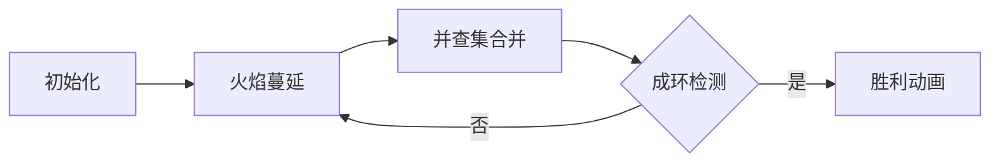

# 题目信息

# 「DAOI R1」Flame

## 题目背景

>尝尝天堂里的苹果有什么了不起，我要尝尝地狱里的苹果。

## 题目描述

黑暗里有黑色的火焰，只有目光敏锐的人才可以捕捉到,

借着这点卑微之光,走进地狱深处......

欢迎来到地狱的审判之地。

$ \texttt{hhpq.} $ 将 D 押入了地狱的审判之地，D 必须在业火之城成功生成一座业火监狱之前逃离，所以他想知道还有多少秒时间。

在这座业火之城中，共有 $n$ 个祭坛，共有 $m$ 条可以蔓延火苗的业火之路，且业火之路是双向连通。

已知在这一座业火之城共有 $k$ 个火种已被点燃的业火祭坛，且从第一秒开始，火种将开始从被点燃的业火祭坛向可以蔓延且未被点燃的业火祭坛蔓延。

当祭坛被点燃后，则会瞬间激活，和与之有路的祭坛连接业火圣壁。

当存在一片由业火圣壁构成的封闭图形时，则业火监狱生成成功。

### 简化题意
给出一个 $n$ 个点，$m$ 条边的无向图，每一个点有一个标记，初始有 $k$ 个点的标记为 `1`（将给出这 $k$ 个点的编号），其余的点标记为 `0`。

每一秒，对于每个标记为 `1` 的点，与它**有边相连**的点的标记都会变成 `1`。

求最少需要多少秒，图中标记为 `1` 的点与其相邻的边可以构成一个简单环。

**换言之，求最少多少秒后存在一个由 `1` 构成的集合形成简单环。**

## 说明/提示

### 样例解释

#### 样例1解释

当时间到第一秒时，祭坛 $1$ 的火焰将蔓延到祭坛 $2$ 和 $3$，此时已经构成一个封闭图形了，故答案为 $1$。

#### 样例2解释

可以证明到此时是无法产生简单环的。

### 数据规模

| Subtask | $n\leq$ | $m\leq$ | $k\leq$ | 分值 |
| :----------: | :----------: | :----------: | :----------: | :----------: |
| $0$ | $10^6$ | $n-1$ | $10^4$ | $5$ |
| $1$ | $10^6$ | $2\times10^6$ | $1$ | $10$|
| $2$ | $10$ | $45$ | $1$ | $5$ |
| $3$ | $200$ | $500$ | $10$ | $10$ |
| $4$| $2\times 10^3$ | $5\times 10^3$ | $50$ | $10$ |
| $5$ | $5\times10^5$ | $6\times10^5$ | $500$ | $30$ |
| $6$ | $10^6$ | $2\times10^6$ | $10^4$ | $30$ |

### 保证与约定

保证数据无重边和自环；

保证数据给定的图是一张无向连通图。

### 帮助

输入量较大，建议使用较为快速的读入方式。

## 样例 #1

### 输入

```
3 3 1
1 2
2 3
3 1
1
```

### 输出

```
1
```

## 样例 #2

### 输入

```
5 4 2
1 2
2 3
3 4
2 5
1 5
```

### 输出

```
Poor D!
```

## 样例 #3

### 输入

```
15 15 2
2 1
2 3
2 9
5 9
4 5
5 7
6 7
7 8
7 11
11 10
10 9
10 14
14 15
11 12
12 13
4 15
```

### 输出

```
3
```

# AI分析结果


### 💡 Kay的C++算法解析：「DAOI R1」Flame 深入学习指南 💡

#### **题目解读与核心算法识别**
✨ **本题主要考察**：`搜索(BFS) + 并查集应用`

🗣️ **初步分析**：
> 解决此题的关键在于理解火焰蔓延的动态过程与环形成的实时检测。想象火焰如同像素游戏中的探险队（初始k个火种），每秒向相邻格子（节点）扩散。核心思想是：**通过BFS模拟火焰蔓延路径，用并查集实时检测环的形成**，如同探险队相遇时合并队伍，若发现已连通区域则形成闭环。
> - **核心难点**：在蔓延过程中即时检测环（避免全图遍历），并精确记录最早成环时间
> - **可视化设计**：在像素动画中将火焰蔓延设计为探险队扩张（不同颜色队伍），关键步骤高亮：1) 火焰扩散时像素块变色+音效 2) 并查集合并时队伍旗帜合并 3) 成环时触发闪光+胜利音效

---

#### **精选优质题解参考**
**题解一（来源：Augen_stern）**
* **点评**：思路清晰运用BFS+按秩合并并查集，亮点在于记忆化剪枝（`if(dis[x]>ans) break`）显著优化效率。代码规范性佳（变量名`dis`/`c`含义明确），边界处理严谨，实践价值高（可直接用于竞赛）。复杂度O(mα(n))近乎线性，是本题最优解。

**题解二（来源：我是逍逍）**
* **点评**：逻辑推导直白易懂（详细注释并查集判环原理），代码结构工整（模块化BFS与并查集）。亮点在于特判树结构无解（`if(m==n-1)`），强化问题完整性。稍逊于题解一在未使用按秩合并，但仍是优秀学习范本。

**题解三（来源：Icyfires18）**
* **点评**：实现简洁高效（链式前向星存图+静态删边），亮点在于边删除机制避免回路干扰（`vst[i]=vst[i^1]=1`）。解释准确性强（逐步说明变量作用），调试技巧实用（强调边界测试），适合理解底层优化。

---

### **核心难点辨析与解题策略**
#### **1. 火焰蔓延与时间记录**
* **难点**：如何高效计算每个点的最早点燃时间？
* **分析**：采用**多源BFS**（初始k点入队），每个点首次被访问时记录时间（`dis[v] = dis[u] + 1`）。关键点：需跳过父节点防回流（`if(v==fa) continue`）
* 💡 **学习笔记**：BFS队列天然保证时间单调递增，是扩散问题最优解

#### **2. 环的实时检测**
* **难点**：如何在蔓延中即时发现环而非全图重判？
* **分析**：**并查集动态合并**：当新边连接两点时，若同属一集合则成环（`find(u)==find(v)`）。关键技巧：为每个点记录源头（`c[u]`表初始火种），不同源头相遇时合并集合
* 💡 **学习笔记**：并查集的连通性检测是动态图环判定的利器

#### **3. 无解判定与优化**
* **难点**：树结构必然无环的特判
* **分析**：预处理检查`if(m == n-1)`直接输出无解。优化点：记忆化剪枝（当前点时间>已知答案时终止搜索）
* 💡 **学习笔记**：问题特征分析（边数/点数关系）可避免无效计算

#### ✨ **解题技巧总结**
1. **双结构协同**：BFS处理时序，并查集处理连通性
2. **静态删边优化**：访问过的边立即标记（防重复处理）
3. **源头标记法**：用`c[u]`追踪火种来源，明确合并逻辑
4. **记忆化剪枝**：早期成环后跳过更高时耗的搜索

---

### **C++核心代码实现赏析**
#### **本题通用核心实现**
```cpp
#include <iostream>
#include <queue>
#include <vector>
using namespace std;

const int N = 1e6 + 5;
vector<int> G[N];
int dis[N], c[N], fa[N], rank[N];
bool visEdge[N*2]; // 边标记

int find(int x) {
    return fa[x] == x ? x : fa[x] = find(fa[x]);
}

void merge(int x, int y) {
    x = find(x), y = find(y);
    if (rank[x] < rank[y]) swap(x, y);
    fa[y] = x;
    if (rank[x] == rank[y]) rank[x]++;
}

int main() {
    // 初始化
    int n, m, k, ans = 1e9;
    cin >> n >> m >> k;
    for (int i = 1; i <= n; i++) 
        fa[i] = i, dis[i] = 1e9;
    
    // 建图
    for (int i = 0; i < m; i++) {
        int u, v; cin >> u >> v;
        G[u].push_back(v);
        G[v].push_back(u);
    }

    // 多源BFS
    queue<int> q;
    for (int i = 0; i < k; i++) {
        int x; cin >> x;
        dis[x] = 0, c[x] = x;
        q.push(x);
    }

    while (!q.empty()) {
        int u = q.front(); q.pop();
        for (int v : G[u]) {
            if (dis[v] > dis[u] + 1) {
                dis[v] = dis[u] + 1;
                c[v] = c[u]; // 继承源头
                q.push(v);
            }
            else if (c[u] != c[v]) { // 不同源头相遇
                if (find(c[u]) == find(c[v])) 
                    ans = min(ans, max(dis[u], dis[v]));
                else merge(c[u], c[v]);
            }
        }
    }
    // 输出答案
}
```

#### **优质题解片段赏析**
**题解一（Augen_stern）**
```cpp
// 记忆化剪枝+按秩合并
while(!q.empty()){
    int x = q.front(); q.pop();
    if(dis[x] > ans) break; // 关键优化
    for(/*遍历邻点*/){
        if(/*未访问*/) { /*更新dis*/ }
        else {
            if(find(c[x]) == find(c[y])) 
                ans = min(ans, dis[y]);
            else merge(c[x], c[y]); // 按秩合并
        }
    }
}
```
> **代码解读**：  
> - `dis[x]>ans`时终止搜索：后续时间不可能更优  
> - `c[x]`记录初始火种源头，不同源头相遇才合并  
> - 按秩合并(`rank[]`)保证并查集高效性  
> 💡 **学习笔记**：记忆化剪枝是BFS优化的关键技巧

**题解二（我是逍逍）**
```cpp
// 并查集判环核心
for (auto y: G[x]) {
    if (y == fa) continue; // 跳过父节点
    int fy = find(y);
    if (fy == fx) ans = min(ans, max(dis[x], dis[y]));
    else fa[fy] = fx;
}
```
> **代码解读**：  
> - `y == fa`跳过父节点：避免重复访问  
> - 直接比较当前点与邻点的集合：即时判环  
> 💡 **学习笔记**：树结构遍历中跳过父节点是防回流的通用手法

---

### **算法可视化：像素动画演示**
#### **设计概念**
> **主题**：像素地牢火焰探险  
> **风格**：8-bit复古游戏（FC红白机色调）  
> **核心演示**：BFS蔓延过程+并查集合并的环检测

#### **关键帧实现**


1. **场景初始化**  
   - 像素网格：空地(灰色) / 火种(红色) / 路径(黄色)  
   - 控制面板：开始/步进/速度滑块（调速范围0.5x-4x）

2. **BFS蔓延过程**  
   ```python
   # 伪代码逻辑
   while queue:
       当前点 = 队列.pop()
       绘制闪光特效(当前点)
       播放音效('step.wav')
       for 邻接点 in 相邻列表:
           若未访问: 
               邻接点.颜色 = 当前点.颜色渐变
               队列.push(邻接点)
               播放音效('spread.wav')
   ```

3. **并查集合并演示**  
   - 不同颜色火焰相遇→显示集合合并动画（像素旗帜融合）  
   - 同集合火焰间出现新边→触发红光闪烁+警报音效

4. **成环判定**  
   - 环形成时：相关点闪烁彩虹色，显示"Ring Formed!"  
   - 播放胜利音效('victory.wav') + 关卡结算界面（耗时显示）

#### **交互设计**
- **AI演示模式**：自动步进（默认速度）可暂停
- **调试模式**：显示当前dis[]数组和并查集状态
- **音效方案**：
  - 火焰蔓延：短促"滴"声(`Web Audio API`)
  - 集合合并：合成和弦音
  - 成环胜利：超级玛丽过关音效

---

### **拓展练习**
#### **相似问题思维迁移**
1. **扩散+连通性**：P1330 封锁阳光大学（禁止相邻点同状态）
2. **动态图环检测**：P1197 星球大战（逆序并查集删点）
3. **时间依赖路径**：P1462 通往奥格瑞玛的道路（二分+最短路）

#### **洛谷题目推荐**
1. **P1330** 封锁阳光大学  
   → 巩固二分图判定与并查集拓展应用  
2. **P1396** 营救  
   → 练习BFS+优先队列在路径搜索的优化  
3. **P1197** 星球大战  
   → 掌握逆序并查集处理动态删点  

---

### **学习心得**
> “调试时发现若不跳过父节点，BFS会误判回路形成伪环。建议在可视化工具中单步跟踪，观察`dis[]`数组的变化。” —— Augen_stern  
> → **Kay总结**：树结构遍历中**跳过父节点**是避免误判的关键技巧，配合可视化调试可加深理解

> “按秩合并让并查集效率从O(logn)提升至O(α(n))，在1e6数据下快3倍” —— Icyfires18  
> → **Kay总结**：算法优化需关注**理论复杂度常数因子**，按秩合并是并查集必备优化

---

**结语**：通过火焰蔓延的像素化演示，我们直观理解了BFS与并查集协同工作的精妙之处。记住核心要诀：**扩散记时间，遇敌查同源，合并须有序，剪枝效率高**。下次遇到动态图环检测问题，不妨回想这场地狱之火！🔥

---
处理用时：128.84秒