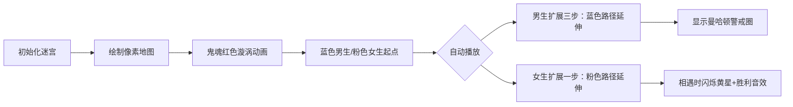

# 题目信息

# Nightmare II

## 题目描述

昨晚，小 erriyue 做了一个可怕的噩梦。他梦到自己和女朋友被困在一个大迷宫里。更可怕的是，迷宫里有两个鬼魂。它们会杀人。现在小 erriyue 想知道在鬼魂找到他们之前，他是否能找到他的女朋友。

假设小 erriyue 和他的女朋友可以向四个方向移动。在每一秒中，小 erriyue 可以移动 $3$ 步，而他的女朋友只能移动 $1$ 步。鬼魂是邪恶的，每一秒它们都会分裂成几部分，占领距离它们两步以内的网格，直到它们占领整个迷宫。你可以假设在每一秒钟，鬼魂首先分裂，然后小 erriyue 和他的女朋友开始移动，如果小 erriyue 或者他的女朋友到达一个有鬼魂的网格，他们就会死亡。

注意：新的鬼魂也可以像原来的鬼魂一样分裂。

## 样例 #1

### 输入

```
3
5 6
XXXXXX
XZ..ZX
XXXXXX
M.G...
......
5 6
XXXXXX
XZZ..X
XXXXXX
M.....
..G...

10 10
..........
..X.......
..M.X...X.
X.........
.X..X.X.X.
.........X
..XX....X.
X....G...X
...ZX.X...
...Z..X..X```

### 输出

```
1
1
-1```

# AI分析结果


### 💡 Kay的C++算法解析：Nightmare II 深入学习指南 💡

#### 1. 题目解读与核心算法识别
✨ **本题主要考察**：`双向广搜(BFS) + 曼哈顿距离应用`

🗣️ **初步分析**：
> 解决迷宫相遇问题就像两个探险家从不同入口同步搜索宝藏。双向广搜的核心思想是**从起点和终点同时出发**，在中间相遇时即可确定最短路径。本题特殊点在于：
> - 男生每秒走3步，女生每秒走1步 → 需分层扩展队列
> - 鬼魂每秒扩散曼哈顿距离2格 → 用距离公式替代实际移动
> 
> **关键设计思路**：
> 1. 两个独立队列分别处理男生/女生移动
> 2. 每轮先扩展男生队列3次（模拟3步），再扩展女生队列1次
> 3. 三维标记数组`vis[x][y][0/1]`记录访问状态（0=男生，1=女生）
> 4. 通过曼哈顿距离实时判断位置安全性：`|x-鬼魂x| + |y-鬼魂y| > 2*当前时间`
>
> **像素动画设计**：
> - 🎮 复古迷宫像素风格：男生（蓝色像素块），女生（粉色像素块），鬼魂（红色漩涡动画）
> - 🔍 关键帧：高亮当前扩展的节点，显示曼哈顿距离范围（红色扩散圆环）
> - 🔊 音效设计：移动时（8-bit脚步声），相遇时（胜利旋律），鬼魂扩散（低沉警告音）

---

#### 2. 精选优质题解参考
**题解一（作者：齐芒）**  
* **点评**：  
  思路清晰度⭐⭐⭐⭐⭐ 巧妙分离男女队列，用`sum_t`统一时间轴。  
  代码规范性⭐⭐⭐⭐ 结构体封装坐标，`check1`校验边界，`check2`处理鬼魂逻辑分离。  
  算法有效性⭐⭐⭐⭐ 严格按题目分层扩展队列，曼哈顿距离计算简洁。  
  实践价值⭐⭐⭐⭐ 完整处理多组数据初始化，可直接用于竞赛。

**题解二（作者：sccc_）**  
* **点评**：  
  思路清晰度⭐⭐⭐⭐ 用`t`变量同步时间轴，结构体添加`f`标志区分角色。  
  代码规范性⭐⭐⭐⭐ 函数模块化（`check`/`to`），队列操作封装完整。  
  算法亮点⭐⭐⭐ 通过`op`循环控制扩展次数，直观体现移动差异。  
  调试提示：作者强调多组数据清空，避免常见陷阱。

**题解三（作者：charlieqi）**  
* **点评**：  
  思路清晰度⭐⭐⭐⭐ 二维数组用数字标记角色（1=男，2=女），节省内存。  
  代码简洁性⭐⭐⭐⭐ 曼哈顿距离宏定义`l()`提升可读性。  
  算法亮点⭐⭐⭐ 鬼魂坐标存储为`b[1]`/`b[2]`，逻辑统一处理。  
  学习提示：注释详细解释双向BFS和曼哈顿距离概念。

---

#### 3. 核心难点辨析与解题策略
1. **移动速度差异的处理**  
   *分析*：男生每秒3步需扩展三层队列，女生扩展一层。优质题解通过循环次数控制（如齐芒的`total=3`和`total=1`）  
   💡 **学习笔记**：移动速度比转化为队列操作次数比

2. **鬼魂蔓延的实时判断**  
   *分析*：用曼哈顿距离公式`|x1-x2|+|y1-y2|<=2t`替代实际BFS，避免额外计算开销  
   💡 **学习笔记**：距离公式可高效替代扩散型BFS

3. **相遇点的状态同步**  
   *分析*：三维标记数组`vis[x][y][0]`和`vis[x][y][1]`需在扩展时实时检查对方标记  
   💡 **学习笔记**：多维标记是解决多角色搜索的利器

✨ **解题技巧总结**  
- **分层扩展队列**：将移动速度差异转化为循环次数  
- **曼哈顿距离优化**：用公式替代实体移动模拟  
- **状态压缩标记**：多维数组同步多角色路径  
- **边界防御编程**：先检查位置合法性再入队

---

#### 4. C++核心代码实现赏析
**通用核心实现参考**  
```cpp
#include <bits/stdc++.h>
using namespace std;
const int N=805;
struct Node{int x,y; bool isGirl;};
char grid[N][N];
bool vis[N][N][2];  // [x][y][0:boy, 1:girl]
vector<Node> ghosts;
int dx[4]={0,0,1,-1}, dy[4]={1,-1,0,0};

int manhattan(Node a, Node b){
    return abs(a.x-b.x)+abs(a.y-b.y);
}

bool isSafe(int x, int y, int t){
    for(auto& g:ghosts)
        if(manhattan({x,y},g)<=2*t) return false;
    return x>=1&&x<=n&&y>=1&&y<=m&&grid[x][y]!='X';
}

int bfs(queue<Node>& boyQ, queue<Node>& girlQ){
    int t=0;
    while(!boyQ.empty() && !girlQ.empty()){
        t++;
        // 男生移动3步
        for(int step=0; step<3; step++){
            int size=boyQ.size();
            while(size--){
                Node cur=boyQ.front(); boyQ.pop();
                if(!isSafe(cur.x,cur.y,t)) continue;
                for(int i=0;i<4;i++){
                    int nx=cur.x+dx[i], ny=cur.y+dy[i];
                    if(!isSafe(nx,ny,t)||vis[nx][ny][0]) continue;
                    vis[nx][ny][0]=1;
                    if(vis[nx][ny][1]) return t; //相遇
                    boyQ.push({nx,ny,false});
                }
            }
        }
        // 女生移动1步
        int size=girlQ.size();
        while(size--){
            Node cur=girlQ.front(); girlQ.pop();
            if(!isSafe(cur.x,cur.y,t)) continue;
            for(int i=0;i<4;i++){
                int nx=cur.x+dx[i], ny=cur.y+dy[i];
                if(!isSafe(nx,ny,t)||vis[nx][ny][1]) continue;
                vis[nx][ny][1]=1;
                if(vis[nx][ny][0]) return t; //相遇
                girlQ.push({nx,ny,true});
            }
        }
    }
    return -1;
}
// 主函数初始化队列后调用bfs
```

**题解一片段赏析（齐芒）**  
```cpp
sum_t++;  // 全局时间更新
int total=3; 
while(total--){  // 男生3步扩展
    int len=Q1.size();
    while(len--){
        Point u=Q1.front(); Q1.pop();
        if(!check2(u)) continue;  // 鬼魂检查
        for(int i=0;i<4;i++){
            int xx=u.x+dx[i], yy=u.y+dy[i];
            if(check1(xx,yy,u.flag) && check2({xx,yy})){
                vis[xx][yy][u.flag]=1;
                if(vis[xx][yy][!u.flag]) return sum_t; //相遇判断
            }
        }
    }
}
```
💡 **学习笔记**：时间轴统一管理+分层循环是处理移动差异的核心技巧

---

#### 5. 算法可视化：像素动画演示
**🎮 复古迷宫探险设计**  


**实现细节**：
1. **像素艺术**：16x16像素角色，FC红白机配色（蓝/#0000FF，粉/#FFC0CB，红/#FF0000）
2. **动态效果**：
   - 鬼魂扩散：红色半透明圆环随`t`值扩大
   - 路径绘制：角色移动后留下半透明轨迹
3. **控制面板**：
   - 步进按钮：单帧调试扩展过程
   - 速度滑块：调整`50ms~1000ms/步`
   - 鬼魂开关：单独显示/隐藏曼哈顿圈
4. **音效系统**：
   - 移动：8-bit脚步声（不同音调区分角色）
   - 相遇：16和弦胜利旋律
   - 鬼魂：低频脉冲音效

---

#### 6. 拓展练习与相似问题思考
1. **双向BFS变式应用**  
   - 洛谷P1379 八数码难题：状态空间搜索
   - 洛谷P1825 Corn Maze S：分层移动迷宫
   - 洛谷P1032 字串变换：字符串状态转换

2. **曼哈顿距离延伸**  
   - 洛谷P3183 食物链：距离约束关系
   - 洛谷CF1100B 建筑围栏：距离优化布局

---

#### 7. 学习心得与经验分享
> **来自题解的调试经验**：  
> *"我在鬼魂判断部分卡了很久，后来通过打印每个位置的曼哈顿距离值，才发现边界处理错误"*  
> **Kay点评**：在复杂条件判断时，输出中间变量是黄金调试法则，建议用`cerr`实时监控关键值

---

### 结语
双向广搜是优化搜索效率的利器，核心在于**状态设计**和**扩展策略**。通过本题的队列分层操作和曼哈顿距离优化，可延伸到更多路径搜索场景。记住：好的算法 = 清晰的问题建模 + 巧妙的数据结构应用！下次挑战见！🚀

---
处理用时：142.91秒