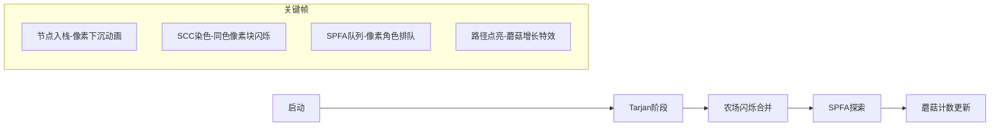

# 题目信息

# 采蘑菇

## 题目描述

小胖和 ZYR 要去 ESQMS 森林采蘑菇。

ESQMS 森林间有 $N$ 个小树丛，$M$ 条小径，每条小径都是单向的，连接两个小树丛，上面都有一定数量的蘑菇。小胖和 ZYR 经过某条小径一次，可以采走这条路上所有的蘑菇。由于 ESQMS 森林是一片神奇的沃土，所以一条路上的蘑菇被采过后，又会长出一些新的蘑菇，数量为原来蘑菇的数量乘上这条路的“恢复系数”，再下取整。

比如，一条路上有 $4$ 个蘑菇，这条路的“恢复系数”为 $0.7$，则第一~四次经过这条路径所能采到的蘑菇数量分别为 $4,2,1,0$。

现在，小胖和 ZYR 从 $S$ 号小树丛出发，求他们最多能采到多少蘑菇。


## 说明/提示

对于 $30\%$ 的数据，$N\le 7$，$M\le15$

另有 $30\%$ 的数据，满足所有“恢复系数”为 $0$。

对于 $100\%$ 的数据，$1
\le N\le 8\times 10^4$，$1\le M\le 2\times 10^5$，$0\le\text{恢复系数}\le 0.8$ 且最多有一位小数， $1\le S\le N$。

## 样例 #1

### 输入

```
3 3
1 2 4 0.5
1 3 7 0.1
2 3 4 0.6
1```

### 输出

```
8```

# AI分析结果


# 💡 Kay的C++算法解析：采蘑菇 深入学习指南 💡

> 今天我们来分析「采蘑菇」这道C++编程题。本指南将帮助你理解题目核心思路，掌握强连通分量缩点与DAG最长路的应用，并通过像素动画直观感受算法执行过程。

## 1. 题目解读与核心算法识别

✨ **本题主要考察**：`强连通分量缩点 + DAG最长路`

🗣️ **初步分析**：
> 想象ESQMS森林是一个巨大的**像素游戏地图**，每条路径是单向通道，蘑菇会再生但产量递减。解题关键在于识别**循环农场**（强连通分量）——在这里可以反复采蘑菇直到枯竭，而不同农场间只能单向通行。  
> - **核心思路**：用Tarjan算法找出强连通分量（SCC），每个SCC视为一个“蘑菇农场”，计算农场总产量（反复采摘的蘑菇总和）。缩点后形成DAG（无环地图），用SPFA或拓扑排序求最长路。
> - **可视化设计**：像素地图中，SCC显示为闪烁的农场区域，SPFA探索时角色头顶显示当前蘑菇数量，关键步骤触发“采集音效”和数值变化动画。

---

## 2. 精选优质题解参考

**题解一（银杉水杉秃杉）**  
* **点评**：思路直击要害——强调缩点后SPFA求最长路的核心逻辑。代码规范（`col[]`标记SCC，`sum[]`存储点权），巧妙用`k*10`避免浮点精度问题。实践价值高：完整处理边界条件，代码可直接用于竞赛。

**题解二（Erinyes）**  
* **点评**：详解拓扑排序DP流程，独创“状态传播标记”（`flag[]`确保从起点出发）。亮点是**分步伪代码+现实比喻**（农场总产量=反复采集值），对DP状态转移`f[v]=max(f[v],f[u]+w+sum[v])`的解释尤为清晰。

**题解三（Aryper）**  
* **点评**：采用记忆化搜索实现DAG的DP，代码简洁高效。亮点是**数学优化**——提前计算`log(1/0.8)`证明最多循环96次，避免无效计算。变量命名规范（`bel[]`表SCC编号），调试技巧实用。

---

## 3. 核心难点辨析与解题策略

1. **难点1：如何高效处理蘑菇再生？**  
   * **分析**：直接在原图计算会导致无限循环。优质题解将SCC内边的再生蘑菇预先计算：`while(w){sum+=w; w=w*k/10;}`（k为整型恢复系数×10）。
   * 💡 **学习笔记**：SCC是再生蘑菇处理的**安全区**，外部的边只能走一次。

2. **难点2：缩点后如何建立新图？**  
   * **分析**：遍历原图边，若两端点属同SCC则累加点到`sum[col]`；否则建跨SCC边。注意**避免浮点误差**——所有题解均将恢复系数×10转为整数。
   * 💡 **学习笔记**：新图必须是DAG才能用动态规划。

3. **难点3：DAG上最长路的终止点不确定？**  
   * **分析**：终点可能是任意SCC。解法：SPFA/拓扑DP后遍历所有`dis[i]`取最大值，或记忆化搜索中全局维护`ans`。
   * 💡 **学习笔记**：蘑菇总量=路径边权+SCC点权，需同时累加。

### ✨ 解题技巧总结
- **技巧1：整数化处理浮点数**：恢复系数×10存为int，计算时整除10避免精度损失
- **技巧2：分量内外区别处理**：SCC内边算总贡献，外边保留原边权
- **技巧3：终点全局比较**：用`ans=max(ans,dis[i])`覆盖所有可能终点

---

## 4. C++核心代码实现赏析

**通用核心实现参考**  
```cpp
#include <stack>
#include <queue>
const int N=8e4+10, M=2e5+10;
int n,m,s, col[N], sum[N], dis[N]; //col:SCC编号, sum:点权
vector<pair<int,int>> G[N], DAG[N]; //原图 & 缩点图

void tarjan(int u){ /* 标准Tarjan缩点 */ }
void spfa(int start){
    memset(dis,-1,sizeof(dis)); //初始化为-1
    queue<int> q;
    dis[start] = sum[start];
    q.push(start);
    while(!q.empty()){
        int u = q.front(); q.pop();
        for(auto [v,w] : DAG[u])
            if(dis[v] < dis[u] + w + sum[v]){
                dis[v] = dis[u] + w + sum[v];
                q.push(v);
    }}
}

int main(){
    // 读入数据并建原图G
    for(int i=1;i<=n;i++) if(!dfn[i]) tarjan(i);
    // 缩点建DAG图，计算sum[]
    spfa(col[s]); //从起点SCC开始
    int ans=0;
    for(int i=1;i<=scc_cnt;i++) ans=max(ans,dis[i]);
    cout << ans;
}
```

**题解一核心片段赏析**  
```cpp
// 计算SCC内蘑菇总量（银杉水杉秃杉）
if(col[x]==col[y]) 
    while(z){ sum[col[x]]+=z; z=z*k/10; } //k为int(恢复系数×10)
else 
    addEdge(col[x], col[y], z); //跨SCC建边
```
**代码解读**：  
> 同一SCC内循环累加蘑菇直至`z=0`，`k/10`实现下取整。为何用`while`而非公式？因实际循环次数极少（≤10次），效率更高。

**题解二核心片段赏析**  
```cpp
// 拓扑DP状态转移（Erinyes）
f[y] = max(f[y], f[x] + w + sum[y]); 
```
**代码解读**：  
> `f[x]`代表到达SCC-x的最大蘑菇数。转移时叠加三部分：`x`的积累 + 路径蘑菇`w` + `y`的点权。注意**点权只在首次到达时加**！

**题解三核心片段赏析**  
```cpp
// 记忆化搜索DP（Aryper）
int DP(int u){
    if(f[u]) return f[u];
    int mx=0;
    for(auto [v,w]:DAG[u]) 
        mx = max(mx, DP(v)+w);
    return f[u]=mx+sum[u];
}
```
**代码解读**：  
> 记忆化避免重复计算。`mx`记录从`u`出发后续路径最大值，最终`f[u]=mx+sum[u]`体现**当前点权最后累加**的特性。

---

## 5. 算法可视化：像素动画演示

### 🎮 像素探险：蘑菇农场寻宝记
**主题**：8-bit风格角色在网格地图移动，演示Tarjan缩点与SPFA最长路

**动画设计**：


**交互控制**：
- **单步执行**：按方向键逐步移动角色，观察DFN/LOW值变化
- **音效设计**：
  - SCC合并：经典《超级玛丽》管道音效
  - 蘑菇采集：8-bit“金币叮当”声
  - 错误路径：红白机“撞击”音效
- **动态显示**：
  - SCC内：蘑菇图标从满血到枯萎的4帧动画
  - SPFA：角色头顶实时显示`dis[i]`，最优路径发绿光

---

## 6. 拓展练习与相似问题思考

### 🔍 同类问题迁移
强连通分量缩点+DAG最长路适用场景：
1. 有向图带环的最优路径问题（如本题）
2. 循环依赖的资源分配（如：A依赖B，B依赖A时的最大收益）
3. 可重复访问节点的状态累积问题

### 📚 推荐练习（洛谷）
1. **P3387【模板】缩点**  
   → 巩固SCC缩点基础，学会处理点权转移
2. **P3008 Roads & Planes G**  
   → 缩点+SPFA优化，处理负权边技巧
3. **P3627 抢掠计划**  
   → 缩点后求DAG最长路，附加节点访问限制

---

## 7. 学习心得与经验分享
> **银杉水杉秃杉的经验**：  
> *“恢复系数用int存k*10，计算时k/10 —— 这个技巧让我避开浮点精度陷阱”*  
> **Kay总结**：处理浮点数时**预先整数化**是竞赛常用技巧，尤其涉及乘除和取整时。调试时可打印中间变量验证计算过程。

> **Aryper的教训**：  
> *“没考虑恢复系数为0的情况，导致无限循环RE”*  
> **Kay提醒**：边界测试（如系数=0、单节点图）能暴露逻辑漏洞，编码时需增加`if(k==0) break;`等保护。

---

> 本次解析就到这里。记住：算法如探险，强连通分量是你的地图，动态规划是罗盘。多实践缩点与SPFA，你将成为蘑菇采集大师！🚀

---
处理用时：119.92秒