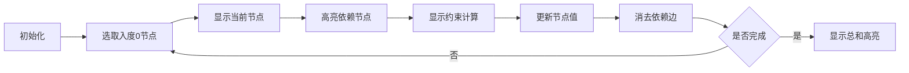

# 题目信息

# [GDCPC 2024] 不等式

## 题目背景

数据、标程、题解等资源的获取：<https://gitlink.org.cn/thusaa/gdcpc2024>

## 题目描述

给定 $n,m$，以及 $m$ 个形如 $a_{x_i}\ge a_{y_i}+a_{z_i}(1 \le i \le m)$ 的条件。问是否有一组**正整数** $(a_1,a_2,\cdots,a_n)$ 满足所有条件，并且 $a_1+a_2+\cdots+a_n \le 10^{9}$。如果有，输出 $a_1+a_2+\cdots+a_n$ 的最小值；如果无解，输出 $-1$。

## 说明/提示

和最小的解为 $(3,1,2,1,1)$，和为 $8$。

## 样例 #1

### 输入

```
5 2
1 2 3
3 4 5```

### 输出

```
8```

# AI分析结果


### 💡 Kay的C++算法解析：不等式 深入学习指南 💡

#### 引言
今天我们来分析"[GDCPC 2024] 不等式"这道C++编程题。本指南将帮助大家理解拓扑排序与动态规划的结合应用，掌握约束处理的核心技巧。

---

### 1. 题目解读与核心算法识别

✨ **本题主要考察**：图论（拓扑排序）与动态规划

🗣️ **初步分析**：
> 解决不等式约束问题就像建造积木塔：每个积木（变量）必须放在支撑它的积木（依赖变量）之上。拓扑排序就是确定积木的搭建顺序，动态规划则计算每块积木的最小高度（值）。
> - 核心思路：将变量视为节点，约束建立依赖边，通过拓扑排序处理依赖顺序，用动态规划计算每个变量的最小值
> - 关键难点：环检测（循环依赖导致无解）、值溢出处理（和≤10⁹）
> - 可视化设计：采用"像素积木搭建"动画，用不同颜色方块表示变量，搭建过程展示依赖关系，每步高亮当前处理的变量和更新的值

---

### 2. 精选优质题解参考

**题解一：fish_love_cat**
* **点评**：
  思路清晰度：⭐⭐⭐⭐⭐ 使用两个独立容器分别存储拓扑边和约束关系，逻辑分明
  代码规范性：⭐⭐⭐⭐ 变量名`ret[]`含义明确，用map处理重边避免重复计算
  算法有效性：⭐⭐⭐⭐ 在拓扑排序中实时更新节点值，严格满足约束条件
  实践价值：⭐⭐⭐⭐ 完整处理了环检测和溢出判断，可直接用于竞赛

**题解二：Heyg_future**
* **点评**：
  思路清晰度：⭐⭐⭐⭐ 创新性使用"贪心取1"理论证明初始值设定
  代码规范性：⭐⭐⭐ 模块化处理拓扑排序和约束更新
  算法有效性：⭐⭐⭐⭐ 按拓扑顺序更新保证依赖前置计算
  实践价值：⭐⭐⭐⭐ 特别强调`long long`使用避免溢出

**题解三：MonKeySort_ZYczc**
* **点评**：
  思路清晰度：⭐⭐⭐⭐ 双vector设计分离拓扑边和约束
  代码规范性：⭐⭐⭐ 简洁的栈实现拓扑排序
  算法有效性：⭐⭐⭐⭐ 节点出队时立即处理约束
  实践价值：⭐⭐⭐ 包含溢出提前终止优化

---

### 3. 核心难点辨析与解题策略

1. **依赖环检测（死锁困境）**
   * **分析**：当变量间形成循环依赖（A≥B+B≥A），系统陷入死锁。优质解法通过拓扑排序后检查未处理节点数或剩余入度来识别
   * 💡 学习笔记：任何依赖系统都需验证无环性

2. **约束传递时机（更新顺序悖论）**
   * **分析**：必须在所有前置变量计算完成后才能更新当前变量。正确解法将约束存储到目标节点，在目标节点入度为0时统一处理
   * 💡 学习笔记：拓扑排序的本质是保证计算顺序满足前置条件

3. **边界值初始化（最小正整数）**
   * **分析**：无约束变量取最小值1（正整数基础单位）。通过`f[i]=1`初始化，被约束变量在后续更新中自然提升
   * 💡 学习笔记：优化问题常从边界值开始迭代

#### ✨ 解题技巧总结
- **环检测双保险**：同时检查已处理节点数和最终入度值
- **溢出早停策略**：在拓扑排序过程中实时判断总和，避免无效计算
- **约束分离存储**：独立容器存储拓扑边和约束关系，提升可读性
- **防御性类型**：全程使用`long long`预防中间值溢出

---

### 4. C++核心代码实现赏析

**本题通用核心C++实现参考**
```cpp
#include <bits/stdc++.h>
#define int long long
using namespace std;
const int N=2e5+5;
vector<int> topoEdges[N];     // 拓扑依赖边
vector<pair<int,int>> cons[N];// 约束关系
int inDegree[N], val[N];      // 入度与节点值

void topology(int n) {
    queue<int> q;
    int cnt = 0, sum = 0;
    for(int i=1; i<=n; i++) {
        val[i] = 1;
        if(!inDegree[i]) q.push(i);
    }
    while(!q.empty()) {
        int u = q.front(); q.pop(); cnt++;
        for(auto [v,w] : cons[u])  // 处理当前节点约束
            val[u] = max(val[u], val[v] + val[w]);
        sum += val[u];
        for(int v : topoEdges[u])  // 更新后继节点
            if(--inDegree[v] == 0) q.push(v);
    }
    cout << (cnt!=n || sum>1e9 ? -1 : sum);
}
```

**题解一核心片段**
```cpp
ret[x]=1;  // 初始化
for(auto [b,c] : qwq[x])  // 遍历所有约束
    ret[x]=max(ret[x], ret[b]+ret[c]);
```
> **学习笔记**：节点值取所有约束的最大值，保证最小满足条件

**题解二创新点**
```cpp
// 拓扑排序后按顺序更新
for(int u : topoOrder) 
    for(auto [y,z] : constraints[u])
        a[u]=max(a[u], a[y]+a[z]);
```
> **技巧**：分离拓扑排序和约束处理，逻辑更清晰

**题解三优化**
```cpp
if(val[x]>1e9) break; // 溢出早停
```
> **实践价值**：及时终止无效计算，提升性能

---

### 5. 算法可视化：像素动画演示

* **主题**："积木之城" - 8-bit风格变量搭建模拟
* **核心演示**：拓扑排序过程与约束满足动画

**动画设计**：


**交互控制**：
1. 单步执行：空格键触发下一步
2. 速度调节：滑块控制0.5x-5x速度
3. 模式切换：
   - 教学模式：分步解说约束计算
   - 挑战模式：修复故意设置的循环依赖错误

**像素化效果**：
- 变量：16x16像素方块，颜色随值增大由绿→红渐变
- 约束线：闪烁的黄色像素线连接变量
- 音效：
  - 节点更新：8-bit "叮"声
  - 约束满足：合成器滑音
  - 环检测：警报音

---

### 6. 拓展练习与相似问题思考

**技巧迁移场景**：
1. 任务调度系统（任务依赖关系）
2. 版本冲突检测（软件包依赖）
3. 课程选修顺序（先修课约束）

**洛谷推荐**：
1. **P1113** 杂务
   - 同类拓扑排序应用，无约束计算
2. **P2146** 软件包管理器
   - 增强版依赖系统，含删除操作
3. **P3243** 菜肴制作
   - 拓扑排序进阶，要求特定顺序

---

### 7. 学习心得与经验分享

**fish_love_cat的经验**：
> "特判10⁹边界和long long转换是最大陷阱，建议将溢出判断集成到拓扑过程中"

**Kay的总结**：
> 调试依赖系统问题的黄金法则：
> 1. 可视化打印入度变化过程
> 2. 中间步骤输出约束满足状态
> 3. 小规模测试（n=3）验证边界

---

### 结语
通过拓扑排序与动态规划的结合，我们解决了不等式约束系统的优化问题。记住：好的算法设计就像稳固的积木塔，基础越扎实，建筑越宏伟。下次遇到依赖关系问题时，不妨回想今天的"像素积木"！🚀

---
处理用时：129.17秒