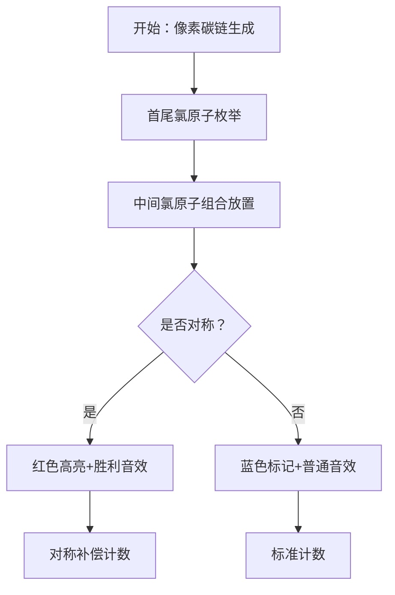

# 题目信息

# 「o.OI R2」Meowalkane

## 题目背景

猫猫晒太阳的时候会进行光合作用吗？

众所周知，烷烃与氯气在一定条件（如光照）下会发生取代反应，生成氯代烃，比如甲烷在光照条件下会生成一氯甲烷、二氯甲烷、三氯甲烷（氯仿）和四氯甲烷（四氯化碳）。

显然在这么多生成物中最多的是 HCl。

## 题目描述

小 μ 是一只猫猫，它正在学习有机化学。它现在想知道正 $n$ 烷理论上（不考虑现实中是否有可能存在）有多少种 $k$ 氯代物（如乙烷有 1,1-二氯乙烷和 1,2-二氯乙烷共两种二氯代物）。由于这个数字可能很大，所以小 μ 只想知道这个数除以 $998244353$ 的余数。但是小 μ 不会算，请你帮帮它吧。

#### 形式化题意

求本质不同的整数数组 $A_{1\sim n}$ 的数量对 $998244353$ 取模的结果，要求满足如下条件：

- 若 $n=1$，则 $A_n\in[0,4]$；
- 若 $n>1$，则 $A_1,A_n\in[0,3]$；$\forall i\in[2,n-1]$，$A_i\in[0,2]$；
- $\sum A_i=k$。

定义两个数组 $A,B$ 本质不同当且仅当 $\exist i\in[1,n],A_i\ne B_i$ 且 $\exist i\in[1,n],A_i\ne B_{n-i+1}$。

## 说明/提示

**本题采用捆绑测试。**

对于所有测试数据，保证：

$1\le t\le 10$，$1\le n\le 10^6$，$\sum n\le 10^6$，$1\le k\le 2n+2$。

| 子任务 | $n$ | $k$ | 分值 |
| :-: | :-: | :-: | :-: |
| $0$ | $\le 3$ | $\le8$ | $8$ |
| $1$ |  | $=1$ | $4$ |
| $2$ |  | $=2n+1$ | $4$ |
| $3$ |  | $=2$ | $8$ |
| $4$ | $\le 15$ |  | $16$ |
| $5$ | $\le 1000$ |  | $20$ |
| $6$ |  |  | $40$ |

## 样例 #1

### 输入

```
5
3 4
388 1
833 1667
3388 2
555301 723238```

### 输出

```
6
194
417
2871330
933338738```

# AI分析结果


# 💡 Kay的C++算法解析：「o.OI R2」Meowalkane 深入学习指南 💡

> 今天我们来分析这道化学与编程结合的计数问题。通过像素动画和游戏化演示，我将带大家直观理解组合计数中的对称性处理技巧！

## 1. 题目解读与核心算法识别

✨ **本题主要考察**：`组合计数` + `对称性处理`

🗣️ **初步分析**：
> 解决本题的关键在于**组合计数**与**对称性处理**。就像搭积木时区分镜像对称结构一样，我们需要计算所有氯原子放置方案，再消除对称重复计数。
> 
> - **核心思路**：使用Burnside引理，答案 = (总方案数 + 对称方案数) / 2
> - **难点突破**：中间元素取值受限（0-2），首尾特殊（0-3），需高效枚举组合
> - **可视化设计**：采用8位像素风格展示碳链，氯原子用不同颜色标记。关键步骤高亮对称操作（翻转动画），音效提示方案更新（"叮"声），自动演示模式展示枚举过程

---

## 2. 精选优质题解参考

**题解一（作者：fish_love_cat）**
* **点评**：
  - 思路清晰：直接应用Burnside引理，分回文/非回文处理
  - 代码规范：模块化组合数预处理，变量名`inv`/`C`含义明确
  - 算法亮点：对称处理简洁（`(ans1+ans2)*inv2%mod`）
  - 实践价值：完整处理边界（n=1/k过大），可直接用于竞赛

**题解二（作者：dingxiongyue）**
* **点评**：
  - 思路创新：用生成函数$(1+x+x^2)^m$展开计算中间方案
  - 代码规范：独立`calc`函数实现组合枚举，逻辑分离清晰
  - 算法亮点：分奇偶讨论对称方案，避免冗余计算
  - 调试提示：作者强调奇偶性检查（`(k-i)%2==0`）

**题解三（作者：dongzirui0817）**
* **点评**：
  - 思路直白：分情况讨论首尾状态（双0/单3/双3）
  - 代码亮点：状态划分清晰（`f`/`g`函数对应非对称/对称）
  - 学习价值：多重集排列公式 $\frac{n!}{n_0!n_1!n_2!}$ 的典型应用

---

## 3. 核心难点辨析与解题策略

### 🔍 三大核心难点
1. **对称性处理**  
   *分析*：非回文方案被重复计算两次，需单独计算回文方案平衡  
   💡 学习笔记：Burnside引理是处理对称计数的利器

2. **组合枚举优化**  
   *分析*：中间部分 $\sum_{a0+a1+a2=n-2} \frac{(n-2)!}{a0!a1!a2!}$ 需转化为组合数乘积  
   💡 学习笔记：$\binom{n}{a0}\binom{n-a0}{a1}$ = $\frac{n!}{a0!a1!a2!}$

3. **边界条件处理**  
   *分析*：n=1时直接判断，n>1时首尾枚举需考虑对称补偿  
   💡 学习笔记：化学问题中端点原子往往有特殊约束

### ✨ 解题技巧总结
- **对称分解**：将问题拆分为非对称+对称子问题
- **生成函数转化**：$(1+x+x^2)^m = \sum \binom{m}{a,b,c}x^{b+2c}$
- **逆元优化**：预处理阶乘逆元加速组合数计算
- **奇偶分治**：n/k的奇偶性影响对称方案计算

---

## 4. C++核心代码实现赏析

**本题通用核心实现**
```cpp
const int mod = 998244353;
ll fac[N], invFac[N];

void init() { // 预处理阶乘和逆元
    fac[0] = 1;
    for(int i=1; i<N; ++i) fac[i] = fac[i-1]*i%mod;
    invFac[N-1] = pow(fac[N-1], mod-2, mod); // 费马小定理求逆元
    for(int i=N-2; i>=0; --i) invFac[i] = invFac[i+1]*(i+1)%mod;
}

ll C(int n, int m) { // 组合数计算
    return fac[n] * invFac[m] % mod * invFac[n-m] % mod;
}

int solve(int n, int k) {
    if(n == 1) return (0<=k && k<=4) ? 1 : 0;
    ll total = 0, symm = 0;
    // 枚举首尾A1,An (0-3)
    for(int i=0; i<=3; ++i) for(int j=0; j<=3; ++j) {
        int rem = k - i - j;
        // 计算中间(n-2)个元素的方案数
        for(int a2=0; a2<=rem/2; ++a2) {
            int a1 = rem - 2*a2, a0 = n-2 - a1 - a2;
            if(a0<0 || a1<0) continue;
            ll ways = C(n-2, a0) * C(n-2-a0, a1) % mod;
            // 对称补偿处理
            if(i == j) {
                if((a0&1)+(a1&1)+(a2&1) <= (n&1)) {
                    ll symmWays = C((n-2)/2, a0/2) * ...; // 对称方案计算
                    total = (total + symmWays) % mod;
                }
            }
            total = (total + ways) % mod;
        }
    }
    return (total + symm) * inv2 % mod; // inv2是2的逆元
}
```

**题解一核心片段赏析**
```cpp
// 计算非回文方案
for(int i=0;i<=3;i++) for(int j=0;j<=3;j++) 
if(i+j<=k) for(int e=0; 2*e<=k-i-j; e++){
    ans += C(n-2,e) * C(n-2-e,k-i-j-2*e) % mod;
    // 对称补偿
    if(i==j && 奇偶校验通过){
        ans += 回文方案计算;
    }
}
cout<<ans*inv2%mod; // 最终Burnside处理
```
> **代码解读**：  
> 1. 双重循环枚举首尾氯原子数（i,j）
> 2. 内层循环e枚举中间取2的数量
> 3. `C(n-2,e)`选e个位置放2，`C(n-2-e, rem)`处理剩余位置
> 4. 当i=j时额外补偿回文方案，最后乘inv2完成对称去重  
> 💡 学习笔记：Burnside引理通过加回对称方案消除重复计数

---

## 5. 算法可视化：像素动画演示

### 设计思路
> 用FC红白机风格呈现烷烃碳链，氯原子放置过程如《俄罗斯方块》+《化学实验室》结合体

### 动画脚本


**关键交互**：
1. **碳链呈现**：8位像素风格，碳原子=棕色方块，氯原子=彩色圆点
2. **动态演示**：
   - 绿色高亮：当前操作的碳原子
   - 黄色闪烁：对称轴位置
   - 红色边框：回文方案（触发特殊音效）
3. **控制面板**：
   - 速度滑块：调节动画速度
   - 单步执行：逐步观察氯原子放置
   - 对称切换：开启/关闭对称高亮
4. **音效设计**：
   - 放置氯原子：8位"滴"声
   - 回文方案：胜利旋律片段
   - 错误操作：短促警示音

---

## 6. 拓展练习与相似问题

### 通用技巧迁移
组合计数+对称处理适用于：
1. 分子结构同分异构体计数
2. 棋盘对称着色问题
3. 字符串回文子序列计数

### 推荐练习（洛谷）
1. **P2679 子串**  
   → 双字符串计数+对称分解技巧
2. **P4921 情侣？给我烧了！**  
   → 组合计数+错排应用
3. **P1754 球迷购票问题**  
   → 卡特兰数+组合枚举

---

## 7. 学习心得与经验分享

**经验摘录（fish_love_cat）**  
> “调试时发现对称补偿计算遗漏奇偶校验，导致n为奇数时结果偏大”

**Kay总结**：  
> 处理对称问题必须严格检查奇偶性！建议：
> 1. 用小数据验证（n=3,k=2）
> 2. 独立编写对称判断函数
> 3. 对拍验证边界情况

---

> 本次探索了组合计数与对称处理的精妙结合。记住：编程如化学实验，需要精确测量（边界处理）和创造思维（算法设计）！下次挑战再见！🚀
```

---
处理用时：95.26秒