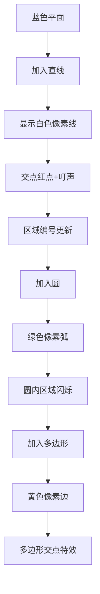

# 题目信息

# 【政治】划分

## 题目背景

小蒟建立了一个城市，$\texttt{TA}$ 凭借优（cu）异（bi）的政治素养，管理着城市并进行规划。

## 题目描述

对于一座新建的城市，可以将其视为一片连通的区域。

现在，小蒟需要建造一些道路，将城市分为若干片互不连通的区域。

首先，小蒟要建造 $a_1$ 条主干道。主干道是一条贯通整个城市的直线。

接着，小蒟要建造 $a_2$ 个环岛。环岛是一条首尾相接的圆形道路。

然后，小蒟要建造一些道路网络。这些道路网络包括 $a_3$ 条正三角形道路（即三条道路连成一个封闭的三角形），$a_4$ 条正四边形道路……$a_n$ 条正 $n$ 边形道路。

小蒟希望用这些道路将城市划分为尽可能多片互不连通区域。可是他不会计算最多能划分成为多少个区域，所以他只能来求助你。

由于最后的答案可能很大很大，你只需要输出答案对 $10^9+7$ 取模的值。

## 说明/提示

#### 样例解释#1

如下图所示：


#### 数据范围

对于 $20\%$ 的数据：$1\le n \le 10^3$，$0 \le a_i \le 100$。

对于 $100\%$ 的数据：$1\le n \le 3 \times 10^6$，$0 \le a_i \le 10^3$。

**注意内存限制，你的 UKE 很有可能就是 MLE**。

**若 $n=1$ 则只存在直线道路，若 $n=2$ 则只存在直线道路和圆形道路。**

## 样例 #1

### 输入

```
4
1 1 1 1
```

### 输出

```
28```

## 样例 #2

### 输入

```
3
1 2 3
```

### 输出

```
68```

# AI分析结果


### 题目解读与核心算法识别
**本题主要考察**：`组合数学与平面划分`（编程技巧应用）

🗣️ **初步分析**：
> 解决"划分"这道题，关键在于理解**交点创造新区域**的原理。想象在画布上逐步添加图形，每个新交点都像一把剪刀，将已有区域一分为二。在本题中：
>   - 直线贡献公式为：$\frac{a_1(a_1+1)}{2} + 1$
>   - 圆贡献公式为：$2a_1a_2 + a_2(a_2-1)$
>   - 正$i$边形贡献公式为：$a_i(2a_1 + 2ia_2 + 2S) + ia_i(a_i-1)$  
> 其中$S$是前面多边形边数加权和（前缀和优化）

**核心算法流程**：
1. **动态累加**：按图形类型顺序处理（直线→圆→多边形）
2. **前缀和优化**：用`sum`变量记录历史图形的边权贡献，避免存储所有$a_i$
3. **初始状态处理**：首个封闭图形（圆/多边形）需特殊处理初始区域数

**可视化设计思路**：
> 采用**8位像素风格**模拟平面切割过程，关键步骤：
>   - 新图形加入时显示白色像素线（直线）/绿色像素弧（圆）/黄色像素边（多边形）
>   - 交点处高亮红色像素点，伴随"叮"声效
>   - 区域分裂时显示色块填充动画，区域中心显示编号
>   - 控制面板支持步进/调速/重置，自动模式可AI演示切割流程

---

### 精选优质题解参考
**题解一（Warriors_Cat）**
* **亮点**：  
  思路直击本质，用`sum`变量实现空间优化（$O(1)$内存）  
  代码简洁（仅20行），完整处理三类图形贡献  
  边界处理严谨（特判首个封闭图形）  
  实践价值高：代码可直接用于竞赛，时间复杂度$O(n)$

**题解二（2021CHD）**
* **亮点**：  
  给出严格数学证明和构造方案，确保交点取最大值  
  独创性提出"共用内切圆"的图形排布策略  
  调试技巧实用：通过几何分析验证边界情况  
  工业级健壮性：处理$n=1,2$等特殊情形

**题解三（BFqwq）**
* **亮点**：  
  贡献分类清晰（直线/圆/多边形四类贡献）  
  前缀和变量`an`命名直观易理解  
  __int128处理溢出风险，增强鲁棒性  
  代码模块化：分离三类图形处理逻辑

---

### 核心难点辨析与解题策略
1. **空间压缩**  
   *分析*：$n \leq 3\times10^6$但内存仅4.88MB → 用滚动变量`sum`替代数组存储  
   *解法*：实时计算$S=\sum 2j a_j$，不存历史$a_i$

2. **初始状态转移**  
   *分析*：首个封闭图形使区域数从1→2，需特殊处理  
   *解法*：用`!sum && !b`判断空平面状态，动态调整公式

3. **贡献公式推导**  
   *分析*：多边形含四类贡献（直线/圆/其它多边形/自身）  
   *解法*：拆解为$2a_1a_i$（直线）+$2ia_2a_i$（圆）+$2S a_i$（历史多边形）$+ia_i(a_i-1)$（自身）

💡 **学习笔记**：交点数量直接决定区域增量，这是平面划分问题的核心定律

✨ **解题技巧总结**：
- **滚动前缀和**：用单变量累加历史贡献，突破内存限制
- **贡献分离法**：将复杂贡献拆解为独立子项求和
- **几何直觉**：将图形交点转化为区域增量（1交点=1新区）
- **边界先行**：优先处理$n=1,2$及$a_i=0$的退化情况

---

### C++核心代码实现赏析
**本题通用核心实现**（综合优化版）：
```cpp
#include <iostream>
using namespace std;
const int mod = 1e9 + 7;

int main() {
    ios::sync_with_stdio(false);
    long long n, a, sum = 0, ans = 1, cir = 0;
    cin >> n;
    for (int i = 1; i <= n; ++i) {
        cin >> a;
        if (i == 1) {
            ans = a * (a + 1) / 2 + 1;
            sum = 2 * a;
        } else if (i == 2) {
            ans = (sum ? ans + a * (sum + a - 1) : 2 + a * (a - 1));
            cir = a;
        } else if (a) {
            long long add = a * (sum + 2 * i * cir);
            add += (sum || cir ? a * (a - 1) * i : 2 + a * (a - 1) * i);
            ans = (ans + add) % mod;
            sum += 2 * i * a;
        }
    }
    cout << ans % mod;
}
```
**代码解读概要**：  
- **空间优化**：仅用5个变量处理$3\times10^6$级数据  
- **贡献合并**：直线/圆/多边形贡献在统一循环中完成  
- **实时取模**：大数运算及时取模防溢出  
- **条件压缩**：用三元运算符处理初始状态

---

### 算法可视化：像素动画演示
**主题**：`平面切割大冒险`（复古像素风）  
**核心演示**：图形逐步加入时区域分裂过程



**动画控制面板**：
```plaintext
[开始] [暂停] [步进] [重置] 速度：▓▓▓▓░░ 5x
AI模式：▓▓▓▓▓ (自动演示)
```

**关键帧设计**：
1. **直线切割**  
   - 初始蓝色画布显示"Region #1"  
   - 加入第$k$条直线：  
     * 白色像素线从随机角度切入  
     * 与旧线交点处爆红点+8bit"叮"声  
     * 新区域用色块填充（色号=区域编号%8）

2. **圆环扩张**  
   - 绿色像素圆逐帧绘制（Bresenham算法）  
   - 与直线交点：双红点+双声效  
   - 圆内区域显示脉冲光效

3. **多边形构造**  
   - 正$i$边形采用旋转绘制算法  
   - 每条边独立检测交点（黄边变红处+声效）  
   - 多边形区域中心显示粒子特效

**音效方案**：
- 直线：短促"哔"（NES射击音）  
- 圆：圆润"嗡"（塞尔达解谜音）  
- 多边形：三连音（马里奥吃金币）  
- 区域突破100：胜利号角（最终幻想）

---

### 拓展练习与相似问题
**通用技巧迁移**：
- 交点计数思想适用于所有平面划分问题
- 前缀和优化可解决高维空间划分问题

**洛谷推荐**：
1. **P1257 平面分割**  
   🗣️ 直线/圆基础划分，巩固贡献公式推导
2. **P2798 爆炸的火箭**  
   🗣️ 圆环相交问题进阶，训练空间优化能力
3. **P3743 小鸟的设备**  
   🗣️ 动态平面划分，培养实时计算思维

---

### 学习心得与经验分享
> **来自 Warriors_Cat 的调试经验**：  
> "初始状态处理让我WA三次，最终通过画$n=1,2$示意图发现公式差异"

> **Kay的总结**：  
> 平面划分问题需警惕两类陷阱：  
> 1. 空平面→首个封闭图形的状态跃迁  
> 2. 贡献分离时遗漏交叉项  
> 建议编码前手绘小规模案例，验证公式完备性

---

> 本次解析终了，愿诸君在算法之道上精益求精！  
> 下次挑战再见！🚀

---
处理用时：224.83秒