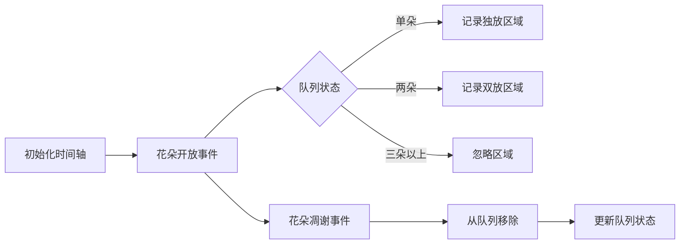

# 题目信息

# 『FLA - I』云音泛

## 题目背景

“……这些年来，过得可好？”

“……无所谓好或不好，人生一场空虚大梦，韶华白首，不过转瞬。惟有天道恒在，往复循环，不曾更改...”

## 题目描述

在梦中，秋种下了 $n$ 朵凋零玫瑰。他记得，第 $i$ 朵玫瑰是在时刻 $t_i$ 种植的。

凋零玫瑰在被种下的那个时刻就立即开放，但每一株玫瑰只会开放 $m$ 个时刻（在时刻 $T$ 种植的玫瑰会且仅会在从时刻 $T$ 到时刻 $T+m-1$ 的 $m$ 个时刻开放），在 $m$ 个时刻后便化作再也无法挽留的灰尘，飘散在凛冽的寒风中。

他问你，假如他可以改变不超过一朵玫瑰的种植时间（选定一个 $t_i$ 并将其修改为任意正整数），那么最多有多少个时刻有且仅有一株凋零玫瑰开放？

## 说明/提示

**「样例解释 #1」**

如图，使用金色标记有且仅有一株凋零玫瑰开放的时刻，使用黑色和红色标记每朵凋零玫瑰开放的时刻。


将使用红色标记的玫瑰的种植时刻改为 $17$（将 $t_1$ 的值修改为 $17$，如下图）后有 $14$ 个时刻有且仅有一株凋零玫瑰开放。可以证明不存在能够使有且仅有一株凋零玫瑰开放的时刻数量大于 $14$ 的修改方案。


**「数据范围」**

|测试点编号|$n \leq$|$m \leq$|$t_i \leq$|
|:-:|:-:|:-:|:-:|
|$1 \sim 6$|$5000$|$5000$|$5000$|
|$7 \sim 12$|$2 \times 10^5$|$2 \times 10^5$|$2 \times 10^5$|
|$13 \sim 14$|$2 \times 10^5$|$1$|$10^9$|
|$15 \sim 20$|$2 \times10^5$|$10^9$|$10^9$|

对于所有测试数据，$1 \leq n \leq 2 \times 10^5$，$1 \leq m,t_i \leq 10^9$。

## 样例 #1

### 输入

```
5 4
11 9 1 3 12
```

### 输出

```
14
```

## 样例 #2

### 输入

```
13 7
6 42 58 41 20 60 2 61 45 28 45 28 12
```

### 输出

```
38
```

# AI分析结果


# 💡 Kay的C++算法解析：云音泛 深入学习指南 💡

**引言**  
今天我们一起分析洛谷P10837「云音泛」这道C++编程题。本指南将帮助大家理解题目核心思想，掌握差分队列解法，并通过生动的像素动画直观感受算法执行过程。让我们开始吧！

## 1. 题目解读与核心算法识别

✨ **本题主要考察**：`差分数组` + `队列维护` (编程技巧应用)  

🗣️ **初步分析**：  
> 这道题可以想象成在时间轴上放置多个固定长度的线段（每朵玫瑰的花期）。核心挑战是**找到移动一朵玫瑰的最佳位置**，使得整条时间轴上"独放时刻"最大化。  

- **算法核心**：使用队列维护当前开放的花朵（类似"花期时间线"），通过离散化处理大数值范围，计算每朵玫瑰对独放时刻的贡献  
- **可视化设计**：  
  - 用8位像素风格展示时间轴，每朵玫瑰用不同颜色方块表示  
  - 队列动态显示当前开放的花朵，关键操作（入队/出队）触发像素动画和音效  
  - 高亮显示独放时刻区域，移动玫瑰时展示贡献变化过程  

## 2. 精选优质题解参考

**题解一：ScaredQiu (赞34)**  
* **点评**：  
  这份题解思路清晰，通过**队列维护当前花期**的方法巧妙解决了大值域问题。其亮点在于：  
  - 使用离散化处理10^9级时间值，避免内存溢出  
  - 精确计算每朵花的"独放贡献"和"双放贡献"  
  - 代码简洁高效（O(n log n)），边界处理严谨  
  特别是通过`w[0][i]`和`w[1][i]`记录贡献的方式，体现了对问题本质的深刻理解。变量命名规范（如`sum`表示总独放时长），实践价值高。

**题解二：ycy1124 (赞17)**  
* **点评**：  
  采用**相邻花重叠计算**的方法，直接推导每朵花的贡献变化。亮点在于：  
  - 通过数学公式直接计算移动花朵的收益  
  - 避免使用高级数据结构，适合基础学习者  
  但边界条件处理较复杂，在花朵密集时容易出错，不如队列解法鲁棒。

**题解三：Asedwai (赞16)**  
* **点评**：  
  创新性地提出**线段覆盖模型**，用`f(x,y)`函数计算重叠区域。亮点：  
  - 几何直观性强，用图形辅助理解（见题解图示）  
  - 状态转移公式简洁（`ans = sum - f(i) + cover(i) + m`)  
  但推导过程较抽象，对初学者有一定门槛。

## 3. 核心难点辨析与解题策略

1. **难点1：如何高效计算花朵的独放时段？**  
   * **分析**：由于值域巨大(10^9)，不能直接用数组标记。优质解法采用离散化+事件处理，将花的开放/结束视为事件点，计算事件区间内的花朵数量。
   * 💡 学习笔记：离散化是处理大值域的银弹！

2. **难点2：移动花朵时如何快速更新贡献？**  
   * **分析**：移动花朵i的影响仅限于其原位置相邻区域。队列解法通过预处理`w[0][i]`(独放贡献)和`w[1][i]`(双放贡献)，实现O(1)时间计算变动。
   * 💡 学习笔记：问题分解——先计算不变部分，再聚焦变动区域。

3. **难点3：如何避免整数溢出？**  
   * **分析**：答案可能达到3×10^9，必须使用`long long`。多个题解强调此点（如ScaredQiu特别标注）。
   * 💡 学习笔记：十年OI一场空，不开long long见祖宗！

### ✨ 解题技巧总结
1. **离散化技巧**：将大数值映射到小索引，兼顾效率与空间
2. **事件驱动法**：将开始/结束视为事件，按时间排序处理
3. **贡献分离思想**：预处理每朵花的独放/双放贡献，避免重复计算
4. **边界防护**：使用`t[0]=-INF, t[n+1]=INF`守卫边界

## 4. C++核心代码实现赏析

**通用核心实现（基于ScaredQiu队列法）**  
```cpp
#include<bits/stdc++.h>
using namespace std;
typedef long long ll;
const int MAXN = 2e5+5;

int main() {
    ios::sync_with_stdio(0); 
    cin.tie(0); cout.tie(0);
    
    // 输入与离散化
    int n, m, cnt = 0;
    ll t[MAXN], p[MAXN*2];
    cin >> n >> m;
    for(int i = 1; i <= n; i++) {
        cin >> t[i];
        p[++cnt] = t[i];          // 开始时间
        p[++cnt] = t[i] + m;      // 结束时间
    }
    
    // 离散化处理
    sort(p+1, p+cnt+1);
    cnt = unique(p+1, p+cnt+1) - p - 1;
    
    // 队列维护当前花朵
    queue<int> q;
    ll w[2][MAXN] = {0}, sum = 0; // w[0]:独放贡献, w[1]:双放贡献
    int pos = 1;
    
    // 处理每个时间点
    for(int i = 1; i <= cnt; i++) {
        // 移除已谢的花朵
        while(!q.empty() && t[q.front()] + m <= p[i]) 
            q.pop();
        
        // 加入新开放的花朵
        while(pos <= n && t[pos] <= p[i]) 
            q.push(pos++);
        
        // 计算区间长度
        ll len = p[i+1] - p[i];
        
        // 根据花朵数量记录贡献
        if(q.size() == 1) {
            w[0][q.front()] += len;
            sum += len;
        }
        else if(q.size() == 2) {
            int f = q.front(); q.pop();
            int b = q.front(); q.push(f);
            w[1][f] += len;
            w[1][b] += len;
        }
    }
    
    // 枚举移动每朵花
    ll ans = 0;
    for(int i = 1; i <= n; i++) 
        ans = max(ans, sum - w[0][i] + w[1][i] + m);
    
    cout << ans << '\n';
    return 0;
}
```

**代码解读概要**：
1. **离散化处理**：将花朵的开始/结束时间映射到紧凑索引
2. **事件驱动**：按时间顺序处理花朵入队/出队
3. **贡献记录**：根据队列长度实时更新`w[0]`和`w[1]`
4. **最优解计算**：枚举每朵花移动后的最大收益

## 5. 算法可视化：像素动画演示

**动画演示主题**：`花期交响曲 - 像素玫瑰园`  

**核心演示内容**：  


**动画帧步骤**：  
1. **场景初始化**：  
   - 8位像素风格时间轴，顶部控制面板（开始/暂停/单步）  
   - 底部队列区域显示当前开放花朵（不同颜色方块）  
   - 播放轻松芯片音乐BGM  

2. **花朵开放事件**：  
   ```python
   # 伪代码：花朵开放动画
   def flower_bloom(t):
       创建新花朵像素精灵
       播放“叮”音效
       花朵从右侧滑入时间轴位置t
       花朵加入队列区域（右侧进入）
       时间轴[t, t+m]区域染色（半透明花色）
   ```

3. **队列状态更新**：  
   - **单朵花**：时间轴对应区域高亮金色 + 闪烁边框  
   - **两朵花**：时间轴显示双色重叠，播放"嗡嗡"音效  
   - **三朵以上**：时间轴显示灰色区域  

4. **移动花朵操作**：  
   - 选中花朵闪烁红光，从原位置渐隐  
   - 新位置从屏幕外飞入，伴随"嗖"音效  
   - 原位置区域更新颜色（金→蓝表示独放消失，蓝→金表示双放变独放）  

5. **数据统计面板**：  
   - 实时显示：总独放时长 = Σw[0] - w[0][i] + w[1][i] + m  
   - 当前选中花朵的贡献变化动态显示  

## 6. 拓展练习与相似问题思考

**通用技巧迁移**：  
1. **区间覆盖问题**：如[CF1029C]用类似队列法处理重叠区间  
2. **事件驱动模型**：如[P2280]激光炸弹，用事件点优化二维覆盖  
3. **离散化应用**：如[P1904]天际线问题，处理大值域坐标  

**推荐练习（洛谷）**：  
1. **P1884 线段覆盖**  
   🗣️ 练习基础区间覆盖计算，巩固离散化技巧  

2. **P2280 激光炸弹**  
   🗣️ 学习二维事件处理，拓展到矩阵覆盖问题  

3. **P1904 天际线问题**  
   🗣️ 挑战经典离散化应用，掌握扫描线算法思想  

## 7. 学习心得与经验分享

> **ScaredQiu的调试经验**：  
> “我在处理花朵结束时间时，最初忽略了`t[i]+m`的等号边界，导致队列移除过早。通过打印队列状态和当前时间点，最终定位到边界判断错误。”  

**Kay点评**：  
这个经验提醒我们：  
1. 时间边界处理要格外谨慎，特别是闭区间/开区间选择  
2. 打印中间状态（如队列内容）是调试边界问题的有效手段  
3. 对于`t[i]+m`这类计算，建议写成`t[i] + m - 1`更符合直觉  

---

**结语**  
本次「云音泛」的解题之旅就到这里。关键要掌握**事件驱动思想**和**离散化技巧**，理解队列维护当前状态的妙用。记住Kay的话：编程如种花，细心培育每个逻辑，终将收获满园芬芳！下次挑战再见！💪🏻

---
处理用时：131.58秒