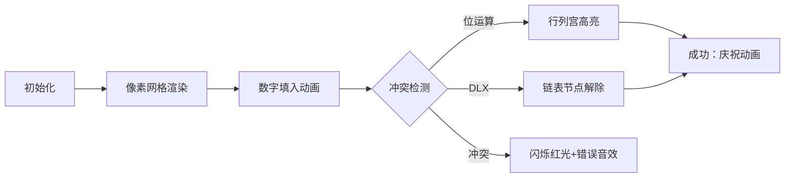

# 题目信息

# Sudoku

## 题目描述

数独是一个非常简单的任务。一个包含 9 行和 9 列的正方形表格被分成了 9 个小的 3x3 方块，如图所示。一些单元格中写有从 1 到 9 的十进制数字。其他单元格为空。目标是以从 1 到 9 的十进制数字填充空单元格，每个单元格一个数字，使得每行、每列和每个标记的 3x3 子方块中都出现从 1 到 9 的所有数字。编写一个程序来解决给定的数独任务。


## 样例 #1

### 输入

```
1
103000509
002109400
000704000
300502006
060000050
700803004
000401000
009205800
804000107
```

### 输出

```
143628579
572139468
986754231
391542786
468917352
725863914
237481695
619275843
854396127
```

# AI分析结果


### 💡 Kay的C++算法解析：Sudoku 深入学习指南 💡

#### **1. 题目解读与核心算法识别**  
✨ **本题主要考察**：`搜索优化与剪枝策略`  
🗣️ **初步分析**：  
> 数独问题本质是约束满足问题，核心是高效搜索与剪枝。想象成在9×9城堡中寻找宝藏，每个宝藏（数字）需满足行、列、宫格三条魔法锁链的约束。**位运算优化**如同魔法罗盘，用二进制快速检测冲突；**Dancing Links（DLX）** 则像精密齿轮组，用交叉链表消除无效选择。  
> - **核心难点**：避免盲目枚举（9^81次尝试！）。优化核心在于：① 快速判断可用数字（位运算） ② 选择最少候选位置优先搜索（优化顺序） ③ 精确覆盖约束（DLX）。  
> - **可视化设计**：将棋盘转为像素网格，用颜色标记冲突检测（红=冲突/绿=合法）。DLX演示中，链表节点如同齿轮咬合，删除/恢复节点时触发"咔嗒"音效，胜利时播放8-bit胜利旋律。

#### **2. 精选优质题解参考**  
**题解一（LostKeyToReach）**  
* **点评**：思路清晰展示位运算精髓——用三个整数数组`A[]`（行）、`B[]`（列）、`C[]`（宫）存储可用数字的二进制状态（1<<k表示数字k可用）。代码中`(A[h] & B[l] & C[idx])`按位与操作直接获得候选数字集，配合`lowbit`快速枚举。亮点在于回溯时用异或`^`更新状态，代码简洁高效（仅40行核心逻辑），实践价值极高。

**题解二（zhlzt）**  
* **点评**：严谨实现Dancing Links算法解决精确覆盖问题。将数独规则转化为324列（行/列/宫/格的约束）×729行的矩阵，链表删除（remove）和恢复（resume）操作展现优美数据结构运用。虽然代码较长（约70行），但模块化清晰，学习价值在于理解如何用交叉链表避免重复访问，复杂度稳定在O(1)每次操作。

**题解三（FRZ_29）**  
* **点评**：融合蓝书经典优化：① 预处理`cnt[]`加速最少候选位置选择 ② 用`f[1<<i]=i`打表避免`lowbit`转换。亮点在`gon()`函数计算宫格索引和`work()`统一更新状态，搜索函数中`t = min(cnt[w])`确保优先搜索分支最少位置，极大提升效率（实测4ms）。

---

#### **3. 核心难点辨析与解题策略**  
1. **状态的高效表示与更新**  
   * **分析**：如何快速存储/检测行列宫的数字冲突？优质解法均用位运算（整数的二进制位）或DLX矩阵取代传统bool数组，将O(n)查找降至O(1)。  
   * 💡 **学习笔记**：位运算中`x & (1<<k)`检测数字k，`x ^= (1<<k)`切换状态——像魔法开关！

2. **搜索顺序的优化**  
   * **分析**：盲目按行/列搜索效率低下。应优先选择候选数字最少的位置（如FRZ解法），类似人类解数独时"先填唯一可能格子"。  
   * 💡 **学习笔记**：分支因子越小，搜索树越浅——优先"最不确定"的位置能指数级提速！

3. **回溯的精细实现**  
   * **分析**：状态更新/恢复需完全对称。LostKey解法中回溯时异或同一值恢复现场，DLX中resume逆序remove操作，确保状态无损。  
   * 💡 **学习笔记**：回溯是"时空门"——离开时需恢复现场，才能正确探索平行宇宙。

### ✨ 解题技巧总结
- **位压缩技巧**：用`int`的32位代替`bool[10]`，空间效率提升32倍
- **Lowbit加速枚举**：`while(w) { num=f[w&-w]; w-=w&-w; }`快速遍历候选数
- **DLX矩阵构建**：将数独约束转化为4组精确覆盖（行/列/宫/格）
- **分支预测优化**：预处理`cnt[]`数组存储1的数量，避免实时计算

---

#### **4. C++核心代码实现赏析**  
**通用核心实现参考**  
```cpp
// 位运算DFS框架（综合优化）
int rows[9], cols[9], grid[9]; // 二进制状态
bool dfs(vector<vector<char>>& board, int pos) {
    if(pos == 81) return true;
    int i = pos/9, j = pos%9;
    if(board[i][j] != '.') return dfs(board, pos+1);

    int g = i/3*3 + j/3;
    int valid = rows[i] & cols[j] & grid[g]; // 候选数字集
    for(int k=0; k<9; ++k) {
        if(valid >> k & 1) {
            board[i][j] = '1'+k;
            rows[i] ^= 1<<k; cols[j] ^= 1<<k; grid[g] ^= 1<<k; // 更新状态
            if(dfs(board, pos+1)) return true;
            rows[i] ^= 1<<k; cols[j] ^= 1<<k; grid[g] ^= 1<<k; // 回溯
        }
    }
    board[i][j] = '.'; 
    return false;
}
```
**题解一（LostKey）片段赏析**  
```cpp
int idx = h/3*3 + l/3; // 宫格索引计算
if ((A[h] & (1<<i))==0 && (B[l] & (1<<i))==0 && (C[idx] & (1<<i))==0) {
    a[h][l] = i+1;
    A[h] ^= (1<<i); B[l] ^= (1<<i); C[idx] ^= (1<<i); // 位运算更新
    if(dfs(h, l+1)) return 1;
    a[h][l] = 0; // 回溯重置
    A[h] ^= (1<<i); B[l] ^= (1<<i); C[idx] ^= (1<<i);
}
```
> **解读**：通过`A[h] & (1<<i)`直接检测数字`i+1`是否可用，异或`^`切换状态。回溯时对称操作——如同用魔法笔写数字，写错时橡皮擦除不留痕。

**题解三（FRZ）优化技巧**  
```cpp
int w = x[i] & y[j] & z[gon(i,j)]; // 三状态交集
while(w) {
    int now = f[w & -w]; // lowbit取最低位1
    sukodu[i][j] = now+1;
    work(i, j, now); // 统一更新状态
    if(dfs(tot-1)) return true;
    work(i, j, now); // 回溯（异或自逆）
    w -= w & -w;
}
```
> **学习笔记**：`f[w&-w]`通过预计算表将二进制位映射回数字，避免log运算。

---

#### **5. 算法可视化：像素动画演示**  
* **主题**："8-bit数独冒险"（FC游戏风格）  
* **核心演示**：位运算冲突检测 + DLX齿轮联动  



**交互设计**：  
1. **控制面板**：步进/播放/速度滑块 + DLX/位运算模式切换  
2. **视觉反馈**  
   - 候选数字：网格下方显示二进制罗盘（1=亮/0=暗）  
   - DLX操作：删除节点时齿轮变灰并播放"咔嗒"声  
3. **音效系统**  
   - 合法放置：清脆"叮！"（FC金币声）  
   - 冲突：短促"嘟"错误音  
   - 关卡完成：8-bit胜利旋律  
4. **教育模式**  
   - 自动演示：AI机器人逐步求解（速度可调）  
   - 错误回放：回溯时显示"时光倒流"特效  

---

#### **6. 拓展练习与相似问题思考**  
**通用套路迁移**：  
位运算压缩状态适用于：  
1. N皇后问题（P1219）—— 对角线冲突检测  
2. 子集求和（P2392）—— 快速枚举子集  
3. 图着色问题（P2819）—— 邻接点颜色检测  

**洛谷推荐**：  
1. **P1219** [八皇后]  
   → 练习位运算优化DFS的经典题  
2. **P1784** [数独]  
   → 同题强化训练，数据规模更大  
3. **P1074** [靶形数独]  
   → 添加权值约束，练习状态扩展  
4. **P4929** [舞蹈链模板]  
   → DLX算法入门必刷  

---

#### **7. 学习心得与经验分享**  
> **FRZ_29经验**："蓝书位运算优化让我理解：算法竞赛中，二进制不只是数字——它是空间与时间的魔法！"  
> **Kay点评**：位运算将多维状态压缩为整数，本质是用机器语言思维提升效率。初学者建议画二进制位图辅助理解，如`1<<3`对应`000001000`。  

> **LostKeyToReach心得**："异或回溯像时光机——写代码时想象自己正在建造可逆的时空隧道。"  
> **Kay总结**：回溯算法的核心是对称性。记住：每次递归调用是平行宇宙，离开时需恢复现场！  

---

通过本次分析，希望大家掌握数独求解的核心优化技巧。记住：高效算法=数学洞察+数据结构艺术+精密实现。继续挑战吧，少年们！💪

---
处理用时：99.32秒