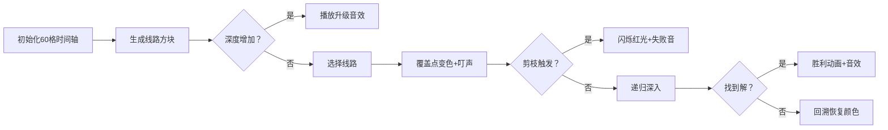

# 题目信息

# [IOI 1994] The Buses

## 题目描述

一个人在 12:00 到达一个公交车站。他在 12:00 到 12:59 期间一直待在那里。这个公交车站被多条公交线路使用。这个人记录了公交车到达的时间。给出了公交车到达的时间。

- 同一条路线的公交车在整个小时内从 12:00 到 12:59 以固定的时间间隔到达。
- 时间以整分钟给出，从 0 到 59。
- 每条公交线路至少停靠 2 次。
- 测试示例中的公交线路数量将 $\leq 17$。
- 不同路线的公交车可能同时到达。
- 几条公交线路的首次到达时间和/或时间间隔可能相同。如果两条公交线路的起始时间和间隔相同，则它们是不同的，并且都需要呈现。

找出满足输入数据的必须停靠在公交车站的公交线路数量最少的时间表。对于每条公交线路，输出起始时间和间隔。

## 样例 #1

### 输入

```
17
0 3 5 13 13 15 21 26 27 29 37 39 39 45 51 52 53```

### 输出

```
3```

# AI分析结果


### 💡 Kay的C++算法解析：[IOI1994] The Buses 深入学习指南 💡

**引言**  
今天我们一起分析IOI1994经典题目"The Buses"。这道题要求用最少的公交线路覆盖所有给定的公交车到达时间点，每条线路必须是固定间隔的等差数列。本指南将帮你掌握迭代加深搜索的核心思想和优化技巧。

---

### 1. 题目解读与核心算法识别
✨ **本题主要考察**：`迭代加深搜索(IDDFS) + 贪心策略`  

🗣️ **初步分析**：
> 本题如同在时间轴上玩"像素拼图"游戏——我们需要用最少的"等差数列方块"（公交线路）覆盖所有时间点。IDDFS就像逐层增加拼图块数量进行尝试，而贪心策略则优先选择最大的方块（覆盖最多时间点的线路）来加速完成。  
> - **核心难点**：如何避免组合爆炸？通过预处理有效线路 + 降序排序 + 可行性剪枝，将指数级复杂度降至可接受范围  
> - **可视化设计**：将60个时间点设计为FC风格的像素条，不同颜色方块代表不同线路。选择线路时播放"叮"音效，覆盖的像素块变色；触发剪枝时闪烁红光并播放"失败"音效；找到解时播放胜利音效  
> - **AI演示模式**：自动以最优速度演示搜索过程，每完成一层深度视为"过关"，增加8位风格积分奖励

---

### 2. 精选优质题解参考

**题解一（来源：Stars_Traveller）**  
* **点评**：思路清晰如拼图教程——先枚举所有有效线路，按覆盖数降序排序，IDDFS中配合剪枝条件`sum + (dep-cur)*route[k].num < n`。代码规范如乐高积木：结构体封装线路属性（x,d,num），回溯逻辑严丝合缝。亮点在于可行性剪枝的数学设计，如同预估剩余拼图空间，提前放弃无效分支。

**题解二（来源：Im_Klee）**  
* **点评**：将题意转化为"等差数列覆盖"的视角新颖如数学魔术。代码可读性强：详细注释DFS参数意义（cur/k/sum），边界处理严谨。虽然变量名`s`稍简略，但贪心排序原理阐释透彻，特别适合初学者理解"为何优先选大块拼图"。

**题解三（来源：Weekoder）**  
* **点评**：代码简洁如瑞士军刀——用lambda表达式实现降序排序，剪枝条件`sum + q[k].num*(lim-cur)<n`直击要害。虽变量命名`q/lim`可优化，但IDDFS框架干净利落，完美展示"深度递增+回溯"的搜索骨架，竞赛实用性强。

---

### 3. 核心难点辨析与解题策略

1. **难点：线路组合爆炸**  
   * **分析**：枚举所有线路组合不可行（17! > 1e14）。优质解法通过三重优化：预处理有效线路（避免无效尝试）→ 降序排序（优先大覆盖）→ 可行性剪枝（数学预估剩余能力）  
   * 💡 **学习笔记**：搜索优化 = 减少状态 × 加速决策

2. **难点：动态覆盖验证**  
   * **分析**：需实时验证线路有效性并更新覆盖状态。题解用桶数组`s[]`记录时间点余量，选择线路时循环更新：`for(int j=x;j<60;j+=d) s[j]--`  
   * 💡 **学习笔记**：回溯法要像"沙盘推演"——进入时改状态，返回时复原状

3. **难点：剪枝条件设计**  
   * **分析**：关键剪枝`sum + (深度余量)*当前线路覆盖数 < n`源于贪心性质：已选线路覆盖数 + 剩余步骤最大可能覆盖数 < 总需求则无解  
   * 💡 **学习笔记**：剪枝是搜索的"先知"——用数学预判避免徒劳

✨ **解题技巧总结**  
- **降序贪心**：先处理覆盖数最多的线路，如同拼图先放最大块  
- **状态回溯**：用轻量级桶数组而非拷贝整个状态  
- **预处理加速**：离线计算所有有效线路，搜索只做选择  
- **边界特判**：首项<30的优化（因首项≥30时无法满足至少2次停靠）

---

### 4. C++核心代码实现赏析

**通用核心实现参考**  
```cpp
#include <iostream>
#include <algorithm>
#include <vector>
using namespace std;

struct Route { int start, step, cover; }; // 首项/公差/覆盖数
vector<Route> routes;
int timeCount[60]; // 时间点计数器

// 检查线路是否有效
bool isValid(int start, int step) {
    for (int t = start; t < 60; t += step) 
        if (!timeCount[t]) return false;
    return true;
}

// IDDFS核心：当前深度/线路索引/已覆盖数
bool dfs(int depth, int idx, int covered) {
    if (depth == maxDepth) return covered == n;
    if (covered + routes[idx].cover * (maxDepth - depth) < n) 
        return false; // 可行性剪枝
    
    for (int i = idx; i < routes.size(); ++i) {
        auto& r = routes[i];
        if (!isValid(r.start, r.step)) continue;
        
        // 选择线路：更新时间点计数
        for (int t = r.start; t < 60; t += r.step) timeCount[t]--;
        if (dfs(depth + 1, i, covered + r.cover)) return true;
        // 回溯：恢复状态
        for (int t = r.start; t < 60; t += r.step) timeCount[t]++;
    }
    return false;
}

/* 预处理片段（main函数内） */
for (int start = 0; start < 30; ++start) // 首项<30优化
    for (int step = start + 1; start + step < 60; ++step) 
        if (isValid(start, step)) 
            routes.push_back({start, step, (59 - start) / step + 1});
sort(routes.begin(), routes.end(), [](auto& a, auto& b) { 
    return a.cover > b.cover; // 降序排序
});
```

**题解一（Stars_Traveller）片段赏析**  
```cpp
if (sum + (dep - cur) * route[k].num < n) // 可行性剪枝
    return 0;
```
* **解读**：如同预估剩余背包空间——`(dep-cur)`是剩余层数，`route[k].num`是当前最优覆盖能力，乘积即剩余步骤最大覆盖量。若加已覆盖量仍不足总数，果断放弃。
* 💡 **学习笔记**：剪枝条件本质是`剩余能力上限 < 需求缺口`

**题解二（Im_Klee）片段赏析**  
```cpp
for (int j = route[i].x; j < 60; j += route[i].d) s[j]--; // 选择线路
```
* **解读**：循环步长`route[i].d`是关键！以公差为步长遍历时间点，如首项=3、公差=5时，访问3,8,13...。注意边界`j<60`确保不越界。
* 💡 **学习笔记**：等差数列遍历 = 首项 + k×公差 (k≥0)

**题解三（Weekoder）片段赏析**  
```cpp
sort(q + 1, q + cnt + 1, [](node a, node b) { 
    return a.num > b.num; 
});
```
* **解读**：lambda表达式实现降序排序，比比较函数更简洁。`q`存储线路，`num`为覆盖数，排序后覆盖数大的线路优先搜索。
* 💡 **学习笔记**：C++11的lambda是简洁排序的神器

---

### 5. 算法可视化：像素动画演示

**主题**：8位公交调度员——复古线路规划模拟  
**核心演示**：IDDFS搜索过程 + 贪心选择 + 剪枝判断  



**实现细节**：  
1. **像素网格**：60×5网格，上排显示时间点（0-59），下排显示当前覆盖状态  
2. **线路方块**：不同颜色代表不同线路，尺寸=覆盖数×2像素  
3. **控制面板**：  
   - 速度滑块：调节自动演示速度（1-5档）  
   - 单步按钮：手动控制搜索步骤  
   - 模式切换：DFS普通模式/AI自动演示  
4. **音效设计**：  
   - 选择线路：NES风格"叮"声（频率=公差×10）  
   - 剪枝触发：短促"失败"音效  
   - 找到解：马里奥过关音乐  
5. **动画逻辑**：  
   - 当前线路：紫色闪烁边框  
   - 已覆盖点：显示线路颜色+覆盖计数  
   - 剪枝提示：显示"Remaining: X"（剩余最大覆盖数）  

---

### 6. 拓展练习与相似问题思考

**通用思路迁移**：  
1. **最小步数问题**：如八数码（P1379），用IDDFS+启发式剪枝  
2. **覆盖问题变种**：如激光覆盖网格（P2285），状态压缩+迭代加深  
3. **组合优化**：如最少矩阵覆盖（P2701），行列建模+搜索  

**洛谷推荐**：  
1. **P2324 [SCOI2005] 骑士精神**  
   → 经典IDDFS应用，强化剪枝训练  
2. **P1074 [NOIP2009] 靶形数独**  
   → 状态维护+搜索顺序优化  
3. **P1312 [NOIP2010] 关押罪犯**  
   → 虽为图论题，但覆盖思想相通  

---

### 7. 学习心得与经验分享

> **来自Stars_Traveller的经验**：  
> "调试时发现边界问题——当首项=58且公差=1时，线路覆盖数计算错误，应为(59-58)/1+1=2，而非1"  
>   
> **Kay的总结**：  
> 等差数列元素数 = (末项-首项)/公差 + 1，这个公式在类似问题中高频出现。务必用多组边界数据验证（如首项=0/58/59，公差=1/2/30等）

---

**结语**  
通过本题，我们掌握了IDDFS这把"可伸缩的搜索尺"，学会用贪心策略引导搜索方向，用数学剪枝避开无效深渊。记住：优化搜索=减少状态空间×加速决策过程。下次遇到类似问题，不妨先问自己："能否排序？能否剪枝？" 保持思考，编程之旅终将抵达光点！🚌✨

---
处理用时：206.84秒