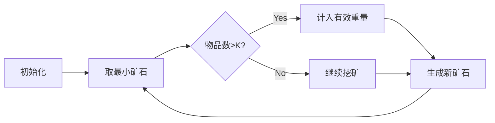

# 题目信息

# [蓝桥杯 2024 国 Java B] 背包问题

## 题目描述

神奇商店中一共有 $N$ 种不同的物品，第 $i$ 种物品的重量为 $W_i$，每种物品的数量都是无限个。店主会从中挑选任意种商品，每种商品可以选择任意个并将其装入到一个背包之中，从而可以组合出多种背包（这个背包可以容纳无限多的物品），其中背包的重量就是其中所含物品的重量之和。

小蓝想要的背包中至少要有 $K$ 件物品。小蓝想要知道，在所有满足他要求的背包中，如果将背包重量从小到大排序并去除重复的重量，排名第 $L$ 的重量是多少。

## 说明/提示

### 样例说明

背包中物品个数大于等于 $2$ 时，从小到大依次出现的背包重量为：

$6 = 3 + 3$、$8 = 3 + 5$、$9 = 3 + 3 + 3$、$10 = 5 + 5$、$11 = 3 + 3 + 5$、$12 = 3 + 3 + 3 + 3$、$13 = 3 + 5 + 5$。

### 评测用例规模与约定

- 对于 $40\%$ 的评测用例，$1 \leq W_i \leq 100$，$1 \leq L \leq 10$。
- 对于 $100\%$ 的评测用例，$1 \leq N \leq 10$，$1 \leq K \leq 10$，$1 \leq W_i \leq 10^9$，$1 \leq L \leq 10^5$

## 样例 #1

### 输入

```
7 2 7
84 21 12 3 65 5 41```

### 输出

```
13```

# AI分析结果


# 💡 Kay的C++算法解析：背包问题 深入学习指南 💡

> 今天我们来分析蓝桥杯2024国赛Java B组的背包问题。这道题考察了优先队列和状态压缩的巧妙应用，我将带你深入理解核心思想并掌握解题技巧！

## 1. 题目解读与核心算法识别

✨ **本题主要考察**：`优先队列（堆）与状态压缩`  

🗣️ **初步分析**：
> 解决背包问题的关键在于**按顺序生成有效状态**。想象你是一位矿工在挖宝：每次从最浅的矿层（最小重量）开始挖掘，挖出的矿石（新状态）会放入矿车（优先队列）。在本题中：
> - **优先队列**用于按重量从小到大的顺序生成背包状态
> - **状态压缩**将物品数超过K的状态统一标记为K（因为≥K即满足条件）
> - **二维map去重**避免重复处理相同状态
>
> 核心流程：初始化队列→弹出最小值→生成新状态→计数有效重量。可视化方案将用像素矿工形象展示状态生成过程，高亮当前处理状态，用不同颜色标记物品数，堆结构动态调整过程将配以"挖掘"音效。

---

## 2. 精选优质题解参考

**题解一（zyzxzhangyi）**
* **点评**：此解法思路清晰直接，使用最小堆维护状态队列，核心优化在于用`min(k, s+1)`压缩状态，大幅减少空间占用。代码简洁规范（仅30行），变量命名合理（v=重量，s=物品数），二维map去重高效。时间复杂度O(Llog(NL))完全满足题目要求，是竞赛实战的优选方案。

**题解二（tuboshu666）**
* **点评**：此解法展示了平衡树（FHQ Treap）的动态维护能力，思路完整具有教学价值。通过平衡树直接维护第L小值，虽然代码较长（100+行），但实现了堆+平衡树的双重结构。变量命名规范（tr=树节点，q=队列），适合学习高级数据结构应用。

---

## 3. 核心难点辨析与解题策略

1.  **状态压缩优化**
    * **分析**：当物品数≥K后具体数量不再重要。优质题解使用`min(k, s+1)`将状态统一标记为K，避免无限增长的状态空间
    * 💡 **学习笔记**：识别状态维度中的"饱和点"是优化关键

2.  **高效去重机制**
    * **分析**：不同路径可能产生相同（重量,物品数）状态。题解1用二维map精确去重，题解2用set存储二元组
    * 💡 **学习笔记**：状态类问题必须建立完善去重体系

3.  **动态序列生成**
    * **分析**：按重量顺序生成状态需最小堆支持。每次扩展N个新状态，用`priority_queue`实现O(logN)插入
    * 💡 **学习笔记**：优先队列是生成有序序列的利器

### ✨ 解题技巧总结
- **状态压缩**：识别状态维度的阈值（如K值），超阈值后统一表示
- **分层去重**：根据状态特性选择map或set，避免重复计算
- **模块化设计**：将堆操作、状态生成、条件判断分离
- **边界处理**：特别注意L=1和K=1的特殊情况

---

## 4. C++核心代码实现赏析

**通用核心实现参考**
* **说明**：综合题解1思路的精简实现
```cpp
#include <iostream>
#include <queue>
#include <map>
using namespace std;
typedef long long LL;
struct Node { LL v; int s; };
priority_queue<Node> q;
map<LL, map<int, bool>> vis;

int main() {
    LL n, k, l; cin >> n >> k >> l;
    vector<LL> w(n);
    for (int i = 0; i < n; i++) {
        cin >> w[i];
        q.push({w[i], 1});
        vis[w[i]][1] = true;
    }
    
    while (l) {
        auto [v, s] = q.top(); q.pop();
        if (s >= k && !--l) { cout << v; break; }
        for (int i = 0; i < n; i++) {
            LL nv = v + w[i];
            int ns = min((LL)k, (LL)s + 1);
            if (vis[nv][ns]) continue;
            vis[nv][ns] = true;
            q.push({nv, ns});
        }
    }
    return 0;
}
```
* **代码解读概要**：  
  1. 初始化：所有物品作为起点状态入队  
  2. 循环弹出堆顶最小重量  
  3. 满足物品数≥k时递减L计数器  
  4. 生成新状态（重量+Wi, min(k,物品数+1)）  
  5. 二维map去重后入队

---

**题解一核心片段**
```cpp
while(l){
    x = q.top(), q.pop();
    if(x.s >= k) l--;
    for(int i = 1; i <= n; i++)
        if(!t[x.v + a[i]][min(k, x.s + 1)])
            t[x.v + a[i]][min(k, x.s + 1)] = 1, 
            q.push({x.v + a[i], min(k, x.s + 1)});
}
```
* **亮点**：状态压缩与去重的完美结合
* **代码解读**：  
  - `min(k, x.s+1)`将物品数压缩到K阈值  
  - 二维map`t`以重量和压缩物品数为键去重  
  - 仅当新状态未访问时才入队
* 💡 **学习笔记**：状态压缩能指数级降低空间复杂度

---

**题解二平衡树应用**
```cpp
// 在满足条件时插入平衡树
if (cnt >= k && !mp.count(sum)) {
    mp[sum]++; 
    insert(sum);  // 平衡树插入
    q.push({sum, cnt});
}
```
* **亮点**：动态维护有序序列
* **代码解读**：  
  - 当物品数≥k且重量首次出现时  
  - `insert(sum)`将重量加入平衡树  
  - 平衡树支持直接查询第L小元素
* 💡 **学习笔记**：平衡树适合动态TopK问题

-----

## 5. 算法可视化：像素动画演示

**主题**：像素矿工挖宝之旅  
**核心演示**：优先队列如何按序生成状态，状态压缩如何优化空间  

### 动画设计（8-bit风格）：


**关键交互**：  
1. **矿石堆可视化**：堆结构显示为像素矿石堆，当前最小矿石闪烁红光  
2. **状态生成动画**：矿工挖矿时产生N个新矿石飞入堆中，伴随"叮"音效  
3. **状态压缩特效**：当物品数≥K时矿石变为金色，物品数数字变为"K"  
4. **平衡树展示区**：右侧像素树动态展示已收集的有效重量  
5. **控制面板**：  
   - 速度滑块：调整自动播放速度  
   - 单步执行：空格键触发下一步  
   - AI模式：自动运行至找到第L小重量  

**音效设计**：  
- 矿石弹出：清脆"咔嚓"声  
- 有效重量：金币掉落音效  
- 错误操作：短促警示音  

-----

## 6. 拓展练习与相似问题思考

**通用技巧迁移**：  
优先队列生成序列适用于：  
1. 超级丑数问题（质因数生成序列）  
2. 合并K个有序链表  
3. 第K短路问题  

**洛谷推荐**：  
1. P2723 [USACO]丑数 - 巩固优先队列生成序列  
   > *"用相同思路生成第K小丑数，注意状态去重"*
2. P1334 瑞瑞的木板 - 基础堆应用  
   > *"练习堆的基本操作与贪心结合"*
3. P2483 k短路 - 进阶优先队列应用  
   > *"挑战A*算法与堆的结合，提升问题抽象能力"*

-----

## 7. 学习心得与经验分享

> **题解作者经验**：  
> *"本题的关键是理解状态本质：当物品数超过K后，具体数量不影响结果，只需标记为K即可"*  
>  
> **Kay点评**：  
> 这个经验揭示了算法优化的核心思路——识别状态空间中的**等价类**。在类似问题中，要主动寻找可以合并的状态维度，这是提升算法效率的关键突破点。

---

通过本次分析，相信你已经掌握了优先队列生成序列的核心技巧。记住：优秀的算法=正确的数据结构+巧妙的状态设计+严谨的去重。下次遇到类似问题，不妨先画状态转移图哦！🚀

---
处理用时：183.20秒