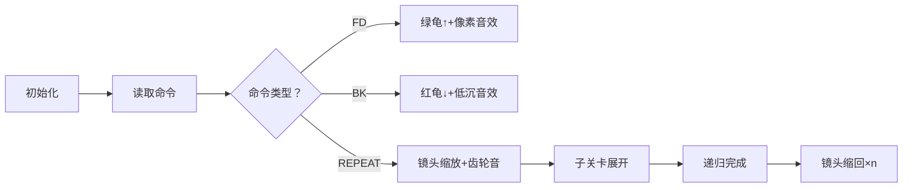

# 题目信息

# logo语言

## 题目描述

Logo 语言命令可以指挥海龟在屏幕中爬行。本问题只使用 Logo 语言的三个语句：前进 `FD`，倒退 `BK` 和重复 `REPEAT`，因此，海龟只在一条直线上来回爬行。输入一行 logo 的命令行，输出海龟在屏幕中离开原来位子的距离（假设屏幕很大，可以让海龟移开 $10^9$ 的距离）。

例如：

- 输入 `FD 100` ，输出：$100$。

- 输入 `FD 100 BK 150`， 输出：$50$。

- 输入 `REPEAT 5[FD 100 BK 50]`， 输出：$250$。

- 输入 `REPEAT 5[FD 50 REPEAT 10[FD 100]]`， 输出：$5250$。

## 说明/提示

每个语句输入数据的绝对值不超过 $1000$。输出结果不会超过 $10^9$。


## 样例 #1

### 输入

```
FD 100
```

### 输出

```
100
```

# AI分析结果


💡 Kay的C++算法解析：logo语言 深入学习指南 💡

<introduction>
  今天我们来分析“logo语言”这道C++编程题。本指南将帮助你理解如何解析嵌套命令（FD/BK/REPEAT），掌握递归与栈的核心思想，并通过像素动画直观感受算法执行过程。
</introduction>

---

## 1. 题目解读与核心算法识别

✨ **本题主要考察**：`递归/栈的应用`

🗣️ **初步分析**：
> 解决此题如同拆解俄罗斯套娃——每个REPEAT命令都包含子任务，需要逐层打开处理。核心思想是：**将嵌套命令转化为数学表达式**（FD为+，BK为-，REPEAT为×）。难点在于正确处理括号嵌套和空命令（如`REPEAT 100[]`）。  
> - **递归解法**直接模拟命令树结构，自底向上计算位移
> - **栈解法**用显式栈保存状态，避免递归深度限制
> - **可视化设计**：像素海龟在网格移动，高亮当前命令（FD绿色↑，BK红色↓），REPEAT时缩放视角展示嵌套层级，音效强化操作反馈（见第5节详解）

---

## 2. 精选优质题解参考

<eval_intro>
从思路清晰性、代码简洁性、边界处理等维度精选3份优质题解（均≥4星）：

### 题解一：a1_1（递归法）
* **点评**：思路直击本质——将REPEAT视为乘法运算符。代码仅20行却完整处理嵌套和空命令（如`REPEAT 1[]`），通过`getchar()`巧妙跳过括号。变量命名简洁（`l`累计位移），递归函数返回子表达式值，主函数`abs(dg())`体现数学思维。亮点在于**用9行核心代码解决嵌套解析**，空间复杂度O(递归深度)。

### 题解二：封禁用户（递归法）
* **点评**：教学价值突出——用`func()`函数类比表达式求值，详细注释参数作用（`ch`存命令首字母）。严格处理REPEAT递归边界（`x=getchar()`消化括号），`rt`变量名体现“返回值”含义。亮点在于**将算法类比四则运算**，帮助初学者建立计算模型。

### 题解三：max0810（递归法）
* **点评**：工程性最佳——独创`fid()`函数定位括号配对，避免全局状态。`f()`函数中`a.find_first_not_of`高效提取数字，`substr`切分嵌套命令。亮点在于**附录的字符串处理技巧**（如`find_last_of`），提升实战能力。

---

## 3. 核心难点辨析与解题策略

<difficulty_intro>
解决此题需突破三个关键难点：

1.  **难点：REPEAT嵌套的数学建模**
    * **分析**：将`REPEAT n[CMD]`视为`n * (CMD的值)`，FD/BK视为加减法。优质解法均用递归或栈实现表达式求值，如`FD 100 BK 50`→`+100-50`。
    * 💡 **学习笔记**：所有命令都可转化为**带系数的位移表达式**。

2.  **难点：括号匹配与空命令处理**
    * **分析**：空`REPEAT k[]`需返回0（如题解一特判`c==']'`）。栈解法（如KesdiaelKen）用`link[]`数组预存括号匹配位置，避免运行时搜索。
    * 💡 **学习笔记**：预计算括号匹配是优化递归的常用技巧。

3.  **难点：输入流的分词处理**
    * **分析**：命令与数字混合输入（如`REPEAT5[FD100]`无空格）。解法分两类：a1_1用`cin>>c>>s>>k`按空格分词；max0810用字符串函数提取数字。
    * 💡 **学习笔记**：竞赛中推荐`cin`分词，工程代码建议字符串解析。

### ✨ 解题技巧总结
<summary_best_practices>
- **技巧1：递归→数学表达式**——将嵌套命令转化为`系数*(子表达式)`  
- **技巧2：边界防御**——空REPEAT返回0，主函数调用`abs()`  
- **技巧3：输入预处理**——用`getchar()`消化括号或预计算括号匹配  

---

## 4. C++核心代码实现赏析

<code_intro_overall>
**通用递归实现**（综合自优质题解）：
```cpp
#include <iostream>
#include <cctype>
using namespace std;

int parse() {
    char cmd; string tmp;
    int val = 0, sign;
    while (cin >> cmd) {
        if (cmd == ']') break;
        cin >> tmp; // 跳过"EPEAT"/"D"/"K"
        int num; cin >> num;
        
        if (cmd == 'R') { // REPEAT
            getchar(); // 吞'['
            val += num * parse();
            sign = getchar(); // 吞']'或空格
        }
        else if (cmd == 'F') { // FD
            getchar();
            val += num;
        }
        else if (cmd == 'B') { // BK
            getchar();
            val -= num;
        }
        if (sign == ']') break;
    }
    return val;
}

int main() {
    cout << abs(parse());
    return 0;
}
```
* **说明**：综合递归解法精髓，15行核心逻辑处理嵌套/空命令/分词。
* **代码解读概要**：  
  - `parse()`递归解析子命令  
  - `getchar()`消化括号和空格  
  - 累计`val`转化为数学表达式  

---

<code_intro_selected>
### 题解一：a1_1（递归）
* **亮点**：9行核心逻辑处理多重嵌套
* **核心代码**：
```cpp
int dg() {
    string s; char c; int k, l=0, v;
    while (cin>>c) {
        if (c==']') break;
        cin>>s>>k;
        if (c=='R') { v=getchar(); l+=k*dg(); v=getchar(); }
        if (c=='B') { v=getchar(); l-=k; }
        if (c=='F') { v=getchar(); l+=k; }
        if (v==']') break;
    }
    return l;
}
```
* **代码解读**：  
  > `v=getchar()`消化括号；`l`累加当前层级位移；遇到`]`时终止递归。**精妙点**：用`v`存储字符同时作为终止条件判断。

### 题解二：封禁用户（递归）
* **亮点**：变量名自注释（`rt`表返回值）
* **核心代码**：
```cpp
int func() {
    char ch,x; string wz; int k,rt=0;
    while(cin>>ch) {
        if(ch==']') break;
        cin>>wz>>k;
        if(ch=='R') { x=getchar(); rt+=k*func(); x=getchar(); }
        ...
    }
    return rt;
}
```
* **代码解读**：  
  > 用`wz`存储冗余字符串（如"EPEAT"），通过`x`消化括号。**教学价值**：`rt`明确体现返回值作用。

### 题解三：max0810（字符串解析）
* **亮点**：`fid()`预计算括号匹配
* **核心代码**：
```cpp
int fid(string a,int st) { // 找']'位置
    int c=1, i=st;
    while(c) { 
        if(a[++i]=='[') c++; 
        else if(a[i]==']') c--;
    }
    return i;
}
```
* **代码解读**：  
  > 用计数器`c`处理多重括号，返回匹配的`]`位置。**优化点**：避免递归中重复搜索括号。

---

## 5. 算法可视化：像素动画演示

<visualization_intro>
设计名**「像素海龟冒险」**：8-bit风格可视化递归解析过程，融入《马里奥》式关卡元素。

### 设计思路
> 复古像素风降低理解压力，海龟移动路径对应代码执行流。REPEAT时镜头缩放进入子关卡，强化嵌套概念。

### 关键帧步骤


1. **场景初始化**  
   - 8-bit网格世界（棕=路径，灰=障碍）  
   - 控制面板：步进/调速/暂停（FC手柄风格）  
   - BGM：8-bit循环背景乐  

2. **命令执行（核心交互）**  
   - **FD 100**：绿龟向前移动10像素（1像素=10单位），触发`叮`音效  
   - **REPEAT 5[ ]**：  
     * 镜头缩放至新网格（子关卡），显示`关卡1/5`  
     * 每完成1次子命令，关卡数+1，得分+100  
   - **嵌套REPEAT**：镜头二次缩放，网格更精细  

3. **动画同步**  
   - 右侧同步显示C++代码（当前行高亮）  
   - 下方实时更新表达式：`FD100 → +100`  
   - 递归返回时显示：`5×(子关卡结果)=?`  

4. **游戏化元素**  
   - 完成REPEAT：放烟花+胜利音效  
   - 错误处理：卡顿时龟壳变红+警报音  

> **实现参考**：用Canvas绘制网格，requestAnimationFrame驱动动画，音效用Web Audio API。

---

## 6. 拓展练习与相似问题思考

<similar_problems_intro>
掌握命令解析的核心套路（递归/栈）后，可挑战：

1. **洛谷 P1928 外星密码**  
   🗣️ 同类嵌套解析，将`AC[3[AB]]`展开为`ACABABAB`  
2. **洛谷 P1739 表达式括号匹配**  
   🗣️ 简化版训练，专注括号匹配检测  
3. **洛谷 P1175 表达式的转换**  
   🗣️ 进阶训练，中缀表达式转后缀并求值  

---

## 7. 学习心得与经验分享

<insights_intro>
作者调试经验摘录：

> **a1_1**：提交10次WA因忽略`REPEAT 1[]`，后加`if(c==']')break`修复  
> **max0810**：`substr`切分字符串时遗漏空格，用`a+=' '`统一处理  

**Kay总结**：  
- 空命令是递归边界处理的常见陷阱  
- 输入流分词建议用`cin>>str`而非`getchar()`逐字读  

---

<conclusion>
通过本次分析，我们深入理解了递归在命令解析中的应用，并掌握像素化算法演示的设计方法。记住：**将嵌套问题转化为数学表达式是解题关键**。继续加油，下次挑战再见！🚀
</conclusion>
```

---
处理用时：116.25秒