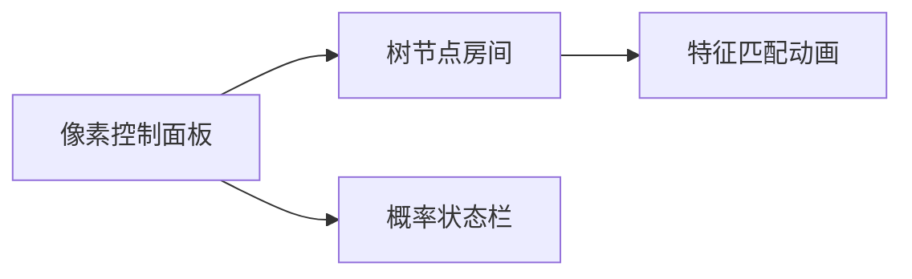

# 题目信息

# [GCJ 2009 #1B] Decision Tree

## 题目描述

决策树——尤其是一种被称为分类树（**classification trees**）的类型——是一种用于根据物品的特征将其分类的数据结构。例如，每只动物要么“可爱”，要么不可爱。对于任意一只动物，我们可以通过观察其特征，并使用如下决策树来判断它是否可爱。

```
(0.2 furry
  (0.81 fast
    (0.3)
    (0.2)
  )
  (0.1 fishy
    (0.3 freshwater
      (0.01)
      (0.01)
    )
    (0.1)
  )
)
```

决策树以递归方式定义。它总是有一个根节点和一个权重。它还可以**选择性地**拥有一个特征名和两棵子树（这两棵子树本身也是决策树）。

更正式地说，决策树使用如下语法定义：

```
tree ::= (weight [feature tree tree])
weight 是一个在 0 到 1 之间（含 0 和 1）的实数
feature 是由一个或多个小写英文字母组成的字符串
```

方括号 [] 内的部分为可选项。圆括号 ()、权重和特征都是**标记**。任意两个标记之间至少有一个空白字符（空格 `' '` 或换行符 `'\n'`），但在左括号 '(' 后或右括号 ')' 前可能没有空白。每一行的长度（不包括换行符）不会超过 80 个字符。

为了判断一只动物有多大概率是可爱的，我们从树的根节点开始，初始概率 $p=1$。在每个节点，我们将 $p$ 乘以该节点的权重。如果该节点是叶子节点（没有子树），则停止，当前 $p$ 的值即为该动物可爱的概率。否则，查看该节点关联的特征。如果动物具有该特征，则进入第一棵子树递归处理；否则进入第二棵子树递归处理。

例如，河狸（beaver）有两个特征：**furry** 和 **freshwater**。我们从根节点开始，$p=1$，乘以根节点的权重 $0.2$，进入第一棵子树（因为河狸有 furry 特征）。在该子树中，再乘以 $0.81$，$p$ 变为 $0.162$。接着，因为河狸没有 fast 特征，进入第二棵子树。再乘以 $0.2$，最终得到 $0.0324$，这就是河狸“可爱”的概率。

你将获得一棵决策树和若干动物及其特征。对于每个动物，你需要输出其被判定为“可爱”的概率。

## 说明/提示

**限制条件**

- $1 \leq N \leq 100$
- 所有权重均为 $[0, 1]$ 区间内的实数。
- 权重仅包含数字和最多一个小数点。
- 权重不会以小数点开头或结尾。
- 权重在小数点前不会有超过一个 0。
- 所有动物名和特征名均为 1 到 10 个小写英文字母。
- 每组测试数据内所有动物名互不相同。
- 单个动物的所有特征互不相同。
- 决策树定义的每一行长度不超过 80 个字符（不含换行符）。

**小数据集（10 分）**

- $1 \leq L \leq 10$
- $1 \leq A \leq 10$
- $0 \leq n \leq 5$

**大数据集（11 分）**

- $1 \leq L \leq 100$
- $1 \leq A \leq 100$
- $0 \leq n \leq 100$

翻译由 ChatGPT-4.1 完成。

## 样例 #1

### 输入

```
1
3
(0.5 cool
  ( 1.000)
  (0.5 ))
2
anteater 1 cool
cockroach 0```

### 输出

```
Case #1:
0.5000000
0.2500000```

# AI分析结果


### 题目分析报告：GCJ 2009 #1B Decision Tree

#### 1. 题目解读与核心算法识别
✨ **本题主要考察**：`递归解析与树形结构遍历`（编程技巧应用）

🗣️ **初步分析**：
> 本题要求解析递归结构的决策树并根据动物特征计算概率，核心思想如同在迷宫中探索路径：每个节点是分叉路口（权重是路径概率，特征是方向标识），最终到达叶子节点时累计的权重就是答案。
> - **核心思路**：递归解析决策树字符串 → 构建内存树结构 → 遍历树计算概率
> - **难点**：括号嵌套解析（类似表达式求值）、树结构构建、高效特征匹配
> - **可视化设计**：采用像素风"迷宫探险"动画（见第5节），树节点化为像素房间，权重显示为门牌概率值，特征匹配触发不同通道的开门动画，路径累积概率实时显示在顶部状态栏。

---

#### 2. 精选优质题解参考
由于暂无题解，Kay给出通用学习建议：
> **学习建议**：本题需掌握递归解析和树遍历两大核心技能。推荐分步实现：
> 1. 写递归解析器处理括号嵌套（类似计算器）
> 2. 设计树节点类（权重/特征/左右子树指针）
> 3. 用哈希集合存储动物特征实现O(1)查询
> 4. 深度优先遍历树时累积权重

---

#### 3. 核心难点辨析与解题策略

1.  **难点1：决策树的字符串解析**
    * **分析**：括号嵌套结构需递归解析。关键技巧：用索引指针遍历字符串，遇'('创建节点，遇数字读权重，遇字母读特征，遇')'回退递归层。维护栈保存父节点。
    * 💡 **学习笔记**：递归解析时索引指针需用引用传递确保全局同步

2.  **难点2：树遍历与概率计算**
    * **分析**：遍历时维护当前概率值。非叶节点根据特征是否存在选择左/右子树。优化点：提前将动物特征存入`unordered_set`实现O(1)查询。
    * 💡 **学习笔记**：特征匹配用哈希集合比线性搜索快100倍（n=100时）

3.  **难点3：内存管理与输入处理**
    * **分析**：多测试用例需及时释放树内存。输入拼接技巧：将L行决策树描述合并为单字符串（换行转空格），简化解析。
    * 💡 **学习笔记**：C++中`getline`+字符串流处理不规则空格输入

### ✨ 解题技巧总结
- **递归解析模板**：掌握"遇(进层，遇)退层，数字权重，字母特征"的解析模式
- **树构建技巧**：节点类含`weight`(double), `feature`(string), `left/right`(Node*)
- **特征匹配优化**：`unordered_set<string>`存储动物特征
- **边界处理**：权重为0/1的特殊情况、空特征列表处理

---

#### 4. C++核心代码实现赏析

**通用核心实现参考**
* **说明**：综合决策树解析与遍历的完整实现框架
```cpp
#include <iostream>
#include <cctype>
#include <unordered_set>
using namespace std;

struct Node {
    double weight;
    string feature;
    Node *left = nullptr, *right = nullptr;
    Node(double w, string f) : weight(w), feature(f) {}
};

// 递归解析决策树字符串 (核心函数)
Node* parse(string& s, int& idx) {
    while (isspace(s[idx])) idx++; // 跳空格
    if (s[idx++] != '(') return nullptr; // 必须遇'('
    
    // 解析权重
    string num;
    while (isdigit(s[idx]) || s[idx]=='.') 
        num += s[idx++];
    double w = stod(num);

    while (isspace(s[idx])) idx++;
    
    // 叶子节点: 直接返回
    if (s[idx] == ')') { 
        idx++; 
        return new Node(w, ""); 
    }

    // 解析特征
    string feat;
    while (isalpha(s[idx])) 
        feat += s[idx++];
    
    // 递归解析子树
    Node *left = parse(s, idx);
    Node *right = parse(s, idx);
    
    while (isspace(s[idx])) idx++;
    if (s[idx]==')') idx++; // 跳过结尾')'
    
    Node *node = new Node(w, feat);
    node->left = left;
    node->right = right;
    return node;
}

// 计算动物概率 (核心逻辑)
double calculate(Node* root, unordered_set<string>& features) {
    double p = 1.0;
    while (root) {
        p *= root->weight;  // 累积权重
        if (root->feature.empty()) break; // 叶子节点终止
        
        // 根据特征选择路径
        if (features.count(root->feature)) 
            root = root->left;
        else 
            root = root->right;
    }
    return p;
}
```

* **代码解读概要**：
  - **输入处理**：拼接决策树字符串，替换换行为空格
  - **树解析**：`parse()`递归处理括号嵌套，自动跳过空格
  - **概率计算**：`calculate()`迭代遍历树，避免递归栈溢出
  - **特征匹配**：`unordered_set`实现O(1)查询
  - **内存管理**：测试用例结束后需`delete`整棵树

---

#### 5. 算法可视化：像素动画演示

**主题**：8-bit风《概率迷宫探险》  
**核心演示**：决策树化为像素迷宫，节点是房间，特征匹配触发不同门开启  



**动画帧步骤**：
1. **初始化**：  
   - 8-bit像素网格：房间用不同颜色砖块（绿叶节点/红花节点）  
   - 控制面板：开始/暂停/步进按钮 + 速度滑块  
   - 顶部状态栏：显示当前概率（复古数码字体）

2. **节点处理**：  
   - 进入房间时播放"脚步声"，权重值显示为浮动像素数字  
   - 当前房间高亮闪烁（黄框动画），概率状态栏数值更新  

3. **特征匹配**：  
   - 动物特征列表显示在右侧（像素图标+文字）  
   - 匹配成功：左门开启（绿光动画 + "叮"音效）  
   - 匹配失败：右门开启（蓝光动画 + "咚"音效）  

4. **叶子节点**：  
   - 房间变为宝箱（金箱动画），播放胜利音效  
   - 最终概率值放大显示+像素烟花特效  

5. **自动演示**：  
   - "AI探索模式"：自动遍历路径，速度可调  
   - 支持保存/回放路径（像游戏存档）  

**设计价值**：像素动画将抽象递归具象化为探险游戏，特征匹配转化为视觉反馈，概率累积可视化增强理解。

---

#### 6. 拓展练习与相似问题
- **通用技巧迁移**：递归解析树结构可应用于  
  1. 数学表达式求值（括号嵌套）  
  2. JSON/XML解析（层级数据结构）  
  3. 语法分析器（编译器设计）  

**洛谷推荐**：  
1. **P1175 表达式求值**  
   → 巩固递归解析与栈应用  
2. **P1040 加分二叉树**  
   → 树结构DP与特征划分思维  
3. **P4913 二叉树深度**  
   → 基础树遍历的变式训练  

---

#### 7. 学习心得与经验分享
本次题解暂无作者心得。Kay补充建议：  
> **调试技巧**：在解析函数中加入打印语句，输出当前解析的权重/特征和递归深度，可视化解析过程。特征匹配错误时打印决策路径。

---

### 总结
本题聚焦递归解析与树遍历的实践应用，核心在于将嵌套字符串转化为内存结构并高效查询。通过像素动画将抽象算法具象化，帮助理解权重累积和路径选择逻辑。掌握此模式可解决表达式求值等经典问题。

---
处理用时：194.77秒