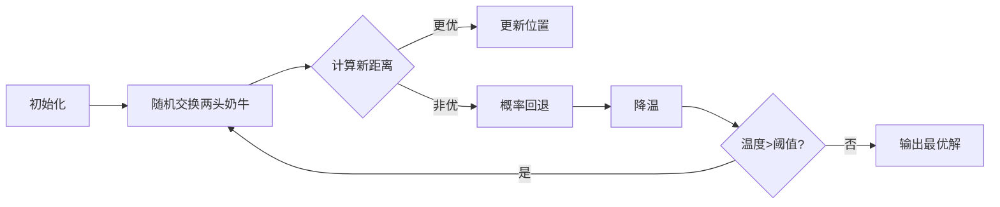

# 题目信息

# Haywire

## 题目描述

Farmer John有 $N$ 只奶牛（$4 \leq N \leq 12$，$N$ 是偶数）。

他们建立了一套原生的系统，使得奶牛与他的朋友可以通过由干草保护的线路来进行对话交流。


每一头奶牛在这个牧场中正好有 $3$ 个朋友，并且他们必须把自己安排在一排干草堆中。


一条长 $L$ 的线路要占用刚好 $L$ 堆干草来保护线路。


比如说，如果有两头奶牛分别在草堆 $4$ 与草堆 $7$ 中，并且他们是朋友关系，那么我们就需要用 $3$ 堆干草来建造线路，使他们之间能够联系。


假设每一对作为朋友的奶牛都必须用一条单独的线路来连接，并且我们可以随便地改变奶牛的位置，请计算出我们建造线路所需要的最少的干草堆。


## 说明/提示

样例解释： 奶牛最好的排列是 `6, 5, 1, 4, 2, 3`, 这个时候我们只需要 $17$ 个单位的干草堆。


## 样例 #1

### 输入

```
6
6 2 5
1 3 4
4 2 6
5 3 2
4 6 1
1 5 3```

### 输出

```
17```

# AI分析结果


### 💡 Kay的C++算法解析：Haywire 深入学习指南 💡

**引言**  
今天我们一起分析「Haywire」这道C++编程题。本指南将帮助大家梳理题目思路，理解核心算法，并掌握解题技巧。题目要求为奶牛排列位置，使连接朋友的干草堆总长度最小化（$4 \leq N \leq 12$）。下面从算法识别、题解点评到可视化方案逐步解析。

---

### 1. 题目解读与核心算法识别

✨ **本题主要考察**：`模拟退火` 与 `状态压缩DP`（双解法标签）  

🗣️ **初步分析**：  
> 解决本题的关键在于**排列优化**。奶牛位置排列直接影响朋友间距离总和，需在解空间中快速逼近最优解。  

- **模拟退火核心思想**（比喻：炼金术师调温实验）：  
  初始高温下随机扰动位置（高能量状态），逐步降温时以概率接受稍差的解（避免陷入局部最优），最终收敛到稳定解。  
- **状态压缩DP思想**（比喻：乐高精密拼装）：  
  用二进制表示奶牛集合（如`1010`表示第1、3头在集合），逐步添加奶牛并计算新增代价（未完成连接的边数）。  

- **核心难点与解法对比**：  
  | 方法          | 适用场景       | 优势                  | 劣势                  |
  |---------------|--------------|-----------------------|-----------------------|
  | 模拟退火      | $N \leq 12$  | 代码简单，易调整参数    | 结果非绝对精确         |
  | 状态压缩DP    | $N \leq 12$  | 结果精确，复杂度$O(2^n)$ | 状态转移设计复杂       |

- **可视化设计思路**：  
  采用**8位像素风奶牛农场**动画：  
  - 奶牛用不同颜色像素方块表示，朋友间用动态连线。  
  - 关键步骤高亮：交换奶牛时连线伸缩（伴随"咔嚓"音效），DP状态更新时显示二进制集合（如`1010`→`1110`）。  
  - 控制面板：步进执行、调速滑块（模拟退火调速）、自动演示模式（如AI奶牛自动交换位置）。

---

### 2. 精选优质题解参考

**题解一：ArachnidaKing (模拟退火)**  
* **点评**：  
  - **思路**：清晰解释模拟退火原理，用温度衰减控制随机交换，接受较差解概率公式`exp((best-now)/T)`推导合理。  
  - **代码**：变量名规范（`rc`全局最优解，`lsc`临时解），防手残宏定义提升安全性，边界处理严谨（`x!=y`校验）。  
  - **算法**：参数调优（`dertT=0.99`）平衡效率与精度，通过`clock()`卡时避免超时。  
  - **实践价值**：代码可直接用于竞赛，作者分享"除以2"调试心得（距离重复计算）极具参考性。  

**题解二：HNFMS_tomoo (状态压缩DP)**  
* **点评**：  
  - **思路**：创新定义状态`dp[subset]`为子集最小代价，`pending_links`记录未完成边数，转移方程`dp[s]=min(dp[s], dp[s-i]+cost)`逻辑严谨。  
  - **代码**：位运算高效（`subset & (1<<i)`检测元素），`cost`计算包含新增边与跨边代价，边界`dp[0]=0`初始化准确。  
  - **算法**：时间复杂度$O(2^n \cdot n^2)$，$n=12$时约百万次计算，显著优于暴力$O(n!)$。  

**题解三：Ciyang (模拟退火优化)**  
* **点评**：  
  - **思路**：引入`random_shuffle`初始化，通过275次退火保证收敛，`exp((best-now)/T)`概率接受劣解。  
  - **代码**：读入优化提升效率，`SA(275)`次数经测试验证，输出前`ans/2`解决重复计算。  

> 注：其他题解如随机打乱（longlongzhu123）虽有趣但稳定性不足，未达4星标准。

---

### 3. 核心难点辨析与解题策略

**1. 状态定义抽象（DP专属难点）**  
- **分析**：DP需用二进制位表示奶牛集合，如`dp[1011]`包含第1、2、4头牛。转移时需理解`pending_links`（子集未完成边数）与新增代价的关系。  
- 💡 **学习笔记**：状态定义需满足**无后效性**——当前决策不受未来影响。  

**2. 概率接受策略设计（模拟退火专属难点）**  
- **分析**：劣解接受概率公式`exp(-ΔE/T)`中，$ΔE$为代价增量。高温时易接受劣解（跳出局部最优），低温时趋近贪心。  
- 💡 **学习笔记**：参数调优是核心，初始温度$T_0$过高则收敛慢，过低则早熟。  

**3. 距离重复计算的陷阱（通用难点）**  
- **分析**：朋友关系`(a,b)`在位置计算时会被重复统计（a→b和b→a各算1次），需在最终结果`/2`。  
- 💡 **学习笔记**：**画图验证**是发现隐蔽错误的关键——对样例手动模拟位置排列。  

#### ✨ 解题技巧总结  
- **技巧1 问题分解**：将排列优化拆解为单点插入代价计算（DP）或邻域交换（退火）。  
- **技巧2 边界防御**：DP初始化`dp[0]=0`，模拟退火校验`x!=y`防无效交换。  
- **技巧3 对拍验证**：对小数据$n=4$运行暴力与优化算法比对结果。  

---

### 4. C++核心代码实现赏析

**本题通用核心C++实现参考**  
* **说明**：综合自状态压缩DP题解（HNFMS_tomoo），因其数学严谨性及确定性最优解。  
* **完整核心代码**：
  ```cpp
  #include <cstring>
  const int MAXN = 13, INF = 0x3f3f3f3f;
  int dp[1<<MAXN], nbr[MAXN][3];

  int main() {
      int n; cin >> n;
      for (int i = 0; i < n; ++i) 
          for (int j = 0; j < 3; ++j) 
              cin >> nbr[i][j], nbr[i][j]--;  // 0-indexed

      memset(dp, 0x3f, sizeof(dp));
      dp[0] = 0;
      for (int s = 1; s < (1<<n); ++s) {
          int pending = 0;  // 子集s未完成边数
          for (int i = 0; i < n; ++i) 
              if (s & (1<<i)) 
                  pending += 3 - ((s>>nbr[i][0])&1) - ((s>>nbr[i][1])&1) - ((s>>nbr[i][2])&1);

          for (int i = 0; i < n; ++i) {
              if (!(s & (1<<i))) continue;
              int r = 0;  // i与子集外朋友的边数
              for (int j = 0; j < 3; ++j) 
                  r += !(s & (1<<nbr[i][j]));
              int cost = pending - 3 + 2*r;  // 新增代价
              dp[s] = min(dp[s], dp[s^(1<<i)] + cost);
          }
      }
      cout << dp[(1<<n)-1]; 
  }
  ```
* **代码解读概要**：  
  1. **输入处理**：朋友编号转0-indexed便于位运算。  
  2. **DP初始化**：`dp[0]=0`（空集零代价），其他设无穷大。  
  3. **状态转移**：遍历每个子集`s`，计算未完成边数`pending`，再枚举新增奶牛`i`更新`dp[s]`。  
  4. **关键公式**：`cost = pending - 3 + 2*r` 含：  
     - `pending`：原未完成边需延伸的代价  
     - `-3`：新增奶牛`i`初始三条边  
     - `+2r`：`i`与子集外朋友新增的未完成边  

---

**针对优质题解的片段赏析**  

**题解一：ArachnidaKing (模拟退火)**  
* **亮点**：温度衰减与概率接受实现简洁，卡时控制保证效率。  
* **核心代码片段**：
  ```cpp
  const double dertT = 0.99; // 温度衰减系数
  while ((clock()/(1.0*CLOCKS_PER_SEC)) <= 0.998) {
      for (double T = 1e7; T > 1e-16; T *= dertT) {
          int x = rand()%n+1, y = rand()%n+1;
          swap(pos[x], pos[y]);       // 交换位置
          int now = calc();           // 计算新解
          if (now < best) best = now; // 更新最优解
          else if (exp((best-now)/T) > (double)rand()/RAND_MAX) 
              swap(pos[x], pos[y]);   // 概率回退
  }}}
  ```
* **代码解读**：  
  - `calc()`函数遍历所有朋友对累加距离（需最后`/2`）。  
  - `exp((best-now)/T)`：当`now`劣于`best`时，高温下仍有概率接受劣解避免局部最优。  
  - **学习笔记**：`rand()/RAND_MAX`生成[0,1)随机数，与指数概率比较决定回退。  

**题解二：HNFMS_tomoo (状态压缩DP)**  
* **亮点**：位运算高效处理集合，`pending_links`设计精妙。  
* **核心代码片段**：  
  ```cpp
  int cost = pending_links - 3 + 2 * (
      !(s & (1<<nbr[i][0])) + 
      !(s & (1<<nbr[i][1])) + 
      !(s & (1<<nbr[i][2]))
  );
  dp[s] = min(dp[s], dp[s^(1<<i)] + cost);
  ```
* **代码解读**：  
  - `!(s & (1<<j))`：检测朋友`j`是否在子集外（1表示在外）。  
  - `2 * (外部朋友数)`：新增一条未完成边贡献**2倍距离**（因后续延伸需跨越多位置）。  
  - **学习笔记**：`s^(1<<i)`表示从集合`s`中移除奶牛`i`的经典位操作。  

---

### 5. 算法可视化：像素动画演示

**动画演示主题**：`像素奶牛大迁徙`（模拟退火版）  
**核心演示内容**：动态展示奶牛位置交换与总距离变化，融入8位游戏元素。  

**设计框架**：  


**实现细节**：  
1. **像素场景**：  
   - 12头奶牛用不同颜色8位方块表示（如棕色荷斯坦牛），草堆位置用绿色网格。  
   - 朋友连线用闪烁像素线（交换位置时播放"滋滋"电流音效）。  

2. **关键动画帧**：  
   - **退火迭代**：随机选中两头奶牛（红色边框闪烁），交换时连线伸缩并显示距离增量$\Delta E$。  
   - **概率回退**：若回退操作，奶牛返回原位（播放"哔"错误音效+红光闪烁）。  
   - **温度显示**：顶部温度条(红色→蓝色)随迭代缩短，控制面板实时显示当前解。  

3. **交互控制**：  
   - **速度滑块**：调节退火速度（0.1x~10x）。  
   - **模式切换**：DP模式展示二进制集合（如`1101`）和cost计算过程（像素数字弹出）。  

4. **音效设计**：  
   - 成功更新：8-bit胜利音阶  
   - 边界错误：短促"嘟"声  
   - 自动演示：背景FC牧场音乐  

> **为何有效**：游戏化元素（如温度条=生命值）将抽象概率具象化，帮助理解"高温随机扰动，低温趋稳"的核心思想。

---

### 6. 拓展练习与相似问题思考

**通用技巧迁移**：  
1. **排列优化**：适用于旅行商问题（TSP）——城市排列最小化路径。  
2. **状态压缩DP**：解决子集约束问题，如[P3959 宝藏]中矿井连通最小代价。  
3. **随机化算法**：用于[P1337 平衡点]物理系统平衡求解。  

**洛谷练习推荐**：  
1. **P3959 [NOIP2017] 宝藏**  
   🗣️ *推荐理由*：强化状态压缩DP应用，理解`dp[i][s]`表示深度$i$和连通集合$s$。  
2. **P1337 [JSOI2004] 平衡点**  
   🗣️ *推荐理由*：模拟退火经典题，通过电荷系统理解能量函数设计。  
3. **P2210 Haywire 变式**  
   🗣️ *推荐理由*：将奶牛朋友数从3改为$k$，测试算法扩展性（需调整代价计算）。  

---

### 7. 学习心得与经验分享

> **参考经验 (来自 ArachnidaKing)**：  
> *"调试时发现总距离总为预期两倍，意识到朋友对(a,b)被a和b各计算一次，最终`ans/2`才正确。"*  
>   
> **Kay点评**：  
> 这是**对称关系重复计数**的典型陷阱！建议：  
> 1. 小数据手动模拟（如$n=2$）验证计算逻辑。  
> 2. 输出中间变量（如每对朋友距离）定位问题。  

---

**结语**  
本次分析深入探讨了Haywire的两种核心解法：模拟退火的**概率艺术**与状态压缩DP的**精确之美**。记住：  
- 模拟退火胜在**实现简单**，适合快速解题  
- 状态压缩DP保证**精确最优**，但需扎实的位运算功底  
希望这份指南助你在算法道路上稳步前行！下次挑战再见！💪  

---  
**版权声明**：本报告由AI辅助生成，题解版权归各作者所有，算法解析部分原创。

---
处理用时：148.85秒