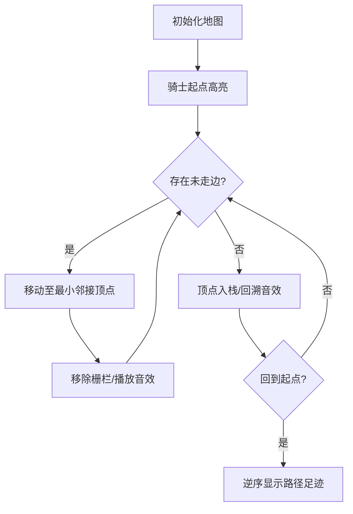

# 题目信息

# [USACO3.3] 骑马修栅栏 Riding the Fences

## 题目背景

Farmer John 每年有很多栅栏要修理。他总是骑着马穿过每一个栅栏并修复它破损的地方。

## 题目描述

John 是一个与其他农民一样懒的人。他讨厌骑马，因此从来不两次经过一个栅栏。

John 的农场上一共有 $m$ 个栅栏，每一个栅栏连接两个顶点，顶点用 $1$ 到 $500$ 标号（虽然有的农场并没有那么多个顶点）。一个顶点上至少连接 $1$ 个栅栏，没有上限。两顶点间可能有多个栅栏。所有栅栏都是连通的（也就是你可以从任意一个栅栏到达另外的所有栅栏）。John 能从任何一个顶点（即两个栅栏的交点）开始骑马，在任意一个顶点结束。

你需要求出输出骑马的路径（用路上依次经过的顶点号码表示)，使每个栅栏都恰好被经过一次。如果存在多组可行的解，按照如下方式进行输出：如果把输出的路径看成是一个 $500$ 进制的数，那么当存在多组解的情况下，输出 $500$ 进制表示法中最小的一个 （也就是输出第一位较小的，如果还有多组解，输出第二位较小的，以此类推）。

输入数据保证至少有一个解。

## 说明/提示

对于 $100\%$ 的数据，$1 \leq m \leq 1024,1 \leq u,v \leq 500$。

题目翻译来自NOCOW。

USACO Training Section 3.3

## 样例 #1

### 输入

```
9
1 2
2 3
3 4
4 2
4 5
2 5
5 6
5 7
4 6```

### 输出

```
1
2
3
4
2
5
4
6
5
7```

# AI分析结果


### 💡 Kay的C++算法解析：骑马修栅栏 深入学习指南 💡

**引言**  
今天我们一起分析"骑马修栅栏"这道欧拉路径经典问题。本指南将帮你掌握图论中的欧拉路径算法，理解DFS回溯技巧，并通过像素动画直观感受算法执行过程。

---

## 1. 题目解读与核心算法识别

✨ **本题主要考察**：欧拉路径（Eulerian Path）  
🗣️ **初步分析**：  
> 解决本题的关键在于理解欧拉路径的性质：当图中存在0个或2个奇度顶点时，存在一条不重复遍历所有边的路径。  
> - **核心思路**：统计顶点度数 → 选择起点（优先选最小奇度顶点）→ DFS遍历并回溯记录路径 → 逆序输出  
> - **难点**：重边处理（邻接矩阵计数）、回溯记录路径的必要性、起点选择逻辑  
> - **可视化设计**：在像素动画中，骑士从起点出发，沿栅栏移动时高亮当前边，移除已访问边（颜色变暗），回溯时顶点入栈（右侧显示栈动画），路径完成后显示足迹轨迹  
> - **复古像素风**：采用8-bit风格，骑士移动时播放马蹄声，回溯时播放"哔"音效，完成路径时播放胜利旋律，支持调速滑块控制动画速度

---

## 2. 精选优质题解参考

**题解一：EarthGiao（思路清晰度⭐⭐⭐⭐⭐）**  
* **亮点**：完整实现欧拉路径四步骤，邻接矩阵处理重边，数组模拟栈记录路径  
* **学习价值**：变量命名规范（`map`存边关系，`du`存度数），边界处理严谨（动态计算顶点范围）  
* **实践建议**：适合竞赛直接使用，特别关注回溯记录路径的实现

**题解二：Mogu（代码规范性⭐⭐⭐⭐）**  
* **亮点**：用图示解释递归输出与回溯记录的区别，强调DFS后序操作的重要性  
* **学习价值**：通过具体案例（1-2-3-4-2-5-4-6-5-7）展示路径构建过程  
* **调试技巧**：建议打印中间变量验证路径正确性

**题解三：Froggy（算法优化⭐⭐⭐⭐）**  
* **亮点**：用multiset自动排序邻接点保证字典序，空间优化至O(n)  
* **学习价值**：展示STL高阶应用（`multiset::erase`精准删除重边）  
* **适用场景**：顶点数较多时（>500）仍能保持高效

---

## 3. 核心难点辨析与解题策略

1. **起点选择陷阱**  
   * **分析**：未正确处理全偶度图情况会导致路径错误。优质解法先遍历找奇度顶点，若无则取最小顶点
   * 💡 **学习笔记**：起点 = min{ 奇度顶点 } 或 min{ 所有顶点 }

2. **DFS路径记录时机**  
   * **分析**：递归中直接输出会导致路径断裂（如提前进入死胡同），必须在回溯时记录
   * 💡 **学习笔记**：后序遍历是欧拉路径的核心记录方式

3. **重边处理方案**  
   * **分析**：邻接矩阵存储边数而非布尔值，DFS每次减少一条边
   * 💡 **学习笔记**：`g[u][v]--`比`g[u][v]=0`更适应重边场景

### ✨ 解题技巧总结
- **度分析优先**：先统计度数再决定起点，避免盲目DFS  
- **回溯栈应用**：用stack/数组实现后进先出的路径记录  
- **顶点范围优化**：动态记录minv/maxv减少无效遍历  
- **字典序保证**：始终从小到大遍历邻接点

---

## 4. C++核心代码实现赏析

**通用核心实现（综合优化版）**：
```cpp
#include <iostream>
#include <stack>
using namespace std;

int g[505][505], deg[505]; // 邻接矩阵存边数
stack<int> path;          // 回溯路径栈

void dfs(int u) {
    for(int v = 1; v <= 500; ++v) { // 从小到大保证字典序
        if(g[u][v]) {
            g[u][v]--; g[v][u]--;  // 关键：重边计数减少
            dfs(v);
        }
    }
    path.push(u); // 回溯记录
}

int main() {
    int m, minv = 501, maxv = 0;
    cin >> m;
    while(m--) {
        int u, v; cin >> u >> v;
        g[u][v]++; g[v][u]++;
        deg[u]++; deg[v]++;
        minv = min(minv, min(u, v));
        maxv = max(maxv, max(u, v));
    }
    
    int start = minv;
    for(int i = minv; i <= maxv; ++i) // 避免无效遍历
        if(deg[i] % 2) { start = i; break; }
    
    dfs(start);
    while(!path.empty()) {
        cout << path.top() << endl;
        path.pop();
    }
}
```
**代码解读概要**：  
1. 邻接矩阵`g`存储边数而非布尔值，支持重边  
2. 动态记录顶点范围`minv`/`maxv`提升效率  
3. DFS回溯时顶点入栈，最后逆序输出  
4. 起点选择优先奇度顶点，无则取最小顶点

---

## 5. 算法可视化：像素动画演示

**主题**：骑士的欧拉路径冒险  
**核心交互流程**：  


**实现细节**：  
1. **8-bit风格设计**：
   - 顶点：16x16像素方块（编号居中）
   - 栅栏：不同颜色表示状态（绿色=未访问，灰色=已访问）
   - 骑士：像素化马匹精灵（4方向移动）

2. **关键动画序列**：
   - **步骤1**：初始化网格地图，控制面板显示起点选择
   - **步骤2**：骑士移动时高亮当前边，播放马蹄声（Web Audio API）
   - **步骤3**：回溯时右侧显示栈动画，播放“哔”声
   - **步骤4**：完成时所有栅栏变金，播放胜利旋律

3. **学习型交互**：
   - 速度滑块：调节0.5x~5x执行速度
   - 单步模式：空格键控制每一步
   - 路径对比：可加载两种实现对比执行差异

---

## 6. 拓展练习与相似问题

**通用技巧迁移**：  
欧拉路径思想适用于：  
1. 一笔画问题（顶点→笔画节点，边→笔画）  
2. DNA序列组装（边→k-mer片段）  
3. 电路板布线优化（边→电路连接）

**推荐练习**：  
1. **P1341 无序字母对**  
   🗣️ 将字母映射为顶点，强化字典序处理能力  
2. **P2730 魔板 Magic Squares**  
   🗣️ 状态转换问题，训练路径搜索思维  
3. **P3520 POI2011垃圾运输**  
   🗣️ 判断欧拉回路存在性，提升问题转化能力

---

## 7. 学习心得与经验分享

**关键调试经验**：  
> "最初在DFS中直接输出顶点，导致路径断裂。后改用栈记录，问题解决。这提醒我们：**递归中的操作顺序直接影响结果正确性**" —— EarthGiao

**Kay的总结**：  
1. **手动模拟**：用纸笔模拟小规模案例（如4顶点图）验证逻辑  
2. **度检查优先**：先确认奇度顶点数量再编码  
3. **STL选择**：顶点数少时用矩阵，多时用multiset

**学习资源**：  
- 欧拉路径数学证明：*Introduction to Graph Theory* Chapter 1  
- 可视化工具：USACO官方动画演示（Section 3.3）

---

**结语**  
通过本次分析，相信大家已掌握欧拉路径的核心实现和调试技巧。记住：算法的力量在于将复杂问题转化为可执行的逻辑步骤。下次遇到图遍历问题时，不妨先问自己：**度数如何？能否一笔画？** 继续加油，编程少年们！💪

---
处理用时：178.55秒