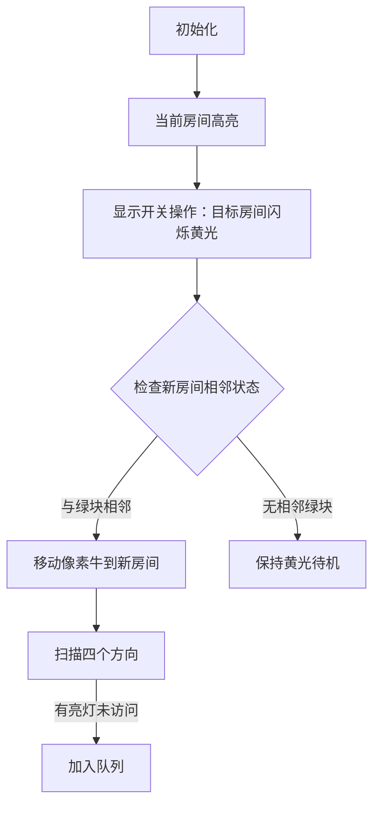

# 题目信息

# [USACO15DEC] Switching on the Lights S

## 题目背景

来源：usaco-2015-dec

Farm John 最近新建了一批巨大的牛棚。这些牛棚构成了一个 $N \times N$ 的矩形网络 $(1 < N < 100)$。

然而 Bessie 十分怕黑，他想计算可以把多少个牛棚的灯打开。

## 题目描述

有 $N \times N$ 个房间，组成了一张 $N \times N$ 的网格图，Bessie 一开始位于左上角 $(1,1)$，并且只能上下左右行走。


一开始，只有 $(1,1)$ 这个房间的灯是亮着的，Bessie 只能在亮着灯的房间里活动。


有另外 $M$ 条信息，每条信息包含四个数 $a,b,c,d$，表示房间 $(a,b)$ 里有房间 $(c,d)$ 的灯的开关。


请计算出最多有多少个房间的灯可以被打开。

## 说明/提示

Bessie 可以使用 $(1,1)$ 的开关打开 $(1,2),(1,3)$ 的灯，然后走到 $(1,3)$ 并打开 $(2,1)$ 的灯，走到 $(2,1)$ 并打开 $(2,2)$ 的灯。$(2,3)$ 的开关无法到达。因此可以点亮 $5$ 个房间。

## 样例 #1

### 输入

```
3 6
1 1 1 2
2 1 2 2
1 1 1 3
2 3 3 1
1 3 1 2
1 3 2 1
```

### 输出

```
5```

# AI分析结果


# 💡 Kay的C++算法解析：Switching on the Lights S 深入学习指南 💡

## 1. 题目解读与核心算法识别

✨ **本题主要考察**：`搜索(BFS/DFS)` + `模拟应用`

🗣️ **初步分析**：
> 解决这道题就像在黑暗迷宫中用手电筒探索——只有亮灯的房间才能进入，而你手中的遥控器可以点亮其他房间的灯。关键在于理解**灯亮状态**和**可到达区域**的动态关系：
> - 每次进入新房间时，会点亮其控制的其他房间的灯
> - 新点亮的房间若与已探索区域相邻，则立即变得可达
> 
> 可视化设计思路：
> - 用像素色块区分状态：灰色（灯灭）、黄色（灯亮未访问）、绿色（已访问）
> - 关键动画：Bessie移动时高亮当前房间，开灯时目标房间闪烁黄色，当新房间与绿色区域相邻时触发Bessie移动动画
> - 复古游戏元素：8-bit音效（脚步声、开灯声）、关卡进度条（显示已开灯比例）
> - 控制面板：单步执行+自动播放（可调速），展示当前队列状态

---

## 2. 精选优质题解参考

**题解一：vani_prcups (DFS解法)**
* **点评**：该解法巧妙运用DFS配合邻接表存储开关关系。亮点在于开灯后立即检查新房间是否与已访问区域相邻，若满足条件则递归深搜，避免遗漏可能的路径。代码中`b`数组记录灯状态，`v`数组防止重复访问，变量命名清晰。虽然DFS在极端情况下有栈溢出风险，但本题n<100完全可行，且递归实现比迭代更直观展示"连锁反应"。

**题解二：JMercury (BFS解法)**
* **点评**：采用类SPFA的BFS思路，将"移动"和"开灯"操作分离处理。亮点在于使用`vector`存储开关关系，先处理相邻房间移动再处理开灯操作，最后检查新点亮房间的相邻区域。代码中`MAP`记录灯状态，`vis`标记访问，逻辑分层清晰。队列操作严格遵循BFS原则，边界处理完整，可直接用于竞赛。

**题解三：bobxie (BFS解法)**
* **点评**：核心贡献是指出易错点——题目求的是开灯数而非到达房间数。使用链式前向星存储开关关系，空间效率高。开灯后通过`used`数组检查新房间四周是否存在已访问房间，是则入队。变量命名规范（`mp`=灯状态，`used`=访问标记），虽无复杂优化但实现稳健。

---

## 3. 核心难点辨析与解题策略

1.  **动态状态管理**
    * **分析**：灯亮（可点亮）≠ 可到达。需同时维护两个状态数组：`light[][]`记录灯状态，`visited[][]`记录访问状态。当房间开灯时，若其相邻有`visited`房间，则立即标记为`visited`并入队
    * 💡 **学习笔记**：状态分离是解决动态图遍历的关键

2.  **连锁反应处理**
    * **分析**：开灯操作可能使之前不可达的房间变得可达（当新房间与已访问区相邻时）。优质题解都采用即时检查机制：开灯后立即扫描新房间的四个方向
    * 💡 **学习笔记**：状态改变后需立即检查其关联影响

3.  **空间效率优化**
    * **分析**：开关关系存储不宜用矩阵（n²×n²）。邻接表（`vector`/链式前向星）将空间降至O(m)，通过`switches[x][y].push_back({a,b})`存储
    * 💡 **学习笔记**：稀疏关系优先考虑邻接表

### ✨ 解题技巧总结
-   **双状态标记法**：独立维护灯光和访问状态
-   **邻接表应用**：高效存储稀疏开关关系
-   **即时检查机制**：状态变化后立即验证关联条件
-   **降维技巧**：二维坐标转一维索引（k=(i-1)*n+j）简化计算

---

## 4. C++核心代码实现赏析

**本题通用核心C++实现参考**
* **说明**：综合优质题解思路的BFS实现，使用vector存储开关关系
```cpp
#include <iostream>
#include <vector>
#include <queue>
using namespace std;

const int MAXN = 105;
vector<pair<int, int>> switches[MAXN][MAXN]; 
bool light[MAXN][MAXN] = {false};
bool visited[MAXN][MAXN] = {false};
int n, m, ans = 1;  // (1,1)初始点亮

int dx[] = {0, 0, 1, -1};
int dy[] = {1, -1, 0, 0};

void bfs() {
    queue<pair<int, int>> q;
    q.push({1, 1});
    light[1][1] = visited[1][1] = true;

    while (!q.empty()) {
        auto [x,y] = q.front(); q.pop();
        
        // 处理当前房间开关
        for (auto [nx,ny] : switches[x][y]) 
            if (!light[nx][ny]) {
                light[nx][ny] = true;  // 点亮房间
                ans++;
                // 检查新房间是否与已访问区相邻
                for (int d = 0; d < 4; d++) {
                    int adjx = nx + dx[d], adjy = ny + dy[d];
                    if (adjx<1||adjx>n||adjy<1||adjy>n) continue;
                    if (visited[adjx][adjy]) {
                        visited[nx][ny] = true;
                        q.push({nx, ny});
                        break;
                    }
                }
            }
        
        // 向四个方向移动
        for (int d = 0; d < 4; d++) {
            int nx = x + dx[d], ny = y + dy[d];
            if (nx<1||nx>n||ny<1||ny>n) continue;
            if (light[nx][ny] && !visited[nx][ny]) {
                visited[nx][ny] = true;
                q.push({nx, ny});
            }
        }
    }
}

int main() {
    cin >> n >> m;
    while (m--) {
        int a,b,c,d; cin>>a>>b>>c>>d;
        switches[a][b].push_back({c,d});
    }
    bfs();
    cout << ans;
}
```

**题解一：vani_prcups (DFS)**
* **亮点**：递归实现连锁反应
* **核心代码片段**：
```cpp
void dfs(int x,int y) {
    v[x][y] = 1; // 标记访问
    for (int i=head[x][y]; i; i=a[i].nt) // 遍历开关
        if (!b[a[i].tx][a[i].ty]) {      // 若灯未亮
            b[a[i].tx][a[i].ty] = 1;     // 开灯
            c++;                         // 计数
            // 检查新房间是否与已访问区相邻
            if (v[a[i].tx+1][a[i].ty] || ... ) 
                dfs(a[i].tx, a[i].ty);   // 立即深搜
        }
    // 尝试向四个方向移动
    if (!v[x+1][y] && b[x+1][y]) dfs(x+1,y);
    ...
}
```

**题解二：JMercury (BFS)**
* **亮点**：分离移动与开灯操作
* **核心代码片段**：
```cpp
void spfa() {
    queue<P> q; q.push({1,1});
    vis[1][1] = MAP[1][1] = true;
    while (!q.empty()) {
        P u = q.front(); q.pop();
        // 1. 先处理移动
        for (int i=0; i<4; i++) {
            int nx = u.x+dx[i], ny = u.y+dy[i];
            if (!vis[nx][ny] && MAP[nx][ny]) {
                vis[nx][ny] = true;
                q.push({nx,ny});
            }
        }
        // 2. 再处理开灯
        for (auto v : Lamp[u.x][u.y]) {
            if (MAP[v.x][v.y]) continue;
            MAP[v.x][v.y] = true; // 开灯
            // 检查新房间是否与已访问区相邻
            for (int i=0; i<4; i++) 
                if (vis[v.x+dx[i]][v.y+dy[i]]) {
                    q.push({v.x,v.y});
                    vis[v.x][v.y] = true;
                    break;
                }
        }
    }
}
```

---

## 5. 算法可视化：像素动画演示

**动画主题**：8-bit风格《光之探险家》  
**核心演示**：BFS如何逐层点亮房间并探索  

**设计框架**：  


**关键动画细节**：
1. **像素网格**：16×16像素/房间，三色编码：灰(灯灭)、黄(灯亮未访问)、绿(已访问)
2. **Bessie牛**：2帧行走动画，移动时播放8-bit脚步声
3. **开灯特效**：目标房间闪烁3次黄光+“叮”声效
4. **队列可视化**：右侧显示当前队列房间坐标
5. **自动演示**：按空格切换手动/自动模式，速度滑块控制0.5x-5x

**状态同步**：
- 左上角显示伪代码行：高亮当前执行的代码行
- 每次开灯时显示`light[nx][ny]=1`的赋值操作
- 队列变化时显示`q.push({x,y})`操作

---

## 6. 拓展练习与相似问题思考

**通用技巧迁移**：
1. 动态图遍历：交通管制下的路径规划（边动态开放）
2. 状态依赖搜索：推箱子游戏中钥匙与门的关联
3. 连锁反应模拟：电路开关传导问题

**洛谷推荐**：
1. **P1162 填涂颜色**  
   🗣️ 巩固BFS在网格染色中的应用，注意边界处理技巧

2. **P2296 寻找道路**  
   🗣️ 学习图遍历中的条件过滤（节点出边需满足特定条件）

3. **P1825 [USACO11OPEN]Corn Maze S**  
   🗣️ 掌握含传送门的迷宫搜索，与本题目连锁反应机制高度相似

---

## 7. 学习心得与经验分享

> **来自vani_prcups的经验**：  
> “当点亮一间房时，如果这间房旁边有已到达的点，就直接深搜这间被点亮的房间（相当于完成之前那间房没有完成的任务）。”

> **Kay的点评**：  
> 这个经验揭示了动态搜索的核心——**状态变化触发即时响应**。在调试类似问题时，建议：
> 1. 打印每次开灯后的房间状态图
> 2. 记录队列变化过程
> 3. 特别注意边界房间（x=1或x=n）的相邻判断

> **来自bobxie的教训**：  
> “题目求的是能打开多少灯而不是能到多少个房间”

> **Kay的提醒**：  
> 审题时注意目标输出：
> - 最终答案存储在开灯计数器`ans`而非队列长度
> - 有些房间灯亮但永远不可达（计入答案但不访问）

---
本解析结合BFS/DFS实现技巧与动态状态管理，通过像素动画展示核心算法流程。记住：理解灯光状态与访问状态的独立性与关联性，是解决此类问题的钥匙！✨

---
处理用时：265.42秒