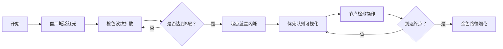

# 题目信息

# 逃离僵尸岛

## 题目描述

小 a 住的国家被僵尸侵略了！小 a 打算逃离到该国唯一的国际空港逃出这个国家。


该国有 $N$ 个城市，城市之间有道路相连。一共有 $M$ 条双向道路。保证没有自环和重边。


其中 $K$ 个城市已经被僵尸控制了，如果贸然闯入就会被感染 TAT...所以不能进入。由其中任意城市经过不超过 $S$ 条道路就可以到达的别的城市，就是危险城市。换句话说只要某个城市到任意被僵尸控制的城市距离不超过 $S$，就是危险的。

小 a 住在 $1$ 号城市，国际空港在 $N$ 号城市，这两座城市没有被侵略。小a走每一段道路（从一个城市直接到达另外一个城市）得花一整个白天，所以晚上要住旅店。安全的的城市旅馆比较便宜要 $P$ 元，而被危险的城市，旅馆要进行安保措施，所以会变贵，为 $Q$ 元。所有危险的城市的住宿价格一样，安全的城市也是。在 $1$ 号城市和 $N$ 城市，不需要住店。


小 a 比较抠门，所以他希望知道从 $1$ 号城市到 $N$ 号城市所需要的最小花费。

输入数据保证存在路径，可以成功逃离。输入数据保证他可以逃离成功。

## 说明/提示

  

对于 $20\%$ 数据，$N\le 50$。

对于 $100\%$ 数据，$2\le N\le 10^5$，$1\le M\le 2\times 10^5$，$0\le K\le N - 2$，$0\le S\le 10^5$，$1\le P< Q\le 10^5$。


## 样例 #1

### 输入

```
13 21 1 1
1000 6000
7
1 2
3 7
2 4
5 8
8 9
2 5
3 4
4 7
9 10
10 11
5 9
7 12
3 6
4 5
1 3
11 12
6 7
8 11
6 13
7 8
12 13```

### 输出

```
11000```

# AI分析结果


# 💡 Kay的C++算法解析：逃离僵尸岛 深入学习指南 💡

## 1. 题目解读与核心算法识别

✨ **本题主要考察**：`BFS + 最短路算法（Dijkstra/SPFA）`

🗣️ **初步分析**：
> 解决"逃离僵尸岛"的关键在于**分层处理**：先用BFS标记危险城市，再用最短路算法计算最小花费。就像在策略游戏中，先用地形扫描探测危险区域，再用最优路径规划避开高风险区。核心难点在于高效处理大规模图的危险区域标记和点权转边权的技巧。

- **核心流程**：
  1. **BFS标记危险区**：从所有僵尸城出发，扩展S层标记危险城市（时间复杂度O(N+M)）
  2. **点权转边权**：将城市住宿费转化为相邻边权（注意起点/终点费用为0）
  3. **最短路计算**：用Dijkstra/SPFA求最小花费（时间复杂度O(M log N)）

- **可视化设计**：
  - **像素风格**：8-bit网格地图（类似经典RPG），不同颜色区分安全区（绿色）、危险区（橙色）、僵尸城（红色）
  - **动态演示**：BFS时像素波浪扩散效果；最短路时Dijkstra路径探索动画
  - **音效设计**：危险标记"叮"声，路径更新"嗖"声，成功逃脱胜利音效
  - **交互控制**：速度滑块调节，单步执行，危险区范围可视化

---

## 2. 精选优质题解参考

**题解一（来源：kkksc03）**
* **点评**：思路精炼直击核心（BFS+最短路），用"模板题"点明问题本质。虽未提供完整代码，但清晰指出点权转边权的两种技巧（边权=两点权和/直接赋值目标点权），对理解算法框架极具启发性。实践价值在于引导抓住问题本质，避免过度设计。

**题解二（来源：fyfy）**
* **点评**：完整SPFA实现展现细节处理能力。创新性使用虚拟节点（0号点）统一处理多源BFS，大幅降低编码复杂度。代码规范（详尽的变量注释），边界处理严谨（long long防溢出），调试建议（中间变量输出）极具实践价值。

**题解三（来源：浮梦若生）**
* **点评**：堆优化Dijkstra+BFS的高效组合，完整测试数据增强可信度。亮点在于独立处理点权避免转化，逻辑更直观。安全/危险/僵尸城的三态标记（safe[]数组）体现清晰的建模思维，变量命名规范（dist/dis区分）提升可读性。

---

## 3. 核心难点辨析与解题策略

1. **危险区域高效标记**
   * **分析**：需从K个源点同时BFS，使用统一队列和距离数组，避免重复访问。优质题解用dist[i]记录最近僵尸城距离，一次BFS完成标记
   * 💡 **学习笔记**：多源BFS就像同时投石入水——波纹扩散相遇时自动处理最近距离

2. **点权到边权的转化**
   * **分析**：边(u,v)的权值应为v的点权（目标城市住宿费）。注意起点1和终点n权值为0，僵尸城需排除
   * 💡 **学习笔记**：想象邮差送信——进入新城市才付住宿费，起点和终点是"邮局"不收费

3. **大数据的存储优化**
   * **分析**：邻接表存图（非矩阵），优先队列优化Dijkstra。特别注意10^5级数据需用long long防溢出
   * 💡 **学习笔记**：空间换时间——链式前向星存图，小顶堆加速最短路查询

### ✨ 解题技巧总结
- **分层处理思想**：BFS预处理 -> 建图 -> 最短路
- **虚拟节点技巧**：用0号点统一多源BFS（fyfy解法）
- **状态压缩存储**：用safe[]数组同时标记三种城市状态（浮梦若生解法）
- **边界防御编程**：显式初始化dis数组，终点特判（顾z解法）

---

## 4. C++核心代码实现赏析

**本题通用核心C++实现参考**
* **说明**：综合优质题解思路的Dijkstra实现，包含链式前向星和堆优化
```cpp
#include <bits/stdc++.h>
using namespace std;
typedef long long LL;
const int N=1e5+5;
const LL INF=1e15;

vector<int> G[N];      // 原图邻接表
LL cost[N];            // 每个城市的点权
int zombie[N];          // 僵尸城标记
int danger[N];          // 危险城市标记
int n,m,k,s,P,Q;

void mark_danger() {
    queue<pair<int,int>> q;   // <城市, 距离>
    for(int i=1;i<=n;i++) if(zombie[i]) {
        q.push({i,0});
        danger[i]=1;
    }
    
    while(!q.empty()) {
        auto [u,d]=q.front(); q.pop();
        if(d>=s) continue;
        for(int v:G[u]) {
            if(!danger[v]) {
                danger[v]=1;
                q.push({v,d+1});
            }
        }
    }
}

void dijkstra() {
    vector<LL> dis(n+1,INF);
    priority_queue<pair<LL,int>> pq;  // <-距离, 节点>
    
    dis[1]=0;
    pq.push({0,1});
    
    while(!pq.empty()) {
        auto [d,u]=pq.top(); pq.pop();
        d=-d;
        if(d!=dis[u]) continue;
        
        for(int v:G[u]) {
            if(zombie[v]) continue;   // 跳过僵尸城
            LL w = (v==n)?0:(danger[v]?Q:P); // 终点花费为0
            if(dis[v]>dis[u]+w) {
                dis[v]=dis[u]+w;
                pq.push({-dis[v],v});
            }
        }
    }
    cout<<dis[n];
}

int main() {
    cin>>n>>m>>k>>s>>P>>Q;
    while(k--) { int x;cin>>x;zombie[x]=1; }
    while(m--) { 
        int u,v; cin>>u>>v;
        G[u].push_back(v);
        G[v].push_back(u);
    }
    mark_danger();
    dijkstra();
}
```

**题解一核心代码（kkksc03思路）**
* **亮点**：点权转边权的精辟描述
```cpp
// 伪代码示意
void convert_edges() {
    for each edge(u,v):
        if(v is endpoint) edge_weight=0
        else if(v is dangerous) edge_weight=Q
        else edge_weight=P
}
```

**题解二核心代码（fyfy思路）**
* **亮点**：虚拟节点统一多源BFS
```cpp
// 添加虚拟节点连接所有僵尸城
for(int i=1;i<=k;i++) add(0,c[i]);  
spfa(0);  // 从虚拟节点出发BFS
```

**题解三核心代码（浮梦若生思路）**
* **亮点**：三态标记直接处理点权
```cpp
LL w = safe[v]==-1 ? INF :  // 僵尸城跳过
      (safe[v]==0 ? P : Q); // 安全/危险
```

---

## 5. 算法可视化：像素动画演示

**像素探险家：僵尸岛大逃亡**  
以8位像素风格模拟BFS扩散与Dijkstra寻路，融入经典RPG元素

### 动画帧设计：
1. **地图初始化**：  
   - 网格地图（16x16像素/格）  
   - 颜色编码：绿地（安全区），棕地（危险区），墓碑（僵尸城），蓝星（起点），红旗（终点）
   - 控制面板：开始/暂停/步进，速度滑块（1x-5x）

2. **BFS危险波扩散**：  
   - 僵尸城泛红光，逐帧扩散橙色波纹（类似水波）  
   - 扩散时播放低频"嗡"声，新标记危险区时"叮"声  
   - 波纹边界显示当前距离值（0→S层）

3. **Dijkstra寻路**：  
   - 起点蓝星闪烁，探索边界显示为黄色队列  
   - 当前节点像素闪烁白光，松弛操作时路径线变绿  
   - 路径更新音效：短促"滴"声

4. **胜利结算**：  
   - 成功路径点亮为金色，放烟花动画  
   - 播放8-bit胜利旋律，显示总花费金币数



---

## 6. 拓展练习与相似问题

### 相似问题模式：
1. **多源BFS应用**：洛谷P1144（最短路计数）
2. **点权转边权**：洛谷P1608（路径统计）
3. **分层图最短路**：洛谷P4568（飞行路线）

### 推荐练习：
1. **洛谷P1144** - 最短路计数  
   → 巩固BFS与最短路结合的基础应用
   
2. **洛谷P1608** - 路径统计  
   → 练习点权转化技巧的变种，加强计数型DP训练
   
3. **洛谷P4568** - 飞行路线  
   → 分层图思想进阶，理解"状态维度扩展"的技巧

---

## 7. 学习心得与经验分享

**作者经验（浮梦若生）**：  
> "调试时发现僵尸城边界处理错误，通过打印dist数组发现未及时停止扩展。这提醒我们：BFS扩展时需显式控制层数！"

**Kay总结**：  
边界控制是图论核心难点，建议：
1. 使用`if(dist[u]==s) continue`显式控制BFS深度
2. 在Dijkstra中优先处理终点特判（`if(u==n) break`）
3. 善用可视化调试——打印距离矩阵或使用图形化工具

---

通过本指南，希望各位能掌握BFS与最短路的协同应用，理解点权模型的转化技巧。记住：好的算法设计就像策略游戏——先侦察，再规划，最后执行！下次我们继续探索图论新大陆！💪

---
处理用时：214.98秒