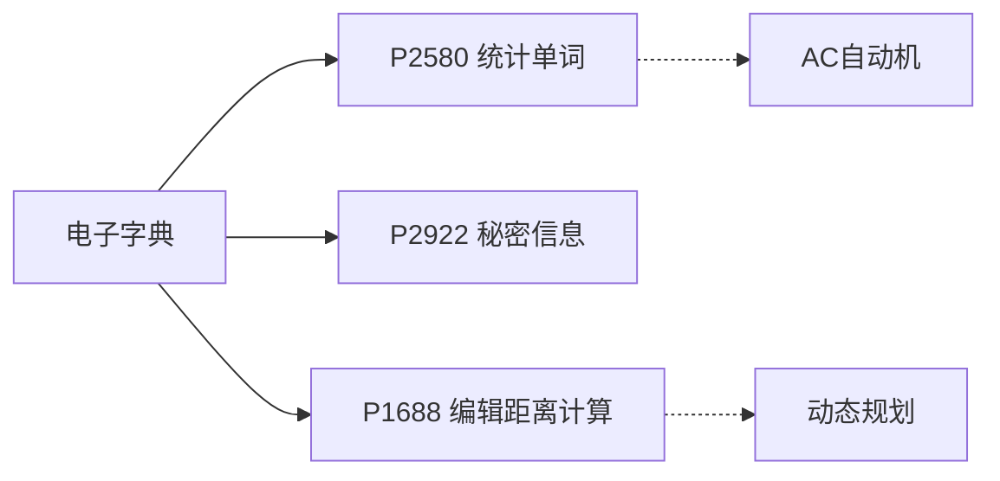

# 题目信息

# [JSOI2009] 电子字典

## 题目描述


人们在英文字典中查找某个单词的时候可能不知道该单词的完整拼法，而只知道该单词的一个错误的近似拼法，这时人们可能陷入困境，为了查找一个单词而浪费大量的时间。带有模糊查询功能的电子字典能够从一定程度上解决这一问题：用户只要输入一个字符串，电子字典就返回与该单词编辑距离最小的几个单词供用户选择。

字符串 $a$ 与字符串 $b$ 的编辑距离是指：允许对 $a$ 或 $b$ 串进行下列“编辑”操作，将 $a$ 变为 $b$ 或 $b$ 变为 $a$，最少“编辑”次数即为距离。

1. 删除串中某个位置的字母；
2. 添加一个字母到串中某个位置；
3. 替换串中某一位置的一个字母为另一个字母。

JSOI 团队正在开发一款电子字典，你需要帮助团队实现一个用于模糊查询功能的计数部件：对于一个待查询字符串，如果它是单词，则返回 $-1$；如果它不是单词，则返回字典中有多少个单词与它的编辑距离为 $1$。

## 说明/提示

### 样例解释

- `abcd` 在单词表中出现过；
- `abc` 与单词 `abcd`、`aabc` 的编辑距离都是 $1$；
- `abcdd` 与单词 `abcd`、`abcde`、`abced` 的编辑距离都是 $1$。

### 数据范围与约定

- 所有单词互不相同，但是查询字符串可能有重复；
- 对 $50\%$ 的数据范围，$N,M\le 10^3$；
- 对 $100\%$ 的数据范围，$N,M\le 10^4$。

## 样例 #1

### 输入

```
4 3
abcd
abcde
aabc
abced
abcd
abc
abcdd```

### 输出

```
-1
2
3```

# AI分析结果


# 💡 Kay的C++算法解析：电子字典 深入学习指南 💡

> 欢迎来到电子字典算法的探索之旅！今天我们将深入分析这道字符串处理题，通过生动比喻和像素动画帮助大家理解Trie树与哈希两种核心解法。准备好开启算法冒险了吗？🚀

## 1. 题目解读与核心算法识别

✨ **本题主要考察**：`Trie树应用` 与 `哈希技巧`

🗣️ **初步分析**：
> 电子字典问题就像在图书馆用模糊书名找书——允许书名有1个字母的误差（增/删/改）。核心挑战是**高效枚举所有误差为1的变形并验证存在性**。就像图书管理员用索引系统快速检索，我们采用：
> - **Trie树（字母树）**：像图书馆分区导航，按字母顺序分层组织单词，DFS搜索时模拟编辑操作
> - **哈希表**：像快速检索码，预处理所有可能变形并存储指纹
> 
> **关键对比**：
> - Trie解法：通过DFS在树上"行走"时实时编辑，避免生成全部字符串
> - 哈希解法：提前计算所有变形指纹，查询时直接匹配
>
> **可视化设计**：采用8位像素风格展示Trie树结构（树节点=像素书架），DFS过程用不同颜色光点表示当前操作（红=删除/绿=添加/蓝=替换）。添加FC音效：编辑操作触发"嘀"声，找到单词时播放《超级玛丽》过关音效！

---

## 2. 精选优质题解参考

### 题解一：Utsuji_risshū (Trie+DFS)
* **点评**：
  - 思路清晰度：⭐️⭐️⭐️⭐️⭐️  
    DFS状态设计简洁（当前节点/位置/编辑标记），三种编辑操作逻辑分明
  - 代码规范性：⭐️⭐️⭐️⭐️  
    变量名`visx`/`vistot`直观体现代码去重思想，边界处理严谨（`l>=len`判断）
  - 算法有效性：⭐️⭐️⭐️⭐️  
    时间复杂度O(26*L)（L=单词长度），利用Trie剪枝避免无效搜索
  - 实践价值：⭐️⭐️⭐️⭐️⭐️  
    可直接用于竞赛，`vis`数组标记节点解决重复计数问题

### 题解二：Iscream2001 (哈希预处理)
* **点评**：
  - 思路清晰度：⭐️⭐️⭐️⭐️  
    将编辑操作转化为哈希值计算，分类讨论删除/添加/替换的哈希处理
  - 代码规范性：⭐️⭐️⭐️  
    `b[25]`存储幂次稍显隐晦，但排序去重逻辑正确
  - 算法有效性：⭐️⭐️⭐️⭐️  
    O(nL)预处理，O(L)查询，哈希冲突概率低（ull自然溢出）
  - 实践价值：⭐️⭐️⭐️⭐️  
    避免DFS递归栈开销，更适合大查询量场景

### 题解三：Cry_For_theMoon (Trie+DFS细节优化)
* **点评**：
  - 思路清晰度：⭐️⭐️⭐️⭐️⭐️  
    特别强调"假修改"处理（如替换相同字母无效），深入分析Trie路径特性
  - 代码规范性：⭐️⭐️⭐️⭐️  
    函数模块化（dfs1/dfs2/dfs3分离操作），调试提示实用
  - 算法有效性：⭐️⭐️⭐️⭐️  
    额外剪枝提升效率，时间复杂度与解法一相当
  - 实践价值：⭐️⭐️⭐️⭐️  
    对理解Trie搜索机制有教学意义，但代码量稍大

---

## 3. 核心难点辨析与解题策略

### 难点1：高效枚举编辑变形
* **分析**  
  直接生成所有变形需O(26L)种可能（L=长度），Trie解法通过DFS在树上实时过滤无效路径，哈希解法通过数学计算避免显式生成
* 💡 **学习笔记**  
  **"树上行走"比"暴力枚举"更智能**

### 难点2：避免重复计数
* **分析**  
  不同编辑路径可能产生相同单词（如删除首字母a和替换首字母a为a）。优质解法用`vis[]`标记Trie终点节点，或对哈希值排序去重
* 💡 **学习笔记**  
  **终点去重是保证结果正确的关键**

### 难点3：边界条件处理
* **分析**  
  添加操作可能在头/尾插入，删除需防越界。解法中`l<len`/`l>=len`等判断确保安全访问
* 💡 **学习笔记**  
  **字符串首尾是编辑操作的敏感区**

### ✨ 解题技巧总结
1. **状态机思维**：将编辑操作视为状态转移（未编辑→已编辑）
2. **数学化处理**：哈希解法中用`l[j-1]*bin[len-j] + r[j+1]`高效计算删除j位的哈希
3. **实时剪枝**：Trie DFS中遇到匹配成功后立即终止无关搜索
4. **模块化设计**：分离插入/查询/编辑操作逻辑（如解法三独立dfs函数）

---

## 4. C++核心代码实现赏析

### 本题通用核心实现参考
* **说明**：综合Trie解法精髓，优化变量命名与边界处理
* **完整核心代码**：
```cpp
#include <bits/stdc++.h>
using namespace std;
const int MAXN = 200005; // 扩大节点数

struct EletronicDict {
    int trie[MAXN][26], cnt; // trie树结构
    bool exist[MAXN], vis[MAXN]; // 终点标记/访问标记
    vector<int> path; // 记录访问路径

    void insert(string s) {
        int u = 0;
        for (char c : s) {
            int idx = c - 'a';
            if (!trie[u][idx]) trie[u][idx] = ++cnt;
            u = trie[u][idx];
        }
        exist[u] = true;
    }

    void dfs(string& s, int u, int pos, bool edited) {
        if (pos == s.size()) {
            if (exist[u]) {
                if (!edited) found = true; // 完全匹配
                else if (!vis[u]) {        // 编辑后匹配
                    vis[u] = true;
                    path.push_back(u);
                }
            }
            return;
        }
        
        int idx = s[pos] - 'a';
        // 正常匹配
        if (trie[u][idx]) 
            dfs(s, trie[u][idx], pos+1, edited);
        
        if (edited) return; // 已编辑则终止
        
        // 删除当前字符
        if (pos < s.size())
            dfs(s, u, pos+1, true);
        
        // 添加字符（枚举26字母）
        for (int i = 0; i < 26; i++) {
            if (!trie[u][i]) continue;
            // 添加后匹配当前位置
            dfs(s, trie[u][i], pos, true);
            // 替换字符（非原字符）
            if (i != idx) 
                dfs(s, trie[u][i], pos+1, true);
        }
    }

    int query(string s) {
        found = false;
        path.clear();
        dfs(s, 0, 0, false);
        for (int u : path) vis[u] = false; // 重置访问标记
        return found ? -1 : path.size();
    }
};
```
* **代码解读概要**：
  - **插入**：沿Trie路径创建/更新节点，终点标记`exist`
  - **DFS查询**：核心状态`(节点, 位置, 编辑标记)`，三种编辑操作并行处理
  - **去重机制**：`vis[]`标记已访问终点，`path`存储本次访问节点
  - **重置技巧**：查询后清空`path`并复位`vis`避免全局重置

---

## 5. 算法可视化：像素动画演示

### 像素探险家闯关指南 🎮
* **主题**：8-bit风格Trie树迷宫探险
* **核心演示**：DFS遍历Trie树时的三种编辑操作动画

### 动画帧设计（伪代码）
```javascript
// 初始化：FC风格界面
InitScene(Trie树像素地图, 当前查询词:"abcd") 

// 关键帧1：正常匹配（蓝光追踪）
while (正常匹配路径)
    DrawNode(current, 颜色=#3498db) 
    PlaySound("move.wav") 

// 关键帧2：删除操作（红光跳跃）
if (触发删除)
    DrawArrow(跳过当前字符, 颜色=#e74c3c)
    PlaySound("delete.wav")

// 关键帧3：添加操作（绿光分叉）
if (触发添加)
    DrawNewBranch(新增节点, 颜色=#2ecc71)
    PlaySound("insert.wav") 

// 关键帧4：替换操作（紫光变换）
if (触发替换)
    DrawTransform(原字符→新字符, 颜色=#9b59b6)
    PlaySound("replace.wav")

// 结果界面
if (找到目标) 
    DrawFireworks(终点节点)
    PlaySound("win.wav")
```

### 交互控制面板
```markdown
| 控制项     | 功能                     | 像素风格          |
|------------|--------------------------|-------------------|
| 步进执行   | 单步演示算法             | FC手柄右键        |
| 速度滑块   | 调整DFS速度(1x-5x)       | 滑动条(8-bit灰阶) |
| 操作高亮   | 红/绿/蓝光标记编辑操作   | 闪烁边框          |
| 音效开关   | 启用/禁用操作音效        | 开关像素按钮      |
```

### 设计逻辑
> 通过**颜色编码**区分操作类型，**像素箭头**显示跳转路径，**音效反馈**强化记忆。将DFS转化为探险家闯关：每通过一个编辑操作关卡获得积分，最终找到单词时触发"宝藏开启"动画。数据结构可视化采用书架隐喻：Trie节点=书架，字母=图书分类标签。

---

## 6. 拓展练习与相似问题思考

### 能力进阶路线


### 推荐练习
1. **洛谷 P2580** - 统计单词
   * 🗣️ **推荐理由**：巩固Trie树基础操作，理解前缀查询
2. **洛谷 P2922** - 秘密信息
   * 🗣️ **推荐理由**：扩展Trie树在信息检索中的应用，练习前缀匹配
3. **洛谷 P1688** - 编辑距离计算
   * 🗣️ **推荐理由**：学习通用编辑距离DP解法，对比本题特例

---

## 7. 学习心得与经验分享

> **来自题解的启示**：
> - *Utsuji_risshū*：DFS设计时用`vis[]`标记终点而非路径，避免重复计数
> - *Cry_For_theMoon*：特别注意"假修改"（如替换相同字符）是无用操作
> - *Iscream2001*：哈希解法中排序去重是保证效率的关键
>
> **调试经验**：
> 当DFS结果异常时，打印`(节点,位置,编辑标记)`三元组，观察状态转移路径

---

本次电子字典的算法探索就到这里！记住：**优秀的算法如同精妙的探险地图——既要结构清晰，又要充满发现乐趣**。下次算法冒险再见！👾

---
处理用时：181.36秒