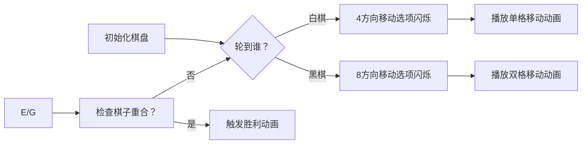

# 题目信息

# [CQOI2013] 棋盘游戏

## 题目描述

一个n*n（n>=2）棋盘上有黑白棋子各一枚。游戏者A和B轮流移动棋子，A先走。

 * A的移动规则：只能移动白棋子。可以往上下左右四个方向之一移动一格。
 
 * B的移动规则：只能移动黑棋子。可以往上下左右四个方向之一移动一格或者两格。
 
和通常的“吃子”规则一样，当某游戏者把自己的棋子移动到对方棋子所在的格子时，他就赢了。

两个游戏者都很聪明，当可以获胜时会尽快获胜，只能输掉的时候会尽量拖延时间。你的任务是判断谁会赢，需要多少回合。


比如$n=2$，白棋子在$(1,1)$，黑棋子在$(2,2)$，那么虽然A有两种走法，第二个回合B总能取胜。

## 说明/提示

$n<=20$

## 样例 #1

### 输入

```
2 1 1 2 2```

### 输出

```
BLACK 2```

# AI分析结果


### 💡 Kay的C++算法解析：[CQOI2013] 棋盘游戏 深入学习指南 💡

#### 1. 题目解读与核心算法识别
✨ **本题主要考察**：`对抗搜索`（博弈论）  
🗣️ **初步分析**：  
> 解决棋盘游戏的关键在于理解**对抗搜索**——就像两名棋手轮流下棋，一方希望尽快获胜，另一方则尽力拖延。白棋（A）每次只能移动一格，黑棋（B）可移动一或两格。核心策略是：
> - 若开局两棋子相邻（曼哈顿距离=1），白棋一步获胜
> - 否则黑棋必胜，需计算其最小获胜步数  
>  
> **可视化设计思路**：  
> 采用**8位像素风**棋盘（如FC游戏），白棋为⚪，黑棋为⚫。动画将展示：
> - 当前移动方高亮闪烁  
> - 移动路径的箭头轨迹  
> - 步数计数器实时更新  
> - 获胜时棋子爆炸特效+胜利音效  

---

#### 2. 精选优质题解参考
**题解一（作者：Tenshi）**  
* **点评**：  
  思路清晰直击对抗搜索本质——通过`dfs`交替进行min/max决策。代码规范：  
  - 用`bool ok`区分玩家，`dx/dy`数组封装移动逻辑  
  - 记忆化数组`f[2][65][N][N][N][N]`设计合理  
  - 时间复杂度优化：步数限制`3n`避免无限递归  
  亮点：对抗搜索的零和博弈特性阐释透彻，代码可直接用于竞赛。

**题解二（作者：Exiler）**  
* **点评**：  
  亮点在于**工程化封装**：  
  - `point`结构体提升坐标可读性  
  - `getdis()`计算曼哈顿距离  
  - `move()`函数实现方向移动  
  严谨处理边界：`judge()`函数验证位置合法性，步数上限`3n`保障高效性。

**题解三（作者：JRhdj）**  
* **点评**：  
  最简洁的对抗搜索实现：  
  - 状态定义`f[2][60][21][21][21][21]`兼顾效率  
  - 白棋移动循环`for(i=0;i<4)`，黑棋`for(i=0;i<8)`覆盖1-2格移动  
  - 返回值`INF`巧妙处理无效状态  

---

#### 3. 核心难点辨析与解题策略
1. **关键点1：胜负态判断**  
   * **分析**：白棋仅当开局曼哈顿距离=1时必胜（一步吃子）。其他情况黑棋必胜——因黑棋移动更快（2格/步），可主动逼近白棋。
   * 💡 学习笔记：曼哈顿距离是判断先手优势的关键指标。

2. **关键点2：状态设计与剪枝**  
   * **分析**：状态需包含六维参数：`(玩家, 步数, 白棋坐标, 黑棋坐标)`。通过步数上限`3n`（实验得出）避免无限递归，记忆化数组减少重复计算。
   * 💡 学习笔记：对抗搜索中，状态空间压缩是优化核心。

3. **关键点3：Min-Max决策实现**  
   * **分析**：  
     - 白棋回合：取后继状态最大值（拖延时间）  
     - 黑棋回合：取后继状态最小值（快速取胜）  
     用方向数组`dx/dy`统一移动逻辑，提升代码复用性。
   * 💡 学习笔记：玩家角色决定状态转移策略（max/min）。

✨ **解题技巧总结**  
- **技巧1：问题特征识别**——零和博弈、回合制、完全信息  
- **技巧2：记忆化剪枝**——六维数组存储已计算状态  
- **技巧3：移动封装**——方向数组+距离参数化  
- **技巧4：边界防御**——严格验证坐标合法性  

---

#### 4. C++核心代码实现赏析
```cpp
#include <cstring>
#include <iostream>
#define y1 y_coord // 避免命名冲突
using namespace std;
const int N=21, INF=0x3f3f3f3f;
int dx[4]={-1,1,0,0}, dy[4]={0,0,-1,1}; 
int f[2][65][N][N][N][N]; // [玩家][步数][白x][白y][黑x][黑y]

int dfs(bool isWhite, int step, int wx, int wy, int bx, int by) {
    if(step>3*N) return INF; // 步数限制
    if(f[isWhite][step][wx][wy][bx][by] != -1) 
        return f[isWhite][step][wx][wy][bx][by];
    if(wx==bx && wy==by) 
        return isWhite ? INF : 0; // 黑棋吃子获胜

    int res;
    if(isWhite) { // 白棋移动（拖延）
        res = -1;
        for(int i=0; i<4; ++i) {
            int nwx=wx+dx[i], nwy=wy+dy[i];
            if(nwx<1||nwx>N||nwy<1||nwy>N) continue;
            res = max(res, dfs(0, step+1, nwx, nwy, bx, by));
        }
    } else { // 黑棋移动（速胜）
        res = INF;
        for(int i=0; i<4; ++i) 
        for(int j=1; j<=2; ++j) { // 移动1或2格
            int nbx=bx+j*dx[i], nby=by+j*dy[i];
            if(nbx<1||nbx>N||nby<1||nby>N) continue;
            res = min(res, dfs(1, step+1, wx, wy, nbx, nby));
        }
    }
    return f[isWhite][step][wx][wy][bx][by] = res+1;
}

int main() {
    memset(f, -1, sizeof f);
    int n, wx, wy, bx, by;
    cin >> n >> wx >> wy >> bx >> by;
    if(abs(wx-bx)+abs(wy-by)==1) 
        cout << "WHITE 1";
    else 
        cout << "BLACK " << dfs(1, 0, wx, wy, bx, by);
}
```
**代码解读概要**：  
1. 初始化六维记忆数组`f`为-1  
2. 特判曼哈顿距离=1时白棋一步获胜  
3. 黑棋必胜时调用`dfs`计算最小步数  
4. 白棋移动：4方向取max  
5. 黑棋移动：8方向（4向×2步）取min  

---

#### 5. 算法可视化：像素动画演示
**主题**：`8位机风格棋盘对战`  
**核心演示**：  
1. 初始化：复古绿底棋盘，白棋⚪/黑棋⚫像素精灵（16×16）  
2. 移动动画：  
   - 白棋移动：蓝色轨迹箭头（单格）  
   - 黑棋移动：红色轨迹箭头（双格虚影）  
3. 控制面板：  
   ```plaintext
   [开始] [暂停] [步进] 速度：■□□□□□ (1-5x)
   ```
4. **音效设计**：  
   - 移动：FC游戏"滴"声  
   - 获胜：超级玛丽过关音乐  
   - 步数更新：电子计数"哔"声  

**关键帧流程**：  


---

#### 6. 拓展练习与相似问题
1. **洛谷 P2580**：基于字典树的对抗搜索（单词接龙博弈）  
2. **洛谷 P2734**：区间DP型博弈（取数游戏）  
3. **洛谷 P4363**：棋盘博弈+状态压缩（九宫格对战）  

---

#### 7. 学习心得分享
> **经验摘录（来自 Tenshi）**：  
> *"对抗搜索中，玩家角色决定min/max策略。白棋要拖延所以max未来步数，黑棋要速胜所以min步数。"*  
>   
> **Kay点评**：此心得直击对抗搜索本质——角色目标差异驱动决策逻辑，是理解零和博弈的关键。

---

通过本指南，你不仅掌握了对抗搜索的核心思想，更通过像素动画直观感受到博弈决策过程。记住：在零和博弈中，清晰的角色定位是解题突破口！下次遇到类似问题，不妨先问自己：**当前玩家希望最大化还是最小化步数？** 💪

---
处理用时：136.48秒