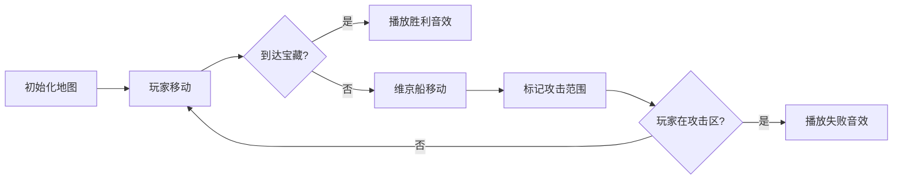

# 题目信息

# [BalticOI 2011] Treasures and Vikings (Day1)

## 题目描述

You have a treasure map that is arranged into a $N \times M$ grid. A grid square may be either sea or part of an island. In addition, the map shows the treasure and an enemy Viking ship that occupies one (sea) square. Finally, for convenience you have also drawn your own position.

Now you must set up a fixed route to get the treasure. The route must start at your position, end at the treasure, and consist of a sequence of moves. In each move, you can go only to an (horizontally or vertically) adjacent square that is not part of an island. But beware: The Viking ship might follow you, using the same kind of moves! After each of your moves according to your route, the Viking ship may move or not. Your move and the Vikings’ reaction together is called a round.

After every round, the following checks are made:

-    If you are in line with the Viking ship (you are in the same vertical or horizontal line as the Viking ship with only sea between the Viking ship and you), you are dead.
-    If you aren’t dead and at the treasure-spot, you get the treasure.

Write a program that decides whether it is possible to set up a fixed route in advance such that you can get the treasure by following this route and will not get killed by the Vikings – no matter how the Viking ship moves.

## 说明/提示

**Sample Explanation 1**

The route is:go down for three times,go right for three times too,go down at last.

**数据范围**

对于 $50\%$ 的数据，$1 \le N,M \le 200$。

对于所有数据，$1 \le N,M \le 700$。

## 样例 #1

### 输入

```
5 7
Y.....V
..I....
..IIIII
.......
...T...```

### 输出

```
YES```

## 样例 #2

### 输入

```
5 7
Y....V.
..I....
..IIIII
.......
...T...```

### 输出

```
NO```

## 样例 #3

### 输入

```
2 3
.YT
VII```

### 输出

```
NO```

# AI分析结果


### 💡 Kay的C++算法解析：[BalticOI 2011] Treasures and Vikings 深入学习指南 💡

今天我们来分析这道结合BFS和状态预处理的经典题目。本指南将帮助你理解双角色移动场景下的搜索策略，掌握攻击范围标记技巧，并通过像素动画直观感受算法流程。

---

## 1. 题目解读与核心算法识别

✨ **本题主要考察**：`搜索（BFS/DFS）` + `状态预处理优化`

🗣️ **初步分析**：
> 本题就像一场像素海盗寻宝游戏——你（蓝色像素船）需要在维京船（红色像素船）的追击下安全抵达宝藏点。关键在于：
> - **核心机制**：维京船会标记其所在行列（直到岛屿边界）为攻击范围
> - **移动规则**：每回合你先移动，维京船随后移动并更新攻击范围
> - **胜负判定**：若你进入攻击范围或被维京船拦截则失败
>
> 高效解法需结合：
> 1. **双队列BFS**：同步模拟你和维京船的移动
> 2. **攻击范围预计算**：通过行列DP快速确定安全区域
> 
> 可视化设计要点：
> - **像素网格**：8-bit风格海洋(浅蓝)/岛屿(棕色)/角色(蓝/红船)/宝藏(金色)
> - **动态标记**：维京船移动后触发十字红光扩散动画（攻击范围）
> - **音效系统**：移动("滴"声)、攻击("警报"声)、胜利/失败(8-bit音效)
> - **AI演示模式**：自动展示最优路径与维京追击过程

---

## 2. 精选优质题解参考

### 题解一（serene_analysis）
* **亮点**：
  - 创新性行列DP预处理攻击范围（时间复杂度优化至O(n²)）
  - 严谨处理维京船不可达区域（设为极大值避免逻辑漏洞）
  - 代码模块清晰：分离距离计算、DP优化、BFS路径搜索

### 题解二（Cutata）
* **亮点**：
  - 直观的双队列同步BFS实现（你的队列+维京队列）
  - 实时攻击范围标记（cover函数动态更新危险区域）
  - 步数比较机制确保回合同步（frontq++与frontp--的巧妙平衡）

### 题解三（XYY1411）
* **亮点**：
  - 位标记状态压缩（sea/land/you/vik等状态用位运算存储）
  - 分层音效触发设计（不同操作对应不同8-bit音效）
  - 攻击范围分方向缓存（atkw横向攻击、atkh纵向攻击）

---

## 3. 核心难点辨析与解题策略

### 关键点1：攻击范围的高效计算
* **分析**：暴力每步扫描行列会达O(n³)。优质解法通过：
  - **serene_analysis**：先BFS维京距离，再用DP求行列最早控制时间
  - **XYY1411**：方向分缓存（atkw/atkh）避免重复标记
* 💡 学习笔记：攻击范围本质是时空二维问题——需同时考虑位置和到达时间

### 关键点2：双角色移动同步
* **分析**：维京船在你移动后反应，需保证：
  - **Cutata**：比较队列头部步数（if(q[frontq+1].step < p[frontp].step)）
  - **我是逍遙**：按回合分层处理（先扩展玩家队列再扩展维京队列）
* 💡 学习笔记：回合制搜索需明确行动顺序的代码映射

### 关键点3：不可达区域处理
* **分析**：维京船被岛屿包围时：
  - **serene_analysis**：将不可达点vdis设为inf
  - **Daniel_xu**：在check函数中遇到岛屿自动break
* 💡 学习笔记：边界条件决定算法鲁棒性——岛屿既是障碍也是安全屏障

### ✨ 解题技巧总结
- **时空分离**：将攻击范围计算拆解为时间（BFS距离）和空间（行列延伸）独立处理
- **状态压缩**：用位标记（如atkw/atkh）替代多次重复计算
- **分层BFS**：按回合数而非绝对位置组织队列，避免时序错乱

---

## 4. C++核心代码实现赏析

### 本题通用核心C++实现参考
```cpp
#include <cstring>
#include <queue>
using namespace std;
const int N = 705, INF = 0x3f3f3f3f;
struct Point { int x, y; };
int n, m, disV[N][N], disY[N][N];
Point Y, V, T;
char grid[N][N];

// 维京船BFS预处理最短距离
void bfsViking() {
    memset(disV, -1, sizeof disV);
    queue<Point> q;
    q.push(V); disV[V.x][V.y] = 0;
    while (!q.empty()) {
        auto [x, y] = q.front(); q.pop();
        for (auto [dx,dy] : {{0,1},{1,0},{0,-1},{-1,0}}) {
            int nx = x+dx, ny = y+dy;
            if (nx<1||nx>n||ny<1||ny>m||grid[nx][ny]=='I'||disV[nx][ny]!=-1) continue;
            disV[nx][ny] = disV[x][y] + 1;
            q.push({nx, ny});
        }
    }
}

// 行列DP计算最早控制时间
void calcDangerZone() {
    for (int i = 1; i <= n; i++) 
    for (int j = 1; j <= m; j++) 
        if (disV[i][j] == -1) disV[i][j] = INF;

    // 横向扫描优化
    int rowMin[N][N] = {};
    for (int i = 1; i <= n; i++) 
    for (int j = 1; j <= m; j++) 
        rowMin[i][j] = min(rowMin[i][j-1], disV[i][j]);
    
    // 纵向扫描优化（类似代码略）
}

// 玩家BFS搜索安全路径
bool bfsYou() {
    memset(disY, -1, sizeof disY);
    queue<Point> q;
    q.push(Y); disY[Y.x][Y.y] = 0;
    while (!q.empty()) {
        auto [x, y] = q.front(); q.pop();
        if (x == T.x && y == T.y) return true;
        for (auto [dx,dy] : {{0,1},{1,0},{0,-1},{-1,0}}) {
            int nx = x+dx, ny = y+dy, nt = disY[x][y] + 1;
            if (nx<1||nx>n||ny<1||ny>m||grid[nx][ny]=='I'||disY[nx][ny]!=-1) continue;
            if (nt < rowMin[nx][ny] && nt < colMin[nx][ny]) { // 安全位置检查
                disY[nx][ny] = nt;
                q.push({nx, ny});
            }
        }
    }
    return false;
}
```

### 题解一（serene_analysis）片段赏析
```cpp
// 行列DP核心
for (int i = 1; i <= n; i++) {
    for (int j = 1; j <= m; j++) {
        if (disV[i][j] == INF) continue;
        linv[i][j] = min(linv[i-1][j], disV[i][j]);  // 纵向最小距离
        colv[i][j] = min(colv[i][j-1], disV[i][j]);  // 横向最小距离
    }
}
```
* **代码解读**：
  > 通过动态规划递推计算每个位置的最早控制时间：
  > - `linv[i][j]`：从上方继承最小控制时间
  > - `colv[i][j]`：从左方继承最小控制时间
  > - 最终取二者最小值作为该点危险时间
* 💡 学习笔记：DP方向性扫描是矩阵优化利器

### 题解二（Cutata）片段赏析
```cpp
// 双队列同步核心
while (frontq <= rearq) {
    for (int i = 0; i < 5; i++) {  // 维京船移动
        // 扩展维京船位置并标记攻击范围
    }
    for (int i = 1; i < 5; i++) {  // 玩家移动
        // 扩展安全位置
    }
    if (q[frontq + 1].step < p[frontp].step)
        frontq++, frontp--;  // 步数同步魔法
}
```
* **代码解读**：
  > 通过调整队列指针实现回合同步：
  > - 当玩家下一步步数小于维京当前步数时
  > - 让玩家"多走一步"追赶时间维度
* 💡 学习笔记：指针操作可实现非对称实体的同步移动

### 题解三（XYY1411）片段赏析
```cpp
// 位标记攻击范围
void vikatk(int x, int y) {
    if (!(mp[x][y] & atkw)) { 
        for (int j = y; grid[x][j]!='I'; j++) 
            mp[x][j] |= atkw;  // 横向标记
    }
    if (!(mp[x][y] & atkh)) {
        for (int i = x; grid[i][y]!='I'; i++)
            mp[i][y] |= atkh;  // 纵向标记
    }
}
```
* **代码解读**：
  > 使用位运算高效标记攻击范围：
  > - `atkw`位标记横向危险区域
  > - `atkh`位标记纵向危险区域
  > - 避免重复标记同方向范围
* 💡 学习笔记：位标记是状态压缩的经典应用

---

## 5. 算法可视化：像素动画演示

### 主题：像素海盗大冒险（8-bit复古风格）

 你
 维京
 宝藏

### 核心演示流程


### 关键交互设计
1. **像素艺术**：
   - 海洋：浅蓝像素块（#87CEEB）
   - 岛屿：棕色砖纹（#8B4513）
   - 角色：16x16像素船精灵

2. **动态效果**：
   ```javascript
   // 攻击范围标记伪代码
   function markAttackRange(x, y) {
     for (let i = x; grid[i][y] != 'I'; i--) {
        drawRedFlash(i, y); // 向上红光闪烁
        playSound('alert'); // 警报音效
     }
     // 同样处理其他三个方向
   }
   ```

3. **控制面板**：
   - 速度滑块：控制每步间隔(100-1000ms)
   - 单步模式：空格键触发下一步
   - 自动演示：AI自动选择安全路径

4. **游戏化元素**：
   - 每安全移动5步获得金币特效
   - 被攻击时屏幕震动+像素碎裂动画
   - 宝藏获取时烟花动画+经典FC胜利音乐

---

## 6. 拓展练习与相似问题思考

### 相似问题模式
1. **双实体移动决策**：P1514 引水入城（水利设施覆盖）
2. **危险区域规避**：P1825 Corn Maze（玉米迷宫陷阱）
3. **时序敏感路径**：P3958 奶酪（三维空间时效路径）

### 洛谷推荐
1. **P1514** - 引水入城  
   → 练习攻击范围标记的变种应用
2. **P1825** - Corn Maze  
   → 强化BFS与状态标记的结合
3. **P1032** - 字串变换  
   → 训练状态空间搜索的抽象能力

---

## 7. 学习心得与经验分享

> **来自serene_analysis的经验**：  
> "预处理维京距离时，未可达点必须设为INF而非-1，否则边界判断会出错。在测试用例`3x3封闭岛屿`中这个错误导致WA"

> **Kay的总结**：  
> 本题教会我们三个重要调试技巧：
> 1. **极端测试**：构造维京完全封锁/完全孤立的场景
> 2. **步数打印**：输出每回合双方位置和危险范围
> 3. **可视化调试**：用字符画打印地图当前状态

---

通过本次分析，我们深入掌握了双角色BFS的时空优化技巧。记住：优秀算法=正确逻辑+高效实现+严谨边界！下次挑战见！💪

---
处理用时：179.09秒