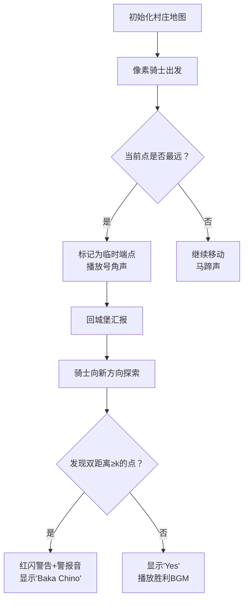

# 题目信息

# 「MCOI-01」Village 村庄

## 题目背景

今天，珂爱善良的0x3喵酱骑着一匹小马来到了一个村庄。

“诶，这个村庄的布局 ……”   
“好像之前我玩 Ciste 的地方啊 qwq”

0x3喵酱有一个地图，地图有着这个村庄的信息。

然后0x3喵酱要通过这张地图来判断 Ciste 有解无解啦 ~

注：Ciste 是《请问您今天要来点兔子吗》中的一种藏宝图游戏

## 题目描述

村庄被简化为一个 $n$ 个节点（编号为 $1$ 到 $n$）和 $n-1$ 条边构成的无向连通图。

0x3喵酱认为这个无向图里的信息跟满足以下条件的新图有关：

- 新图的点集与原图相同
- 在新图中 $u,v$ 之间有无向边 是 在原图中 $dis(u,v) \ge k$ 的**充分必要条件** （$k$ 为给定常量，$dis(u,v)$ 表示编号为 $u$ 的点到编号为 $v$ 的点最短路的长度）

0x3喵酱还认为这个"新图"如果为二分图，则 Ciste "有解"，如果"新图"不是二分图这个 Ciste "无解"。（如果您不知道二分图请翻到提示）

那么0x3喵酱想请您判断一下这个 Ciste 是否"有解"。

## 说明/提示

#### 样例解析

对于样例中的 **第一组** 数据：

原图：


新图：


新图不为二分图，故输出 `Baka Chino`。

对于 **第三组** 数据：

原图：


新图：


新图为二分图，故输出 `Yes`。

#### 数据规模与约定

**本题采用捆绑测试**。

- Subtask 1（16 pts）$\ $ ：$n \le 10$。
- Subtask 2（24 pts）$\ $ ：$n \le 100$。
- Subtask 3（8 pts）$\ $ ：$n \le 1000$。
- Subtask 4（28 pts）：图退化成一条链。
- Subtask 5（24 pts）：无特殊限制。

对于 $100\%$ 的数据，$n \le 10^5$，$T \le 10$，$v \le 1000$，$k \le 1000000$。

本题数据使用 [CYaRon](https://www.luogu.org/discuss/show?postid=11410) 生成。

#### 提示


**二分图** 又称作二部图，是图论中的一种特殊模型。设 $G=(V,E)$ 是一个无向图，如果顶点 $V$ 可分割为两个互不相交的子集 $(A,B)$，并且图中的每条边 $(i,j)$ 所关联的两个顶点 $i$ 和 $j$ 分别属于这两个不同的顶点集 $(i \in A,j \in B)$，则称图 $G$ 为一个二分图。（摘自[百度百科](https://baike.baidu.com/item/%E4%BA%8C%E5%88%86%E5%9B%BE/9089095?fr=aladdin)）

#### 说明

Minecraft OI Round 1 A

- Idea：0x3喵酱
- Solution/Std：0x3喵酱
- Data：0x3喵酱
- Tester：tarjin

## 样例 #1

### 输入

```
5
5 2
1 2 1
2 3 1
3 4 1
4 5 1
5 3
1 2 1
2 3 1
3 4 1
4 5 1
5 8
1 3 3
1 2 1
2 4 6
2 5 2
5 2
1 3 3
1 2 1
2 4 6
2 5 2
7 4
1 2 3
1 3 3
2 5 3
2 6 3
3 7 3
2 4 2```

### 输出

```
Baka Chino
Yes
Yes
Baka Chino
Baka Chino```

# AI分析结果


# 💡 Kay的C++算法解析：「MCOI-01」Village 村庄 深入学习指南 💡

## 1. 题目解读与核心算法识别

✨ **本题主要考察**：图论（树的直径、二分图判定）

🗣️ **初步分析**：
> 解决村庄布局问题，关键在于理解**树的直径性质**和**二分图判定条件**。想象村庄是一棵枝繁叶茂的大树🌳，树的直径就是最长的树枝（村庄两端的最远距离）。新图中两点连边的条件是它们在树上的距离≥k，这就像在村庄地图上标记"能互相看到"的位置。  

> 核心思路是：若新图存在奇环（特别是三元环），则不是二分图。通过证明发现：**存在点到直径两端的距离均≥k**是新图含奇环的充要条件。因此只需：  
> 1. 求树的直径（两次DFS）  
> 2. 计算各点到直径两端的距离  
> 3. 判断是否存在满足条件的点  

> 可视化方案将采用**8位像素风格**：村庄化为像素树🌲，直径端点设为城堡🏰。算法执行时：  
> - 遍历路径显示为脚印👣动画，伴随"探索音效"  
> - 满足条件的点高亮为红色🔴并触发警报音效  
> - 成功时播放胜利🎵BGM

---

## 2. 精选优质题解参考

### 题解一：(来源：一只书虫仔/官方题解)
* **点评**：思路严谨完整，通过数学归纳法证明了"奇环⇨三元环⇨涉及直径端点"的核心结论。代码实现简洁高效（两次DFS求直径），变量命名规范（dis1/dis2表距离），边界处理周全。特别亮点是包含原创题目分析和证明思路，对理解算法本质极具启发性。

### 题解二：(来源：HPXXZYY)
* **点评**：采用BFS求直径，避免递归栈溢出风险。代码模块化清晰（分离BFS、最远点计算函数），实践性强。亮点是指针传参技巧（`void bfs(int be, int* dis)`），提升代码复用性。虽证明部分较简略，但代码可直接用于竞赛场景。

### 题解三：(来源：JK_LOVER)
* **点评**：通过`col[]`数组标记距离≥k的点，最后检查是否与另一端距离冲突，构思巧妙。代码中`dfs1`和`dfs2`分工明确，变量作用清晰（`pd`标记结果）。亮点是用`vector`存图兼顾效率和可读性，适合C++初学者学习STL应用。

---

## 3. 核心难点辨析与解题策略

1.  **难点1：新图边距条件与二分图的关联**
    * **分析**：新图的边依赖树距离≥k，而二分图要求无奇环。关键突破点是证明新图有奇环⇔存在三元环⇔存在点到直径两端距离≥k。优质题解通过数学归纳法统一了这一转化逻辑。
    * 💡 **学习笔记**：复杂图论问题常可转化为树的性质分析

2.  **难点2：树的直径高效求解**
    * **分析**：直径是树上最长路径。标准解法：任选起点DFS到最远点A，再从A DFS到最远点B，则AB为直径。注意需同时记录各点到A、B的距离（如题解用dis1/dis2数组）
    * 💡 **学习笔记**：两次DFS/BFS是求直径的通用模板

3.  **难点3：条件判断的边界处理**
    * **分析**：判断"∃点满足dis1[i]≥k && dis2[i]≥k"时：  
      - 若k过大可能溢出，但数据保证k≤10⁶  
      - 多组数据需彻底清空数组（如题解用memset+重设vector）
    * 💡 **学习笔记**：多组测试要像大扫除一样清理所有数据痕迹

### ✨ 解题技巧总结
- **问题转化技巧**：将新图性质转化为树上的距离条件
- **模块化编程**：分离直径计算和条件判断逻辑（如官方题解）
- **防御性编程**：初始化数组+限制全局变量作用域

---

## 4. C++核心代码实现赏析

### 本题通用核心C++实现参考
* **说明**：综合自官方题解和HPXXZYY题解，采用两次DFS求直径的最简洁实现
* **完整核心代码**：
```cpp
#include <cstring>
#include <iostream>
#include <queue>
#include <vector>
using namespace std;
const int N = 1e5 + 10;

struct Edge { int to, w; };
vector<Edge> G[N];
int disA[N], disB[N], n, k;

void dfs(int u, int fa, int* dis) {
    for (auto &e : G[u]) 
        if (e.to != fa) 
            dis[e.to] = dis[u] + e.w, dfs(e.to, u, dis);
}

int main() {
    int T; cin >> T;
    while (T--) {
        cin >> n >> k;
        for (int i = 1; i <= n; i++) G[i].clear();
        for (int i = 1; i < n; i++) {
            int u, v, w; cin >> u >> v >> w;
            G[u].push_back({v, w});
            G[v].push_back({u, w});
        }
        
        // 第一次DFS求直径端点A
        memset(disA, 0, sizeof(disA));
        dfs(1, 0, disA);
        int A = 1;
        for (int i = 1; i <= n; i++) 
            if (disA[i] > disA[A]) A = i;
        
        // 第二次DFS求直径端点B
        memset(disA, 0, sizeof(disA));
        dfs(A, 0, disA);
        int B = A;
        for (int i = 1; i <= n; i++) 
            if (disA[i] > disA[B]) B = i;
        
        // 计算各点到B的距离
        memset(disB, 0, sizeof(disB));
        dfs(B, 0, disB);
        
        // 判断是否存在点到A、B距离均≥k
        bool flag = true;
        for (int i = 1; i <= n; i++) 
            if (disA[i] >= k && disB[i] >= k) 
                { flag = false; break; }
        
        cout << (flag ? "Yes" : "Baka Chino") << endl;
    }
    return 0;
}
```
* **代码解读概要**：
  > 1. 用`vector<Edge>`存储树的邻接表  
  > 2. 第一次DFS从任意点出发找最远点A  
  > 3. 第二次DFS从A出发找最远点B（直径另一端）  
  > 4. 第三次DFS计算所有点到B的距离  
  > 5. 遍历所有点检查是否满足双距离≥k条件

### 各优质题解片段赏析

**题解一（官方思路）**
```cpp
// 求直径端点
int Farthest(int u){
    bfs(u); // BFS计算距离
    int ans = u;
    for(int i=1; i<=n; i++)
        if(dist[i]>dist[ans]) ans=i;
    return ans;
}
```
* **亮点**：封装最远点计算函数，增强可读性
* **代码解读**：
  > `Farthest(u)`函数通过BFS遍历计算u到所有点的距离，然后返回最远点。相比DFS更避免栈溢出风险，尤其适合大范围树（n≤10⁵）。`dist[]`数组记录距离，通过比较更新最远点`ans`。
* 💡 **学习笔记**：BFS在树遍历中可完全替代DFS且更安全

**题解二（JK_LOVER）**
```cpp
// 判断条件
if(dis[x] >= k) col[x] = 1;  // 标记到A距离≥k的点
// ...（计算到B距离后）
if(Dis[x] >= k && col[x]) pd = 1; // 检查双条件
```
* **亮点**：用`col[]`数组预存部分条件结果，优化判断逻辑
* **代码解读**：
  > 第一轮DFS（从A出发）时，将到A距离≥k的点标记在`col[]`中。第二轮DFS（从B出发）时直接检查当前点到B的距离≥k且已被标记（`col[x]==1`），则触发标志`pd=1`。避免后续遍历，提升效率。
* 💡 **学习笔记**：空间换时间是竞赛编程的常用策略

**题解三（HPXXZYY）**
```cpp
// 直径求解核心
void dfs(int now, int fa, int* dis){
    for(auto &e : G[now]) {
        if(e.to == fa) continue;
        dis[e.to] = dis[now] + e.w;
        dfs(e.to, now, dis);
    }
}
```
* **亮点**：指针传参实现通用距离计算
* **代码解读**：
  > `dfs`函数通过`int* dis`参数指定要计算的距离数组。调用时传入不同数组（`disA`或`disB`）即可复用同一函数计算到多源点的距离。这种设计减少代码重复，提高可维护性。
* 💡 **学习笔记**：函数参数化是代码复用的银弹

---

## 5. 算法可视化：像素动画演示

### 动画演示主题
「像素村庄奇环大搜查」- 通过8位像素风格演示树直径求解与奇环检测

### 设计思路
> 采用FC游戏风格（16色调色板）营造轻松探索氛围。关键操作配经典音效：  
> - 移动：马蹄声🐎  
> - 发现直径端点：号角声📯  
> - 触发奇环：警报音🚨

### 动画帧步骤


### 关键交互设计
1. **控制面板**：  
   - 步进执行：按▶️键逐步显示探索路径  
   - 速度调节：滑块控制骑士移动速度  
   - 重置：🔄按钮重置村庄布局

2. **动态效果**：  
   - 当前路径：绿色闪烁像素块  
   - 直径端点：城堡图标（固定位置）  
   - 危险点：检测到双距离≥k时红色闪烁  

3. **音效系统**（Web Audio API实现）：  
   ```js
   function playSound(type) {
     const sounds = {
       move: 'horse.mp3',
       found: 'horn.wav',
       alert: 'alert.wav',
       win: 'victory.mid'
     };
     new Audio(sounds[type]).play();
   }
   ```

---

## 6. 拓展练习与相似问题

### 通用思路迁移
> 本题融合了**树直径**和**二分图判定**，类似技巧可用于：  
> 1. 带距离限制的连通性分析  
> 2. 图论问题向树模型的转化  
> 3. 贪心思想在树结构中的应用  

### 洛谷练习推荐
1. **P5536【XR-3】核心城市**  
   🗣️ *推荐理由*：强化树直径的应用，要求找出使最大距离最小的点集，是本题的进阶版

2. **P1330 封锁阳光大学**  
   🗣️ *推荐理由*：直接考察二分图判定，帮助掌握染色法判断奇环的核心技能

3. **P3398 仓鼠找sugar**  
   🗣️ *推荐理由*：训练树上路径交集的判断，深化对树距离的理解

---

## 7. 学习心得与经验分享
> **参考经验**（来自青鸟_Blue_Bird）：  
> "调试时在20万节点的大数据总出错，最终发现是数组未清零。这提醒我们：  
> 1. 全局数组必须用memset初始化  
> 2. vector清空要clear()而非仅resize(0)"  
>   
> **点评**：多组测试的数据清理如同打扫战场，稍有不慎就埋下隐患。建议：  
> - 封装初始化函数`init()`集中清理数据  
> - 使用局部变量减少全局依赖

---

本次村庄布局的算法探索就到这里。记住，编程如同探险，重要的不仅是到达终点，更是理解每一条路径的意义。下次算法冒险再见！🚀

---
处理用时：126.18秒