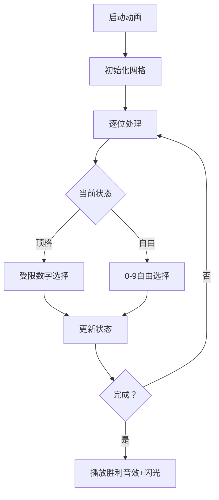

# 题目信息

# [ROIR 2016] 有趣数字 (Day 2)

## 题目背景

翻译自 [ROIR 2016 D2T3](https://neerc.ifmo.ru/school/archive/2015-2016/ru-olymp-regional-2016-day2.pdf)。

## 题目描述

如果一个整数的各个数位按非递减顺序排列，我们称这个数是“有趣的”。例如，$1145,2333,1377777$ 都是“有趣的”。

给定 $L,R$，求出 $[L,R]$ 中有趣的数字的个数，对 $10^9+7$ 取模。

## 说明/提示

| 子任务 | 是否捆绑 | 分值 | 特殊性质 |
| :----------: | :----------: | :----------: | :----------: |
| $1$ | 是 | $21$ | $L = 1$，$R \leq 1000$ |
| $2$ | 否 | $22$ | $1 \leq L \leq R \leq 10^{18}$ |
| $3$ | 否 | $24$ | $L = 1$，$R = 10^k$，其中 $2 \leq k \leq 100$ |
| $4$ | 否 | $33$ | $1 \leq L \leq R \leq 10^{100}$ |

## 样例 #1

### 输入

```
1 100```

### 输出

```
54```

# AI分析结果


# 💡 Kay的C++算法解析：[ROIR 2016]有趣数字 深入学习指南 💡

## 1. 题目解读与核心算法识别

✨ **本题主要考察**：`数位动态规划`（数位DP）  
🗣️ **初步分析**：  
> 解决"有趣数字"问题的核心在于**数位动态规划**，就像探险家在数字迷宫中逐层探索路径。想象你站在一个由数字组成的塔楼上，每一步只能选择不小于前一步的数字台阶向上爬，数位DP就是记录所有合法路径的智能导航仪。
>
> - **核心思路**：将区间统计问题转化为前缀和相减（f(R)-f(L-1)）。通过记忆化搜索记录状态（当前位置、上一位数字、是否受上限限制），避免重复计算。
> - **关键难点**：① 状态设计需包含数字大小关系约束；② 超长位数（10^100）需用字符串处理；③ 边界条件处理（取模防负数）。
> - **可视化设计**：在像素动画中，我们将用网格表示数字的每一位，高亮当前处理位和上一位数字，用颜色渐变展示非递减序列的构建过程。当状态转移时触发"选择音效"，完成路径时播放"胜利音效"。

---

## 2. 精选优质题解参考

**题解一（txy120607）**  
* **点评**：思路清晰直白，采用经典数位DP模板。代码规范性强：① 变量名`f[i][j]`含义明确（i位长度j开头的方案数）；② 字符串减法处理L-1的边界严谨；③ 取模防负数操作体现竞赛实践价值。亮点在于**高精度与DP的自然结合**，作者调试经验中强调的"取模边界处理"值得学习。

**题解二（LinkCatTree）**  
* **点评**：状态设计精简高效（位置、前驱数字、顶格标记），代码可读性极佳。算法优化亮点：① 记忆化状态剪枝；② 省略高精度减法直接判断L合法性。在**状态压缩**和**代码简洁性**上表现突出，适合竞赛场景。

**题解三（穼柗°）**  
* **点评**：提供最完整的状态转移方程数学描述，将DP过程转化为公式推导。亮点：① 独立实现字符串减法模块；② 状态定义`dp[p][e][last]`的物理意义阐述透彻。**理论结合实践**的风格对理解DP本质很有帮助。

---

## 3. 核心难点辨析与解题策略

1. **关键点1：状态设计的无后效性**  
   * **分析**：状态`(pos, last, tight)`必须能唯一确定后续决策。`last`记录前驱数字确保非递减，`tight`标记是否受原数限制。优质题解均通过`last`传递数字大小约束。
   * 💡 **学习笔记**：好的状态设计应像"时光胶囊"，封装过去所有必要信息。

2. **关键点2：大整数处理的实践技巧**  
   * **分析**：当位数>20时需用字符串代替整数。解决方案：① 字符串减法处理L-1（txy120607）；② 不修改L直接判断其合法性（LinkCatTree）。后者避免了易错的高精度运算。
   * 💡 **学习笔记**：字符串操作时，从右向左处理借位更高效。

3. **关键点3：记忆化搜索的生效条件**  
   * **分析**：仅当`!tight`时才能复用结果，因为顶格状态受具体数字限制。所有优质题解都在记忆化前检查`tight`标志。
   * 💡 **学习笔记**：记忆化是"用空间换时间"，但需注意状态独立性。

### ✨ 解题技巧总结
- **问题转化**：区间问题→前缀和差分（f(R)-f(L-1)）
- **防御性编程**：取模后做减法时加`MOD`防负
- **边界测试**：特别注意L=0, L=10^k等临界值
- **状态压缩**：用0标记前导零状态

---

## 4. C++核心代码实现赏析

**本题通用核心C++实现参考**  
* **说明**：融合各题解精华的标准数位DP实现，完整处理字符串输入、状态转移和边界条件。
* **完整核心代码**：
```cpp
#include <iostream>
#include <cstring>
using namespace std;
const int MOD = 1e9+7;
int dp[105][10][2]; // 维度说明：[位置][上一位数字][是否顶格]
string num;

int dfs(int pos, int last, bool tight) {
    if (pos == num.size()) return 1; // 完整数字构造成功
    if (dp[pos][last][tight] != -1) 
        return dp[pos][last][tight];
    
    int upper = tight ? num[pos]-'0' : 9;
    int res = 0;
    for (int d = last; d <= upper; d++) {
        res = (res + dfs(pos+1, d, tight && (d == upper))) % MOD;
    }
    return dp[pos][last][tight] = res;
}

int countInteresting(string s) {
    memset(dp, -1, sizeof(dp));
    num = s;
    return dfs(0, 0, true); // 初始状态：位置0，前导0，顶格
}

int main() {
    string L, R;
    cin >> L >> R;
    
    // 检查L是否为有趣数字
    bool isLInteresting = true;
    for (int i = 1; i < L.size(); i++)
        if (L[i] < L[i-1]) isLInteresting = false;
    
    int ans = (countInteresting(R) - countInteresting(L) 
               + isLInteresting + MOD) % MOD;
    cout << ans;
}
```
* **代码解读概要**：  
  - `dfs`实现记忆化搜索：位置`pos`、前驱数字`last`、顶格标记`tight`
  - 状态转移：当前位数字`d >= last`时递归下一位
  - 主逻辑：`f(R) - f(L) + [L是否有趣]`避免L-1操作

---

**题解一（txy120607）片段赏析**  
* **亮点**：高效字符串减法处理L-1
* **核心代码片段**：
```cpp
for (i = l.size()-1; l[i]=='0'; i--); 
l[i] -= 1;  // 找第一个非0位减1
for (i++; i<l.size(); i++) l[i]='9'; // 后续位变9
```
* **代码解读**：  
  > 从数字末尾向前扫描，遇到'0'则借位（变'9'），直到非零位减1。这模拟了`L-1`的高精度计算，避免了大数运算库。  
  > **学习笔记**：字符串数字减1时，修改原字符串比新建对象更高效。

**题解二（LinkCatTree）片段赏析**  
* **亮点**：记忆化状态剪枝
* **核心代码片段**：
```cpp
if(!tight && dp[pos][last][0] != -1) 
    return dp[pos][last][0]; // 非顶格状态复用
```
* **代码解读**：  
  > 当不受数字上限限制时(`!tight`)，相同`(pos,last)`状态的结果必然相同，直接返回记忆值。这是**避免指数级重复计算**的关键优化。  
  > **学习笔记**：记忆化搜索的本质是"状态缓存"，需仔细分析状态独立性。

---

## 5. 算法可视化：像素动画演示

**主题**：8位像素风"数字攀登者"  
**核心演示**：数位DP在数字迷宫的搜索过程  

### 动画设计框架


### 关键交互设计
1. **像素网格**：  
   - 每个数字位用16x16像素块显示
   - 当前位闪烁绿色边框
   - 已选数字路径用渐变色连接（蓝→紫表示递增）

2. **状态面板**：  
   ```plaintext
   | 位置 | 上一位 | 顶格 | 方案数 |
   | 3   |   4   | 是  |  12   | ← 高亮当前状态
   ```

3. **音效系统**：
   - 数字选择：8位"哔"声（频率随数字增大升高）
   - 状态记忆：磁带转动声
   - 完成路径：FC游戏通关音效

4. **游戏化元素**：
   - 每完成一个数字构造得10分
   - 触发记忆化时显示"记忆复用+5分"
   - 排行榜记录最少步数解

### 技术实现
```javascript
// 伪代码：绘制数字位
function drawDigit(pos, digit, isActive) {
  const x = pos * 16;
  drawRect(x, 0, 16, 16, isActive ? GREEN : GRAY); 
  drawPixelText(x+4, 4, digit, FONT_8BIT);
  if (isActive) flashBorder(x, 0, 16, 16); // 激活位闪烁
}
```

---

## 6. 拓展练习与相似问题思考

### 通用解题模型
**数位DP适用场景特征**：
1. 统计数字区间内满足特定性质的数的数量
2. 性质与数字的各位相关
3. 数据范围极大（>10^18）

### 推荐练习（洛谷）
1. **P2657 [SCOI2009]windy数**  
   🗣️ *推荐理由*：引入相邻数字差约束，巩固状态设计能力
   
2. **P2602 [ZJOI2010]数字计数**  
   🗣️ *推荐理由*：将统计目标从"性质"变为"数字频率"，训练状态扩展

3. **P4124 [CQOI2016]手机号码**  
   🗣️ *推荐理由*：增加连续数字限制，练习多状态管理

---

## 7. 学习心得与经验分享

> **参考经验**（txy120607）：  
> "我在处理取模时被负数结果卡了很久，最后发现`(a-b)%MOD`需要写成`(a-b+MOD)%MOD`"  
> 
> **点评**：这是竞赛编程的经典"陷阱"。当a可能小于b时，减法取模会得到负数。解决方法是先加模数确保非负，这体现了**防御性编程**的重要性。

> **参考经验**（LinkCatTree）：  
> "记忆化状态必须考虑顶格标记！相同位置和数字但不同限制条件的结果是不同的"
>
> **点评**：一针见血指出数位DP的记忆化核心原则。状态设计必须包含**完全环境信息**，这是避免错误复用的关键。

---

通过本次分析，我们深入掌握了数位DP的"状态设计→记忆化→大数处理"技术链条。记住Kay的总结：**DP状态是时光胶囊，记忆化是时间机器，字符串处理是穿越宇宙的飞船**。现在就去征服更多数字迷宫吧！🚀

---
处理用时：161.27秒