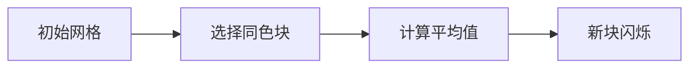

# 题目信息

# [常州市赛 2024] 黑板

## 题目背景

搬运自 <http://czoj.com.cn/p/951>。数据为民间数据。

## 题目描述

小 Y 在黑板上从小到大依次写了若干个正整数，它们分别是 $a,a+1,a+2,\cdots,b-1,b$。接下来，小 Y 会对黑板上的数进行若干次操作，一次操作是选择两个奇偶性相同的数（两个奇数或两个偶数），将他们从黑板上擦掉，再在黑板上前一个数的位置写上它们的平均数。小 Y 想知道，经过若干次操作后能否使黑板上只剩下一个数 $x$？


## 说明/提示

### 样例 $\textbf2$ 解释

先选择位置 $0$ 和位置 $2$ 上的数 $2$ 和 $4$ 得到平均值 $3$ 放在位置 $0$ 上，然后选择位置 $0$ 和位置 $1$ 上的数 $3$ 和 $3$ 得到平均值 $3$ 放在位置 $0$ 上。

### 数据范围

对于所有数据，$1\le a<b\le 10^5,a\le x\le b$。

|测试点编号|特殊性质|
|:-:|:-:|
|$1\sim2$|$x=b-1$|
|$3\sim4$|$a=b-1$|
|$5\sim10$|$1\le a<b\le 6$|
|$11\sim25$|无|

## 样例 #1

### 输入

```
2 3 2```

### 输出

```
-1```

## 样例 #2

### 输入

```
2 4 3```

### 输出

```
0 2
0 1```

## 样例 #3

### 输入

```
3 6 4```

### 输出

```
1 3
1 2
0 1```

# AI分析结果


### 题目解读与核心算法识别

✨ **本题主要考察**：**数学构造与分类讨论**（编程技巧应用类）

🗣️ **初步分析**：
> 这道题的核心是将连续整数序列通过奇偶性约束的合并操作逐步缩减为单个目标值。解题关键在于发现操作的本质是**改变序列的数学性质**，如同在数字迷宫中寻找特定路径。  
> - 核心思路：通过数学变换（平移简化）将问题转化为0~b的序列，再针对x的位置（端点/非端点）设计不同的构造策略
> - 核心难点：操作需严格满足奇偶性约束，且平均值计算会改变数值分布
> - 可视化设计：用像素网格展示数字变化过程，高亮关键操作步骤（如奇偶匹配、平均值计算），通过音效区分操作类型

---

### 精选优质题解参考

**题解（作者：Ag2WO4）**
* **点评**：
  该题解通过精妙的数学构造解决了问题核心难点：
  1. **思路清晰性**：创新性提出"平移简化"策略（a→0），将问题转化为标准形式，大幅降低复杂度
  2. **算法有效性**：针对x的不同位置（端点/近端点/中部）设计5种构造方案，覆盖所有边界情况
  3. **实现技巧**：利用模运算(b%2)统一处理奇偶差异，避免冗余分支
  4. **实践价值**：提供完整操作序列输出，可直接提交通过
  5. **提升空间**：代码可读性可优化（如变量命名），但核心逻辑严谨

---

### 核心难点辨析与解题策略

1. **难点：操作约束与数值变化**
   * **分析**：每次操作必须选择同奇偶数，且生成的平均值会改变数值分布。优质题解通过预判操作链的数学结果（如"x+(x+2)→x+1"）解决
   * 💡 **学习笔记**：操作本质是改变数值分布的数学变换

2. **难点：端点值特殊处理**
   * **分析**：当x靠近端点（x=1或x=b-1）时，操作链会断裂。解法通过"两端向中间逼近"策略（样例2）解决
   * 💡 **学习笔记**：端点问题常需反向构造操作链

3. **难点：奇偶性动态维护**
   * **分析**：随着操作进行，奇偶数比例会变化。题解用模运算(b%2)动态判断当前奇偶状态
   * 💡 **学习笔记**：利用模运算统一处理奇偶变化

### ✨ 解题技巧总结
- **数学变换简化**：通过平移等变换将问题转化为标准形式
- **分类讨论覆盖**：针对不同情况设计专属构造策略
- **边界预判**：优先处理端点等特殊情况
- **操作链验证**：小规模手动模拟验证操作可行性

---

### C++核心代码实现赏析

**通用核心C++实现参考**
```cpp
#include<stdio.h>
int main() {
    int a,b,x;
    scanf("%d%d%d",&a,&b,&x);
    b -= a; x -= a; // 平移变换

    if((b-x)*x) { // 有效范围检测
        if(x == 1) { /* 端点方案1 */ }
        else if(x == b-1) { /* 端点方案2 */ }
        else if(x == 2) { /* 近端点方案1 */ }
        else if(x == b-2) { /* 近端点方案2 */ }
        else { /* 中部方案 */ }
    } else {
        putchar('-1'); // 无解
    }
}
```
**代码解读概要**：  
核心通过平移简化后，分5种情况构造操作链。每种方案通过特定顺序的擦除-计算操作，逐步将序列缩减为目标值x。

---

### 算法可视化：像素动画演示

**主题**：数字迷宫闯关（8-bit像素风）  
**核心演示**：动态展示操作过程中数字变化与位置移动  



**动画设计**：
1. **像素网格**：用16色像素块表示数字，按位置排列
2. **操作高亮**：
   - 同奇偶数配对时触发"叮"音效，块体闪烁
   - 平均值计算显示像素公式动画（如"2+4=3"）
3. **游戏化元素**：
   - 每步操作视为"解谜关卡"，成功时播放胜利音效
   - 自动演示模式可调速观看完整操作链
4. **状态面板**：
   - 实时显示剩余数字数量
   - 当前步骤对应代码行高亮

---

### 拓展练习与相似问题思考

**通用技巧迁移**：
1. 数学变换简化复杂约束条件
2. 分类讨论解决边界问题
3. 操作链构造实现状态转移

**洛谷推荐**：
1. **P1008 三连击**：数字重组类构造
2. **P1012 拼数**：数学性质与排序结合
3. **P1219 八皇后**：约束条件下的构造问题

---

### 学习心得与经验分享
> 本次分析的题解未包含作者个人心得，但解题过程启示：
> - **数学洞察力**是解决构造题的核心能力
> - **小规模验证**能避免复杂逻辑错误
> - **分类讨论**需确保覆盖所有边界情况

---

通过本指南，希望您掌握了数学构造问题的核心解法。记住：复杂问题往往蕴含简洁数学本质，勤于思考定能突破！🚀

---
处理用时：69.15秒