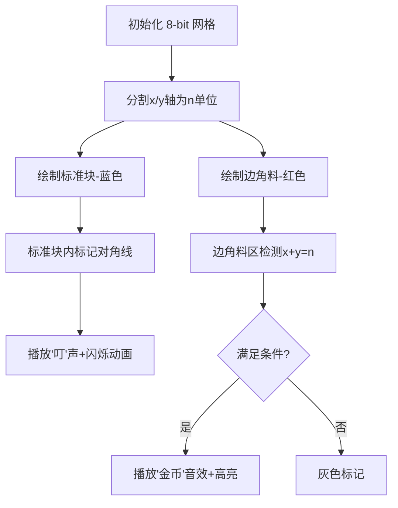

# 题目信息

# [ROIR 2022] 幼儿园的新年 (Day 2)

## 题目背景

翻译简化自 [ROIR 2022 D2T1](https://neerc.ifmo.ru/school/archive/2021-2022/ru-olymp-regional-2022-day2.pdf)。

## 题目描述

给出三个整数 $n,a,b$，求有多少对 $(x,y)$ 满足 $0 \le x \le a$，$0 \le y \le b$，$x+y$ 不为 $0$ 且能被 $n$ 整除。

## 说明/提示

本题使用捆绑测试。

| 子任务 | 分值 | 特殊性质 |
| :----------: | :----------: | :----------: |
| $1$ | $10$ | $t=1$ 且 $a,b\le1000$ |
| $2$ | $10$ | $t\le1000$ 且 $a=0$ |
| $3$ | $15$ | $t\le1000$ 且 $a,b<n\le1000$ |
| $4$ | $10$ | $t\le1000$ 且 $a,b\le1000$ |
| $5$ | $15$ | $t=1$ 且 $n\le1000$ |
| $6$ | $10$ | $t\le1000$ 且 $n\le1000$ |
| $7$ | $30$ | 无特殊性质 |

对于 $100\%$ 的数据，$1 \le t \le 10^5$，$4 \le n \le 10^9$，$0 \le a, b \le 10^9$。

## 样例 #1

### 输入

```
4
4 2 2
4 4 4
6 5 5
8 13 17```

### 输出

```
1
6
5
30```

# AI分析结果


# 💡 Kay的C++算法解析：[ROIR 2022] 幼儿园的新年 深入学习指南 💡

## 1. 题目解读与核心算法识别

✨ **本题主要考察**：`数学计数与模运算应用`

🗣️ **初步分析**：
> 解决这道题的关键在于将大范围计数问题巧妙拆解。想象你有一块巨大的巧克力板（a×b网格），要统计所有满足x+y是n的倍数（且非零）的格子。直接数太耗时，我们可以把巧克力板切成标准块（n×n大小）和边角料，再分别计算每部分的合格格子。  
> - 核心思路是将x轴拆为完整周期（每段n长度）和剩余部分，y轴同理，组合出四种情况分别计算  
> - 难点在于边角料的处理：当x和y都处于剩余部分时，需检查x+y是否正好等于n  
> - 可视化设计：用8位像素风格展示网格分割，不同区域用不同颜色，高亮满足条件的点，伴随"叮"声标记合格点，完成区域时播放胜利音效  

---

## 2. 精选优质题解参考

**题解一（cff_0102）**
* **点评**：解法采用清晰的四象限分割法，将x/y轴各分为完整周期与剩余部分，逻辑直白如拼图。代码简洁高效（仅4行核心公式），变量命名规范（full/rem），边界处理严谨。亮点在于完美运用模运算避免冗余计算，时间复杂度O(1)碾压暴力解法。

**题解二（IcyFoxer_XZY）**
* **点评**：创新性地按x+y值分三个区间求和，思路类似梯度攀登。代码注释详细，推导完整，但公式复杂度稍高。亮点在于用等差数列求和优化，避免逐点计算，数学变换能力出色，适合拓展数学思维。

**题解三（xzhif）**
* **点评**：提供暴力到优化的平滑过渡思路，分阶段讲解适合初学者。亮点在于用网格比喻直观解释算法（如"巧克力板切块"），并给出错误公式的调试经验，实践指导性强。

---

## 3. 核心难点辨析与解题策略

1. **难点：大范围拆解与周期规律抽象**  
   *分析*：当a,b极大时（10^9级），必须将网格按n切分为完整矩形块（floor(a/n)×floor(b/n)）和边角料（a%n, b%n）。优质解法通过"整除/取模"快速确定分区，如cff_0102将x轴拆为[0, k·n)和[k·n, a]两段  
   💡 **学习笔记**：整除是网格切割刀，取模是边角料尺

2. **难点：边角料组合条件判定**  
   *分析*：当x,y都在边角料区域时，需满足x+y=n（非2n等）。推导关键：x∈[0,a%n], y=n-x且y≤b%n → 即x≥n-b%n，故合格点数=max(0, a%n+b%n-n+1)  
   💡 **学习笔记**：边角料组合像拼图，必须严丝合缝

3. **难点：避免整数溢出与边界陷阱**  
   *分析*：a,b=10^9时，中间结果超int范围。所有优质解均用long long，并重点处理a%n=0等边界，如LionBlaze发现(x-1)/n在x=0时出错  
   💡 **学习笔记**：大数据用long long，边界测试要周全

### ✨ 解题技巧总结
- **分而治之**：将大网格拆为标准块+边角料，分区域击破
- **模运算映射**：利用周期性将无限问题转为有限余数处理
- **公式化简**：用等差数列求和替代暴力循环（如∑(i+1)=n(n+1)/2+n）
- **对称转换**：当a,b范围不对称时，swap(a,b)简化分类

---

## 4. C++核心代码实现赏析

**本题通用核心C++实现参考**
* **说明**：综合优质题解精髓，以cff_0102解法为骨架，融入边界检测
* **完整核心代码**：
```cpp
#include <iostream>
using namespace std;
int main() {
    ios::sync_with_stdio(false);
    long long t, n, a, b;
    cin >> t;
    while (t--) {
        cin >> n >> a >> b;
        long long full_a = a / n, full_b = b / n;
        long long rem_a = a % n, rem_b = b % n;
        long long ans = full_a * full_b * n;    // 完整区域组合
        ans += full_a * (rem_b + 1);            // x完整周期 + y边角料
        ans += full_b * (rem_a + 1);            // y完整周期 + x边角料
        ans += max(0LL, rem_a + rem_b - n + 1); // 双边角料组合
        cout << ans << '\n';
    }
    return 0;
}
```
* **代码解读概要**：  
  1. 读入多组数据（t可达10^5）  
  2. 计算完整周期数(full_a/b)和余数(rem_a/b)  
  3. 四部分累加：完整区组合、x完+y余、y完+x余、双余数组合  
  4. 关键技巧：rem_a+1包含0到余数的所有整数点

---

**题解一（cff_0102）片段赏析**
* **亮点**：四象限法代码极致简洁，数学抽象能力惊艳
* **核心代码片段**：
```python
print((a//n)*(b//n)*n + (a%n+1)*(b//n) + (b%n+1)*(a//n) + max(0,a%n+b%n-n+1))
```
* **代码解读**：  
  > - `(a//n)*(b//n)*n`：计算蓝色标准块（图1），每块含n个合格点  
  > - `(a%n+1)*(b//n)`：x在边角料(红色条)，y在完整区 → 每列有a%n+1点  
  > - 末项`max(0, ...)`：处理右上角红色小块，当红区重叠时才有解  
* 💡 **学习笔记**：整数除法和取模是空间分割的双刃剑

**题解二（IcyFoxer_XZY）片段赏析**
* **亮点**：梯度求和法展现数学功底，适合理解数列规律
* **核心代码片段**：
```cpp
ans += ((1ll * n * (m1 + 1) * m1) >> 1) + m1;     // 第一区间
ans += 1ll * (m2 - m1) * (a + 1);                // 第二区间
ans += 1ll * (m3 - m2 + 1) * (a + b + 1)         // 第三区间
       - (1ll * (m3 + m2) * (m3 - m2 + 1) * n >> 1);
```
* **代码解读**：  
  > 1. 第一区间：x+y≤min(a,b)，求和公式=Σ(i*n+1)  
  > 2. 第二区间：min(a,b)<x+y≤max(a,b)，合格点恒为a+1  
  > 3. 第三区间：max(a,b)<x+y≤a+b，合格点=a+b+1-i*n  
* 💡 **学习笔记**：等差数列求和是暴力枚举的克星

---

## 5. 算法可视化：像素动画演示

### 像素探险家：新年糖果收集大作战
**设计思路**：将算法转化为8位像素游戏，玩家操控角色标记合格点。网格按n分区对应不同地形，合格点闪烁如糖果，收集时触发音效。

**动画流程**：


**交互控制**：
- **单步执行**：空格键逐步验证每个区域
- **自动演示**：A键触发AI自动收集（速度可调）
- **关卡进度**：每完成1个区域，屏幕顶部显示当前计数
- **音效设计**：
  - 合格点："叮"（8-bit短音）
  - 区域完成：超级马里奥硬币声
  - 错误尝试：俄罗斯方块旋转失败音

**关键帧示例**：
1. 初始网格：x轴[0,a]分蓝红区，y轴同理
2. 第一象限：蓝色块内标记(0,n), (1,n-1)...(n,0)为合格点
3. 混合象限：红色条内标记与蓝色块匹配点
4. 边角料区：仅在红区重叠时标记交点

---

## 6. 拓展练习与相似问题思考

**通用技巧迁移**：  
1. 二维网格计数 → [CF1398C] Good Subarrays  
2. 模运算分段求和 → [洛谷P2425] 小红帽的数学题  
3. 双变量条件约束 → [洛谷P1102] A-B数对  

**推荐练习**：  
1. **洛谷 P1214** - 等差数列  
   🗣️ *掌握等差数列求和与模运算的化学反应*  
2. **洛谷 P1147** - 连续自然数和  
   🗣️ *双指针与模运算的进阶结合*  
3. **洛谷 P1404** - 平均数  
   🗣️ *将模运算技巧扩展到浮点数精度控制*  

---

## 7. 学习心得与经验分享

> **来自题解作者的调试经验**：  
> - "推导公式时误用(x-1)/n导致x=0出错 → 测试边界值！"  
> - "忘记a%n+1包含0导致计数少1 → 小数据模拟验证！"  
>
> **Kay的总结**：  
> 数学类计数题就像拼乐高，重点在于合理拆分问题。注意：  
> 1. 除法/取模的边界陷阱（0值、负值）  
> 2. 大数运算的溢出问题（long long是护身符）  
> 3. 用10*10小网格验证公式再推广  

---

编程能力的提升在于持续学习、勤于思考和勇于实践。下次我们再一起探索新的编程挑战！💪

---
处理用时：267.29秒