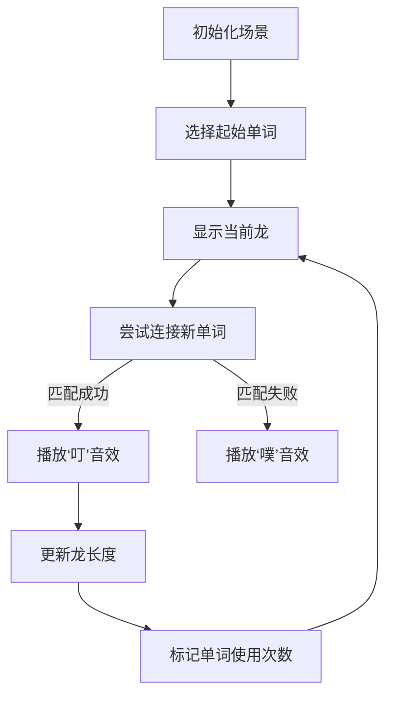

# 题目信息

# [NOIP 2000 提高组] 单词接龙

## 题目背景

注意：本题为上古 NOIP 原题，不保证存在靠谱的做法能通过该数据范围下的所有数据。

本题为搜索题，本题不接受 hack 数据。[关于此类题目的详细内容](https://www.luogu.com.cn/paste/isdgwj5l)

NOIP2000 提高组 T3

## 题目描述

单词接龙是一个与我们经常玩的成语接龙相类似的游戏，现在我们已知一组单词，且给定一个开头的字母，要求出以这个字母开头的最长的“龙”（每个单词都最多在“龙”中出现两次），在两个单词相连时，其重合部分合为一部分，例如 `beast` 和 `astonish`，如果接成一条龙则变为 `beastonish`，另外相邻的两部分不能存在包含关系，例如 `at` 和 `atide` 间不能相连。


## 说明/提示

样例解释：连成的“龙”为 `atoucheatactactouchoose`。

$n \le 20$。

## 样例 #1

### 输入

```
5
at
touch
cheat
choose
tact
a
```

### 输出

```
23
```

# AI分析结果


# 💡 Kay的C++算法解析：单词接龙 深入学习指南 💡

欢迎来到单词接龙的分析课堂！今天我们将一起探索这道经典搜索题目的解题思路，通过清晰的算法分析和生动的可视化方案，帮助你深入理解DFS回溯和字符串处理技巧。

## 1. 题目解读与核心算法识别

✨ **本题主要考察**：`DFS回溯` + `字符串匹配`

🗣️ **初步分析**：
> 单词接龙就像一场"词语拼图冒险"，我们需要将单词像拼图一样连接起来（重叠部分合并），寻找最长的单词链。核心挑战在于：
> - 如何高效找到单词间的**重叠部分**（如`beast`和`astonish`可拼接为`beastonish`）
> - 如何管理每个单词的**使用次数**（不超过两次）
> 
> **算法流程**：
> 1. 从起始字母匹配的单词开始DFS
> 2. 对每个候选单词，枚举可能的**重叠长度j**
> 3. 用`substr`比较当前龙尾与候选单词头
> 4. 匹配成功则拼接剩余部分，更新使用计数
> 
> **可视化设计**：
> 我们将设计**像素风单词冒险**动画：
> - 单词显示为像素方块（不同颜色区分状态）
> - 连接时高亮重叠部分（红色边框）
> - 成功连接播放"叮"音效，失败播放"噗"音效
> - 实时显示当前龙长度和单词使用计数

---

## 2. 精选优质题解参考

**题解一（来源：RyanLi）**
* **点评**：此解法思路清晰直白，直接在主DFS中处理重叠匹配，避免了额外函数调用。代码简洁高效（仅20行核心逻辑），变量命名规范（`vis`记录使用次数，`tmp`存储当前龙）。通过`substr`巧妙处理字符串匹配，边界控制严谨（`j < min(s1.size, s2.size)`确保无包含关系）。特别值得学习的是回溯时`vis[i]`的加减操作，体现了DFS的经典模式。

---

## 3. 核心难点辨析与解题策略

1.  **难点：寻找有效重叠部分**
    * **分析**：需要精确匹配当前龙尾与候选单词头。优质解法通过`j`循环枚举重叠长度（1→min(龙长,候选词长)-1），用`tmp.substr(龙尾j位) == word.substr(0,j)`高效比较
    * 💡 **学习笔记**：`substr`是字符串匹配的瑞士军刀

2.  **难点：避免重复使用单词**
    * **分析**：使用`vis`数组记录每个单词使用次数。DFS递归前`vis[i]++`，回溯时`vis[i]--`，确保状态正确恢复
    * 💡 **学习笔记**：回溯法必须"恢复现场"

3.  **难点：DFS剪枝优化**
    * **分析**：当`vis[i]>=2`时直接跳过，避免无效搜索。虽然本题n≤20无需复杂剪枝，但此模式可扩展到更大规模问题
    * 💡 **学习笔记**：状态监控是DFS高效的关键

### ✨ 解题技巧总结
- **字符串处理技巧**：善用`substr()`提取子串进行比较
- **DFS回溯模板**：进入递归前修改状态，退出时恢复状态
- **边界防御编程**：`j`从1开始且小于两字符串长度，避免包含关系
- **变量命名规范**：如`vis`表访问状态，`ans`存最优解

---

## 4. C++核心代码实现赏析

**通用核心C++实现参考**
```cpp
#include <iostream>
#include <string>
using namespace std;

const int N = 30;
int n, vis[N], ans;
string words[N];
char startChar;

void dfs(string current) {
    ans = max(ans, (int)current.size());
    for (int i = 1; i <= n; ++i) {
        if (vis[i] >= 2) continue;  // 剪枝：单词已用两次
        for (int j = 1; j < min(current.size(), words[i].size()); ++j) {
            // 检查重叠部分是否匹配
            if (current.substr(current.size()-j) == words[i].substr(0, j)) {
                vis[i]++;  // 标记使用
                dfs(current + words[i].substr(j));  // 拼接剩余部分
                vis[i]--;  // 回溯
            }
        }
    }
}

int main() {
    cin >> n;
    for (int i = 1; i <= n; ++i) cin >> words[i];
    cin >> startChar;
    for (int i = 1; i <= n; ++i) {
        if (words[i][0] == startChar) {
            vis[i]++;
            dfs(words[i]);
            vis[i]--;
        }
    }
    cout << ans;
    return 0;
}
```

**题解一核心赏析**
```cpp
for (int j = 1; j < min(tmp.size(), s[i].size()); ++j)
    if (tmp.substr(tmp.size()-j) == s[i].substr(0,j)) {
        ++vis[i];
        dfs(tmp + s[i].substr(j));  // 关键拼接点
        --vis[i];
    }
```
* **代码解读**：
  - 循环变量`j`动态确定重叠长度
  - `tmp.substr(龙尾j位)`取出当前龙尾部
  - `s[i].substr(0,j)`取出候选单词头部
  - 匹配成功则拼接`tmp + s[i].substr(j)`（跳过重叠部分）
* 💡 **学习笔记**：`substr`的灵活运用避免字符串复制开销

---

## 5. 算法可视化：像素动画演示

**主题**：单词冒险岛（8-bit像素风RPG）

**核心交互设计**：


**动画实现细节**：
1. **像素场景**：
   - 单词显示为16×16像素方块（随机颜色边框）
   - 当前龙显示为连接的光带
   - 控制面板含：单步/自动切换，速度滑块

2. **匹配过程**：
   ```python
   # 伪代码：匹配动画
   def match_animation(current, candidate):
       for j in range(1, min(len(current), len(candidate))):
           highlight(current[-j:], "red")  # 红框高亮龙尾
           highlight(candidate[:j], "blue") # 蓝框高亮词头
           if current[-j:] == candidate[:j]:
               play_sound("ding")
               merge_animation(current, candidate[j:])
               break
           else:
               play_sound("buzz")
   ```

3. **游戏化元素**：
   - 每连接1词得10分，使用同词第二次得5分
   - 破纪录时播放8-bit胜利音乐
   - "AI演示"模式自动展示最优解路径

---

## 6. 拓展练习与相似问题

**技巧迁移场景**：
1. 路径搜索中状态重复使用问题（如迷宫钥匙收集）
2. 字符串重组类问题（如基因序列拼接）
3. 有使用限制的资源分配问题

**洛谷推荐**：
1. P1101 [单词方阵] - 二维矩阵中的单词搜索
2. P1032 [字串变换] - BFS+字符串变换
3. P1126 [机器人搬重物] - 状态更复杂的DFS

---

让我们在词语的海洋中继续探险吧！掌握DFS和字符串技巧后，你会发现更多有趣的编程挑战等着你征服！🚀

---
处理用时：165.79秒