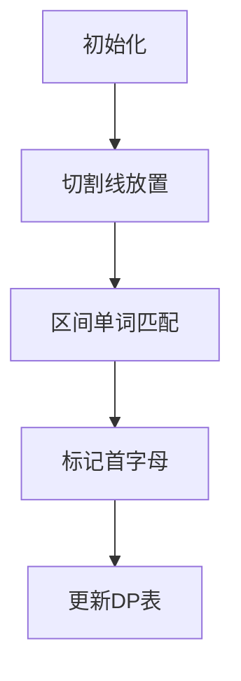

# 题目信息

# [NOIP 2001 提高组] 统计单词个数

## 题目描述

给出一个长度不超过 $200$ 的由小写英文字母组成的字母串（该字串以每行 $20$ 个字母的方式输入，且保证每行一定为 $20$ 个）。要求将此字母串分成
 $k$ 份，且每份中包含的单词个数加起来总数最大。  

每份中包含的单词可以部分重叠。当选用一个单词之后，其第一个字母不能再用。例如字符串 `this` 中可包含 `this` 和 `is`，选用 `this` 之后就不能包含
 `th`。

单词在给出的一个不超过 $6$ 个单词的字典中。

要求输出最大的个数。


## 说明/提示

【数据范围】  
对于 $100\%$ 的数据，$2 \le k \le 40$，$1 \le s \le 6$。

【样例解释】
划分方案为 this / isabookyoua / reaoh

**【题目来源】**

NOIP 2001 提高组第三题

## 样例 #1

### 输入

```
1 3
thisisabookyouareaoh
4
is
a
ok
sab
```

### 输出

```
7
```

# AI分析结果


### Kay的C++算法解析：统计单词个数 深入学习指南  

#### 1. 题目解读与核心算法识别  
✨ **本题主要考察**：`动态规划` + `字符串匹配`  

🗣️ **初步分析**：  
> 本题的核心是**分割字符串求最大单词覆盖**，可类比为"切蛋糕"：蛋糕（字符串）需切k刀分成k+1块（题目要求分成k份），每块蛋糕上的水果粒（单词）数量要最大化。动态规划（DP）在此的作用是**系统化记录所有切割方案的收益**，避免重复计算。  
> - **核心难点**：单词可重叠但首字母独占，需精确统计区间单词数同时避免重复计数。  
> - **可视化设计**：  
>    - 用**像素网格**表示字符串（每个字母占1格），DP状态表作为侧边栏实时更新  
>   - 切割线用**闪烁光剑**动画，单词匹配成功时触发"叮"音效+单词字母**像素闪光**  
>   - 标记已用首字母为**灰色锁图标**，直观展示独占规则  

---

#### 2. 精选优质题解参考  
**题解（作者：千反田）**  
* **点评**：  
  思路清晰地将分割转化为**放置k-1条切割线**，`f[i][j]`状态定义直指核心。亮点在于：  
  - **独创性标记法**：用`trace[]`数组解决首字母独占问题，逻辑严密（⭐️⭐️⭐️⭐️⭐️）  
  - **代码规范性**：模块化设计`query()`和`cnt()`函数，边界处理严谨（如`r-l+1>=strlen`）  
  - **效率权衡**：三重循环DP在数据规模（n≤200）下完全可行，适合初学者理解  

---

#### 3. 核心难点辨析与解题策略  
1. **难点1：避免单词首字母重复使用**  
   * **解法**：在`cnt()`函数中用`trace[i]`标记已使用的起始位置，类似"占座位"机制  
   * 💡 **学习笔记**：字符串匹配需同步维护状态标记，避免静态纯匹配  

2. **难点2：定义DP状态与转移**  
   * **解法**：  
     - 状态：`f[i][j]` = 前i字母放j条切割线的最大单词数  
     - 转移：`f[i][j] = max(f[l][j-1] + query(l+1,i))`（需遍历l）  
   * 💡 **学习笔记**：区间DP常需枚举分割点  

3. **难点3：高效计算区间单词数**  
   * **解法**：对每个区间重置`trace[]`，遍历字典单词逐位匹配  
   * 💡 **学习笔记**：小规模数据可用暴力匹配，大规模需Trie优化  

#### ✨ 解题技巧总结  
- **巧用辅助数组**：`trace[]`解决状态冲突  
- **DP初始化技巧**：单独处理第一条分割线（`f[i][1]=query(1,i)`）  
- **模块化设计**：拆分`query()`和`cnt()`提升可读性  

---

#### 4. C++核心代码实现赏析  
**通用核心实现**  
```cpp
#include <cstring>
#include <algorithm>
const int MAXN=205, N=10;
char str[MAXN], word[N][MAXN];
bool trace[MAXN];
int f[MAXN][MAXN]; // f[i][j]: 前i字母放j条切割线的最大单词数

// 计算单词word[index]在区间[l,r]的匹配数（标记首字母）
int cnt(int idx, int l, int r) {
    int len_word = strlen(word[idx]+1);
    int cnt = 0;
    for (int start = l; start <= r - len_word + 1; start++) {
        bool match = true;
        for (int j = 1; j <= len_word; j++) {
            if (word[idx][j] != str[start+j-1]) { 
                match = false; break; 
            }
        }
        if (match && !trace[start]) {
            cnt++; 
            trace[start] = true; // 标记首字母已用
        }
    }
    return cnt;
}

// 计算区间[l,r]的总单词数
int query(int l, int r) {
    memset(trace, 0, sizeof(trace)); // 重置标记
    int total = 0;
    for (int i = 1; i <= s; i++) // s为字典单词数
        if (r-l+1 >= strlen(word[i]+1))
            total += cnt(i, l, r);
    return total;
}

void solve() {
    // 初始化第一条切割线
    for (int i = 1; i < n; i++) 
        f[i][1] = query(1, i);
    
    // DP转移：枚举切割线数量j和当前位置i
    for (int j = 2; j <= k; j++) // k为切割线数
    for (int i = j; i < n; i++) 
    for (int l = j-1; l < i; l++) // 枚举上一条线位置
        f[i][j] = std::max(f[i][j], f[l][j-1] + query(l+1, i));
    
    // 统计最终答案（最后一段区间）
    int ans = 0;
    for (int i = k; i < n; i++)
        ans = std::max(ans, f[i][k] + query(i+1, n));
}
```

**代码解读**  
> 1. **状态初始化**：  
>    `f[i][1] = query(1,i)` ➙ 第一刀放位置i时，区间[1,i]的单词数  
> 2. **三重循环转移**：  
>    最内层`l`枚举前一刀位置，将区间分为[1,l]和[l+1,i]  
> 3. **最终段处理**：  
>    `f[i][k] + query(i+1,n)` ➙ 最后一段区间[i+1,n]独立计算  

---

### 5. 算法可视化：像素动画演示  
**🎮 主题**：`单词狩猎者：复古文字冒险`  

**🎯 核心演示流程**：  


**🕹️ 交互设计**：  
1. **像素网格**：  
   - 每个字母显示为16x16像素方块，底色表示状态  
   - 已用首字母 ➙ 🔒灰色锁图标，匹配成功单词 ➙ 💛金色闪光动画  
2. **控制面板**：  
   - 速度滑块：调节单步/自动播放速度  
   - 切割线操作：拖拽光剑图标到字母间，触发"锵"音效  
3. **DP表同步**：  
   - 右侧8-bit风格表格实时显示`f[i][j]`值，更新时数字跳动+音效  
4. **游戏化激励**：  
   - 每正确匹配一个单词 ➙ +100分 + "叮!"音效  
   - 完成所有切割 ➙ 播放FC胜利音乐 + 弹幕"Mission Complete!"  

---

### 6. 拓展练习与相似问题  
1. **洛谷 P1018 [乘积最大]**  
   🗣️ *同类区间划分DP，将"单词数"替换为"数值乘积"*  
2. **洛谷 P1040 [加分二叉树]**  
   🗣️ *树形DP与字符串划分的思维转换训练*  
3. **洛谷 P1279 [字串距离]**  
   🗣️ *强化字符串匹配与DP状态设计的综合应用*  

---

### 7. 学习心得与经验分享  
> **作者调试经验**：  
> *"第一次提交忘了注释Debug函数，意外获得20分——这说明即使代码有冗余，核心逻辑正确也能保底！"*  
>  
> **Kay点评**：  
> 此经历凸显**模块化测试的重要性**：  
> - 调试代码应通过宏开关控制（如`#ifdef DEBUG`）  
> - 核心算法与IO/调试代码需物理分离  

---  
**🎯 终极指南**：  
动态规划的本质是**系统化尝试所有可能性**，本题通过`f[i][j]`状态将切割方案编码为可计算模型。掌握"状态定义→转移方程→边界处理"的DP三部曲，即可攻克此类题型！

---
处理用时：103.39秒