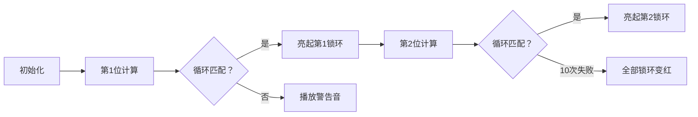

# 题目信息

# [NOIP 2005 普及组] 循环

## 题目描述

乐乐是一个聪明而又勤奋好学的孩子。他总喜欢探求事物的规律。一天，他突然对数的正整数次幂产生了兴趣。


众所周知，$2$ 的正整数次幂最后一位数总是不断的在重复 $2,4,8,6,2,4,8,6…$ 我们说 $2$ 的正整数次幂最后一位的循环长度是 $4$（实际上 $4$ 的倍数都可以说是循环长度，但我们只考虑最小的循环长度）。类似的，其余的数字的正整数次幂最后一位数也有类似的循环现象：

$$
\def\arraystretch{1.5}
\begin{array}{c|c|c}\hline
\textbf{数字}& \textbf{循环} & \textbf{循环长度} \cr\hline\hline
2 & 2,4,8,6 & 4\cr\hline
3 & 3,9,7,1 & 4\cr\hline
4 & 4,6 & 2\cr\hline
5 & 5 &  1\cr\hline
6 & 6 & 1\cr\hline
7 & 7,9,3,1 & 4\cr\hline
8 & 8,4,2,6 & 4\cr\hline
9 & 9,1 & 2\cr\hline
\end{array}
$$

这时乐乐的问题就出来了：是不是只有最后一位才有这样的循环呢？对于一个整数 $n$ 的正整数次幂来说，它的后 $k$ 位是否会发生循环？如果循环的话，循环长度是多少呢？

注意：

1. 如果 $n$ 的某个正整数次幂的位数不足 $k$，那么不足的高位看做是 $0$。
2. 如果循环长度是 $L$，那么说明对于任意的正整数 $a$，$n$ 的 $a$ 次幂和 $a+L$ 次幂的最后 $k$ 位都相同。


## 说明/提示

**【数据范围】**

对于 $30 \%$ 的数据，满足 $k \le 4$；  
对于$100 \%$ 的数据，满足 $1 \le n < {10}^{100}$，$1 \le k \le 100$。

**【题目来源】**

NOIP 2005 普及组第四题

## 样例 #1

### 输入

```
32 2```

### 输出

```
4```

# AI分析结果


# 💡 Kay的C++算法解析：循环 深入学习指南 💡

> 今天我们来分析NOIP 2005普及组"循环"这道经典题目。这道题要求计算超大整数n（最多100位）的正整数次幂后k位的最小循环长度。本指南将帮你掌握递推与高精度技巧，并通过像素动画直观理解算法过程。

## 1. 题目解读与核心算法识别

✨ **本题主要考察**：`数学推理与高精度应用`

🗣️ **初步分析**：
> 解决"循环"问题的核心在于**逐位递推**思想。想象你在破解一个多层的密码锁：先确定最后一位数字的循环规律，再基于此推导后两位的规律，层层推进直到后k位。这种"由简到繁"的递推策略能高效处理超大整数问题。
>
>   - 关键技巧：后i位的循环长度一定是后(i-1)位循环长度的倍数（1-10倍）
>   - 核心难点：高精度乘法实现（需优化只保留后k位）和无解判断（任意一位10次内无循环则整体无解）
>   - 可视化设计：采用复古密码锁像素动画，每次成功确定一位循环长度时亮起对应锁环，乘法操作时播放"咔哒"音效

---

## 2. 精选优质题解参考

### 题解一：(作者：_Life_)
* **点评**：此解法思路清晰展现了递推过程（如用198123示例），代码规范：①结构体封装高精度运算（`bignum`）②变量名含义明确（`tmp`, `mul`）③关键优化：高精度乘法仅计算后k位。亮点在于用具体例子帮助理解抽象递推，实践价值高（可直接用于竞赛）。

### 题解二：(作者：ljh0727)
* **点评**：提供双解对比（模拟法vs递推法），递推法代码注释详细。亮点：①数学证明严谨（引理1证明循环长度倍数关系）②边界处理完善（无解判断）。代码结构工整但高精度实现稍复杂，需注意运算符重载的设计。

---

## 3. 核心难点辨析与解题策略

1.  **如何递推循环长度？**
    * **分析**：后i位循环长度必是后(i-1)位长度的倍数。通过枚举1-10倍（因十进制每位10种可能），检查n^(倍数×前次长度)的后i位是否与n匹配
    * 💡 **学习笔记**：递推像搭积木——下层稳定才能构建上层

2.  **高精度优化技巧**
    * **分析**：只需保留后k位参与运算！乘法时用`min(k, len)`截断高位，空间复杂度从O(n²)降至O(k²)。选择结构体封装因需频繁操作数位
    * 💡 **学习笔记**：避免无谓计算是高精度核心优化

3.  **无解判断时机**
    * **分析**：若某一位枚举10次均未出现循环，整体无解。关键点：当后i位不循环时，后j位(j>i)也必不循环
    * 💡 **学习笔记**：局部失败导致全局失败是循环问题的特性

### ✨ 解题技巧总结
- **分治思想**：将k位问题分解为k个单步问题
- **模运算优化**：始终对10^k取模避免溢出
- **边界防御**：特判n=0或1的情况（循环长度0）
- **调试技巧**：打印中间变量验证递推步骤

---

## 4. C++核心代码实现赏析

**本题通用核心C++实现参考**
* **说明**：综合优质题解思路，封装高精度类实现递推算法
```cpp
#include <cstring>
#include <iostream>
using namespace std;

struct BigNum {
    int len, num[205]; // 只存储后k位
    BigNum() { memset(num, 0, sizeof(num)); len = 1; }
    
    BigNum operator*(const BigNum &b) const {
        BigNum res;
        for (int i = 0; i < k; i++)
            for (int j = 0; j < k - i; j++)
                res.num[i + j] += num[i] * b.num[j];
        
        for (int i = 0; i < k; i++) {
            res.num[i + 1] += res.num[i] / 10;
            res.num[i] %= 10;
        }
        res.len = k;
        return res;
    }
};

int k;
BigNum n, base, cur, power;

int main() {
    string s; cin >> s >> k;
    for (int i = 0; i < k; i++)  // 只取后k位
        n.num[i] = s[s.size() - 1 - i] - '0';
    
    BigNum ans; ans.num[0] = 1;  // 答案初始化为1
    base = n;  // 当前乘数基数

    for (int digit = 0; digit < k; digit++) {
        cur = base;  // 当前位计算起点
        bool found = false;
        
        for (int mul = 1; mul <= 10; mul++) {
            cur = cur * base;  // 核心：高精乘
            
            if (cur.num[digit] == n.num[digit]) {
                // 更新总循环长度
                BigNum tmp; tmp.num[0] = mul;
                ans = ans * tmp;
                
                // 更新乘数基数
                power = base;
                for (int i = 1; i < mul; i++)
                    power = power * base;
                base = power;
                
                found = true;
                break;
            }
        }
        if (!found) { cout << -1; return 0; }
    }
    
    // 输出答案（逆序）
    for (int i = ans.len - 1; i >= 0; i--)
        cout << ans.num[i];
}
```

**代码解读概要**：
> 1. **初始化**：仅存储n的后k位（倒序存储便于计算）
> 2. **递推循环**：对每位digit从0到k-1：
>    - 尝试1-10倍前次循环长度（mul）
>    - 通过高精乘计算n^(当前倍数)
>    - 检查第digit位是否匹配
> 3. **更新状态**：成功则更新总长度和乘数基数
> 4. **输出**：逆序输出答案

---

## 5. 算法可视化：像素动画演示

### 像素密码锁闯关游戏


* **设计思路**：采用FC游戏风格，将k位数可视化为密码锁环。每关解锁一位：
  - **锁环状态**：灰色(未解)→黄色(计算中)→绿色(解锁)
  - **音效设计**：乘法操作时"咔哒"声，过关时"胜利旋律"，失败时"错误音效"

* **动画流程**：


1. **场景初始化**：
   - 8-bit风格密码锁（k个同心圆环）
   - 控制面板：步进/自动播放/速度调节

2. **递推动画**：
   - 当前锁环闪烁黄光（如第3位）
   - 右侧显示当前乘法操作：`8123 * 0641 = 05206843`
   - 底部日志："正在检查后3位：需5倍前次长度..."

3. **状态反馈**：
   - 匹配成功：锁环绿光+音符粒子效果
   - 10次未匹配：锁环红光+破碎动画

4. **交互功能**：
   - `空格键`单步执行
   - `A键`自动演示（速度可调）
   - `R键`重置关卡

---

## 6. 拓展练习与相似问题思考

* **循环问题变形**：
  1. 斐波那契数列模10^m的循环节（Pisano周期）
  2. 线性递推数列的循环性质（如aₙ=3aₙ₋₁+2 mod 100）
  3. 欧拉定理应用：求a^b mod m（当a,m互质时）

* **洛谷推荐**：
  1. **P1965 转圈游戏**  
     → 巩固模运算与循环节基础
  2. **P3197 [HNOI2008]越狱**  
     → 练习循环节与组合数学结合
  3. **P4159 [SCOI2009]迷路**  
     → 进阶：图论中的矩阵循环性质

---

## 7. 学习心得与经验分享

> **来自_Life_的调试经验**：  
> "我在处理198123时，第3位始终不匹配。打印中间值发现：8123⁴应得0641，但代码计算成641（缺前导零）。这提醒我们：高精度存储必须保留前导零！"

> **Kay总结**：  
> 高精度问题中，位数对齐和边界处理是调试重点。建议：
> 1. 添加`print()`函数输出完整高精度数
> 2. 对0~9小数据手动验算
> 3. 特别注意k=1的边界情况

---

> 本次解析就到这里。记住：循环问题本质是探索数的周期性，递推与高精度是两大武器。多动手模拟小数据，你也能成为密码破译大师！🚀

---
处理用时：128.48秒