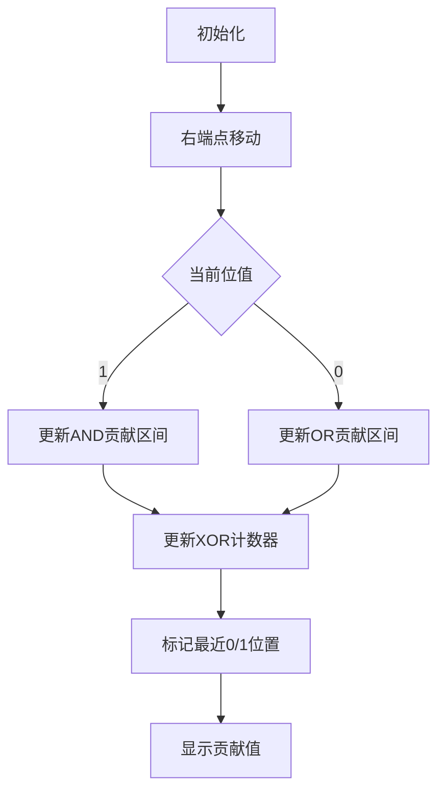

# 题目信息

# Rainbow的信号

## 题目描述

Freda 发明了传呼机之后，rainbow 进一步改进了传呼机发送信息所使用的信号。

由于现在是数字、信息时代，rainbow 发明的信号用 $N$ 个自然数表示。

为了避免两个人的对话被大坏蛋 VariantF 偷听，rainbow 把对话分成 $A、B、C$ 三部分，分别用 $a、b、c$ 三个密码加密。

现在 Freda 接到了 rainbow 的信息，她的首要工作就是解密。

Freda 了解到，这三部分的密码计算方式如下：

在 $1 \sim N$ 这 $N$ 个数中，等概率地选取两个数 $l、r$，如果 $l>r$，则交换 $l、r$。

把信号中的第 $l$ 个数到第 $r$ 个数取出来，构成一个数列 $P$。

$A$ 部分对话的密码是数列 $P$ 的 $xor$ 和的数学期望值，$xor$ 和就是数列 $P$ 中各个数异或之后得到的数； $xor$ 和的期望就是对于所有可能选取的 $l、r$，所得到的数列的 $xor$ 和的平均数。

$B$ 部分对话的密码是数列 $P$ 的 $and$ 和的期望，定义类似于 $xor$ 和。

$C$ 部分对话的密码是数列 $P$ 的 $or$ 和的期望，定义类似于 $xor$ 和。

请你帮忙计算这三个密码。

## 说明/提示

### 样例解释

样例 1 共包含四种可能的 $l,r$：

|c|c|c|c|
|-|-|-|-|
|$l, r$ | xor 和 | and 和 | or 和 |
|1,1 | 4 | 4 | 4 |
|1,2 | 1 | 4 | 5 |
|2,1 | 1 | 4 | 5 |
|2,2 | 5 | 5 | 5 |

以上每一对 $l,r$ 出现的概率均相同, 因此分别对 xor 和、and 和、or 和取平均数就是数学期望值。

## 数据范围与约定

对于 $20 \%$ 的数据， $1 \le N \le 100$ 。  
对于 $40 \%$ 的数据， $1 \le N \le 1000$ 。  
对于另外 $30 \%$ 的数据, $N$ 个数为 $0$ 或 $1$ 。  
对于 $100 \%$ 的数据, $1 \le N \le 100000$，$N$ 个自然数均不超过 $10^9$ 。

## 样例 #1

### 输入

```
2
4 5```

### 输出

```
2.750 4.250 4.750
```

# AI分析结果


### 💡 Kay的C++算法解析：Rainbow的信号 深入学习指南 💡

**引言**  
大家好，我是Kay！今天我们来分析一道关于位运算期望的经典题目——Rainbow的信号。这道题要求计算随机选取区间内数字的异或、与、或三种位运算的期望值。本指南将带大家拆解算法核心，理解优化技巧，并通过可视化方案直观感受算法流程。准备好了吗？让我们开始吧！

---

## 1. 题目解读与核心算法识别

✨ **本题主要考察**：位运算分解、数学期望、状态维护

🗣️ **初步分析**：  
> 解决本题的关键在于**位运算的独立性**和**期望的线性性质**。想象一下，32位整数就像32个独立的开关，每个开关的状态（0/1）对最终结果的贡献是独立的。我们可以将问题分解为32个子问题（每个二进制位单独计算），最后合并结果。

- **核心思路**：  
  1. 将每个数字按二进制位拆解，对每一位单独计算三种运算的期望  
  2. 维护关键状态（最近0/1位置、异或和计数器）  
  3. 区分单点区间（概率1/n²）和一般区间（概率2/n²）

- **可视化设计**：  
  采用8位像素风格，每行表示一个二进制位：  
  - 灰色像素块表示0，黄色表示1  
  - 红色竖线标记最近0位置，蓝色竖线标记最近1位置  
  - 绿色高亮显示当前贡献区间  
  - 音效设计：位翻转时"嘀"声，贡献更新时硬币声

---

## 2. 精选优质题解参考

**题解一（Elaina_0）**  
* **亮点**：  
  - 状态维护清晰（`last[0]/last[1]`记录最近位置）  
  - 概率处理严谨（显式区分1/n²和2/n²）  
  - 代码规范（变量名`c0/c1`直指含义）

**题解二（azaa414）**  
* **亮点**：  
  - 概率推导透彻（解释2/n²的来源）  
  - 代码健壮性强（`long long`防溢出）  
  - 边界处理完整（`last`数组初始化）

**题解三（粥2414）**  
* **亮点**：  
  - XOR优化思路新颖（`c0/c1`计数器动态交换）  
  - 分步骤讲解清晰（先OR/AND再XOR）  
  - 代码模块化（拆分三个求解函数）

---

## 3. 核心难点辨析与解题策略

1. **难点：按位分解的可行性证明**  
   *分析*：通过位运算不进位特性+期望线性性质（E(a+b)=E(a)+E(b))，将问题分解为32个独立子问题  
   💡 学习笔记：位运算分解是降低复杂度的关键策略

2. **难点：XOR的递推关系建立**  
   *分析*：维护`c0/c1`表示前i个数字中，异或和为0/1的左端点数量。当前位为1时交换`c0/c1`  
   💡 学习笔记：XOR的递推本质是奇偶性变化

3. **难点：概率的差异化处理**  
   *分析*：单点区间（l=r）概率为1/n²，一般区间概率为2/n²，需分别计算贡献  
   💡 学习笔记：概率权重是期望计算的核心要素

### ✨ 解题技巧总结
- **技巧1**：位分解（将32位整数视为32个独立问题）  
- **技巧2**：状态压缩（仅需维护最近0/1位置和计数）  
- **技巧3**：滚动更新（O(n)遍历时动态更新贡献）  
- **技巧4**：边界防御（初始化`last[0]=last[1]=0`）

---

## 4. C++核心代码实现赏析

**通用核心实现（综合优化版）**：
```cpp
#include <iostream>
using namespace std;
const int N = 1e5 + 10;

int main() {
    int n, a[N];
    double ans_xor = 0, ans_and = 0, ans_or = 0;
    cin >> n;
    for (int i = 1; i <= n; ++i) cin >> a[i];
    
    for (int k = 0; k < 31; ++k) { // 枚举每个二进制位
        int last[2] = {0, 0}; // last0:最近0位置 last1:最近1位置
        int c0 = 0, c1 = 0;    // 异或和计数器
        
        for (int i = 1; i <= n; ++i) {
            int bit = (a[i] >> k) & 1;
            double base = (1.0 / n / n) * (1 << k);
            
            // 单点区间贡献（l=r）
            if (bit) {
                ans_xor += base;
                ans_and += base;
                ans_or += base;
            }
            
            // 一般区间贡献（l≠r）
            if (bit) {
                ans_and += 2 * base * (i - last[0] - 1);
                ans_or += 2 * base * (i - 1);
                ans_xor += 2 * base * c0;
                swap(c0, c1);  // XOR特性：遇到1时交换计数器
                c1++;
            } else {
                ans_or += 2 * base * last[1];
                ans_xor += 2 * base * c1;
                c0++;
            }
            last[bit] = i;  // 更新最近位置
        }
    }
    printf("%.3f %.3f %.3f", ans_xor, ans_and, ans_or);
}
```
* **代码解读概要**：  
  外层循环枚举32个二进制位，内层遍历序列。通过`last`数组跟踪最近0/1位置，`c0/c1`维护XOR状态。贡献计算区分单点和一般区间（x2），时间复杂度O(32n)

**题解一代码片段赏析**：
```cpp
// 处理当前位为1的情况
if (now) {
    ansand += ret + 2.0 * ret * (j - (last[0] + 1));
    // 解释：ret是单点贡献，2*ret*(区间长度)是一般区间贡献
    // 区间长度为[last0+1, j-1]（AND要求全1）
}
```
* **学习笔记**：AND运算的贡献区间必须是连续1的区间

---

## 5. 算法可视化：像素动画演示

**主题**：8位机风格的位运算探险  
**核心演示**：最低位的计算过程（其他31位并行显示）

### 动画设计：


**关键交互**：  
1. **像素网格**：32行x100列，每行代表一个二进制位  
2. **动态标记**：  
   - 红色竖线：最近0位置  
   - 蓝色竖线：最近1位置  
   - 绿色高亮：当前贡献区间  
3. **控制面板**：  
   - 步进/暂停/重置按钮  
   - 速度滑块（1x-5x）  
4. **音效系统**：  
   - 位翻转：8-bit "嘀"声  
   - 贡献更新：硬币音效  
   - 错误操作：低沉警示音  

**演示逻辑**：  
当处理第i个数字时：  
1. 对应位像素变黄（1）或灰（0）  
2. 根据位值更新红/蓝标记线位置  
3. 显示AND/OR的绿色贡献区间  
4. 右上角显示`c0/c1`计数器的实时变化  

---

## 6. 拓展练习与相似问题

**通用技巧迁移**：  
1. 子数组最大/最小值期望 → 单调栈+位分解  
2. 区间和期望 → 前缀和分解  
3. 带位运算的计数问题 → 状态压缩DP  

**推荐练习**：  
1. 🌟 P2114 [NOI2014] 起床困难综合症（位运算+贪心）  
   *推荐理由*：巩固位分解思想，学习贪心策略应用  
   
2. 🌟 P3211 [HNOI2011]XOR和路径（期望+高斯消元）  
   *推荐理由*：深入理解期望与图论的结合  
   
3. 🌟 P4526 【模板】期望线性性质  
   *推荐理由*：掌握期望基础性质的应用场景  

---

## 7. 学习心得与经验分享

**作者经验摘录**：  
> "调试时特别注意概率因子（1/n²和2/n²的区分），我在这个点上WA了3次" —— Elaina_0  
> "last数组未初始化导致随机值，建议赋初值last0=last1=0" —— azaa414  

**Kay的总结**：  
1. 位分解是处理位运算期望的核心武器  
2. 初始化和边界处理是代码健壮性的关键  
3. 打印中间变量（如每位的贡献值）是有效的调试手段  

---

**结语**  
通过这道题，我们不仅学会了位运算期望的计算方法，更掌握了**问题分解**和**状态维护**的通用技巧。记住，复杂的算法往往由简单的组件构成，就像8位机的像素块最终能组成绚丽的画面。保持好奇心，继续探索算法的奇妙世界吧！🚀

---
处理用时：161.45秒