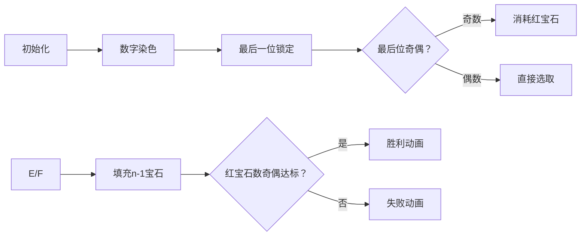

# 题目信息

# [Opoi 2024] 简谐振动

## 题目背景

你说得对，但是简谐振动十分优美。


但是我们不出多边形下海，所以你不需要维护一个质点的简谐振动。

## 题目描述

已知一个数字串 $S$，请你判断是否存在一种长度为 $n$ **且 $n$ 为奇数**的整数序列 $A_i$，使得 $A_1+A_2,A_2+A_3,\dots,A_{n-1}+A_n,A_n+A_1$ 的值按顺序依次拼接起来可以得到 $S$。

特别的，如果存在一种方案使得拼接的时候两项中间用 $[0,\infty)$ 个 $0$ 分隔仍然可以得到 $S$，该方案仍然合法。**所有数据保证最前面没有前导 $0$。**

## 说明/提示

### 样例解释
第一组样例解释：

$\begin{matrix}
7&6&4\cr
+&+&+\cr
6&4&7\cr
||&||&||\cr
13&10&11\end{matrix}$

当然，你也可以说：

$\begin{matrix}
71&60&-60\cr
+&+&+\cr
60&-60&71\cr
||&||&||\cr
131&0&11\end{matrix}$

构造方法不唯一。

第二组样例解释：

如果有解，$A_1=2.5$，而题目说了 $A$ 为整数序列，故无解。

第三组样例解释：

$\begin{matrix}
1&&1&0\cr
+&&+&+\cr
1&&0&1\cr
||&&||&||\cr
2&0&1&1\end{matrix}$

> 该方案中间用了 $1 \in [0,\infty)$ 个 $0$ 分隔，符合要求，输出 `Yes`。

---
### 数据范围
对于 $50\%$ 的数据，$1\le T \le 10$，$1\le |S| \le 10$，$1 \le n \le 3$。

对于 $100\%$ 的数据，$1\le T \le 100$。保证 $\sum n\le 10^6$ 且 $\sum|S|\le 10^6$，${\tt 0} \le S_i \le {\tt 9}$，**且 $n$ 为奇数**。

## 样例 #1

### 输入

```
3
3
131011
1
5
3
2011
```

### 输出

```
Yes
No
Yes```

# AI分析结果


### 💡 Kay的C++算法解析：简谐振动 深入学习指南 💡

> “编程就像解谜，找到规律就能化繁为简。今天我们一起破解'简谐振动'的数学之美！” —— Kay

---

## 1. 题目解读与核心算法识别

✨ **本题主要考察**：`数学奇偶性分析` + `贪心策略应用`

🗣️ **初步分析**：
> 本题核心在于**利用数字奇偶性**快速判断解的存在性。想象你有一串彩色珠子（数字），红珠（奇数）和蓝珠（偶数）。你需要从中选出`n`颗珠子（最后那颗必须选），使得红珠总数是**偶数颗**（因为奇数+奇数=偶数，偶数+偶数=偶数）。  
> - **核心技巧**：统计除最后一位外红蓝珠数量，根据最后一位颜色决定如何选取前`n-1`颗  
> - **可视化设计**：在像素动画中，将用红色/蓝色方块表示奇偶数，高亮最后一位方块，动态演示选取过程  
> - **复古元素**：采用8-bit风格，方块收集伴随"叮"（偶数）/"砰"（奇数）音效，集齐时播放FC胜利音乐

---

## 2. 精选优质题解参考

**题解一（封禁用户）**
* **点评**：该题解通过严谨的数学推导，将问题转化为奇偶数统计问题。亮点在于：
  - 独创`ask()`函数封装选取逻辑，代码复用性强
  - 边界处理周全（如`n=1`时直接判断最后一位奇偶）
  - 变量命名清晰（`od`/`ev`直观测奇偶数）
  - 时间复杂度仅**O(|S|)**，完美匹配数据规模

---

## 3. 核心难点辨析与解题策略

### 🔑 三大核心难点
1. **难点1：理解任意分割的本质**  
   * **分析**：题目允许插入任意多个0，意味着实际只需关注每个数字的**最后一位**（决定奇偶性）。如`"2011"`可拆分为`[2,01,1]`，等价于`[2,1,1]`
   * 💡 学习笔记：前导零不影响奇偶性，首数字无前导零是唯一约束

2. **难点2：奇偶性条件推导**  
   * **分析**：设选中的数字中奇数有`k`个，则`k`必须为偶数（偶数=偶数个奇数之和）。最后一位为奇数时，前`n-1`位需选**奇数个**奇数；最后位为偶数时需**偶数个**
   * 💡 学习笔记：环形序列奇数总和必为偶数（因`n`为奇数）

3. **难点3：高效统计实现**  
   * **分析**：不需实际分割字符串，只需遍历统计奇偶数量。核心代码：
     ```cpp
     for(int i=0; i<s.size()-1; i++)
         (s[i]%2==0) ? ev++ : od++;
     ```

### ✨ 解题技巧总结
- **技巧1：数学转化** - 将字符串问题转化为奇偶统计问题
- **技巧2：分类讨论** - 按最后一位奇偶分情况处理
- **技巧3：边界防御** - 单独处理`n=1`和`od=0`等特殊情况
- **技巧4：贪心选取** - 用`od/2*2`快速计算可用奇数对

---

## 4. C++核心代码实现赏析

```cpp
#include<bits/stdc++.h>
using namespace std;

void ask(int od, int ev, int cnt) {
    if (od + ev < cnt) { 
        cout << "No\n";
        return;
    }
    if (cnt % 2 == 1) {         // 需选奇数个数时先选一个偶数
        if (!ev) { cout << "No\n"; return; }
        cnt--; ev--;
    }
    cnt -= (od / 2) * 2;        // 用奇数对填充
    cout << (cnt <= ev ? "Yes\n" : "No\n");
}

int main() {
    int tc; cin >> tc;
    while (tc--) {
        int n; string s;
        cin >> n >> s;
        int od = 0, ev = 0;
        
        // 统计除最后一位外的奇偶数
        for (int i = 0; i < s.size()-1; i++) 
            (s[i]-'0') % 2 ? od++ : ev++;
        
        // 分类处理
        if (n == 1) 
            cout << ((s.back()-'0') % 2 ? "No\n" : "Yes\n");
        else if ((s.back()-'0') % 2 == 0) 
            ask(od, ev, n-1);
        else 
            od ? ask(od-1, ev, n-2) : void(cout << "No\n");
    }
}
```

**代码解读概要**：
1. **核心逻辑封装**：`ask()`解决"从`od`个奇数`ev`个偶数中选`cnt`个数且奇数为偶"的子问题
2. **高效选取**：先处理奇数个数约束（13-14行），再用奇数对填充（15行），最后用偶数补足
3. **防御性编程**：`void()`避免空else分支（28行），保持代码健壮性

---

## 5. 算法可视化：像素动画演示

### 🎮 动画设计：**《奇偶宝石猎人》**
> *8-bit像素风格 | 音效反馈 | 实时数据可视化*



**关键动画帧**：
1. **场景初始化**  
   - 数字串转为像素方块：🔴（奇数）、🔵（偶数）  
   - 最后一位自动飞入收集栏，边框闪烁（配"锁定"音效）

2. **动态选取演示**  
   - 像素小人（👨‍💻）从左向右移动，点击方块触发收集
   - 收集时显示统计面板：
     ```
     当前需求：收集3颗宝石（红=奇数）
     已选：🔴🔵  → 还需1红
     ```

3. **游戏化反馈**  
   - 成功：收集栏亮💡，播放FC胜利音乐，红宝石爆炸成烟花  
   - 失败：收集栏变💀，播放经典FC失败音效

**交互控制面板**：
```javascript
// 伪代码实现核心交互
const controls = {
  步进按钮: () => moveStep(),  // 空格键触发
  自动演示: () => autoRun(0.5), // 速度可调
  重置: () => initGame(),
  音效: { 
    选取: '8bit_click.wav', 
    成功: 'victory_jingle.mp3',
  }
}
```

---

## 6. 拓展练习与相似问题

### 🔁 奇偶性技巧应用场景
1. 环形序列求和（如本题）
2. 二染色问题判断（如棋盘覆盖）
3. 数字游戏必胜策略（如取石子奇偶性）

### 📚 洛谷推荐题目
1. **P1031 均分纸牌**  
   → 通过奇偶性判断移动可行性，巩固数学建模能力

2. **P1102 A-B数对**  
   → 练习用奇偶性优化搜索策略

3. **P1630 求和**  
   → 强化奇偶性在大型运算中的应用

---

> "编程的本质是发现规律。当你理解奇偶性的妙用，就掌握了打开数学之门的钥匙！" —— Kay的鼓励

---
处理用时：234.39秒