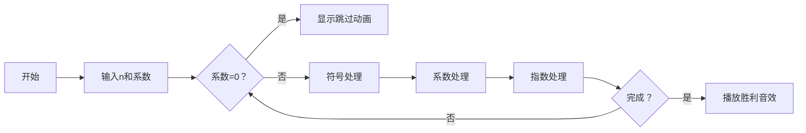

# 题目信息

# [NOIP 2009 普及组] 多项式输出

## 题目描述

一元 $n$ 次多项式可用如下的表达式表示：

$$f(x)=a_nx^n+a_{n-1}x^{n-1}+\cdots +a_1x+a_0,a_n\ne 0$$

其中，$a_ix^i$ 称为 $i$ 次项，$a_i$ 称为 $i$ 次项的系数。给出一个一元多项式各项的次数和系数，请按照如下规定的格式要求输出该多项式：

1. 多项式中自变量为 $x$，从左到右按照次数递减顺序给出多项式。

2. 多项式中只包含系数不为 $0$ 的项。

3. 如果多项式 $n$ 次项系数为正，则多项式开头不出 `+` 号，如果多项式 $n$ 次项系数为负，则多项式以 `-` 号开头。

4. 对于不是最高次的项，以 `+` 号或者 `-` 号连接此项与前一项，分别表示此项系数为正或者系数为负。紧跟一个正整数，表示此项系数的绝对值（如果一个高于 $0$ 次的项，其系数的绝对值为 $1$，则无需输出 $1$）。如果 $x$ 的指数大于 $1$，则接下来紧跟的指数部分的形式为“$x^b$”，其中 $b$ 为 $x$ 的指数；如果 $x$ 的指数为 $1$，则接下来紧跟的指数部分形式为 $x$；如果 $x$ 的指数为 $0$，则仅需输出系数即可。

5. 多项式中，多项式的开头、结尾不含多余的空格。


## 说明/提示

NOIP 2009 普及组 第一题

对于100%数据，$0 \le n \le 100$，$-100 \le $系数$ \le 100$

---

$\text{upd 2022.8.1}$：新增加一组 Hack 数据。

## 样例 #1

### 输入

```
5 
100 -1 1 -3 0 10```

### 输出

```
100x^5-x^4+x^3-3x^2+10```

## 样例 #2

### 输入

```
3 
-50 0 0 1 
```

### 输出

```
-50x^3+1 
```

# AI分析结果


# 💡 Kay的C++算法解析：多项式输出 深入学习指南 💡

## 1. 题目解读与核心算法识别
✨ **本题主要考察**：`模拟应用` (编程技巧应用)

🗣️ **初步分析**：
> 解决多项式输出这道题，关键在于**精确模拟题目要求的输出规则**。这就像按照食谱烘焙蛋糕——每一步都要严格遵循配方细节，稍有偏差就会影响成品外观。  
> 本题的核心在于处理三类细节：**符号规则**（首项无前导'+'）、**系数规则**（±1的特殊处理）、**指数规则**（指数为1时省略）。优质题解普遍采用**分步处理策略**：先判断符号，再处理系数，最后处理指数。  
> 在可视化设计中，我们将用**像素打字机**动画展示输出过程：每个项分解为符号/系数/指数三个模块逐步输出，用不同颜色标记当前处理阶段（黄色-符号/蓝色-系数/绿色-指数），当遇到系数为0时显示"跳过"动画，并伴随复古音效增强反馈。

---

## 2. 精选优质题解参考
**题解一：Loyal_Soldier (赞10)**
* **点评**：此解法思路清晰直白，通过嵌套条件判断覆盖所有边界情况。代码结构紧凑（仅15行），变量命名简洁（`i`表指数，`x`表系数），逻辑链完整处理了符号/系数/指数三大模块。亮点在于用`abs(x)>1||i==0`统一处理系数输出条件，避免冗余分支。实践价值高，适合竞赛快速编码。

**题解二：qhr2023 (赞4)**
* **点评**：解法以极致简洁著称（仅10行），但完整覆盖核心规则。创新点在于用`if(a==-1)`单独处理负一系数，与主条件互补。代码规范性优秀，但缺少注释可能影响初学者理解。算法有效性突出，空间复杂度O(1)，是空间优化的典范。

**题解三：WsW_ (赞3)**
* **点评**：采用**三步分层策略**（符号→系数→指数），逻辑结构如教科书般清晰。亮点在于引入`isFirst`标志变量管理首项规则，使代码可读性显著提升。虽然代码稍长（20行），但教学价值极高，特别适合初学者理解问题分解思想。

---

## 3. 核心难点辨析与解题策略
1.  **符号时序控制**  
    * **分析**：首项负号直接输出，正号不输出；非首项需补'+'（仅正数）。优质题解用`i!=n`判断首项（因循环从高次开始），WsW_解法额外用`isFirst`标记更易理解  
    💡 **学习笔记**：符号输出本质是**状态管理问题**，需区分首项与非首项

2.  **系数省略规则**  
    * **分析**：当|系数|=1且非常数项时省略数字（仅输出符号）。难点在负系数处理——若系数为-1且非常数项，需单独输出'-'（因数字被省略）。qhr2023的`if(a==-1) cout<<'-'`是优雅解决方案  
    💡 **学习笔记**：系数输出需同时考虑**绝对值大小**和**指数是否为0**

3.  **指数显示优化**  
    * **分析**：指数为1时省略"^1"，为0时仅输出系数。Loyal_Soldier通过`if(i>1)`和`if(i==1)`分离处理，避免指数冗余  
    💡 **学习笔记**：指数显示是**条件压缩问题**，需建立指数值与输出格式的映射

### ✨ 解题技巧总结
- **分治策略**：将多项式拆解为单项式，按符号→系数→指数三阶段处理（参考WsW_）
- **边界先知**：提前处理n=0（仅常数项）和a=0（跳过）的退化情况
- **逆向循环**：从高次向低次遍历（`for(int i=n;i>=0;i--)`），自然满足次数递减要求
- **防御性输出**：用`abs(a)>1||i==0`保护系数输出，避免±1误显示

---

## 4. C++核心代码实现赏析
**本题通用核心C++实现参考**
* **说明**：综合优质题解思路，采用WsW_的分层策略优化可读性
* **完整核心代码**：
```cpp
#include <iostream>
#include <cmath>
using namespace std;

int main() {
    int n, a;
    cin >> n;
    bool isFirst = true; // 标记首项
    
    for (int i = n; i >= 0; i--) {
        cin >> a;
        if (a == 0) continue; // 规则2：跳过0系数项
        
        //=== 符号处理 ===
        if (!isFirst && a > 0) cout << '+'; // 非首项正数补+
        
        //=== 系数处理 ===
        if (abs(a) != 1 || i == 0) cout << a; // 非常数项且|a|=1时省略数字
        else if (a == -1) cout << '-';        // 负系数且省略数字时补负号
        
        //=== 指数处理 ===
        if (i > 0) { // 非常数项处理
            cout << 'x';
            if (i > 1) cout << '^' << i; // 指数>1时显示指数
        }
        isFirst = false; // 首项标记更新
    }
    return 0;
}
```
* **代码解读概要**：
  > 代码分为三层架构：  
  > 1. **循环框架**：`for(int i=n;i>=0;i--)`确保从高次到低次遍历  
  > 2. **三层过滤器**：先跳过0系数→处理符号→处理系数→处理指数  
  > 3. **状态标记**：`isFirst`标志区分首项规则，避免冗余条件嵌套  

---
**题解一：Loyal_Soldier**
* **亮点**：用单层条件链覆盖所有规则，极致简洁
* **核心代码片段**：
```cpp
if(x){
    if(i!=n&&x>0) cout<<'+';       // 非首项正号
    if(i!=0&&x==-1) cout<<'-';     // -1系数处理
    if(abs(x)>1||i==0) cout<<x;    // 系数输出
    if(i>1) cout<<"x^"<<i;         // 高次指数
    if(i==1) cout<<'x';            // 一次项
}
```
* **代码解读**：
  > 通过精妙的条件顺序实现规则覆盖：  
  > 1. `i!=n&&x>0`：非首项正数补'+'  
  > 2. `i!=0&&x==-1`：处理-1系数的负号输出  
  > 3. `abs(x)>1||i==0`：合并处理系数显示（绝对值>1或常数项）  
  > 4. 后两个`if`分离处理指数显示，避免冗余  
* 💡 **学习笔记**：条件表达式排序是优化关键，前条件为后条件铺路

**题解二：qhr2023**
* **亮点**：最小化代码行数，竞赛编码典范
* **核心代码片段**：
```cpp
if(a){
    if(i<n&&a>0) cout<<'+';     // 符号补位
    if(abs(a)>1||i==0) cout<<a; // 系数显示
    if(a==-1&&i) cout<<'-';     // -1特判
    if(i>0) cout<<'x';          // 变量输出
    if(i>1) cout<<'^'<<i;       // 指数显示
}
```
* **代码解读**：
  > 四行代码实现完整功能：  
  > 1. `i<n&&a>0`：精准定位非首项正数  
  > 2. `abs(a)>1||i==0`：系数输出的充分条件  
  > 3. `a==-1&&i`：补充处理系数为-1时的负号显示  
  > 4. 后两个`if`实现指数分级显示  
* 💡 **学习笔记**：用逻辑运算符合并条件可大幅压缩代码量

**题解三：WsW_**
* **亮点**：三步分层架构，教学示范级代码
* **核心代码片段**：
```cpp
if(!isFirst && a>0) putchar('+'); // 符号层
if(a<0) putchar('-');             // 负号处理

if(abs(a)!=1 || i==0)             // 系数层
    printf("%d",abs(a)); 
    
if(i){                            // 指数层
    putchar('x');
    if(i>1) printf("^%d",i);
}
isFirst = false;                  // 状态更新
```
* **代码解读**：
  > 显式分离三大模块：  
  > 1. **符号层**：用`isFirst`管理首项规则  
  > 2. **系数层**：`abs(a)!=1 || i==0`统一输出条件  
  > 3. **指数层**：`i>1`时追加指数显示  
  > 状态标记`isFirst`在循环末尾更新  
* 💡 **学习笔记**：模块化分解是降低模拟题复杂度的核心策略

-----

## 5. 算法可视化：像素动画演示

* **动画主题**：<span style="color:#FF6B6B">「多项式打字机」</span>——像素小人操作复古终端输出多项式  
* **核心演示**：逐步生成多项式输出，实时高亮符号(🔶黄)/系数(🔷蓝)/指数(💚绿)三阶段  

### 🎮 交互设计


### 🖌️ 像素动画关键帧
1. **初始化**：  
   - 8位风格控制面板：速度滑块(调速) + 步进/暂停按钮  
   - 像素终端显示空白多项式：`f(x)= [        ]`  

2. **单项式处理**：  
   ```python
   # 伪代码流程
   for 指数 i from n downto 0:
       读取系数a
       if a==0: 
           显示"🚫跳过"像素动画，播放跳过音效(哔~)
       else:
           # 符号阶段(黄色高亮)
           if 非首项且a>0: 
               终端追加"+"，播放打字音效(哒)
           
           # 系数阶段(蓝色高亮)
           if |a|>1 or i==0: 
               终端追加a，播放数字键音效(叮)
           elif a==-1: 
               终端追加"-"，播放警告音(嘀)
           
           # 指数阶段(绿色高亮)
           if i>0: 
               终端追加"x"，播放变量音效(咚)
               if i>1: 
                   终端追加"^"+i，播放指数音效(锵)
   ```

3. **游戏化元素**：  
   - 每完成一个单项式得10分，连续无错追加20%连击奖励  
   - 通关条件：无冗余符号+无遗漏项 → 解锁像素奖杯🏆  

### 🎵 复古音效方案
| 操作         | 音效     | 波形              |
|-------------|---------|------------------|
| 符号输出     | 短"哒"声 | ▁▁▁█▁▁           |
| 系数输出     | 中"叮"声 | ▁▁█▁█▁           |
| 指数输出     | 长"锵"声 | ▁█▁█▁█           |
| 错误/跳过    | 降调"哔" | █▁█▁▁▁           |
| 通关         | 胜利和弦 | ▁▃▅▆█▆▅▃▁        |

---

## 6. 拓展练习与相似问题思考
* **通用技巧迁移**：  
  本题训练的**分段输出控制**技巧还适用于：  
  1. 时间格式化（将秒数转为DD:HH:MM:SS）  
  2. 罗马数字转换（IV/IX等特殊规则）  
  3. 金融数字格式化（千分位逗号分隔）  

* **洛谷习题推荐**：  
  1. [P1051 谁拿了最多奖学金] - 多条件判断+格式化输出  
     🗣️ **推荐理由**：强化分段输出能力，需处理更复杂的条件嵌套  
  2. [P1598 垂直柱状图] - 二维输出模拟  
     🗣️ **推荐理由**：将一维规则拓展到二维空间，培养空间化输出思维  
  3. [P1308 统计单词数] - 字符串格式化处理  
     🗣️ **推荐理由**：训练边界感知能力，解决前缀/后缀空格问题  

-----

## 7. 学习心得与经验分享
> **参考经验 (来自 WsW_)**:  
> “把一个多项式拆成多个单项式分别处理，按照输出顺序分三步：符号→系数→指数”  
>
> **点评**：这种**分阶段处理法**是解决模拟题的金钥匙。在调试时，建议用`n=2, a[]={1,-1,1}`等边界数据逐步验证每个阶段输出，可快速定位逻辑漏洞。记住：优秀的模拟代码像钟表齿轮——每个模块精准咬合，独立验证是组装成功的关键。

---

本次多项式输出的解题分析就到这里。记住：**编程如烹饪，遵循食谱的精确性决定最终味道**。多加练习这些输出控制技巧，你将在各类模拟题中所向披靡！🚀

---
处理用时：286.79秒