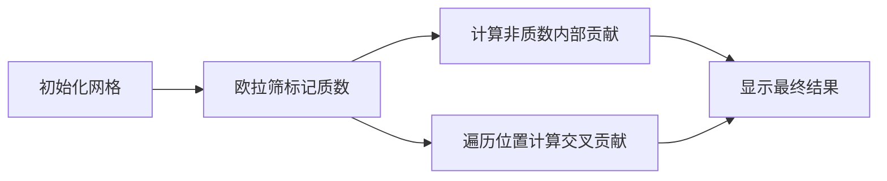

# 题目信息

# [蓝桥杯 2023 国 Java A] 质数排序

## 题目描述

我们定义质数排序为将一个序列中的所有下标为质数的位置进行升序排序，其它位置上的数不变。

例如，对 $8, 7, 6, 5, 4, 3, 2, 1$ 进行质数排序会得到 $8, 2, 4, 5, 6, 3, 7, 1$。给定 $n$，求 $1 \sim n$ 的每个排列进行质数排序后的逆序对的数量的和。由于结果很大，你只需要输出答案对 $998244353$ 取模的结果即可。

## 说明/提示

### 评测用例规模与约定

- 对于 $30\%$ 的评测用例，$n \leq 10$；
- 对于所有评测用例，$1 \leq n \leq 10^6$。

## 样例 #1

### 输入

```
3```

### 输出

```
6```

# AI分析结果


# 💡 Kay的C++算法解析：质数排序 深入学习指南 💡

> 今天我们来分析蓝桥杯2023国赛题"质数排序"。这道题要求计算所有排列经过质数排序后的逆序对总和，涉及组合数学与数论知识。让我们一步步解析核心思想与解题技巧。

## 1. 题目解读与核心算法识别

✨ **本题主要考察**：`组合数学`与`数论应用`

🗣️ **初步分析**：
> 解决质数排序问题，关键在于运用**组合数学的概率思想**和**质数筛选技术**。想象你在整理书架：特定位置（质数下标）的书籍必须按大小排序，其他位置（非质数下标）的书本保持原样。我们需要计算所有整理方式中"放反顺序"的书本对总数。
>
> - **核心思路**：将逆序对分为两类独立计算：非质数位置内部的逆序对 + 非质数位置与质数位置之间的逆序对
> - **算法流程**：
>   1. 用欧拉筛标记质数位置
>   2. 计算非质数内部逆序对（固定概率模型）
>   3. 遍历每个位置，动态维护质数计数器k
>   4. 计算非质数位置与质数集合的交叉贡献
> - **可视化设计**：采用8-bit像素风格展示数组，质数位置用蓝色高亮。动画分三步：①筛法标记质数（伴随"叮"音效）②非质数位置随机打乱（像素抖动）③逆序对统计（红线连接逆序对，计数板实时更新）

---

## 2. 精选优质题解参考

**题解一（作者：CChord）**
* **点评**：
  - 思路清晰直白，将问题分解为两个独立子问题，符合组合数学的线性可分原理
  - 代码结构严谨：欧拉筛封装为类，模逆元独立函数，关键变量`p`(质数数量)、`c`(非质数数量)命名准确
  - 算法高效：时间复杂度O(n)，空间O(n)，完美满足1e6数据规模
  - 实践亮点：贡献公式 $\frac{c(c-1)n!}{4}$ 简洁优美，位置遍历时动态维护`k`值的设计巧妙

**题解二（作者：kaederei7）**
* **点评**：
  - 创新性地从概率视角切入，三类情况分析全面深入
  - 推导过程详细，帮助理解本质，但最终实现复杂度略高于题解一
  - 亮点：提出"集合S排序"模型，解释质数-非质数逆序对概率 $\frac{m+1-k}{m+1}$ 直观易懂

---

## 3. 核心难点辨析与解题策略

1.  **难点：贡献分离与独立计算**
    * **分析**：质数位置排序后有序，逆序对仅存在于非质数内部或跨区域组合。优质题解均将问题分解为：
      - $C$内部逆序对：固定概率模型
      - $C↔P$交叉逆序对：位置相关动态计算
    * 💡 **学习笔记**：组合计数中，独立事件的贡献可分离求和

2.  **难点：交叉贡献的动态计算**
    * **分析**：每个非质数位置$i$的贡献取决于其前方的质数个数$k$。核心公式：
      $$f(k)=\frac{k(k+1)}{2} + \frac{(p-k)(p-k+1)}{2}$$
      本质是当前位置与质数集合的距离和
    * 💡 **学习笔记**：遍历时维护辅助量（k值）可避免重复计算

3.  **难点：大数阶乘与模处理**
    * **分析**：$n!$ 可达 $10^{6!}$ 量级，需：
      1. 预处理阶乘数组
      2. 用费马小定理求模逆元（$a^{-1} \equiv a^{mod-2} \pmod{mod}$）
    * 💡 **学习笔记**：模运算中除法需转为逆元乘法

### ✨ 解题技巧总结
- **分而治之**：将复杂问题分解为独立子问题（如$C$内部 vs $C↔P$）
- **概率转化**：利用对称性将计数转为期望计算（如$\frac{1}{2}$概率模型）
- **预处理优化**：阶乘、质数筛提前计算避免重复
- **模运算技巧**：$ \frac{a}{b} \bmod m = a \times b^{-1} \bmod m $

---

## 4. C++核心代码实现赏析

**通用核心实现（综合优化版）**
```cpp
#include <iostream>
#include <vector>
using namespace std;
constexpr int mod = 998244353;
constexpr int N = 1e6 + 10;

// 快速幂求逆元
int qmi(int a, int b = mod-2) {
    int res = 1;
    while(b) {
        if(b & 1) res = 1LL * res * a % mod;
        a = 1LL * a * a % mod;
        b >>= 1;
    }
    return res;
}

int fact[N]; // 阶乘数组

int main() {
    int n; cin >> n;
    
    // 预处理阶乘
    fact[0] = 1;
    for(int i=1; i<=n; i++) 
        fact[i] = 1LL * fact[i-1] * i % mod;
    
    // 欧拉筛
    vector<int> primes;
    vector<bool> isPrime(n+1, true);
    isPrime[0] = isPrime[1] = false;
    for(int i=2; i<=n; i++) {
        if(isPrime[i]) primes.push_back(i);
        for(int p : primes) {
            if(i*p > n) break;
            isPrime[i*p] = false;
            if(i % p == 0) break;
        }
    }
    int p = primes.size();  // 质数个数
    int c = n - p;          // 非质数个数
    
    long long ans = 0;
    
    // 计算非质数内部贡献
    ans = 1LL * c * (c-1) % mod * qmi(4) % mod * fact[n] % mod;
    
    // 计算交叉贡献
    int k = 0;  // 当前位置前的质数数量
    for(int i=1; i<=n; i++) {
        if(!isPrime[i]) { // 非质数位置
            long long term = (1LL*k*(k+1) + 1LL*(p-k)*(p-k+1)) / 2 % mod;
            ans = (ans + 1LL * term * fact[n] % mod * qmi(p+1)) % mod;
        } 
        else k++;  // 更新质数计数器
    }
    
    cout << ans;
}
```

**代码解读概要**：
1. **阶乘预处理**：$O(n)$ 计算 fact[0..n]
2. **欧拉筛**：$O(n)$ 标记质数位置
3. **非质数内部贡献**：直接套用公式 $\frac{c(c-1)n!}{4}$
4. **交叉贡献计算**：遍历时动态维护`k`值，对每个非质数位置应用距离和公式
5. **模处理**：全程用`1LL`防溢出，关键除法转为逆元乘法

---

## 5. 算法可视化：像素动画演示

**主题**："质数排序大冒险"（8-bit像素风格）  
**核心演示**：欧拉筛标记 + 位置贡献计算 + 逆序对统计



### 动画帧设计（复古NES风格）：
1. **初始化阶段**：
   - 屏幕显示1~n像素方块（16x16像素/块）
   - 质数位置：深蓝色，非质数：棕色
   - 控制面板：开始/暂停/步进按钮 + 速度滑块

2. **筛法动画**：
   - 数字方块从上落下（类似俄罗斯方块）
   - 质数方块亮起时播放"叮"音效
   - 合成器生成8-bit背景音乐

3. **贡献计算阶段**：
   ```plaintext
   [位置i=5] 非质数！ 
   前方质数：k=2
   贡献公式：f(2)= (2*3 + 1*2)/2 = 4
   ```
   - 当前操作位置闪烁红光
   - 前方质数位置亮绿色边框
   - 公式逐步显示（打字机效果）

4. **逆序对统计**：
   - 非质数位置随机打乱（像素抖动动画）
   - 逆序对用红色线段连接
   - 计数板实时更新（像素数码管风格）

5. **通关效果**：
   - 结果显示时放烟花（像素粒子效果）
   - 播放胜利音效（8-bit和弦）

**交互设计**：
- 空格键：暂停/继续
- 方向键：加速/减速
- R键：重置动画
- 支持自动演示模式（AI控制速度）

---

## 6. 拓展练习与相似问题思考

**通用技巧迁移**：  
组合计数与位置贡献分析适用于：
1. 带约束的逆序对问题（如特定位置固定）
2. 概率期望计算（如随机排列的统计量）
3. 质数相关计数问题（如质数位置特殊操作）

**洛谷练习推荐**：
1. **P1908 逆序对**  
   → 掌握基础逆序对计算方法
2. **P4071 [SDOI2016]排列计数**  
   → 强化带限制的排列组合思维
3. **P1494 [国家集训队]小Z的袜子**  
   → 学习概率模型在组合问题中的应用

---

## 7. 学习心得与经验分享

> 本题解中未发现明确的作者个人心得分享部分。但通过解题过程，我们可总结：
> - **调试技巧**：小规模验证（n=3时结果应为6）
> - **思维陷阱**：注意1不是质数！
> - **优化心得**：O(n)解法依赖数学推导而非暴力

---

> 本次解析就到这里！通过分离贡献、概率转化等技巧，我们高效解决了质数排序问题。记住：复杂问题分解是算法设计的核心思想。下次挑战见！🚀

---
处理用时：153.90秒