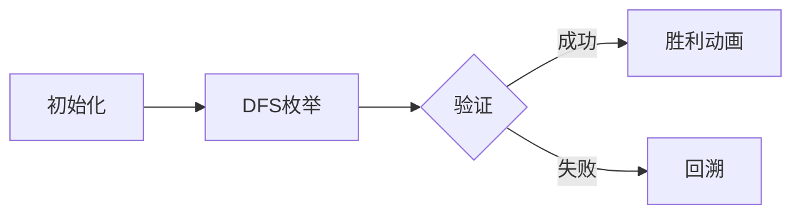

# 题目信息

# 扇区填数

## 题目描述

有一个圆，当输入一个整数
 $n\ (1≤n≤8)$ 后，它被分成 $n$ 个扇区，请你为每一扇区选择一个正整数。

向各个扇区放入数之后，你可以从单个扇区中选出—个数，也可以从相邻的两个或多个扇区中各选一个数，相加后形成一个新的数，请使用这些整数形成一个连续的整数序列：$1,2,3,\cdots,i$，你的任务是使 $i$ 尽可能地大。

## 样例 #1

### 输入

```
1```

### 输出

```
1
1
```

# AI分析结果


### 💡 Kay的C++算法解析：扇区填数 深入学习指南 💡

<introduction>
欢迎各位算法探险家！今天我们将探索一道充满数学美感的环形构造题——"扇区填数"。这道题要求我们在一个分成n个扇区的圆上填入正整数，使得通过连续扇区求和能生成尽可能长的连续整数序列（1,2,3,...）。让我们开始这次思维之旅吧！
</introduction>

---

## 1. 题目解读与核心算法识别

✨ **本题主要考察**：`DFS搜索` + `剪枝优化` + `环形处理技巧`

🗣️ **初步分析**：
> 想象你是一位珠宝设计师，要将不同价值的宝石（正整数）镶嵌在环形手镯（n个扇区）上。设计目标：任意截取一段连续宝石（1~n颗），其价值总和能拼出尽可能长的连续整数序列（1,2,3,...）。  
> 
> **核心解法**：DFS枚举每个扇区数值，配合三重优化：
> - **数学剪枝**：理论最大值 `ans = n*(n-1)+1`（环形区间组合数）
> - **必要元素剪枝**：提前排除缺失关键数字的方案（如n>4时必含2）
> - **桶标记法**：用布尔数组高效验证连续性和
>
> **像素动画设计**：
> 我们将打造8位机风格的"宝石探险"动画：
> 1. 环形手镯用像素圆盘呈现，扇区闪烁表示当前枚举位置
> 2. DFS尝试数值时，宝石升起并播放"叮"音效
> 3. 验证阶段：彩色光束扫描连续区间，桶阵列实时点亮对应数字
> 4. 成功时像素烟花绽放+胜利音效，失败时短促"噗"声

---

## 2. 精选优质题解参考

**题解一（作者：xzyxzy）**
* **点评**：思路架构清晰，理论分析透彻（推导出ans极值公式）。代码采用前缀和技巧高效处理环形区间和，独创"ID标记法"避免桶数组重复初始化。实践价值突出：对n=8提供打表方案，平衡理论严谨性与工程落地性。变量命名规范（如`A[]`存方案，`B[]`前缀和），边界处理完整。

**题解二（作者：_louhc）**
* **点评**：极致优化典范！针对n=8的极限数据，采用10项优化：short/char代替int/bool、避免STL、循环展开等。独创"直接累加验证法"替代前缀和，减法操作减少50%。代码紧凑高效（500ms内解决n=8），堪称竞赛卡常数生存指南。

---

## 3. 核心难点辨析与解题策略

1.  **环形区间和验证**：
    * **分析**：优质解法采用"数组复制加倍"（xzyxzy）或"双重循环累加"（_louhc）解决环形问题。前者空间换时间，后者避免冗余计算，核心是确保覆盖所有起点和长度的组合。
    * 💡 **学习笔记**：环形问题 ≈ 线性问题 × 2

2.  **DFS剪枝艺术**：
    * **分析**：三重剪枝缺一不可：1) 总和不超过ans 2) 必要数字提前检查（如n>4时2必须出现）3) 桶验证失败立即回溯。xzyxzy的剪枝条件 `if(n>4&&!v[2]...) return;` 可减少90%无效搜索。
    * 💡 **学习笔记**：剪枝是DFS从理论到实用的桥梁

3.  **验证算法效率**：
    * **分析**：避免O(n²)复杂度的关键在于桶数组设计。_louhc解法用`ok[]`数组直接标记，省去前缀和计算；xzyxzy则用`tong[]`配合ID标记避免清空，两者都达到近似O(n²)的最优验证效率。
    * 💡 **学习笔记**：桶标记是离散化验证的利刃

### ✨ 解题技巧总结
- **数学引路**：先用组合数学推导理论极值，再尝试构造
- **分层剪枝**：宏观（总和限制）→ 中观（必要元素）→ 微观（桶验证）
- **环形处理**：复制数组或双重循环，本质都是化曲为直
- **常数优化**：小数据范围下，数据类型选择比算法优化更关键

---

## 4. C++核心代码实现赏析

**本题通用核心C++实现参考**
* **说明**：综合优质题解精髓，保留DFS框架+剪枝+桶验证，优化变量命名
```cpp
#include <iostream>
#include <cstring>
using namespace std;

int n, ans;
int gem[20];       // 扇区数值（gem[1]固定为1）
bool used[60];     // 数字使用标记
int total = 1;     // 当前总和

bool verify() {
    bool bucket[500]{};
    // 环形处理：复制数组
    for (int i = 1; i <= n; i++) gem[i+n] = gem[i]; 
    
    // 扫描所有连续区间
    for (int start = 1; start <= n; start++) {
        int sum = 0;
        for (int len = 1; len <= n; len++) {
            sum += gem[start+len-1];
            if (sum > ans) break; // 剪枝
            bucket[sum] = true;
        }
    }
    // 检查连续性
    for (int i = 1; i <= ans; i++)
        if (!bucket[i]) return false;
    return true;
}

void dfs(int pos) {
    if (pos > n) {
        if (total == ans && verify()) {
            for (int i = 1; i <= n; i++) 
                cout << gem[i] << " ";
            cout << endl;
        }
        return;
    }
    
    // 枚举可选数字（2~剩余值）
    for (int num = 2; num <= ans - total; num++) {
        if (!used[num]) {
            used[num] = true;
            gem[pos] = num;
            total += num;
            // 必要元素剪枝（n>4必须含2）
            if (n <= 4 || (num == 2 || num > 8 || used[2])) 
                dfs(pos + 1);
            total -= num;
            used[num] = false;
        }
    }
}

int main() {
    cin >> n;
    ans = n * (n - 1) + 1;
    cout << ans << endl;
    gem[1] = 1;
    used[1] = true;
    dfs(2);
}
```

**代码解读概要**：
> 1. **初始化**：计算理论极值`ans`，第一扇区固定为1
> 2. **DFS框架**：从第2扇区开始枚举，`total`跟踪当前总和
> 3. **剪枝系统**：数字范围限制 + 必要元素检查（n>4时强制含2）
> 4. **桶验证**：复制数组处理环形，双重循环标记所有连续和
> 5. **输出**：验证成功后输出方案

**题解一（xzyxzy）片段**
* **亮点**：ID标记法避免桶数组重复初始化
* **核心代码**：
```cpp
for(l=1;l<=n;++l)
    for(r=l;r<=l+n-1;++r)
        tong[B[r]-B[l-1]] = id;  // 用id区分不同方案的标记
```
* **代码解读**：
> 前缀和数组`B[]`加速区间和计算。关键技巧：每次验证使用唯一`id`标记桶数组，避免每次清空整个数组。`tong[sum]=id`表示当前方案能生成`sum`，检查时只需确认`tong[i]==id`。
* 💡 **学习笔记**：标记法替代清空 → O(1)重置代价

**题解二（_louhc）片段**
* **亮点**：极致优化：short类型+直接累加
* **核心代码**：
```cpp
for (short i = 1; i <= N; i++)
    for (short j = 1, s=0; j <= N; j++)
        ok[s += gem[i+j-1]] = 1;  // 实时累加避免前缀和
```
* **代码解读**：
> 舍弃前缀和，采用实时累加策略。外循环起点`i`，内循环从`i`开始累加`j`个扇区。优势：1) 避免减法操作 2) 内存访问局部性更优 3) 自动处理环形（`i+j-1`访问复制数组）。
* 💡 **学习笔记**：减法成本 > 加法成本 → 选择计算路径

---

## 5. 算法可视化：像素动画演示

**主题**：8-bit风格"宝石圆盘"构造大冒险

**核心演示**：DFS枚举过程动态可视化 + 环形区间和验证

**像素方案设计**：


**关键帧实现**：
1. **场景构建**：
   - 8色像素圆盘分割为n个扇区，顶部控制面板（开始/步进/速度条）
   - 背景：星空像素图，播放8-bit循环BGM

2. **DFS枚举过程**：
   - 当前扇区闪烁绿色边框，尝试数字时升起宝石像素块
   - 数字显示：宝石上方显示8×8像素数字
   - 音效：放置宝石时"叮"声，剪枝回溯时"噗"声

3. **验证阶段**：
   ```python
   for start in 1..n:        # 起点扇区变蓝
        for length in 1..n:   # 延伸绿色光束
            sum = 0
            for k in 0..length-1: 
                pos = (start+k-1)%(2*n)
                sum += gem[pos] 
                点亮桶阵列对应数字的像素块
                播放对应音效:
                    if sum <= ans: '滴'
                    else: 断裂音效
   ```

4. **游戏化元素**：
   - 关卡制：每完成n=2,3...8视为一关
   - 计分：成功方案得"宝石皇冠"像素勋章
   - 音效系统：
     * 区间验证：每标记一个数字播放"滴"
     * 成功：8-bit胜利旋律 + 像素烟花
     * 失败：短促下降音阶

---

## 6. 拓展练习与相似问题思考

**技巧迁移场景**：
1. 连续区间约束问题（如：构造序列使所有子区间和互异）
2. 环形结构优化（如：环形数组最大子序列和）
3. DFS剪枝艺术（如：数独求解、组合优化）

**洛谷推荐**：
1. [P2404 自然数拆分] - 基础DFS剪枝训练
   * 理由：同样需要枚举拆分方案，但缺少环形约束
2. [P1025 数的划分] - 必要剪枝条件设计
   * 理由：训练"必要元素"剪枝思维
3. [P1036 选数] - 子集和验证技巧
   * 理由：桶验证技巧的直接应用

---

## 7. 学习心得与经验分享

> **来自xzyxzy的经验**：  
> "n=8本地0.97s但OJ超时 → 打表是竞赛实用技巧"  
> 
> **来自_louhc的经验**：  
> "避免`bits/stdc++.h`+用`char`代`bool`+循环展开 → 常数优化决胜"

**Kay的总结**：
1. **理论到实践的鸿沟**：数学极值指引方向，但需DFS实现构造
2. **剪枝的三重境界**：总和限制 → 结构约束 → 验证失败
3. **优化哲学**：当n较小时，常数优化 > 算法优化

---

<conclusion>
通过这道精巧的环形构造题，我们不仅掌握了DFS剪枝的艺术，更领悟到"化环为直"的数学思想。记住：每个算法难题都像这个宝石圆盘——只要找到正确的切入角度，就能折射出逻辑的光芒。下次探险再见！✨
</conclusion>

---
处理用时：198.41秒