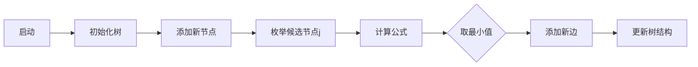

# 题目信息

# 树的重量

## 题目描述

树可以用来表示物种之间的进化关系。一棵“进化树”是一个带边权的树，其叶节点表示一个物种，两个叶节点之间的距离表示两个物种的差异。现在，一个重要的问题是，根据物种之间的距离，重构相应的“进化树”。

令 $N=\{1,2,3,\cdots ,n\}$，用一个 $N$ 上的矩阵 $M$ 来定义树 $T$。其中，矩阵 $M$ 满足：对于任意的 $i$，$j$，$k$，有 $M[i,j]+M[j,k] \ge M[i,k]$。树 $T$ 满足：

1. 叶节点属于集合 $N$；
2. 边权均为非负整数；
3. $d_T(i,j)=M[i,j]$，其中 $d_T(i,j)$ 表示树上 $i$ 到 $j$ 的最短路径长度。

如下图，矩阵 $M$ 描述了一棵树。

$$M=\begin{bmatrix}
0 & 5 & 9 & 12 & 8 \\
5 & 0 & 8 & 11 & 7 \\
9 & 8 & 0 & 5 & 1 \\
12 & 11 & 5 & 0 & 4 \\
8 & 7 & 1 & 4 & 0 \\
\end{bmatrix}$$

树的重量是指树上所有边权之和。对于任意给出的合法矩阵 $M$，它所能表示树的重量是惟一确定的，不可能找到两棵不同重量的树，它们都符合矩阵 $M$。你的任务就是，根据给出的矩阵 $M$，计算 $M$ 所表示树的重量。下图是上面给出的矩阵 $M$ 所能表示的一棵树，这棵树的总重量为 $15$。


## 样例 #1

### 输入

```
5
5 9 12 8
8 11 7
5 1
4
```

### 输出

```
15

```

## 样例 #2

### 输入

```
4
15 36 60
31 55
36```

### 输出

```
71```

# AI分析结果


### 💡 Kay的C++算法解析：树的重量 深入学习指南 💡

**引言**  
今天我们一起分析「树的重量」这道C++编程题。题目要求根据物种间距离矩阵重构进化树，并计算树的重量（所有边权之和）。本指南将帮助你快速掌握核心算法，理解解题技巧，并通过可视化方案直观感受算法执行过程。

---

### 1. 题目解读与核心算法识别  
✨ **本题主要考察**：`树的性质应用`（贪心策略）  

🗣️ **初步分析**：  
> 解决本题的关键在于理解**树的结构特性**和**距离矩阵的几何意义**。想象你在组装一棵乐高树：初始只有两个节点（树根），每次新增节点时，寻找最节省积木（最小边权）的连接方式。  
> - **核心思路**：从节点1和2开始逐步构建树，对每个新节点i（i≥3），计算其连接到已有树的最小代价。  
> - **公式推导**：新增边权 = min{(dis[1][i] + dis[j][i] - dis[1][j]) / 2}（j∈[2, i-1]）。  
> - **可视化设计**：动画将展示节点逐步加入过程，高亮当前节点和枚举的j节点，动态显示距离公式计算过程，用颜色区分已有树和新加入边。  
> - **复古游戏化**：采用8位像素风格，节点用不同颜色方块表示，添加节点时播放"连接音效"，成功构建时触发"胜利音效"，每添加一个节点视为通关一步。

---

### 2. 精选优质题解参考  
**题解一（TsReaper）**  
* **亮点**：  
  - 思路直击本质，用树形图清晰解释分叉原理（n=3和n>3的示意图极具启发性）  
  - 代码简洁高效（位运算优化除法），变量命名规范（`dis`表意明确）  
  - 复杂度O(n²)，完美满足题目约束（n≤30）  

**题解二（Mathison）**  
* **亮点**：  
  - 数学推导严谨，从n=2基础情况自然推广到一般形式  
  - 完整代码包含边界处理，可直接用于竞赛（如`while(~scanf)`处理多组数据）  
  - 实践价值高：强调贪心策略的正确性证明  

**题解三（dzz1537568241）**  
* **亮点**：  
  - 独创性提出两个关键引理（新节点到树的最短边性质）  
  - 详细分析公式几何意义（LCA与距离关系）  
  - 提供替代实现视角（固定根节点降低维度）  

---

### 3. 核心难点辨析与解题策略  
**关键点1：新增节点位置判定**  
* **分析**：新节点i必须连接在已有路径上，但具体位置未知。通过枚举j计算潜在分叉点，利用树的性质（dis[i][j] = dis[i][k] + dis[k][j]）反推分叉位置。  
* 💡 **学习笔记**：公式`(dis[1][i]+dis[j][i]-dis[1][j])/2`本质是计算i到路径[1,j]的垂足距离  

**关键点2：最小值选择的正确性**  
* **分析**：取最小值对应最优连接点，若选择较大值会导致路径冗余（如图中红边比蓝边长）。反证法说明：若存在更优解，会破坏距离矩阵的合法性。  
* 💡 **学习笔记**：最小值保证新边尽可能复用已有路径，符合树的最优子结构  

**关键点3：逐步构建的完备性**  
* **分析**：从n=2开始递推，每个新节点只增加一条边。矩阵唯一性保证最终树结构确定，无需回溯。  
* 💡 **学习笔记**：树的重构问题中，局部最优可推导全局最优  

### ✨ 解题技巧总结  
- **问题分解**：将复杂树重构分解为逐步添加叶节点的过程  
- **公式活用**：理解`(a+b-c)/2`的几何意义（三角形中的垂足计算）  
- **边界艺术**：n=2时直接取dis[1][2]，循环从i=3开始  
- **调试技巧**：对拍验证小数据（n=3/4），验证矩阵合法性（三角不等式）

---

### 4. C++核心代码实现赏析  
**本题通用核心C++实现**  
```cpp
#include <iostream>
#include <algorithm>
#include <climits>
using namespace std;

int main() {
    int n;
    while (cin >> n && n) {
        int dis[35][35] = {}, ans = 0;
        
        // 读入上三角矩阵并对称填充
        for (int i = 1; i < n; i++)
            for (int j = i + 1; j <= n; j++)
                cin >> dis[i][j], dis[j][i] = dis[i][j];

        ans = dis[1][2]; // 初始化：节点1-2的边权
        
        for (int i = 3; i <= n; i++) {
            int tmp = INT_MAX;
            for (int j = 2; j < i; j++) // 枚举已有节点
                tmp = min(tmp, (dis[1][i] + dis[j][i] - dis[1][j]) / 2);
            ans += tmp; // 累加最小新增边权
        }
        cout << ans << endl;
    }
    return 0;
}
```
**代码解读概要**：  
1. 对称存储距离矩阵（`dis[j][i] = dis[i][j]`)  
2. 核心逻辑在3层循环：外层遍历节点（3~n），中层枚举候选节点（2~i-1）  
3. 公式计算使用整数除法（由树性质保证整除性）  
4. 复杂度O(n²)完美处理n≤30  

---

### 5. 算法可视化：像素动画演示  
**主题**：像素树构建大冒险（复古8-bit风格）  

**核心演示流程**：  


**动画关键帧设计**：  
1. **场景初始化**  
   - 16色像素网格，节点1（蓝色）、节点2（绿色）居中  
   - 黄色连线显示dis[1][2]，控制面板含速度滑块/暂停按钮  

2. **节点添加过程**（以节点3为例）  
   - 新节点闪烁（红色），候选节点j高亮（黄色边框）  
   - 实时显示公式：`(dis[1][3] + dis[2][3] - dis[1][2])/2 = ?`  
   - 播放音效：枚举时"滴"声，确定最小值时"叮"声  

3. **动态效果**  
   - 新增边绘制动画（红色像素线从分叉点生长到新节点）  
   - 权重标签弹出显示（"+X"）  
   - 通关效果：每节点添加成功时，播放8-bit胜利音效  

4. **交互功能**  
   - 步进模式：按空格单步执行  
   - AI演示：自动播放（可调速）  
   - 比较模式：并排展示不同j值对应的连接方案  

**技术实现**：  
- Canvas绘制树结构（节点=10px方块，边=抗锯齿直线）  
- 状态高亮：当前操作元素用闪烁动画（opacity周期性变化）  
- 音效系统：Web Audio API播放芯片音效（入队声/错误提示声）

---

### 6. 拓展练习与相似问题  
**通用思路迁移**：  
1. 最小生成树问题（Prim/Kruskal算法）  
2. 树直径求解（两次DFS/BFS）  
3. 带权重树的重心计算  

**洛谷推荐**：  
1. **P1395 会议**  
   🗣️ 巩固树的性质应用，求解最佳集会点  

2. **P4281 紧急集合**  
   🗣️ 练习LCA应用，理解分叉点计算  

3. **P5536 树的直径**  
   🗣️ 进阶训练树形DP，深化结构认知  

---

### 7. 学习心得与经验分享  
> **来自TsReaper的调试经验**：  
> “最初在验证n=4时，发现连接位置判断错误。通过画图模拟节点分叉，终于理解公式本质是计算垂足距离。”  
>   
> **Kay的总结**：  
> 树相关问题中，动手画图比空想更有效！建议：  
> 1. 对n=3/4手工计算验证  
> 2. 打印中间变量（候选j值对应的计算结果）  
> 3. 用纸笔绘制树结构辅助理解  

---

**结语**  
通过本次分析，我们掌握了树重构的核心技巧：利用距离矩阵特性逐步构建，贪心选择最优连接点。记住Kay的秘诀：**复杂问题简单化，抽象问题具象化**。现在就去洛谷挑战相似题目吧！下次我们将探索更有趣的树形DP问题，敬请期待！🚀

---
处理用时：151.13秒