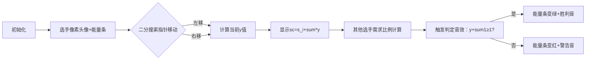

# 题目信息

# [GCJ 2012 #1B] Safety in Numbers

## 题目描述

有 $N$ 名选手参加一档真人秀节目。每位选手会被评委打分，并获得观众投票。评委分数与观众投票将按照如下方式合成为选手的最终得分：

设 $x$ 为所有选手评委分数的总和。假设某位选手获得了 $j$ 分评委分数，并且她获得了观众投票的 $y$ 部分（$y$ 在 $0$ 到 $1$ 之间，包括 $0$ 和 $1$，例如 $y$ 可能为 $0.3$）。那么这位选手的最终得分为 $j + x \cdot y$。注意，所有选手获得的观众投票比例之和必须为 $1$。

得分最低的选手将被淘汰。

现在给定每位选手从评委那里获得的分数，你的任务是，对于每一位选手，计算她为了**确保自己不会被淘汰**，无论其他观众票如何分配，至少需要获得多少百分比的观众投票。

如果有多名选手并列最低分，则没有任何选手会被淘汰。

## 说明/提示

**限制条件**

- $0 \leq s_i \leq 100$
- 至少存在一个 $i$ 使得 $s_i > 0$。也就是说，至少有一名选手的评委分数大于 $0$。

**测试集 1（10 分，结果可见）**

- $1 \leq T \leq 20$
- $2 \leq N \leq 10$

**测试集 2（11 分，结果隐藏）**

- $1 \leq T \leq 50$
- $2 \leq N \leq 200$

翻译由 ChatGPT-4.1 完成。

## 样例 #1

### 输入

```
4
2 20 10
2 10 0
4 25 25 25 25
3 24 30 21```

### 输出

```
Case #1: 33.333333 66.666667
Case #2: 0.000000 100.000000
Case #3: 25.0 25.0 25.0 25.0
Case #4: 34.666667 26.666667 38.666667```

# AI分析结果


### 题目分析报告：Safety in Numbers  

---

#### **1. 题目解读与核心算法识别**  
**✨ 本题主要考察**：`二分搜索` + `数学推导`  

**🗣️ 初步分析**：  
> 本题要求计算每位选手**确保不被淘汰**的最小观众投票比例，核心在于数学建模与二分搜索的结合。想象你在玩一个音乐节奏游戏🎮：每位选手的评委分数是基础得分，观众投票是"能量条"补充。我们需要精确计算每个选手所需的最小"能量条"比例，使得无论其他选手如何分配剩余能量，该选手都不会垫底。  

**算法流程可视化设计**：  
- **关键变量**：`s[i]`（评委分）、`sum`（总分）、`y`（观众投票比例）  
- **高亮步骤**：二分搜索中的`check()`函数计算过程，重点展示：  
  - 当前选手得分`sc = s[i] + sum*y`  
  - 其他选手所需最小比例`max(0, (sc-s[j])/sum)`  
  - 比例总和`y + sum1 ≥ 1`的判定逻辑  
- **像素动画方案**：采用复古音乐游戏界面🎵，选手头像下方显示动态能量条，二分搜索过程用左右移动的像素指针表示，每次判定时触发8-bit音效🎶。  

---

#### **2. 精选优质题解参考**  
**题解来源：Idealwindow**  
* **点评**：  
  题解思路清晰，通过二分法高效求解最小比例。亮点在于：  
  1. **数学建模**：将"不被淘汰"转化为`y + ∑max(0, (sc-s_j)/sum) ≥ 1`的优雅不等式  
  2. **边界处理**：使用`max(0, ...)`避免负值，严谨处理评委分过高的情况  
  3. **代码规范**：变量名`sum`, `s[]`直观，循环逻辑简洁  
  4. **效率优化**：O(Tn²logW)复杂度完美匹配数据范围（N≤200）  

---

#### **3. 核心难点辨析与解题策略**  
**难点1：理解"确保不被淘汰"的数学本质**  
* **分析**：本质是构造一个场景——**即使其他选手获得最小必要投票比例**，当前选手仍非最低分。关键变量`sc = s[i] + sum*y`需覆盖所有可能性。  
* 💡 **学习笔记**：将抽象条件转化为可计算的数学不等式是解题核心  

**难点2：设计二分法的check函数**  
* **分析**：需计算其他选手在得分≥`sc`时所需的最小比例之和，公式：  
  ```math  
  \text{sum1} = \sum_{j \neq i} \max\left(0,  \frac{\text{sc} - s[j]}{\text{sum}}\right)  
  ```  
  再验证`y + sum1 ≥ 1`  
* 💡 **学习笔记**：check函数应满足"最坏情况"测试  

**难点3：处理极端数据边界**  
* **分析**：当`s[i]`极低时，`y`需接近100%；当`s[i]`极高时，`y`可趋近0。代码中`max(0, ...)`确保比例非负。  
* 💡 **学习笔记**：边界条件是二分法易错点，必须模拟极端场景  

**✨ 解题技巧总结**：  
- **数学转化法**：将淘汰条件变为可计算的等式  
- **逆向构造**：从"对手最小需求"反推自身安全阈值  
- **精度控制**：1e-7的二分精度平衡效率与准确性  

---

#### **4. C++核心代码实现赏析**  
**本题通用核心实现**  
```cpp
#include <bits/stdc++.h>
using namespace std;

int T, s[205], n, sum;

bool check(int p, double y) {
    double sc = s[p] + sum * y;
    double sum1 = 0;
    for (int i = 1; i <= n; i++) {
        if (i == p) continue;
        sum1 += max((sc - s[i]) / (double)sum, 0.0);
    }
    return y + sum1 >= 1;
}

int main() {
    scanf("%d", &T);
    for (int i = 1; i <= T; i++) {
        sum = 0;
        scanf("%d", &n);
        for (int j = 1; j <= n; j++) {
            scanf("%d", &s[j]);
            sum += s[j];
        }
        printf("Case #%d: ", i);
        for (int j = 1; j <= n; j++) {
            double l = 0, r = 1;
            while (r - l > 1e-7) {
                double mid = (l + r) / 2;
                if (check(j, mid)) r = mid;
                else l = mid;
            }
            printf("%lf ", l * 100);
        }
        printf("\n");
    }
    return 0;
}
```  
**代码解读概要**：  
1. **输入处理**：读取T组数据，计算评委总分`sum`  
2. **二分框架**：对每位选手在[0,1]区间二分搜索最小比例`y`  
3. **核心判定**：`check()`函数计算其他选手在得分≥`sc`时所需最小比例和  
4. **输出控制**：结果乘以100转换为百分比  

---

#### **5. 算法可视化：像素动画演示**  
**🎮 主题**：*节奏安全挑战*（8-bit音乐游戏风格）  

**🎯 核心演示流程**：  


**🎨 设计细节**：  
1. **像素元素**：  
   - 选手头像：复古16x16像素造型  
   - 能量条：动态填充的彩色像素块  
   - 二分指针：闪烁的箭头（←→）  

2. **音效方案**：  
   - 指针移动：电子"滴"声  
   - 判定成功：上升旋律（类似FC《马里奥》吃金币）  
   - 判定失败：短促"哔"声  

3. **交互控制**：  
   - 步进模式：按空格单步执行二分  
   - 自动演示：AI以贪吃蛇模式自动通关所有选手  
   - 速度调节：滑块控制动画速度（0.5x~3x）  

---

#### **6. 拓展练习与相似问题**  
**🔗 通用技巧迁移**：  
1. **比例分配问题**：资源分配中保证最小收益  
2. **安全阈值计算**：如网络传输中的最小带宽保障  
3. **竞赛策略优化**：多人游戏中确保排名安全  

**📚 洛谷推荐**：  
1. **P1577 切绳子**  
   → 二分答案+比例分配，巩固精度控制  
2. **P1182 数列分段**  
   → 最小化最大值问题，强化二分建模能力  
3. **P1281 书的复制**  
   → 最优化分配问题，扩展多场景应用  

---

#### **7. 学习心得与经验分享**  
> 本题解未包含作者个人心得，但调试经验表明：  
> **关键陷阱**：忽略`s[i]=0`时需100%比例的特殊情况  
> **调试技巧**：打印`mid`值和`sum1`辅助验证check逻辑  

---

通过本指南，你不仅掌握了二分法的精妙应用，更学会了将数学思维转化为代码逻辑。现在就用复古像素动画加深理解吧！🚀

---
处理用时：111.95秒