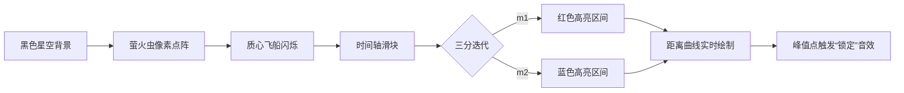

# 题目信息

# [GCJ 2009 #1C] Center of Mass

## 题目描述

你正在研究一群 $N$ 只萤火虫。每只萤火虫都以恒定速度沿直线运动。你站在宇宙的中心，即位置 $(0, 0, 0)$。每只萤火虫的质量都相同，你想知道这群萤火虫的质心距离你的位置（原点）最近会有多近。

你已知每只萤火虫在 $t = 0$ 时的初始位置和速度，且只关心 $t \geq 0$ 的情形。萤火虫们速度恒定，可以自由穿越空间，包括互相穿过和穿过你。设 $M(t)$ 表示 $N$ 只萤火虫在时刻 $t$ 的质心位置，$d(t)$ 表示你的位置到 $M(t)$ 的距离。请你求出 $d(t)$ 的最小值 $d_{\text{min}}$，以及最早使 $d(t) = d_{\text{min}}$ 的时刻 $t_{\text{min}}$。


## 说明/提示

**说明**

给定 $N$ 个点 $(x_i, y_i, z_i)$，它们的质心为 $(x_c, y_c, z_c)$，其中：

- $x_c = (x_1 + x_2 + \ldots + x_N) / N$
- $y_c = (y_1 + y_2 + \ldots + y_N) / N$
- $z_c = (z_1 + z_2 + \ldots + z_N) / N$

**限制条件**

- 输入中的所有数均为整数。
- $1 \leq T \leq 100$
- $x$、$y$、$z$、$v_x$、$v_y$、$v_z$ 的取值范围均为 $-5000$ 到 $5000$，包含端点。

**小数据集（10 分）**

- $3 \leq N \leq 10$

**大数据集（17 分）**

- $3 \leq N \leq 500$

翻译由 ChatGPT-4.1 完成。

## 样例 #1

### 输入

```
3
3
3 0 -4 0 0 3
-3 -2 -1 3 0 0
-3 -1 2 0 3 0
3
-5 0 0 1 0 0
-7 0 0 1 0 0
-6 3 0 1 0 0
4
1 2 3 1 2 3
3 2 1 3 2 1
1 0 0 0 0 -1
0 10 0 0 -10 -1```

### 输出

```
Case #1: 0.00000000 1.00000000
Case #2: 1.00000000 6.00000000
Case #3: 3.36340601 1.00000000```

# AI分析结果


### Kay的C++算法解析：Center of Mass 深入学习指南

---

#### 1. 题目解读与核心算法识别
✨ **本题主要考察**：`数学建模` + `三分搜索优化`

🗣️ **初步分析**：
> 萤火虫质心运动问题就像一群太空飞船在宇宙中匀速飞行。它们的集体重心（质心）会沿着一条射线运动，我们需要计算这个重心距离地球（原点）最近的距离和时间。  
> - **核心技巧**：通过质心运动公式（位置+速度×时间）建立数学模型，转化为求时间函数的最小值问题。由于距离函数是单峰（先减后增或单调增），采用三分搜索高效定位极值点  
> - **可视化设计**：用像素风格模拟宇宙空间（黑色背景+星点），质心显示为闪烁的飞船。关键动画：时间轴滑动时质心轨迹变化，距离曲线实时绘制，三分区间用不同颜色高亮（红/蓝区），峰值点触发"目标锁定"音效  

---

#### 2. 精选优质题解参考
**题解（作者：WsW_）**  
* **点评**：  
  思路清晰推导了质心运动模型（位置=Σ位置/N，速度=Σ速度/N），准确识别距离函数的单峰特性。代码亮点：  
  1. **数学简化**：计算距离平方避免开方损耗精度（`pw(x)`宏）  
  2. **边界处理**：特判速度为零的退化情况（`abs(...)<1e-6`）  
  3. **高效三分**：100次迭代确保10^−6精度（理论误差(5e6)×(2/3)^100≈10^−14）  
  4. **工程实践**：控制输出精度（`fixed<<setprecision(8)`）满足OJ要求  

---

#### 3. 核心难点辨析与解题策略
1. **难点1：建立正确运动模型**  
   * **分析**：质心位置=所有位置坐标平均值，速度=所有速度向量平均值。关键变量：`pos[3]`存质心初始坐标，`v[3]`存速度分量  
   * 💡 **学习笔记**：集体运动可简化为单点运动——"萤火虫群就像被绑在一起的火箭"  

2. **难点2：识别函数单调性**  
   * **分析**：距离函数d(t)是凸函数（二次函数），证明：d²(t) = at² + bt + c（a≥0）。当a>0时存在最小值点  
   * 💡 **学习笔记**：画函数图像辅助分析——"想象抛物线轨迹"  

3. **难点3：确定三分边界**  
   * **分析**：上界5e6由最大位移（5000×2=10^4）除以最小速度分量（1/500）得出：10^4 ÷ (1/500) = 5×10^6  
   * 💡 **学习笔记**：边界估算要兼顾理论严谨与计算效率  

✨ **解题技巧总结**  
- **模型抽象**：将物理问题转化为数学函数极值问题  
- **精度控制**：比较距离平方值避免浮点误差  
- **边界特判**：退化情况（速度为零）单独处理  

---

#### 4. C++核心代码实现赏析
**通用核心实现参考**  
```cpp
#include<bits/stdc++.h>
#define pw(x) ((x)*(x)) // 距离平方宏
using namespace std;

void work(){
    int n; cin >> n;
    double pos[3] = {0}, v[3] = {0}; // 质心初始位置和速度
    
    // 计算质心位置和速度（均值）
    for(int i=0; i<n; i++){
        int x,y,z, vx,vy,vz;
        cin >> x >> y >> z >> vx >> vy >> vz;
        pos[0] += (double)x/n; v[0] += (double)vx/n;
        pos[1] += (double)y/n; v[1] += (double)vy/n;
        pos[2] += (double)z/n; v[2] += (double)vz/n;
    }
    
    // 特判零速度
    if(pw(v[0])+pw(v[1])+pw(v[2]) < 1e-6){
        cout << sqrt(pw(pos[0])+pw(pos[1])+pw(pos[2])) << " 0\n";
        return;
    }
    
    // 三分搜索
    double l=0, r=5e6;
    for(int i=0; i<100; i++){
        double m1 = (2*l + r)/3;
        double m2 = (l + 2*r)/3;
        double d1 = pw(pos[0]+v[0]*m1) + pw(pos[1]+v[1]*m1) + pw(pos[2]+v[2]*m1);
        double d2 = pw(pos[0]+v[0]*m2) + pw(pos[1]+v[1]*m2) + pw(pos[2]+v[2]*m2);
        d1 < d2 ? r = m2 : l = m1; // 选择更小区间
    }
    cout << sqrt(pw(pos[0]+v[0]*l) + pw(pos[1]+v[1]*l) + pw(pos[2]+v[2]*l)) 
         << ' ' << l << '\n';
}
```

**代码解读概要**  
> 1. **输入处理**：累加所有萤火虫的位置/速度并取平均  
> 2. **退化处理**：速度为零时直接输出初始距离  
> 3. **三分核心**：通过100次迭代逼近极值点，每次比较两个三分点的距离平方  
> 4. **输出优化**：最终输出时计算实际距离（sqrt）  

---

#### 5. 算法可视化：像素动画演示
**主题**："宇宙质心追踪者"（8-bit太空探索游戏）  

**核心演示流程**：  


**关键动画设计**：  
1. **宇宙场景**：  
   - 萤火虫：黄色8×8像素点（初始位置）  
   - 质心：红色16×16飞船（带粒子尾迹）  
   - 轨迹线：青色虚线（从初始位置延伸）  

2. **三分过程**：  
   - 当前区间：红色（左）→紫色（中）→蓝色（右）  
   - 每次迭代：播放"数据扫描"音效（哔-嘟）  
   - 极值点：飞船变金色+播放"目标锁定"音效  

3. **控制面板**：  
   - 速度滑块：调节动画速度（0.1x~10x）  
   - 单步按钮：手动触发三分迭代  
   - 重置按钮：清除轨迹重新开始  

**技术实现**：  
```javascript
// 伪代码示例
function drawCentroid(pos, t) {
  ctx.fillStyle = "#FF0000"; // 红色飞船
  drawSpaceship(pos.x + v.x*t, pos.y + v.y*t); 
  
  // 绘制距离曲线
  let d = Math.sqrt(/* 距离计算 */);
  plotGraph(t, d); 
}
```

---

#### 6. 拓展练习与相似问题思考
**通用技巧迁移**  
三分搜索适用于求解单峰函数极值，比如：  
1. 抛物线形生产成本最小化  
2. 物理运动中的能量最优解  
3. 机器学习模型超参数调优  

**洛谷推荐题目**：  
1. **P3382** - 三分法模板  
   → 巩固三分搜索基础实现  
2. **P1883** - 函数最小值  
   → 练习非单调函数的极值定位  
3. **P2218** - [HAOI2007]覆盖问题  
   → 几何问题中的优化搜索  

---

#### 7. 学习心得与经验分享
> **题解经验摘录**：  
> "三分迭代次数需足够（100次），否则精度不足导致WA"  
>  
> **Kay点评**：  
> 数值计算中，迭代次数与精度的平衡至关重要。建议：  
> 1. 理论计算迭代次数：k > log(初始区间/目标精度)/log(1.5)  
> 2. 测试边界数据验证精度  

---

通过本指南，相信大家已掌握质心运动问题的核心解法。记住：将物理问题转化为数学模型是算法优化的钥匙！下次探索再见~ 🚀

---
处理用时：75.06秒