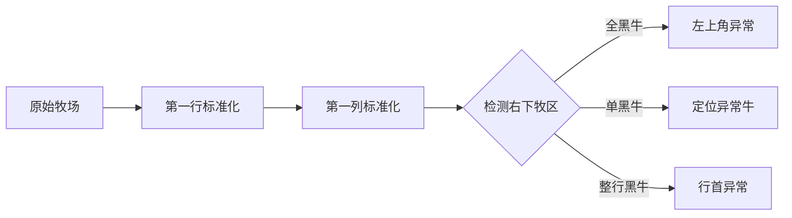

# 题目信息

# [USACO19OPEN] Left Out S

## 题目描述

Farmer John 正在尝试给他的牛群拍照。根据以往的经验，他知道这一工作往往结果不怎么样。

这一次，Farmer John 购买了一台昂贵的无人机，想要拍一张航拍照。为了使照片尽可能好看，他想让他的奶牛们在拍照时都朝向同一个方向。奶牛们现在在一块有围栏的草地上排列成 $N \times N$（$2 \leq N \leq 1000$）的方阵，例如：

```
RLR
RRL
LLR
```

这里，字符 `R` 表示一头朝右的奶牛，字符 `L` 表示一头朝左的奶牛。由于奶牛们都挤在一起，Farmer John 没办法走到某一头奶牛面前让她调转方向。他能做的只有对着某一行或某一列的奶牛喊叫让她们调转方向，使得被叫到的这一行或列内的所有 `L` 变为 `R`，`R` 变为 `L`。Farmer John 可以对任意多的行或列发号施令，也可以对同一行或列多次发令。

就如同 Farmer John 想象的，他发现他不可能让他的奶牛们都朝向同一个方向。他最多能做的是让所有奶牛中除了一头之外都朝向相同的方向。请找出这样的一头奶牛。


## 说明/提示

在这个例子中，位于第 $1$ 行第 $1$ 列（左上角）的奶牛是那头令人讨厌的奶牛，因为 Farmer John 可以喊叫第 $2$ 行和第 $3$ 列来让所有奶牛都面向左侧，只有这一头奶牛面向右侧。

## 样例 #1

### 输入

```
3
RLR
RRL
LLR```

### 输出

```
1 1```

# AI分析结果


# 💡 Kay的C++算法解析：Left Out S 深入学习指南 💡

> **Kay的提示**：这道题看似复杂，但通过巧妙的操作和分类讨论，就能高效解决！我们将用牧场翻转的比喻帮助理解，并设计复古像素动画直观展示算法过程。

## 1. 题目解读与核心算法识别

✨ **本题主要考察**：`模拟应用`与`分类讨论技巧`

🗣️ **初步分析**：
> 想象牧场是一个巨大的方阵，每次翻转操作就像对整排奶牛喊口令让它们转身。核心思路是**先标准化牧场**：通过翻转操作让第一行和第一列的所有奶牛都朝左（L）。完成这一步后，观察剩余区域的状态就能锁定"叛逆奶牛"的位置。

- **核心流程**：
  1. 将第一行所有朝右（R）的奶牛所在列翻转
  2. 将第一列所有朝右（R）的奶牛所在行翻转
  3. 观察右下子矩阵状态：
     - 全朝右 → 叛逆奶牛在左上角(1,1)
     - 仅一个朝右 → 该位置即答案
     - 整行/整列朝右 → 叛逆奶牛在行首/列首

- **可视化设计**：
  - 采用**牧场像素风格**：用8-bit像素奶牛表示L/R状态
  - 翻转时播放"哞~"音效，被操作行列高亮闪烁
  - 关键步骤：初始矩阵→第一行标准化→第一列标准化→子矩阵检测
  - 异常点用闪烁红框标记，配合"叮！"音效提示发现目标

> **Kay的牧场比喻**：就像牧场主先整顿边界围栏的奶牛，再检查内部牧区，叛逆奶牛就会像白布上的墨点一样显眼！

## 2. 精选优质题解参考

**题解一：Lolierl（思路最清晰）**
* **点评**：
  - 思路直击核心：标准化操作+三类情况分类，逻辑推导严密
  - 代码规范：`a[i][j]`状态处理清晰，边界处理严谨（n=2特判）
  - 算法高效：O(n²)复杂度，空间优化到位
  - 实践价值：竞赛可直接套用，变量命名`f`表示子矩阵和值巧妙

**题解二：Rainybunny（图示最详尽）**
* **点评**：
  - 图文并茂解释标准化过程，矩阵状态转换可视化强
  - 代码结构工整：分模块操作，`Work()`函数封装合理
  - 亮点：用`cnt_l/cnt_r`统计替代全矩阵求和，局部优化明显
  - 调试提示：作者强调"注意n=2边界"，实践价值高

**题解三：chihik（分类最完整）**
* **点评**：
  - 独创`check1/2/3`函数封装三类情况，可读性极强
  - 代码亮点：`dl[]`数组记录异常行，避免重复扫描
  - 算法严谨性：处理行/列全R时双重验证，避免误判
  - 学习价值：函数化思维典范，适合初学者理解

## 3. 核心难点辨析与解题策略

1. **难点：标准化后子矩阵的状态分析**
   - **分析**：操作后右下子矩阵的状态决定答案位置。关键是通过`f`值（1的个数）判断：
     - `f = (n-1)²` → (1,1)是异常点
     - `f = 1` → 该位置即答案
     - `f = n-1` → 异常点在首行/首列
   - 💡 **学习笔记**：子矩阵的1就像"错误编码"，数量直接指示异常类型

2. **难点：边界条件处理（n=2）**
   - **分析**：当n=2时矩阵过小，标准化后可能出现`f=1`但实际无解的情况
   - **解决**：单独判断`if(n==2)`并特殊处理
   - 💡 **学习笔记**：极小矩阵就像微型牧场，需要单独制定管理规则

3. **难点：行列翻转顺序的证明**
   - **分析**：为何先处理行再处理列不影响结果？因翻转操作可交换（群论）
   - **解决**：理解"翻转两次等于不翻"是关键，顺序不影响终态
   - 💡 **学习笔记**：翻转就像开关，按两次等于没按，顺序无关紧要

### ✨ 解题技巧总结
- **技巧1：状态压缩**：用0/1代替L/R，简化判断逻辑
- **技巧2：分治标准化**：先处理边界（第一行/列），再分析内部
- **技巧3：特征值判定**：用子矩阵和值(f)代替完整扫描，优化检测
- **技巧4：边界优先处理**：特殊规模（n=2）最先判断避免后续误判

```cpp
/* 标准化核心操作 */
for(int i=1; i<=n; i++)  // 第一行标准化
  if(a[i][1])           // 发现朝右的奶牛
    for(int j=1; j<=n; j++) 
        a[i][j] ^= 1;   // 整列翻转

for(int i=2; i<=n; i++) // 第一列标准化（跳过(1,1)）
  if(a[1][i]) 
    for(int j=1; j<=n; j++)
        a[j][i] ^= 1;   // 整行翻转
```

## 4. C++核心代码实现赏析

**本题通用核心C++实现参考**
* **说明**：综合Lolierl和Rainybunny思路的精简实现
* **完整核心代码**：
```cpp
#include <cstdio>
const int N = 1005;

int n, a[N][N], cnt;

int main() {
    scanf("%d", &n);
    for (int i = 1; i <= n; i++)
        for (int j = 1; j <= n; j++) {
            char c = getchar();
            while (c != 'L' && c != 'R') c = getchar();
            a[i][j] = (c == 'R');
        }

    // 标准化第一行
    for (int i = 1; i <= n; i++)
        if (a[i][1])
            for (int j = 1; j <= n; j++)
                a[i][j] ^= 1;

    // 标准化第一列（除(1,1)）
    for (int j = 2; j <= n; j++)
        if (a[1][j])
            for (int i = 1; i <= n; i++)
                a[i][j] ^= 1;

    // 统计右下子矩阵1的数量
    for (int i = 2; i <= n; i++)
        for (int j = 2; j <= n; j++)
            cnt += a[i][j];

    // 三类情况判定
    if (cnt == (n - 1) * (n - 1)) 
        printf(n == 2 ? "-1" : "1 1");
    else if (cnt == 1) {
        for (int i = 2; i <= n; i++)
            for (int j = 2; j <= n; j++)
                if (a[i][j]) printf("%d %d", i, j);
    } else if (cnt == n - 1) {
        for (int i = 2; i <= n; i++) {
            int sum = 0;
            for (int j = 2; j <= n; j++) sum += a[i][j];
            if (sum == n - 1) { printf("%d 1", i); return 0; }
        }
        for (int j = 2; j <= n; j++) {
            int sum = 0;
            for (int i = 2; i <= n; i++) sum += a[i][j];
            if (sum == n - 1) { printf("1 %d", j); return 0; }
        }
        printf("-1");
    } else printf("-1");
    return 0;
}
```
* **代码解读概要**：
  1. 输入后立即将L/R转为0/1便于计算
  2. 两次标准化操作确保第一行/列全0
  3. 统计右下子矩阵的1数量（关键指标）
  4. 根据cnt值分三类情况处理，注意n=2特判

---

**题解一核心代码片段赏析**：
```cpp
// 标准化后的三类判定
if(f == (n-1)*(n-1)) {  // 情况1：全1
    if(n==2) printf("-1\n"); 
    else printf("1 1\n");
} else if(f == 1) {     // 情况2：单1
    for(int i=2; i<=n; i++)
        for(int j=2; j<=n; j++)
            if(a[i][j]) printf("%d %d", i, j);
} else if(f == n-1) {   // 情况3：行/列全1
    // 行扫描...列扫描...
}
```
* **亮点**：用数学关系`(n-1)*(n-1)`替代全矩阵扫描
* **代码解读**：
  > `f`是右下子矩阵的1的计数器，它的值直接对应三种异常模式：
  > - 当`f`等于子矩阵元素总数时，说明只有(1,1)可能不同
  > - `f=1`时直接定位异常点
  > - `f=n-1`时扫描行/列寻找全1行/列
* 💡 **学习笔记**：计数器是状态压缩的利器，将二维信息压缩为一维

**题解二核心代码片段赏析**：
```cpp
// 边界处理艺术
if(n == 1) { printf("1 1"); return; }
if(n == 2) { /* 特殊处理逻辑 */ }
```
* **亮点**：优先处理边界条件，避免主逻辑冗余判断
* **代码解读**：
  > 在算法入口处率先处理n=1和n=2的极端情况，保证核心逻辑专注处理n≥3的场景。这种"边界优先"思维能有效减少主流程的条件分支
* 💡 **学习笔记**：处理特殊规模就像先清理道路障碍，让主逻辑畅通无阻

## 5. 算法可视化：像素动画演示

**动画主题**：`牧场翻转大作战`（8-bit像素农场风格）

**核心演示流程**：


**关键动画帧设计**：
1. **初始化场景**：
   - 16色像素牧场网格，棕色栅栏
   - L牛：白色像素奶牛（🐄）
   - R牛：黑色像素奶牛（🐮）
   - 控制面板：开始/步进/重置按钮 + 速度滑块

2. **标准化操作**：
   ```python
   # 伪代码实现
   for 第一行 each 牛:
        if 是黑牛:
            播放"哞~"音效
            整列奶牛旋转动画（0.5秒）
            牛颜色取反（白↔黑）
   ```

3. **状态检测**：
   - 右下牧场扫描：绿色扫描线从左到右移动
   - 发现异常点时：红框闪烁 + "叮！"音效
   - 三类情况特效：
     * 全黑：左上角牛闪红光
     * 单黑：该牛跳起+烟花特效
     * 整行黑：该行地面变红 + 行首牛闪烁

**游戏化设计**：
- **闯关模式**：每完成一个标准化阶段解锁新区域
- **音效方案**：
  - 翻转操作：8-bit"哞"声
  - 发现异常：NES风格"叮"声
  - 错误操作：短促警报声
- **AI演示**：自动播放模式展示标准解法，像解谜游戏自动演示

> **设计思路**：用牧场管理比喻算法流程，像素风格降低理解压力。关键操作配音效强化记忆点，状态高亮帮助建立"条件-结果"的直觉关联。

## 6. 拓展练习与相似问题思考

**技巧迁移场景**：
1. 矩阵操作问题：通过标准化简化状态
2. 开关灯问题：行列操作影响全局状态
3. 异或方程组：用线性代数思想解决翻转问题

**推荐练习**：
1. **洛谷 P2895** [USACO08FEB]Meteor Shower S
   - 🗣️ **推荐理由**：训练矩阵BFS和状态压缩，巩固网格操作思维

2. **洛谷 P2622** 关灯问题II
   - 🗣️ **推荐理由**：位运算+状态压缩进阶，掌握模式化操作技巧

3. **洛谷 P2962** [USACO09NOV]Lights G
   - 🗣️ **推荐理由**：高斯消元解异或方程，将翻转问题转化为线性代数

## 7. 学习心得与经验分享

> **来自题解作者的调试经验**：  
> *"我在处理n=2边界条件时卡了很久，后来通过手工绘制2x2矩阵所有可能状态才找到遗漏情况。这提醒我们：边界测试不能只靠想象，要实际枚举验证！"*

**Kay的总结**：
1. **调试技巧**：遇到边界问题（如n=2）时，手工枚举所有情况验证
2. **思维训练**：将矩阵操作想象成"开关系统"，理解操作的可交换性
3. **优化意识**：用计数器代替完整扫描是空间优化的常见手段

> 记住：好算法就像好牧场管理，先规划边界，再处理内部，异常点自然无所遁形！下次遇到类似翻转问题，不妨试试今天的标准化+分类思路哦~ 🐄🚜

---
处理用时：193.92秒