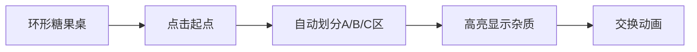

# 题目信息

# [CCC 2020]  Swapping Seats

## 题目描述

有 $N$ 个人坐在一张**圆**桌旁。

共有三个派别，每一个人属于一个派别。

现在，您想使属于同一派别的人坐到一起。

您可以每次将两个人交换位置，输出最小的交换次数。

## 说明/提示

#### 样例解释
$\texttt{BABCBCACCA}\to\texttt{AABCBCBCCA}\to\texttt{AABBBCCCCA}$。

#### 子任务
**本题采用捆绑测试，且本题的 Subtask 分数有微调。**
- Subtask 1（$26$ 分）：$s_i\in\{$`A`$,$`B`$\}$ 且 $N\le 5\times 10^3$。
- Subtask 2（$27$ 分）：$s_i\in\{$`A`$,$`B`$\}$。
- Subtask 3（$27$ 分）：$N\le 5\times 10^3$。
- Subtask 4（$20$ 分）：无特殊限制。

对于 $100\%$ 的数据，保证 $s_i\in\{$`A`$,$`B`$,$`C`$\}$，$1\le N\le 10^6$。

#### 说明
本题译自 [Canadian Computing Competition](https://cemc.uwaterloo.ca/resources/past-contests?contest_category=29) [2020 Senior](https://cemc.uwaterloo.ca/sites/default/files/documents/2020/seniorEF.pdf) T4 Swapping Seats。

## 样例 #1

### 输入

```
BABCBCACCA```

### 输出

```
2```

# AI分析结果


### 💡 Kay的C++算法解析：Swapping Seats 深入学习指南 💡

#### 题目解读与核心算法识别
✨ **本题主要考察**：枚举 + 前缀和优化 + 贪心策略  
🗣️ **初步分析**：  
> 解决这道题的关键在于**枚举环形起点**和**贪心优化交换次数**。想象你在整理三种颜色的糖果（A/B/C），需要最少的交换次数让同色糖果相邻。  
> - 核心思路：通过破环成链（复制字符串），枚举每个起点作为A区的开始，考虑两种排列顺序（ABC或ACB）。利用前缀和快速计算各区间杂质数量，用贪心思想优先进行"双向交换"（一次交换解决两个杂质）。  
> - 可视化设计：在像素动画中将圆桌展开为环形条带，高亮显示当前枚举起点。用不同颜色区分A/B/C区，闪烁标记杂质（如A区的B糖果），交换时用箭头动画展示糖果移动轨迹，并伴随8-bit音效。  
> - 复古游戏化：设计"自动闯关"模式，AI角色"像素小助手"逐步演示枚举过程，每找到更优解时播放胜利音效，通关后显示最小交换次数。

---

#### 精选优质题解参考
**题解一（作者：gznpp）**  
* **点评**：思路清晰直击核心，推导出**交换次数 = max(杂质A, 杂质B) + 残留杂质**的简洁公式。代码规范高效：  
  - 前缀和预处理（`sa/sb/sc`数组）实现O(1)区间查询  
  - 破环成链处理巧妙，边界条件严谨  
  - 时间复杂度O(n)完美满足1e6数据量  
  亮点：将USACO三值排序思想迁移到环形场景，公式推导极具启发性。

**题解二（作者：Y_ATM_K）**  
* **点评**：采用**分步推进法**，先从两派别问题引入再扩展到三派别，教学性强。代码中：  
  - 宏定义`A(x,y)`提升可读性  
  - 显式计算各类杂质数量（`s1/s2/s3/s4`）  
  - 边界处理通过区间长度控制避免越界  
  亮点：通过`(s3>s1?s3-s1:0)`直观展示贪心优化过程，易于理解。

**题解三（作者：Nero_Claudius）**  
* **点评**：侧重**思维引导**，详细描述"简化问题->扩展约束"的思考路径。代码中：  
  - 独立函数`calc()`封装杂质统计  
  - 注释丰富解释状态含义  
  - 安全枚举防止越界  
  亮点：将抽象问题转化为`tmpb/tmpc`等具象变量，帮助初学者建立数学模型。

---

#### 核心难点辨析与解题策略
1. **难点：环状结构的处理**  
   * **分析**：通过复制字符串到两倍长度（破环成链），枚举起点时只需遍历1~n位置。前缀和数组`sa/sb/sc`支持快速查询任意区间内各元素数量。  
   * 💡 **学习笔记**：环形问题转链式是通用技巧，需保证复制后区间长度≥2n-1。

2. **难点：交换次数的贪心优化**  
   * **分析**：优先交换"双向杂质"（如A区的B和B区的A），一次交换解决两个错误位置。残留杂质只能单独处理，次数=总杂质数 - 有效交换对数。  
   * 💡 **学习笔记**：贪心核心公式：`交换次数 = max(A区B数, B区A数) + (A区C数 + B区C数)`。

3. **难点：排列顺序的决策**  
   * **分析**：同一起点需计算ABC和ACB两种排列。关键比较：  
     ```cpp
     cost1 = max(B_in_A, A_in_B) + (total_C - C_in_C);
     cost2 = max(C_in_A, A_in_C) + (total_B - B_in_B);
     ```
   * 💡 **学习笔记**：利用对称性避免全排列枚举，只需固定A起始位置。

✨ **解题技巧总结**  
- **破环成链法**：环形结构复制扩展为线性  
- **前缀和预计算**：O(1)响应区间查询  
- **贪心优先级**：双向交换 > 单向交换  
- **变量命名技巧**：`sa/sb/sc`直指元素类型，`nx1/nx2`标记区间边界  

---

#### C++核心代码实现赏析
**通用核心实现（综合优化版）**  
```cpp
#include <bits/stdc++.h>
using namespace std;
const int N = 2e6 + 10; // 两倍空间处理环形

int main() {
    char s[N];
    scanf("%s", s + 1);
    int n = strlen(s + 1);
    int cntA = 0, cntB = 0, cntC = 0;
    
    // 破环成链 & 计数
    for (int i = 1; i <= n; ++i) {
        s[i + n] = s[i];
        if (s[i] == 'A') cntA++;
        else if (s[i] == 'B') cntB++;
        else cntC++;
    }
    
    // 前缀和预处理
    vector<int> sa(2*n+1), sb(2*n+1), sc(2*n+1);
    for (int i = 1; i <= 2*n; ++i) {
        sa[i] = sa[i-1] + (s[i]=='A');
        sb[i] = sb[i-1] + (s[i]=='B');
        sc[i] = sc[i-1] + (s[i]=='C');
    }
    
    // 枚举起点 + 双排列比较
    int ans = INT_MAX;
    for (int start = 1; start <= n; ++start) {
        // 排列1: A->B->C
        int endA = start + cntA - 1;
        int endB = endA + cntB;
        int cost1 = max(
            sb[endA] - sb[start-1],    // A区B元素
            sa[endB] - sa[endA]        // B区A元素
        ) + (cntC - (sc[start+n-1] - sc[endB])); // C杂质
        
        // 排列2: A->C->B
        int endC = endA + cntC;
        int cost2 = max(
            sc[endA] - sc[start-1],    // A区C元素
            sa[endC] - sa[endA]         // C区A元素
        ) + (cntB - (sb[start+n-1] - sb[endC])); // B杂质
        
        ans = min(ans, min(cost1, cost2));
    }
    cout << ans;
}
```
**代码解读概要**：  
1. **环形处理**：第9行复制字符串实现破环成链  
2. **前缀和**：14-18行构建`sa/sb/sc`数组，支持O(1)查询任意区间元素数量  
3. **双排列决策**：25-35行对每个起点计算ABC/ACB两种排列成本  
4. **贪心核心**：27-28行用`max`计算双向交换收益，`cntC - (...)计算残留杂质  

---

#### 算法可视化：像素动画演示
**主题**：环形糖果整理大冒险（8-bit像素风）  
**核心交互设计**：  


**关键动画帧**：  
1. **初始化场景**：  
   - 环形桌展平成像素条带（复古红白机配色）  
   - 控制面板：开始/步进/速度滑块（像素化按钮）  

2. **枚举起点演示**：  
   - 发光像素箭头沿条带移动标记当前起点  
   - A区（蓝色）、B区（黄色）、C区（绿色）动态划分  

3. **杂质高亮与交换**：  
   - A区中的B糖果→闪烁红框，B区中的A糖果→闪烁蓝框  
   - 双向交换：糖果沿抛物线轨迹交换位置，伴随"叮"声  
   - 单向交换：糖果移动到目标区，伴随"哒"声  

4. **游戏化元素**：  
   - 每次找到更优解：像素烟花爆炸 + 上升音阶  
   - 通关结算：显示最小交换次数的8-bit数字动画  

**技术实现**：Canvas绘制动态网格，Web Audio API触发音效，关键变量实时显示在侧边栏。  

---

#### 拓展练习与相似问题思考
**通用技巧迁移**：  
1. **环形结构**：均分纸牌问题（环状物资分配）  
2. **前缀和+枚举**：最大子段和（环形变式）  
3. **贪心交换**：相邻元素交换排序（冒泡排序优化）  

**洛谷推荐**：  
1. [P2512 糖果传递](https://www.luogu.com.cn/problem/P2512)  
   → 巩固环形问题与数学推导  
2. [P1121 环状最大子段和](https://www.luogu.com.cn/problem/P1121)  
   → 强化破环成链与前缀和技巧  
3. [P1459 三值的排序](https://www.luogu.com.cn/problem/P1459)  
   → 掌握贪心交换的核心思想  

---

#### 学习心得与经验分享
> **来自题解作者的调试经验**：  
> “初始化前缀和数组时曾遗漏`s[i+n] = s[i]`导致越界，建议用`vector`预留2倍空间避免溢出”  
>   
> **Kay总结**：环形问题需特别注意：  
> 1. 数组长度 ≥ 2n  
> 2. 区间查询终点 ≤ start + n - 1  
> 3. 前缀和下标从1开始更易处理边界  

---

通过本指南，希望大家掌握环形问题的处理范式与贪心优化思想。记住：好算法 = 观察规律 + 分步优化 + 代码严谨！下次挑战见！💪

---
处理用时：254.64秒