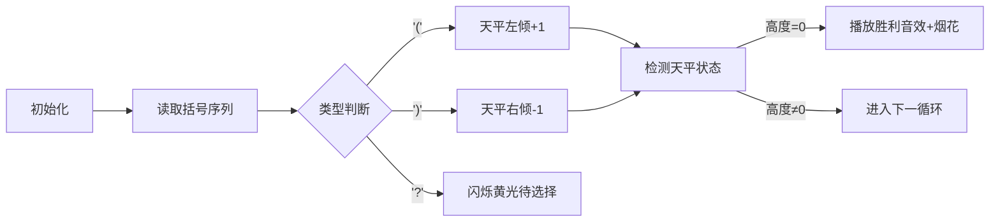

# 题目信息

# 「Wdsr-3」永远与须臾的走廊

## 题目背景

永远亭是迷途森林里的不可思议的屋子。

为了躲避月之使者的到来，也是为了防御，永远亭内被布下了一条无尽的长廊。困在其中的对手无法触及到真实，陷入到永远与须臾的陷阱里去。

不过，无尽的长廊 $S$ 毕竟只是单一有限走廊 $S_0$ 的无限循环，其本质是永远亭的主人蓬莱山辉夜及八意永琳设下的圈套。正因该长廊是通过辉夜的能力实现的，因此辉夜可以通过修改该「有限长的」走廊 $S_0$，进而作用于「无限长的」长廊 $S$。这意味着有限的修改可以创造出无限的变动。

光秃秃的长廊显得单调，也难以起到掩人耳目的目的。辉夜决定在长廊上绘制象征着月初的「上弦月」和象征着月末的「下弦月」，以达到图案交错重叠的目的。为了方便起见，「上弦月」可以被近似认为是左括号，而「下弦月」可以被近似认为是右括号。作为优雅的月之都的公主，当然会有不少条条框框——轮到你帮助辉夜满足她的要求了。

## 题目描述

辉夜希望创造一个无限长的括号序列 $S$ 作为永远亭长廊的绘制图案，它由一个长度为 $n$ 的括号序列 $S_0$ 不断重复而成。

我们称一个括号序列 $T$ 是合法的，当且仅当它可以由以下方式生成：

- $\verb!()!$ 是一个合法的括号序列。  
- 如果 $A$ 是合法括号序列，那么 $\verb!(!A\verb!)!$ 同样是一个合法括号序列。  
- 如果 $A,B$ 都是合法括号序列，那么 $AB$（即 $A,B$ 拼接）同样是一个合法括号序列。

例如，$\verb!(()())!,\verb!()()!,\verb!((()())())!$ 都是合法括号序列；而 $\verb!)(!,\verb!(()!,\verb!())(()!$ 均不是合法括号序列。

现在辉夜已经确定了 $S_0$ 当中一部分的符号。你需要求出，「在剩下来的单元上绘制括号，使得这条无限长的长廊上可以找到**无限长的**合法括号序列」的方案数。两种方案不同仅当两种方案中有至少一个位置的 `?` 被替换成了不同的字符。输出它对 $998,244,353$（一个大质数）取模后的结果。

## 说明/提示

#### 样例 1 解释

符合条件的方案共有三种：$\verb!(())!$、$\verb!()()!$ 和 $\verb!())(!$。

- 第一种方案，$\overbrace{\text{\tt\textcolor{red}{(())}\textcolor{blue}{(())}\texttt{...}\textcolor{red}{(())}\textcolor{blue}{(())}}}^{\text{无穷个}}$ 可以找到无限长的合法括号序列。
- 第二种方案，$\overbrace{\text{\tt\textcolor{red}{()()}\textcolor{blue}{()()}\texttt{...}\textcolor{red}{()()}\textcolor{blue}{()()}}}^{\text{无穷个}}$ 同样可以找到无限长的合法括号序列。
- 第三种方案，$\text{\tt\textcolor{red}{())}}\overbrace{\text{\tt\textcolor{red}{(}\textcolor{blue}{())(}\texttt{...}\textcolor{red}{())(}\textcolor{blue}{())}}}^{\text{无穷个}}\text{\tt\textcolor{blue}{(}}$ 仍然可以找到无穷长的括号序列。

可以证明，不存在其他方案。

#### 数据范围及约定

$$
\def{\arraystretch}{1.5}
\begin{array}{|c|c|c|c|}\hline
\textbf{Subtask} & \bm{n\le } & \textbf{特殊性质} & \textbf{分值} \cr\hline
1 & 20 & - & 20 \cr\hline
2 & 10^5 & \text{A} & 10 \cr\hline
3 & 10^5 & \text{B} & 10 \cr\hline
4 & 10^5 & - & 60 \cr\hline
\end{array}
$$

**特殊性质** $\textbf{A}$：保证字符串里仅出现 $\verb!(!$ 和 $\verb!)!$。  
**特殊性质** $\textbf{B}$：保证字符串里仅出现 $\verb!?!$。

对于全部数据，满足 $1\le n\le 10^5$，且字符串里仅出现 $\verb!(!,\verb!)!,\verb!?!$ 三种字符。

## 样例 #1

### 输入

```
4
(???
```

### 输出

```
3```

## 样例 #2

### 输入

```
8
(???))??```

### 输出

```
10```

# AI分析结果


### 💡 Kay的C++算法解析：「永远与须臾的走廊」深入学习指南 💡

#### 引言
今天我们来分析「永远与须臾的走廊」这道C++编程题。本指南将帮助大家理解无限括号序列的本质，掌握组合数学的计数技巧，并通过像素动画直观感受括号序列的构造过程。

---

## 1. 题目解读与核心算法识别

✨ **本题主要考察**：`组合数学` + `编程技巧应用`

🗣️ **初步分析**：
> 解决这道题的关键在于理解**括号序列的平衡性**。想象括号序列像一架天平：左括号`(`是+1砝码，右括号`)`是-1砝码。要使天平在无限循环中保持平衡（形成合法序列），左右砝码数量必须绝对相等。  
> - **核心思路**：统计已有左/右括号数，在问号处填充括号使两者相等
> - **数学本质**：转化为组合问题——从问号中选k个填左括号，其余填右括号
> - **可视化设计**：我们将用像素天平展示括号序列的平衡过程。左括号(↑)、右括号(↓)会改变天平高度，当高度曲线回归起点时播放胜利音效

---

## 2. 精选优质题解参考

**题解一（作者：囧仙）**
* **点评**：此题解以折线图类比括号序列，直观展示了平衡性的核心原理。代码采用预处理阶乘+逆元优化组合数计算，时间复杂度O(n)。亮点在于用`memo`数组避免重复计算，边界处理严谨（直接特判奇数长度），是竞赛标准实现。

**题解二（作者：2huk）**
* **点评**：通过严谨的充分必要性证明确立核心结论，逻辑清晰。代码模块化出色：分离组合数计算(`C`函数)和主逻辑，使用命名空间封装工具函数，可读性强。特别适合学习代码组织技巧。

**题解三（作者：bmatrix）**
* **点评**：用栈的比喻解释合法性检查（"右括号需要左边有未配对的左括号"），教学性强。虽未提供完整代码，但解题思路描述清晰，强调无限循环特性如何解决局部不匹配问题，具有启发性。

---

## 3. 核心难点辨析与解题策略

1. **难点1：无限序列的特性理解**
   * **分析**：无限重复的序列中，局部不匹配可通过循环移位解决（如`()) (`移位后变`( ()`）。但左右括号总数必须严格相等，否则每轮循环会累积失衡
   * 💡 **学习笔记**：无限循环救不了数量失衡，但能修复局部顺序问题

2. **难点2：组合数取模计算**
   * **分析**：当问号数q较大时，C(q,k)直接计算会溢出。优质题解均采用预处理阶乘+费马小定理求逆元，以O(1)时间计算组合数
   * 💡 **学习笔记**：模质数下的除法→乘逆元，公式：$ \binom{n}{k} = \frac{n!}{k!(n-k)!} \mod p $

3. **难点3：边界条件处理**
   * **分析**：需同时检查：(1)n为奇数(2)已有括号数超过一半(3)问号数不足平衡需求。漏掉任一情况都会导致WA
   * 💡 **学习笔记**：防御性编程——提前特判所有非法情况

### ✨ 解题技巧总结
- **问题转化技巧**：将抽象无限序列问题转化为具体的括号计数问题
- **组合优化技巧**：预处理阶乘和逆元数组，避免重复计算
- **边界防御技巧**：用卫语句(guard clause)集中处理特判
- **模块封装技巧**：将组合数计算封装为独立函数

---

## 4. C++核心代码实现赏析

**本题通用核心C++实现参考**
* **说明**：综合优质题解思路，包含组合数预处理+主逻辑特判
* **完整核心代码**：
```cpp
#include <bits/stdc++.h>
using namespace std;
const int MOD = 998244353;
const int MAXN = 1e5+5;

int fac[MAXN], inv[MAXN];

int qpow(int a, int b) { // 快速幂求逆元
    int res = 1;
    while (b) {
        if (b & 1) res = 1LL * res * a % MOD;
        a = 1LL * a * a % MOD;
        b >>= 1;
    }
    return res;
}

void init(int n) { // 预处理阶乘和逆元
    fac[0] = 1;
    for (int i = 1; i <= n; i++) 
        fac[i] = 1LL * fac[i-1] * i % MOD;
    inv[n] = qpow(fac[n], MOD-2);
    for (int i = n-1; i >= 0; i--)
        inv[i] = 1LL * inv[i+1] * (i+1) % MOD;
}

int C(int n, int k) { // 组合数计算
    if (k < 0 || k > n) return 0;
    return 1LL * fac[n] * inv[k] % MOD * inv[n-k] % MOD;
}

int main() {
    int n; string s;
    cin >> n >> s;
    
    // 特判1: 奇数长度无解
    if (n % 2 != 0) {
        cout << 0;
        return 0;
    }
    
    int l = 0, r = 0, q = 0;
    for (char c : s) {
        if (c == '(') l++;
        else if (c == ')') r++;
        else q++;
    }
    
    // 特判2: 已有括号超过半数
    if (l > n/2 || r > n/2) {
        cout << 0;
        return 0;
    }
    
    init(q); // 预处理组合数
    int need = n/2 - l; // 需补充的左括号数
    cout << C(q, need);
    return 0;
}
```
* **代码解读概要**：
  1. **预处理阶段**：`init()`预计算阶乘和逆元数组，为O(1)组合数查询奠基
  2. **主逻辑**：先双重特判（奇数长度/超额括号），再统计三要素（l/r/q）
  3. **组合计算**：`C(q, need)`直接得出方案数，其中`need = n/2 - l`

---

## 5. 算法可视化：像素动画演示

**动画演示主题**：`像素天平平衡大作战`（8-bit复古风）

**核心演示内容**：用天平升降模拟括号序列，当无限循环后天平回归原点即胜利

**设计思路**：  
> 采用FC红白机像素风格，用天平直观表现括号序列的平衡要求。每帧显示当前循环次数和括号分布，当完成有效循环时触发经典NES胜利音效。

**动画实现细节**：


1. **像素元素设计**：
   - 左括号`(`：红色↑箭头（配上升音效）
   - 右括号`)`：蓝色↓箭头（配下降音效）
   - 问号`?`：闪烁黄色块（选择后分裂为↑/↓）

2. **控制面板**：
   - 步进控制：空格键单步执行
   - 循环速度：滑块调节（1x-10x）
   - 重置按钮：天平归零动画

3. **游戏化机制**：
   - 每完成1轮平衡：+100分，像素烟花庆祝
   - 连续平衡：连击倍率（Combo x2/x3...）
   - 失败场景：天平溢出屏幕时碎裂（玻璃破碎音效）

---

## 6. 拓展练习与相似问题思考

**通用技巧迁移**：  
括号平衡思想还可用于：
1. 栈操作验证（如`P1739 表达式括号匹配`）
2. 前缀和统计（如`P5658 括号树`）
3. 自动机状态转换（如`P3719 正则表达式匹配`）

**洛谷练习推荐**：
1. **P1739 表达式括号匹配**  
   🗣️ *推荐理由*：直接应用括号平衡原理，训练基础栈实现
2. **P5658 括号树**  
   🗣️ *推荐理由*：进阶版括号序列，结合树形DP深化理解
3. **P1245 电话号码**  
   🗣️ *推荐理由*：将括号匹配思想迁移到其他符号配对场景

---

## 7. 学习心得与经验分享

**参考经验（来自多个题解）**：  
> "特判是本题的隐藏考点——漏掉奇数长度检查赛场至少丢20分"  
> "组合数预处理要预计算到最大可能值（q_max=1e5），否则RE"  

**点评**：这些经验突显了竞赛编程的核心法则：  
1. **边界优先**：先写特判再写主逻辑  
2. **预计算**：空间换时间是标准优化手段  
3. **模块测试**：单独验证组合数函数正确性  

---

### 结语
通过本次分析，我们揭开了无限括号序列的神秘面纱——核心竟是如此简洁的平衡法则！记住Kay的八字箴言：**"统计为本，预计算优"**。下次遇到类似计数问题时，不妨先画个像素天平辅助思考哦！(•̀ω•́)✧

---
处理用时：97.13秒