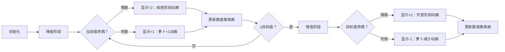

# 题目信息

# [USACO22JAN] Searching for Soulmates S

## 题目描述

Farmer John 的每头奶牛都想找到她们的灵魂伴侣——另一头具有相似特点的奶牛，与她们最大程度地相容。每头奶牛的性格由一个整数 $p_i$（$1 \leq p_i \leq 10^{18}$）描述。两头性格相同的奶牛就是灵魂伴侣。奶牛可以通过「改变操作」，对她的性格乘以 $2$，除以 $2$（当 $p_i$ 是偶数时），或者加上 $1$。

Farmer John 最初以任意方式配对了他的奶牛。他很好奇为使每对奶牛成为灵魂伴侣需要进行多少次改变操作。对于每对奶牛，求配对中的第一头奶牛所必须进行的最小改变操作次数，从而可以与第二头奶牛成为灵魂伴侣。

## 说明/提示

【样例解释】

对于第一个子测试用例，一个最优的操作序列为 $31 \implies 32 \implies 16 \implies 8 \implies 9 \implies 10 \implies 11 \implies 12 \implies 13$。

对于第二个子测试用例，一个最优的操作序列为 $12 \implies 6 \implies 7 \implies 8$.

【数据范围】

- 测试点 1-4 满足 $p_i \le 10^5$。
- 测试点 5-12 没有额外限制。


## 样例 #1

### 输入

```
6
31 13
12 8
25 6
10 24
1 1
997 120```

### 输出

```
8
3
8
3
0
20```

# AI分析结果


### 💡 Kay的C++算法解析：Searching for Soulmates S 深入学习指南 💡

#### 1. 题目解读与核心算法识别
✨ **本题主要考察**：**逆向思维与二进制优化**（编程技巧应用）  
🗣️ **初步分析**：  
> 解决本题的关键在于理解操作的**可逆性**和**二进制特性**。想象你在玩一个复古像素游戏：角色A（初始值）需要通过三种操作（×2、÷2、+1）变成角色B（目标值）。最优策略总是**先通过÷2和+1降低数值**（类似“降级打怪”），再通过×2和+1精确调整（类似“升级装备”）。  
> - **核心难点**：操作顺序的决策（何时除？何时乘？）和超大数值（1e18）的处理  
> - **突破口**：所有操作在二进制下都有直观表现（÷2=右移，×2=左移，+1=末位变1）  
> - **可视化设计**：采用8-bit像素风格，用二进制方块表示数值。除法阶段显示“像素压缩”动画，乘法阶段显示“像素扩展”动画，关键操作时触发“叮”音效（如《塞尔达传说》解谜音效）

---

#### 2. 精选优质题解参考
**题解一（MY）**  
* **点评**：思路如精炼的像素游戏攻略——将操作分为“降阶”（÷2/+1）和“升阶”（×2/+1）两阶段。亮点在于用递归函数`dfs()`优雅处理升阶阶段，时间复杂度O(log²n)完美应对1e18数据。代码中`do-while`循环确保边界处理严谨（修正后通过hack数据），变量名`cnt`/`res`简洁易读，是竞赛标准实现范本。

**题解二（YCSluogu）**  
* **点评**：创意性地从**二进制前缀**切入，将问题转化为“使a匹配b的二进制前缀”。亮点在于`len()`和`get()`函数实现高效位运算，枚举所有前缀的策略如同尝试不同尺寸的“像素拼图”，最后用位扩展完成精确匹配。代码中`nowb`等变量命名体现清晰逻辑链，适合帮助理解二进制本质。

**题解三（sync_with_stdio）**  
* **点评**：采用**双向逼近**策略，先同步调整a和b到相近范围（类似双指针），再精细计算差值。亮点在于发现“当b≥2a时操作可合并”的优化点，代码中`while(p1>=p2)`和`while(b>=a*2)`两个循环形成美妙对称，边界处理完整。

---

#### 3. 核心难点辨析与解题策略
1.  **难点：操作顺序决策**  
    * **分析**：盲目混合三种操作会导致冗余。优质解法的共性是**严格分阶段**：先÷2/+1降值（a>b时），再×2/+1增值。这好比先下楼再上楼，比反复爬楼梯高效。  
    * 💡 **学习笔记**：操作顺序的黄金法则——除法优先于乘法！

2.  **难点：二进制优化**  
    * **分析**：直接处理1e18会超时。题解二/七通过位运算将问题转化为**二进制前缀匹配**，题解一/四用递归将指数级问题压缩为对数级。关键技巧：用`b>>k`获取前缀，用`a<<=1`模拟乘2。  
    * 💡 **学习笔记**：超大数值想位运算，操作次數算对数！

3.  **难点：边界条件处理**  
    * **分析**：a=1或奇数值需特殊处理。题解一用`do-while`替代`while`确保至少执行一次（防死循环），题解三用`if(p1%2)p1++`处理奇数。关键变量：`a&1`判断奇偶，`a>>=1`代替除2。  
    * 💡 **学习笔记**：边界测试三要素——最小值(1)、奇偶性、2的幂！

##### ✨ 解题技巧总结
- **技巧1：分阶段处理**  
  将操作分解为互斥阶段：降值阶段只用÷2/+1，增值阶段只用×2/+1
- **技巧2：逆向思维**  
  a→b的操作可转为b→a的逆操作（÷2→×2，+1→-1），常简化问题
- **技巧3：二进制视角**  
  将数值视为二进制串，操作转化为位移动（÷2=右移）和位翻转（+1=末位变1）

---

#### 4. C++核心代码实现赏析
**通用核心实现参考**  
* **说明**：综合题解一二的精髓，分阶段策略+二进制优化
* **完整核心代码**：
```cpp
#include <iostream>
using namespace std;
typedef long long ll;

ll dfs(ll a, ll b) { // 处理增值阶段（只允许×2/+1）
    if (a > b) return 1e18;
    if (a * 2 > b) return b - a; // 只能加法
    if (b & 1) return dfs(a, b-1) + 1; // 奇数：先减1
    return dfs(a, b/2) + 1; // 偶数：直接折半
}

ll solve(ll a, ll b) {
    if (a == b) return 0;
    ll ans = 1e18, cnt = 0;
    do { // 降值阶段：除2/+1直到a<=b
        ans = min(ans, dfs(a, b) + cnt);
        if (a & 1) a++;
        else a >>= 1; // 等价a/=2
        cnt++;
    } while (a > 1); // 修正：do-while确保至少执行一次
    return ans;
}
```
* **代码解读概要**：  
  > ① `dfs()`递归处理增值阶段：根据b的奇偶性选择减1或折半  
  ② `solve()`先降值：循环内用`a>>=1`高效除2，`a&1`判断奇偶  
  ③ 关键优化：`ans = min(ans, ...)`实时更新最小操作数

**题解一核心片段**  
* **亮点**：递归分治实现数学归纳
* **核心代码**：
```cpp
if (b & 1) return dfs(a, b-1) + 1;
return dfs(a, b/2) + 1;
```
* **代码解读**：  
  > 问：为什么b为奇数时要先-1？  
  答：因为b若是奇数，最后一步操作一定是+1（若最后是×2会得偶数）。递归到b-1的状态相当于“倒推”操作序列，如同游戏回放！  
  *💡 学习笔记：递归是逆向思维的代码映射*

**题解二核心片段**  
* **亮点**：位运算获取二进制前缀
* **核心代码**：
```cpp
long long get(long long num, long long i, long long len) {
    return num >> (len - i); // 取前i位二进制
}
```
* **代码解读**：  
  > `num >> (len-i)` 如同截取像素画的左上角：  
  `len`=画布宽度，`i`=裁剪尺寸，结果保留前i位二进制。  
  *💡 学习笔记：右移是获取二进制前缀的利器*

---

#### 5. 算法可视化：像素动画演示
**动画主题**：**《像素牧场物语》之数值解谜**  
**核心演示**：将数值变化转化为8-bit农场经营——奶牛a通过操作变成奶牛b（像素牛形象变化）  

##### 设计思路
> 用《星露谷物语》风格像素画表现数值：  
> - 二进制位=农田格子（1：种植像素萝卜，0：空地）  
> - ÷2操作：收割右侧农田（像素萝卜飞入篮子音效）  
> - ×2操作：开垦左侧农田（像素锄地动画+音效）  

##### 动画帧步骤


**交互控制**：  
- **单步执行**：按A键触发下一步，像素牛抖动+“叮”音效  
- **自动播放**：摇杆控制速度（←减速→加速），BGM为《牧场物语》变奏曲  
- **胜负反馈**：成功时像素牛放烟花，失败时像素牛倒地（8-bit悲鸣音效）  

---

#### 6. 拓展练习与相似问题思考
**技巧迁移**：  
1. **数值重组问题**：通过有限操作使数值满足特定性质（如P2895）  
2. **最短路径变形**：操作转化为状态转移（如P1135电梯问题）  
3. **位运算优化**：涉及二进制特性的最值问题（如P1433状态压缩）  

**洛谷推荐**：  
1. **P1135 奇怪的电梯**  
   🗣️ 用BFS模拟按钮操作，练习状态转移思想  
2. **P1433 吃奶酪**  
   🗣️ 状态压缩DP，强化二进制表示技巧  
3. **P2895 Meteor Shower S**  
   🗣️ 结合时间维度的BFS，拓展分阶段思维  

---

#### 7. 学习心得与经验分享
> **参考经验（来自MY题解）**：  
> “原代码用`while`循环被hack，改成`do-while`后通过。这提醒我们：边界条件要测试最小值1！”  
> **Kay点评**：  
> 该教训极具普适性——循环边界需测试**最小值、奇偶临界值、2的幂**三类特殊情况。建议写代码前先用样例31→13和12→8验证逻辑链！

---

### 结语  
通过分阶段策略和二进制视角，我们成功将庞大问题压缩为对数级复杂度！记住：好算法如精妙的像素画——用简单规则构建复杂艺术。下次遇到数值操作题，不妨想想今天的像素农场动画哦~ 🎮

---
处理用时：139.68秒