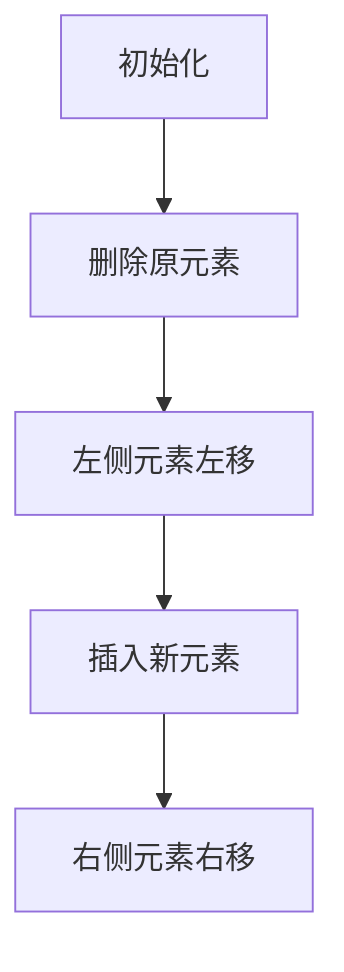

# 题目信息

# [USACO23OPEN] Milk Sum S

## 题目描述

**注意：本题的时间限制为 4 秒，是默认时间限制的 2 倍。**

Farmer John 的 $N$ 头奶牛的产奶量为整数 $a_1, \dots, a_N$。也就是说，第 $i$ 头奶牛每分钟产 $a_i$ 单位的牛奶。

每天早上，Farmer John 会将所有 $N$ 头奶牛连接到谷仓的挤奶机上。他需要依次断开连接，将奶牛送去进行日常锻炼。第一头奶牛在挤奶 1 分钟后被断开连接，第二头奶牛在再挤奶 1 分钟后被断开连接，依此类推。由于第一头奶牛（假设是奶牛 $x$）只在挤奶机上停留了 1 分钟，她总共贡献了 $a_x$ 单位的牛奶。第二头奶牛（假设是奶牛 $y$）在挤奶机上停留了总共 2 分钟，因此贡献了 $2a_y$ 单位的牛奶。第三头奶牛（假设是奶牛 $z$）贡献了 $3a_z$ 单位的牛奶，依此类推。设 $T$ 表示 Farmer John 以最优顺序断开奶牛连接时，可以收集到的最大总牛奶量。

Farmer John 很好奇，如果某些奶牛的产奶量发生变化，$T$ 会如何变化。对于每个由两个整数 $i$ 和 $j$ 指定的 $Q$ 个查询，请计算如果将 $a_i$ 设置为 $j$，新的 $T$ 值会是多少。注意，每个查询都是独立的临时变化，即在考虑下一个查询之前，$a_i$ 会恢复为原始值。

## 说明/提示

对于第一个查询，$a$ 将变为 $[1,1,4,2,6]$，此时 $T = 1 \cdot 1 + 2 \cdot 1 + 3 \cdot 2 + 4 \cdot 4 + 5 \cdot 6 = 55$。

对于第二个查询，$a$ 将变为 $[1,8,4,2,6]$，此时 $T = 1 \cdot 1 + 2 \cdot 2 + 3 \cdot 4 + 4 \cdot 6 + 5 \cdot 8 = 81$。

对于第三个查询，$a$ 将变为 $[1,10,4,5,6]$，此时 $T = 1 \cdot 1 + 2 \cdot 4 + 3 \cdot 5 + 4 \cdot 6 + 5 \cdot 10 = 98$。

$1 \leq N \leq 1.5 \cdot 10^5$，$0 \leq a_i \leq 10^8$，$1 \leq Q \leq 1.5 \cdot 10^5$，$0 \leq j \leq 10^8$。

- 输入 2-4：$N, Q \leq 1000$。
- 输入 5-11：没有额外限制。

## 样例 #1

### 输入

```
5
1 10 4 2 6
3
2 1
2 8
4 5
```

### 输出

```
55
81
98
```

# AI分析结果


### 💡 Kay的C++算法解析：Milk Sum S 深入学习指南 💡

> 让我们一起探索USACO23Open的经典题目，掌握高效处理动态数组排序与加权和的技巧！

---

## 1. 题目解读与核心算法识别

✨ **本题主要考察**：`编程技巧应用`（排序优化 + 前缀和 + 二分查找）

🗣️ **初步分析**：
> 本题核心在于动态维护排序数组的加权和。想象你有**一队按身高排序的奶牛**，每次临时替换一头奶牛后，需要快速重新计算队伍总价值（身高×位置）。解题关键分三步：
> 1. **定位原元素**：在排序数组中找到被修改奶牛的原位置
> 2. **计算移除影响**：删除该奶牛后，后续奶牛位置前移
> 3. **插入新元素**：将新值插入合适位置，后续奶牛后移
>
> 通过**前缀和数组**快速计算区间和，配合**二分查找**确定插入位置，将时间复杂度优化至O(Q log n)。在可视化设计中，我们将用：
> - **像素方块**表示奶牛，高度对应产奶量
> - **高亮移动路径**显示元素位置变化
> - **8-bit音效**标记关键操作（删除/插入/计算）

---

## 2. 精选优质题解参考

**题解一（DreamLand_zcb）**
* **亮点**：  
  ▶️ 图解清晰展示元素删除/插入的位置变化  
  ▶️ 精准处理位置偏移量（`pos > P[a[x]]`的特殊判断）  
  ▶️ 利用`map`记录原位置避免重复排序  
  ▶️ 前缀和优化区间计算，逻辑严密无冗余

**题解二（Nuyoah_awa）**
* **亮点**：  
  ▶️ 创新性分治策略（改大/改小分类处理）  
  ▶️ 边界处理完善（新值处于原位置相邻区间的特判）  
  ▶️ 代码模块化强，结构体存储原始位置信息  
  ▶️ 提供强测试数据验证鲁棒性

**题解三（_Above_the_clouds_）**
* **亮点**：  
  ▶️ 最简实现（仅30行核心代码）  
  ▶️ 双二分查找定位原位置/新位置  
  ▶️ 前缀和计算极致优化（`s[p-1]-s[l-1]`）  
  ▶️ 位置判断逻辑简洁（`if(p>=l)`二分支）

---

## 3. 核心难点辨析与解题策略

### 🔑 难点1：动态维护排序数组
* **分析**：  
  修改元素后需保证数组有序性。通过**两次二分查找**：
  - 第一次：定位原元素在排序数组中的位置`P`
  - 第二次：查找新值`y`的插入位置`pos`
  *💡 学习笔记*：`upper_bound`比`lower_bound`更安全（严格大于定位）

### 🔑 难点2：位置偏移量补偿
* **分析**：  
  删除元素导致右侧元素**左移**（下标-1），插入导致右侧**右移**（下标+1）。需精确计算：
  ```math
  ΔT = -a_x×P + y×pos_{adjusted} ± Σ移动区间值
  ```
  *💡 学习笔记*：当`pos ≤ P`时，需额外扣除原元素值（避免重复计算）

### 🔑 难点3：区间和高效计算
* **分析**：  
  预处理**前缀和数组**`s[]`，使得：
  - 左移区间和 = `s[P-1] - s[pos-1]`
  - 右移区间和 = `s[n] - s[pos-1]`
  *💡 学习笔记*：前缀和将O(n)区间计算优化为O(1)

### ✨ 解题技巧总结
- **技巧1 问题分解**：将修改拆解为"删除→插入"原子操作
- **技巧2 空间换时间**：预处理排序数组/前缀和/位置映射
- **技巧3 边界防御**：特判新值处于原位置相邻区间的情况
- **技巧4 可视化调试**：小规模模拟验证位置偏移逻辑

---

## 4. C++核心代码实现赏析

### 📜 通用核心实现
```cpp
#include <bits/stdc++.h>
#define ll long long
using namespace std;
const int N = 150005;

ll n, Q, a[N], b[N], s[N], sum;
map<ll, ll> pos_map; // 原值→排序后位置

int main() {
    cin >> n;
    for (int i = 1; i <= n; i++) {
        cin >> a[i];
        b[i] = a[i];
    }
    
    sort(b + 1, b + n + 1);
    for (int i = 1; i <= n; i++) {
        s[i] = s[i - 1] + b[i];     // 前缀和预处理
        sum += b[i] * i;             // 初始总价值
        pos_map[b[i]] = i;           // 记录位置映射
    }

    cin >> Q;
    while (Q--) {
        ll idx, new_val;
        cin >> idx >> new_val;
        ll old_pos = pos_map[a[idx]]; // 原位置
        ll new_pos = upper_bound(b + 1, b + n + 1, new_val) - b; // 新插入位置

        ll temp = sum;
        temp -= a[idx] * old_pos;              // 移除原值
        temp -= s[n] - s[old_pos];             // 左侧元素左移
        temp += new_val * (new_pos - (new_pos > old_pos)); // 插入新值
        temp += s[n] - s[new_pos - 1];         // 右侧元素右移
        if (new_pos <= old_pos) temp -= b[old_pos]; // 偏移补偿
        
        cout << temp << endl;
    }
    return 0;
}
```

### 🔍 优质题解片段赏析
**题解一核心（位置偏移补偿）**
```cpp
ans += y*(pos - (pos > P[a[x]]));  // 关键偏移补偿计算
if(pos <= P[a[x]]) ans -= b[P[a[x]]];
```
**解读**：  
▶️ `(pos > P[a[x]])` 智能判断新位置是否在原位置右侧  
▶️ 动态调整乘数（右侧时pos-1）补偿左移  
▶️ 当新位置<=原位置时，需扣除原位置值（避免重复计算）

**题解二核心（分治策略）**
```cpp
if (x < a[opt].val) {  // 改小情况
    int value = ans + (s[opt-1] - s[l-1]);
    value = value - a[opt].val * opt + x * l;
}
```
**解读**：  
▶️ 将修改分为"改小"和"改大"独立处理  
▶️ `s[opt-1] - s[l-1]` 计算左移区间和  
▶️ 统一公式框架 `新T = 原T - 旧贡献 + 新贡献 ± 区间和变化`

---

## 5. 算法可视化：像素动画演示

### 🎮 设计概念：**奶牛排序大作战**（8-bit像素风）
> 通过复古游戏界面直观演示元素删除/插入时的位置偏移效应

**核心演示流程**：


### 🖼️ 关键动画帧
1. **初始化**：  
   - 像素奶牛按高度排序站立，显示前缀和进度条
   - 控制面板：单步执行/自动播放/速度调节

2. **删除元素**：  
   - 目标奶牛闪烁红光 → 爆炸像素特效 + "轰"音效
   - 后续奶牛**左移**：箭头动画 + 位置下标更新

3. **插入新元素**：  
   - 新奶牛从天而降 → 落地震屏特效 + "叮"音效
   - 二分查找过程：屏幕顶部显示搜索区间指针

4. **位置补偿演示**：  
   - 当新位置≤原位置时：原位置奶牛显示黄色警示框
   - 自动播放模式：AI奶牛自主完成全流程（贪吃蛇式移动）

### 🎨 视觉设计
- **奶牛设计**：不同高度对应不同颜色（矮→绿，中→黄，高→红）
- **数据结构可视化**：  
  ```plaintext
  位置: [1][2][3][4][5]  
  奶牛: ▂▅▆▇█
  前缀和: [###.....]
  ```
- **音效系统**：  
  ▶️ 删除：8-bit爆炸声  
  ▶️ 插入：马里奥金币音  
  ▶️ 计算成功：塞尔达解谜音效

---

## 6. 拓展练习与相似问题

### 🔁 通用技巧迁移
前缀和+二分查找的组合适用于：
1. 动态维护有序序列统计量（如中位数）
2. 带修改的区间查询问题
3. 实时数据流排序（如排行榜更新）

### 📚 推荐练习
1. **洛谷 P1908** - 逆序对  
   → 巩固归并排序与分治思想
   
2. **洛谷 P3368** - 树状数组模板  
   → 掌握动态前缀和高效维护

3. **洛谷 P5149** - 会议座位  
   → 强化排序/映射/快速重新计算

---

## 7. 学习心得与经验分享

> **经验摘录（DreamLand_zcb）**：  
> *"十年OI一场空，不开long long见祖宗！位置偏移补偿判断极易遗漏，建议用小规模数据模拟验证"*

**Kay的总结**：  
1. **防御性编程**：  
   - 值域>10⁸ → 全程`long long`  
   - 位置映射使用`map`避免越界
   
2. **验证技巧**：  
   - 制作3×3矩阵手动演算  
   - 对比改大/改小/边界值输出

3. **调试核心**：  
   ```cpp
   printf("old_pos=%d new_pos=%d Δ1=%lld Δ2=%lld\n", ...)
   ```  
   实时打印位置变化量，快速定位计算漏洞

---

通过本指南，相信大家已掌握动态维护排序数组的核心技巧。记住：优秀的算法 = 清晰的问题分解 + 高效的数据结构 + 严谨的边界处理！下次挑战再见！🚀

---
处理用时：128.18秒