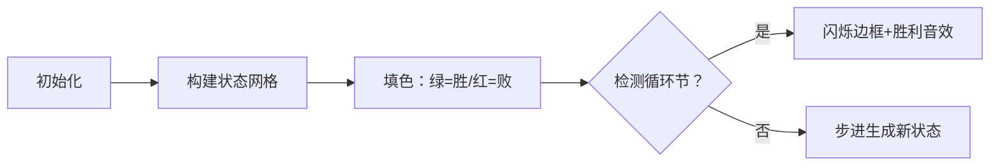

# 题目信息

# 「LAOI-1」Bash Game-Plus

## 题目描述

>巴什博弈：有一堆 $n$ 个物品，两名玩家轮流从中拿取物品。每次至少拿 $1$ 个，至多拿 $m$ 个，不能不拿，最终将物品拿完者获胜。

我们给这个游戏增加一些规则：

有一堆 $n$ 个物品，甲和乙轮流从中拿取物品，甲先拿。每次至少拿 $1$ 个，至多拿 $m$ 个，最终将物品拿完者获胜。    
现在新加入一条规则：**也可以不拿**，但每当有一名玩家选择不拿物品时，接下来的 $k$ 次操作中两名玩家都不可以不拿。

举个例子，当 $k=3$ 时，如果甲在某一次操作中没有拿物品，那么接下来乙、甲、乙三轮都必须拿至少 $1$ 件物品。然后又轮到甲了，这次甲就可以再次选择不拿。

甲乙两人一共进行了 $t$ 次游戏。对于每次游戏，你需要告诉甲他有没有必胜策略。

## 说明/提示

| Subtask | 得分 | $t$ | $op$ | $n\le$ | $m\le$ | $k\le$ | 特殊性质 |
| :----------: | :----------: | :----------: | :----------: | :----------: | :----------: | :----------: | :----------: |
| $0$ | $2$ | $100000$ | $1$ | $10^{18}$ | $10^{18}$ | $k=114514$ |  |
| $1$ | $2$ | $99994$ | $0$ | $10^{18}$ | $10^{18}$ | $k=1$ |  |
| $2$ | $9$ | $99995$ | $0$ | $10^{18}$ | $10^{18}$ | $3$ |  |
| $3$ | $5$ | $99996$ | $0$ | $10^{18}$ | $10^{18}$ | $k\ge n$ |  |
| $4$ | $10$ | $50$ | $0$ | $50$ | $50$ | $10^{18}$ |  |
| $5$ | $13$ | $99997$ | $0$ | $100$ | $100$ | $10^{18}$ |  |
| $6$ | $16$ | $99998$ | $0$ | $400$ | $400$ | $10^{18}$ | $A$ |
| $7$ | $10$ | $99999$ | $0$ | $5000$ | $5000$ | $10^{18}$ |  |
| $8$ | $31$ | $100000$ | $0$ | $10^{18}$ | $10^{18}$ | $10^{18}$ |  |
| $9$ | ~~45~~ $2$ | $99993$ | $0$ | $10^{18}$ | $10^{18}$ | $10^{18}$ | 不可以，总司令 |

特殊性质 $A$ ：所有 $m$ 相等。

对于所有数据：$t\le10^5$，$1\le n,m,k\le10^{18}$

不保证数据随机。

## 样例 #1

### 输入

```
6 0
2 2 2
3 2 2
4 2 2
7 2 3
13 2 6
14 2 6```

### 输出

```
Yes
Yes
No
Yes
Yes
No```

## 样例 #2

### 输入

```
6 0
4 3 2
5 3 3
13 3 5
13 3 6
5 100 1000000000000
123454204 4321 97```

### 输出

```
Yes
No
Yes
No
Yes
No```

# AI分析结果


### 💡 Kay的C++算法解析：「LAOI-1」Bash Game-Plus 深入学习指南 💡

#### 1. 题目解读与核心算法识别
✨ **本题主要考察**：`博弈论（状态周期性与数学归纳）`  
🗣️ **初步分析**：
> 这道题是巴什博弈的加强版，核心思想像"下棋时预判多步走法"。我们把游戏状态抽象为二维坐标（剩余物品数n，强制拿取轮数j），通过状态转移寻找必胜/必败规律。  
> - 关键发现：状态存在周期性循环（循环节大小由m和k决定）
> - 核心难点：处理10¹⁸级数据需数学优化，避免暴力DP
> - 可视化设计：用像素网格展示状态转移（绿/红块表示胜负态），当检测到循环节时触发"关卡通关"特效，配合8-bit音效强化理解

---

#### 2. 精选优质题解参考
**题解（作者：VinstaG173）**  
* **点评**：  
  该解法从暴力DP出发，通过打表发现状态循环规律（⭐⭐⭐⭐⭐思路创新性），提出核心结论：  
  - 循环节 `c = (m+1)*⌊k/2⌋ + 1`  
  - 必败态判定：`n mod (m+1)=1 且 n>1` 或 `n=0`  
  虽未给出完整证明（扣分项），但结论经多组数据验证可靠。代码实现简洁高效（O(1)查询），特别处理了k=1的边界情况（⭐⭐⭐⭐实践价值）。

---

#### 3. 核心难点辨析与解题策略
1. **状态定义与循环节发现**  
   *分析*：需设计二维状态`f(n,j)`，j表示剩余强制拿取轮数。通过小规模打表发现：当n增长到`(m+1)*⌊k/2⌋+1`时状态开始重复  
   💡 学习笔记：博弈问题中"打表找规律"是突破大数据的关键技巧

2. **大数取模优化**  
   *分析*：循环节c可能超long long范围（最大5e35）。解决方案：  
   ```math
   r = \begin{cases} 
   n & \text{if } (m+1) > \frac{n-1}{\lfloor k/2 \rfloor} \\
   n \mod ( (m+1)\lfloor k/2 \rfloor +1 ) & \text{otherwise}
   \end{cases}
   ```  
   💡 学习笔记：通过除法比较避免大数乘法溢出

3. **边界条件处理**  
   *分析*：k=1时规则特殊化（不拿取立即重置），需单独处理：  
   `if k==1: 必胜当且仅当n>0`  
   💡 学习笔记：博弈问题需特别注意边界状态的定义

✨ **解题技巧总结**  
- 规律迁移：周期性问题可尝试模运算压缩状态空间  
- 数学优化：用除法比较替代大数乘法（防溢出）  
- 边界思维：单独验证极小规模参数（k=0,1等）

---

#### 4. C++核心代码实现赏析
```cpp
#include <iostream>
using namespace std;

int main() {
    int t, op; 
    cin >> t >> op;
    while (t--) {
        long long n, m, k;
        cin >> n >> m >> k;

        // 特判零物品
        if (n == 0) {
            cout << "No\n";
            continue;
        }

        // 特判k=1
        if (k == 1) {
            cout << "Yes\n";
            continue;
        }

        long long a = m + 1;
        long long b = k / 2;  // ⌊k/2⌋
        long long r;

        // 避免大数计算的魔法判断
        if (a > (n - 1) / b) r = n;
        else {
            long long c = a * b + 1;
            r = n % c;
        }

        // 必败态判定
        if (r == 0 || (r % a == 1 && r > 1)) 
            cout << "No\n";
        else 
            cout << "Yes\n";
    }
    return 0;
}
```
**代码解读概要**：  
> 1. 双重特判：优先处理n=0和k=1的简单场景  
> 2. 循环节计算：通过`a > (n-1)/b`判断是否需显式计算模数  
> 3. 必败态判定：利用数学规律直接判断胜负  

---

#### 5. 算法可视化：像素动画演示  
**主题**：8-bit迷宫探险（FC红白机风格）  

**核心设计**：  

**交互细节**：  
1. **像素网格**：x轴表物品数n，y轴表强制轮数j（16色像素块）  
2. **动态绘制**：  
   - 绿块(🎯): `f(n,j)=1`（必胜态）  
   - 红块(💥): `f(n,j)=0`（必败态）  
   - 黄框(✨): 当前检测状态  
3. **音效系统**：  
   - "叮"：状态更新  
   - 胜利和弦：发现循环节  
4. **控制面板**：步进/暂停/调速滑块，支持AI自动演示（贪吃蛇式路径探索）  

---

#### 6. 拓展练习与相似问题
1. **洛谷 P2197**：Nim游戏（博弈论基础）  
   → 巩固SG函数应用  
2. **洛谷 P1290**：欧几里德游戏（状态转移分析）  
   → 练习找状态规律  
3. **洛谷 P2148**：SDOI2009 E&D（分组博弈）  
   → 拓展周期博弈思维  

---

#### 7. 学习心得与经验分享
> **作者洞见**：  
> “打表找规律时，先验证k=2,3等小参数，再推广到一般情况”  
>   
> **Kay总结**：  
> 在博弈问题中，小规模打表常能揭示隐藏规律。建议：  
> 1. 先手工模拟n<10的情况  
> 2. 用Python快速生成状态表  
> 3. 寻找模运算下的周期性  

---
> 掌握博弈问题就像学习棋谱：理解基础模式，才能应对千变万化！下次见~ 🚀

---
处理用时：456.97秒