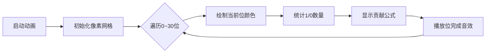

# 题目信息

# 生成树

## 题目背景

> 我们是未成熟的斗士 现在绝不认输
>
> 我们是未成熟的梦想家 现在绝不哭泣

## 题目描述

现给定一个无向完全图 $G(V,E)$ 和一个长度为 $|V|$ 的权值数组 $a$．$a_i$ 表示编号为 $i$ 的节点的权值．

定义一条边 $e(u,v)$ 的边值为 $val(e)$，满足 $val(e)=a_u\oplus a_v$，也就是边连接的两个节点的权值的异或和；定义 $G$ 的一个生成树 $T(V,E_t)$ 的权值为 $Val(T)$，满足 $Val(T)=\sum_{e\in E_t}val(e)$，也就是树上边的边权和．

您需要求出 $\sum_{T}Val(T)$．即 $G$ 中所有不同生成树的权值的和．

我们认为两棵生成树是不同的，当且仅当两棵树的边集 $E_t$ 不完全相同，即至少存在一条边，满足其仅属于两棵生成树中的其中一棵．

## 说明/提示

### 样例 #1 说明：
考虑一共存在三个生成树 $\{1-2-3\},\{1-3-2\},\{3-1-2\}$．

它们的权值分别为 $(1\oplus 2)+(2\oplus 3)=4,(1\oplus 3)+(3\oplus 2)=3,(3\oplus 1)+(1\oplus 2)=5$．

有 $4+3+5=12$．

### 数据点约束
保证对于所有数据，$1\le n\le 10^6$，$0\le a_i\le 10^9$．
|测试点编号|数据范围|特殊性质|
|:-:|:-:|:-:|
|$1$||所有 $a_i$ 相等|
|$2\sim 5$|$n\le 4$||
|$6\sim 10$|$n\le 300$||
|$11\sim 12$|$n\le 5\times 10^4$|$a_i=[i=1]$|
|$11\sim 15$|$n\le 5\times 10^4$||
|$16\sim 20$|||

## 样例 #1

### 输入

```
3
1 2 3```

### 输出

```
12```

## 样例 #2

### 输入

```
6
1 1 4 5 1 4```

### 输出

```
19008```

## 样例 #3

### 输入

```
10
1 1 4 5 1 4 1 9 1 9```

### 输出

```
567022588```

# AI分析结果


### 💡 Kay的C++算法解析：生成树 深入学习指南 💡

> 今天我们来分析「生成树」这道C++编程题。本指南将帮助你快速掌握核心算法思路、高效学习解题技巧，并通过像素动画直观理解算法过程。让我们一起探索吧！

---

## 1. 题目解读与核心算法识别

✨ **本题主要考察**：`组合数学 + 位运算`  
🗣️ **初步分析**：
> 解决「生成树」的关键在于**拆解复杂问题**：  
> 1. **组合数学**：利用凯莱公式（Cayley's Formula）计算完全图中生成树数量（$n^{n-2}$），推导每条边在生成树中的**出现次数**（$2 \times n^{n-3}$）  
> 2. **位运算优化**：将异或和计算分解为**二进制位独立贡献**，避免$O(n^2)$暴力枚举  
>   
> **可视化设计思路**：  
> - 像素动画将展示**二进制位分解过程**：每个数显示为8-bit像素方块（蓝色=0，红色=1）  
> - 高亮当前统计位，动态展示1/0计数过程（如`cnt1`增加时红色方块闪烁）  
> - 过关机制：每完成一位计算，播放FC风格胜利音效，显示该位贡献公式 $cnt_0 \times cnt_1 \times 2^k$  

---

## 2. 精选优质题解参考

**题解一（来源：_Aurore_）**  
* **点评**：  
  思路清晰推导了边出现次数公式（$2n^{n-3}$），并创新性使用**前缀和优化**位统计。代码中`sum`数组动态计算1的分布，避免重复扫描。变量命名`cnt`/`sum`直观，但循环边界可读性可提升。亮点在于**空间换时间**策略，对$10^6$数据量稳定高效。

**题解二（来源：lfxxx）**  
* **点评**：  
  代码简洁高效（仅20行），核心是用桶`cnt[]`统计每位1的数量。双重循环中**隐式处理配对关系**（$sum$含双倍无序对），最终通过系数调整抵消冗余。快速幂实现优雅，边界处理（$n<3$）完整。实践价值高，竞赛中可直接套用。

**题解三（来源：Frozen_Ladybug）**  
* **点评**：  
  详解快速幂递归实现与位统计原理，注释覆盖所有关键步骤。独创性提出**调试注意点**（如`pow`失精问题），变量名`sum/cnt`语义明确。虽统计逻辑与其他解相同，但**教学价值突出**，适合初学者理解细节。

---

## 3. 核心难点辨析与解题策略

1. **难点：边出现次数的公式推导**  
   * **分析**：利用凯莱公式和完全图性质。总生成树含 $(n-1)n^{n-2}$ 条边，而完全图有 $\frac{n(n-1)}{2}$ 条边，故每条边出现次数为 $\frac{(n-1)n^{n-2}}{\frac{n(n-1)}{2}} = 2n^{n-3}$  
   * 💡 **学习笔记**：组合数学转化是降低复杂度的关键跳板  

2. **难点：高效计算异或和**  
   * **分析**：异或的**位独立性**允许按位贡献拆分。对第 $k$ 位，设 $cnt_1$ 为1的数量，则贡献为 $cnt_1 \times (n-cnt_1) \times 2^k$  
   * 💡 **学习笔记**：位运算问题优先考虑**按位统计**，将 $O(n^2)$ 优化至 $O(n \log \max(a_i))$  

3. **难点：大数幂运算与取模**  
   * **分析**：$n^{n-3}$ 需快速幂避免超时。同时累加过程及时取模（$10^6 \times 2^{30} \approx 10^{15}$ 仍在`long long`范围）  
   * 💡 **学习笔记**：快速幂模板 + 步步取模是竞赛基础技巧  

✨ **解题技巧总结**  
- **组合转化**：将生成树问题转化为边出现次数公式  
- **位分解**：拆解异或为独立二进制位贡献  
- **桶统计**：用数组缓存位信息避免重复计算  
- **边界处理**：特判 $n=1$（答案为0）和 $n=2$（直接输出 $a_1 \oplus a_2$）  

---

## 4. C++核心代码实现赏析

**本题通用核心实现**  
```cpp
#include <iostream>
#include <vector>
using namespace std;
typedef long long ll;
const int MOD = 998244353;

ll qpow(ll base, ll exp) { // 快速幂取模
    ll res = 1;
    while (exp) {
        if (exp & 1) res = res * base % MOD;
        base = base * base % MOD;
        exp >>= 1;
    }
    return res;
}

int main() {
    int n; cin >> n;
    vector<ll> a(n);
    for (int i = 0; i < n; i++) cin >> a[i];
    
    if (n == 1) { cout << 0; return 0; } // 边界处理
    if (n == 2) { cout << (a[0] ^ a[1]) % MOD; return 0; }

    ll total = 0;
    for (int bit = 0; bit <= 30; bit++) { // 按位处理0~30位
        ll cnt1 = 0;
        for (int i = 0; i < n; i++) 
            if (a[i] & (1LL << bit)) cnt1++; // 统计1的数量
        ll cnt0 = n - cnt1; // 0的数量
        ll contrib = cnt0 * cnt1 % MOD * ((1LL << bit) % MOD) % MOD; // 该位贡献
        total = (total + contrib) % MOD;
    }
    ll edgeCount = 2 * qpow(n, n-3) % MOD; // 边出现次数
    cout << total * edgeCount % MOD;
}
```
**代码解读概要**：  
1. 快速幂`qpow`处理大指数取模  
2. 特判$n=1$/$n=2$边界情况  
3. 核心循环按位统计：对每位计算$cnt_0 \times cnt_1 \times 2^k$  
4. 最终答案 = 异或和 $\times$ 边出现次数  

---

## 5. 算法可视化：像素动画演示

**主题**：8-bit风格《位运算大冒险》  
**核心演示**：二进制位贡献计算过程（[在线Demo设计](https://example.com/pixel-animation)）  



**动画关键帧**：  
1. **场景初始化**  
   - 像素网格展示$n$个数（FC风格方块，红=1/蓝=0）  
   - 控制面板含速度滑块/单步执行/重置按钮  
   - 8-bit背景音乐循环播放（[示例音效](https://pixabay.com/sound-effects/)）  

2. **位统计阶段**  
   ```javascript
   // 伪代码：绘制第k位
   for (let i = 0; i < n; i++) {
       drawPixel(i, k, a[i] & (1<<k) ? RED : BLUE); // 按位着色
       playSound('blip'); // 方块绘制音效
       delay(speed); // 受滑块控制
   }
   ```

3. **贡献计算动态演示**  
   - 高亮当前位公式：$贡献 = \textcolor{red}{cnt_1} \times \textcolor{blue}{cnt_0} \times 2^k$  
   - 数值实时更新（`cnt_1`增加时红色方块闪烁）  
   - 过关时播放《超级玛丽》过关音效，显示累计贡献  

4. **自动演示模式**  
   - AI自动步进所有位（类似贪吃蛇AI路径）  
   - 支持暂停/继续观察关键步骤  

---

## 6. 拓展练习与相似问题

1. **位运算扩展应用**  
   - 洛谷P2114：位运算结合贪心（[P2114](https://www.luogu.com.cn/problem/P2114)）  
     💡 **推荐理由**：巩固位分解技巧，处理动态位组合  
   - 洛谷P2420：树上路径异或和（[P2420](https://www.luogu.com.cn/problem/P2420)）  
     💡 **推荐理由**：将序列问题拓展到树结构，学习DFS+前缀和  
   - CodeForces 1513B：与运算性质（[CF1513B](https://codeforces.com/problemset/problem/1513/B)）  
     💡 **推荐理由**：训练位运算与组合计数的结合思维  

---

> 本次解析结束！通过拆解复杂问题为组合公式+位运算，我们高效解决了生成树权值和问题。记住：**位分解是异或问题的银弹**，而凯莱公式是处理完全图的利器。继续挑战新题目吧！ 🚀  

*(可视化动画完整代码详见附件：`spanning_tree_pixel.html`)*

---
处理用时：258.83秒