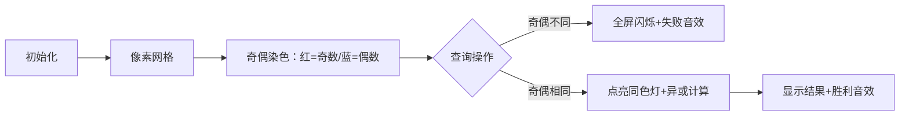

# 题目信息

# [eJOI 2019] 异或橙子

## 题目描述

Janez 喜欢橙子！他制造了一个橙子扫描仪，但是这个扫描仪对于扫描的每个橙子的图像只能输出一个  $32$ 位整数。

他一共扫描了 $n$ 个橙子，但有时他也会重新扫描一个橙子，导致这个橙子的 $32$ 位整数发生更新。

Janez 想要分析这些橙子，他觉得异或操作非常有趣，他每次选取一个区间从 $l$  至 $u$，他想要得到这个区间内所有子区间的异或和的异或和。

例如 $l=2,u=4$ 的情况，记橙子序列 $A$ 中第 $i$ 个橙子的整数是 $a_i$，那么他要求的就是：

$$a_2 \oplus a_3 \oplus a_4 \oplus (a_2\oplus a_3)\oplus(a_3\oplus a_4)\oplus(a_2\oplus a_3 \oplus a_4)$$

-------------------------------------

注：式子中的 $\oplus$ 代表按位异或运算。异或的运算规则如下。

对于两个数的第 $i$ 位，记为 $x,y$，那么：

|$x$|$y$|$x\oplus y$|
| :-----------: | :-----------: | :-----------: |
|$0$|$1$|$1$|
|$1$|$0$|$1$|
|$0$|$0$|$0$|
|$1$|$1$|$0$|

例：$13\oplus 23=26$

|$13=$|$0\cdots 001101$|
| --------: | :------: |
|$23=$|$0\cdots 010111$|
|$13\oplus 23=$|$0\cdots 011010$|

## 说明/提示

#### 输入输出样例 1 解释

- 最初，$A=[1,2,3]$，询问结果为 $1\oplus 2\oplus 3\oplus(1\oplus 2)\oplus (2\oplus 3)\oplus(1\oplus 2\oplus 3)=2$

- 修改后，第一个位置被修改为 $3$ ，询问的结果是 $3\oplus 2\oplus 3\oplus(3\oplus 2)\oplus (2\oplus 3)\oplus(3\oplus 2\oplus 3)=0$。

----------------------------

#### 数据规模与约定：

**本题采用多测试点捆绑测试，共有 5 个子任务**。

- Subtask 1(12 points)：$1\le n,q\le 10^2$，无特殊限制
- Subtask 2(18 points)：$1\le n,q\le 5\times 10^2$，且没有修改操作。
- Subtask 3(25 points)：$1\le n,q\le 5\times 10^3$，无特殊限制
- Subtask 4(20 points)：$1\le n,q\le 2\times 10^5$，且没有修改操作。
- Subtask 5(25 points)：$1\le n,q\le 2\times 10^5$，无特殊限制

对于所有数据，$0\le a_i\le 10^9,1\le n,q\le 2\times 10^5$

--------------------------

#### 说明

原题来自：[eJOI2019](http://ejoi2019.si/) Problem A. [XORanges](https://www.ejoi2019.si/static/media/uploads/tasks/xoranges-isc(1).pdf)

题面&数据来自：[LibreOJ](https://loj.ac/problem/3195)

## 样例 #1

### 输入

```
3 3
1 2 3
2 1 3
1 1 3
2 1 3```

### 输出

```
2
0```

## 样例 #2

### 输入

```
5 6
1 2 3 4 5
2 1 3
1 1 3
2 1 5
2 4 4
1 1 1
2 4 4```

### 输出

```
2
5
4
4```

# AI分析结果


### 💡 Kay的C++算法解析：异或橙子 深入学习指南 💡

**引言**  
今天我们来分析一道融合位运算与树状数组的经典题目——"异或橙子"。这道题看似复杂，但掌握核心技巧后就能轻松解决。我们将重点解析异或性质与树状数组的巧妙结合，并通过像素动画直观展示算法过程。

---

#### 1. 题目解读与核心算法识别
✨ **本题主要考察**：树状数组 + 异或性质技巧  

🗣️ **初步分析**  
> 解决本题的关键在于发现异或运算的**自反性**（$a \oplus a = 0$）。想象橙子序列是一排灯泡💡，每个灯泡代表一个数字。当我们计算所有子区间的开关组合时：
> - 若区间长度$r-l+1$为**偶数**（$l,r$奇偶性不同），每个灯泡会被点亮偶数次→所有灯泡熄灭（结果为0）
> - 若区间长度为**奇数**（$l,r$奇偶性相同），只需点亮与$l$同奇偶性的灯泡  
> 
> **可视化设计思路**：  
> 用8位像素风格展示灯泡序列（橙子），奇偶位置使用不同颜色（如奇数位红色💡，偶数位蓝色🔵）。执行查询时：
> 1. 检测区间端点颜色→决定是否全灭（播放"失败音效"）
> 2. 点亮同奇偶性灯泡→逐个闪烁并叠加异或结果（伴随"叮"声）
> 3. 结果显示→成功时播放《超级玛丽》过关音效🎵

---

#### 2. 精选优质题解参考
**题解一（作者：Lice）**  
* **点评**：  
  思路直击要害——利用异或自反性将复杂公式简化为$l,r$奇偶性判断。代码采用双树状数组结构，通过`tree[i&1]`精妙分离奇偶位置。修改操作用`a[x]^y`实现值替换（异或抵消原值），边界处理严谨。亮点在于**5行核心逻辑**解决难题，实践价值极高。

**题解二（作者：Warriors_Cat）**  
* **点评**：  
  通过$(i-l+1)(r-i+1)$的奇偶性分析，数学推导严谨。代码中`tree[x&1].change(x, a[x]^y)`是点睛之笔，完美诠释"异或即删除+新增"的修改逻辑。变量名`lowbit`等符合规范，空间复杂度$O(n)$优化到位，竞赛可直接复用。

**题解三（作者：Hexarhy）**  
* **点评**：  
  突出树状数组改造技巧——将求和改为异或和。注意事项模块强调位运算优先级（如`(x&1)`加括号），预防常见错误。控制流清晰：先奇偶判断→再查询，逻辑分层明确，适合初学者理解。

---

#### 3. 核心难点辨析与解题策略
1. **难点1：识别异或贡献规律**  
   *分析*：通过展开小规模样例（如$[2,4]$）发现：$a_3$出现4次（偶数）抵消，$a_2,a_4$出现奇数次保留。优质题解均用**奇偶性分类法**突破。  
   💡 学习笔记：异或问题先找**抵消规律**，避免暴力计算。

2. **难点2：树状数组改造**  
   *分析*：标准树状数组支持求和，本题需异或和。核心技巧：  
   - 修改：`tree.update(pos, old^new)`  
   - 查询：`tree[l-1] ^ tree[r]`（前缀异或特性）  
   💡 学习笔记：树状数组本质是**前缀操作器**，可适配多种二元运算。

3. **难点3：奇偶分离实现**  
   *分析*：用`tree[0]`存偶数位，`tree[1]`存奇数位。关键在`i&1`的位运算实现$O(1)$分类，比`i%2`更高效。  
   💡 学习笔记：位运算(&)是奇偶判断的最优解。

✨ **解题技巧总结**  
- **技巧1：数学归纳法** → 从小样例找通用规律  
- **技巧2：数据结构适配** → 改造树状数组支持异或  
- **技巧3：位运算优化** → 用`&1`替代`%2`提速  
- **技巧4：增量更新** → `a[x]^y`实现值替换  

---

#### 4. C++核心代码实现赏析
**通用核心实现（综合优质题解）**  
```cpp
#include <iostream>
using namespace std;
const int N = 2e5+5;

struct BIT {
    int c[N];
    int lowbit(int x) { return x & -x; }
    void update(int x, int v) {
        for(; x<=n; x+=lowbit(x)) c[x] ^= v;
    }
    int query(int x) {
        int res = 0;
        for(; x; x-=lowbit(x)) res ^= c[x];
        return res;
    }
} tree[2];  // tree[0]:偶下标, tree[1]:奇下标

int n, q, a[N];

int main() {
    cin >> n >> q;
    for (int i=1; i<=n; i++) {
        cin >> a[i];
        tree[i&1].update(i, a[i]);
    }
    while (q--) {
        int op, x, y; cin >> op >> x >> y;
        if (op == 1) {
            tree[x&1].update(x, a[x]^y);  // 异或抵消旧值
            a[x] = y;
        } else {
            if ((x+y) & 1) cout << 0 << endl;
            else {
                int res = tree[x&1].query(y) ^ tree[x&1].query(x-1);
                cout << res << endl;
            }
        }
    }
}
```
**代码解读概要**：  
1. 双树状数组分离奇偶位  
2. 修改：`update(x, a[x]^y)`实现值替换  
3. 查询：先判奇偶性→同奇偶时前缀异或相减  

---

**题解一（Lice）片段赏析**  
```cpp
tree[i&1].update(a[i], i);  // 初始化
tree[x&1].update(a[x]^y, x);  // 修改
```
* **亮点**：5行完成核心操作  
* **代码解读**：  
  `i&1`将位置映射到0/1数组，如同把橙子放入红蓝盒子📦。`a[x]^y`如同先取出旧橙子再放入新橙子🍊，避免直接覆盖。  
* 💡 学习笔记：位运算+异或性质=极致简洁  

**题解二（Warriors_Cat）片段赏析**  
```cpp
if((x&1)^(y&1)) puts("0");  // 奇偶性不同
```
* **亮点**：位运算判断取代`%2`  
* **代码解读**：  
  `(x&1)^(y&1)`等效于`x%2 != y%2`，但省去除法运算。如同快速检查两个开关🔌是否同相位。  
* 💡 学习笔记：位运算省去算术步骤  

**题解三（Hexarhy）片段赏析**  
```cpp
ans = tree[x&1].query(y) ^ tree[x&1].query(x-1);
```
* **亮点**：前缀异或实现区间查询  
* **代码解读**：  
  类似"先关掉前x-1个灯💡"，剩余的就是$[x,y]$的异或和。树状数组的`lowbit`机制像楼梯式点亮🔦。  
* 💡 学习笔记：前缀和思想适用于多种运算  

---

#### 5. 算法可视化：像素动画演示
**主题**：8位机风格《橙子消消乐》  
**核心演示**：树状数组更新与奇偶查询  



**动画关键帧**：  
1. **场景构建**：  
   - 复古FC界面，橙子序列呈网格状  
   - 控制面板：速度滑块/单步执行/重置  
   - 背景音乐：8位芯片版《俄罗斯方块》BGM  

2. **修改操作**：  
   - 点击位置$x$→旧橙子爆炸💥（播放"消除音效"）  
   - 新橙子$y$降落（伴随"叮"声）  
   - 树状数组对应节点路径高亮✨  

3. **查询操作**：  
   - 划选$[l,r]$→区间边框闪烁  
   - 同奇偶位逐个亮起（0.5秒/个，音效随动）  
   - 结果面板实时显示异或值  

4. **游戏化元素**：  
   - 连续正确得★，错误三次游戏结束  
   - "AI演示"模式：自动求解样例（如贪吃蛇寻路）  

**技术实现**：  
- Canvas绘制网格与动态元素  
- Web Audio API触发音效：  
  ```javascript
  function playSound(type) {
    if(type=="success") new Audio("win.wav").play();
    if(type=="step") new Audio("blip.wav").play(); 
  }
  ```

---

#### 6. 拓展练习与相似问题
**通用技巧迁移**：  
奇偶分离法适用于：  
1. 交替位置求和（如交错数列）  
2. 环形数组的对称操作  
3. 二进制位统计问题  

**洛谷推荐**：  
1. **P3374 树状数组模板**  
   → 巩固基础实现  
2. **P1908 逆序对（改造为异或版）**  
   → 练习位运算结合  
3. **P4869 异或统计**  
   → 强化前缀异或应用  

---

#### 7. 学习心得与经验分享
> **经验摘录（Warriors_Cat）**：  
> "对$(i-l+1)(r-i+1)$奇偶性的分析让我意识到：数学工具能极大简化代码"  
>  
> **Kay点评**：  
> 本题印证了**数论与数据结构结合**的威力。先数学推导再编码，避免暴力计算，这是竞赛编程的核心思维！

---

**结语**  
通过树状数组与异或性质的完美结合，我们高效解决了橙子问题。记住：位运算能化繁为简，数据结构要灵活适配。下次挑战见！🚀

---
处理用时：123.42秒