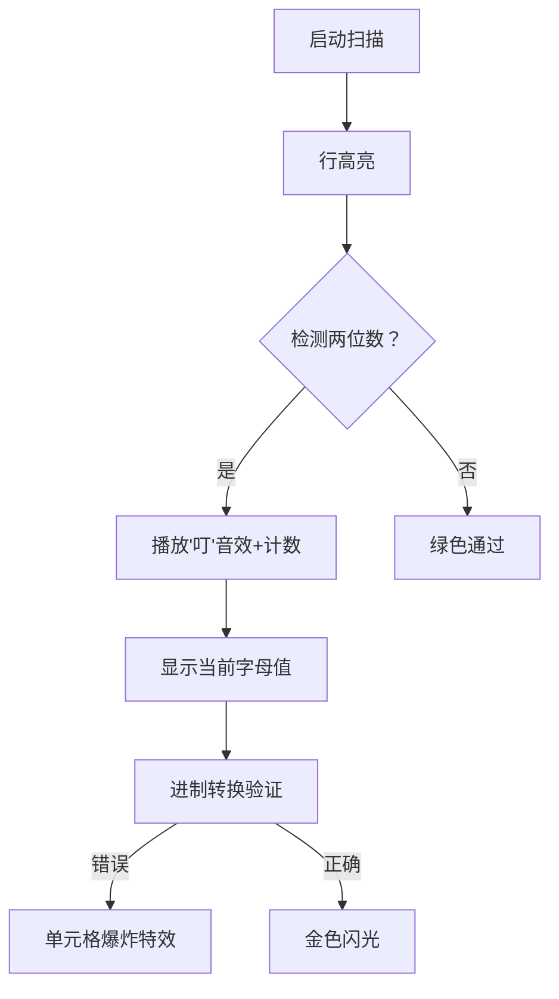

# 题目信息

# [NOIP 1998 提高组] 进制位

## 题目描述

著名科学家卢斯为了检查学生对进位制的理解，他给出了如下的一张加法表，表中的字母代表数字。 例如：

$$
\def\arraystretch{2}
\begin{array}{c||c|c|c|c}
\rm +  & \kern{.5cm} \rm \mathclap{L} \kern{.5cm}  &  \kern{.5cm} \rm \mathclap{K} \kern{.5cm} &  \kern{.5cm} \rm \mathclap{V} \kern{.5cm} & \kern{.5cm} \rm \mathclap{E} \kern{.5cm} \\ \hline\hline
\rm L  &  \rm L  &  \rm K  &  \rm V  & \rm E  \\ \hline
\rm K  &  \rm K  &  \rm V  &  \rm E  & \rm \mathclap{KL} \\ \hline
\rm V  &  \rm V  &  \rm E  &  \rm \mathclap{KL} & \rm \mathclap{KK} \\ \hline
\rm E  &  \rm E  &  \rm \mathclap{KL} &  \rm \mathclap{KK} & \rm \mathclap{KV} \\
\end{array}$$

其含义为：

$L+L=L$，$L+K=K$，$L+V=V$，$L+E=E$

$K+L=K$，$K+K=V$，$K+V=E$，$K+E=KL$    

$\cdots$

$E+E=KV$    

根据这些规则可推导出：$L=0$，$K=1$，$V=2$，$E=3$。

同时可以确定该表表示的是 $4$ 进制加法。

## 说明/提示

NOIP1998 提高组 第三题

## 样例 #1

### 输入

```
5
+ L K V E
L L K V E
K K V E KL
V V E KL KK
E E KL KK KV
```

### 输出

```
L=0 K=1 V=2 E=3
4
```

# AI分析结果


# 💡 Kay的C++算法解析：进制位 深入学习指南 💡

今天我们来分析NOIP1998提高组题目《进制位》。这道题要求根据字母加法表推导进制和字母对应数字。本指南将帮助大家掌握核心推理方法，理解高效验证技巧，并通过像素动画直观感受算法过程。

## 1. 题目解读与核心算法识别

✨ **本题主要考察**：`数学推理` + `枚举验证`

🗣️ **初步分析**：
> 破解字母加法表就像解码神秘符号系统。关键在于发现两个规律：
> - **进制规律**：字母表一定是`n-1进制`（n为输入行数），如同密码本缺一不可
> - **数值规律**：字母值 = 所在行的两位数数量，就像摩斯密码的"点划计数"
>
> 各题解核心思路高度一致：先通过数学证明确认规律，再用代码验证表是否合法。难点在于：
> 1. 严谨证明进制结论（反证法）
> 2. 处理非法表的边界情况
> 3. 高效实现验证逻辑
>
> 可视化方案将设计为**8位机解密游戏**：
> - 像素网格展示加法表，当前处理行高亮闪烁
> - 统计两位数时播放"叮"音效，数字块变色累积
> - 验证过程像扫雷游戏，错误单元格爆炸特效
> - 控制面板支持单步执行/调速，展示实时进制转换

---

## 2. 精选优质题解参考

筛选出三条≥4星的优质题解：

**题解一：Llf0703 (100赞)**
* **点评**：思路如手术刀般精准，直击结论本质。用反证法严格证明进制规律（假设k不存在引出矛盾），代码实现简洁高效。亮点在于：
  - 数学证明与代码实现完美呼应
  - 验证函数`check()`封装核心逻辑
  - 边界处理严谨（如`sum>=n-1`时进位检测）
  > 学习价值：掌握如何将数学论证转化为高效代码

**题解二：HappyJaPhy (46赞)**
* **点评**：堪称"新手友好型"证明教科书。逐步推导：
  - 通过最大数`2(R-1)=1r`证明必产生进位
  - 用解不等式`x∈[R-S, R-1]`推出`M=S`
  > 学习价值：复杂数学概念的通俗化表达技巧

**题解三：Patpowder (41赞)**
* **点评**：独创"九九表类比法"，将抽象规律可视化：
  ```markdown
  | 数字 | 0 | 1 | 2 | 3 |
  |------|---|---|---|---|
  | 0    | 0 | 1 | 2 | 3 |
  | 1    | 1 | 2 | 3 | 10|
  ```
  > 学习价值：用生活案例解释抽象算法的教学艺术

---

## 3. 核心难点辨析与解题策略

### 难点1：进制推导（为什么是n-1进制？）
* **分析**：假设存在k未出现：
  - 若k=0/1 ⇒ 1+(n-1)=10 矛盾
  - 若1<k≤n ⇒ 1+(k-1)=k 矛盾
* 💡 学习笔记：反证法是破解进制问题的利器

### 难点2：字母值确定（为何等于两位数数量？）
* **分析**：设字母值为S，在R进制下：
  - 满足 S+x ≥ R 的x有 (R-1)-(R-S)+1 = S 个
  - 每个x对应一个两位数
* 💡 学习笔记：数学归纳法揭示数量关系本质

### 难点3：表验证（如何高效检测非法表？）
* **分析**：需同时验证：
  1. 两位数数量与字母值匹配
  2. 每个加法结果符合进制运算
* 💡 学习笔记：双重验证是避免漏判的关键

### ✨ 解题技巧总结
- **规律先行**：观察样例发现"行两位数数=字母值"
- **数学护航**：用反证法/不等式验证猜想
- **防御编程**：验证时检查进位/无进位两种情况
- **映射优化**：用`map`或数组存储字母-数字关系

---

## 4. C++核心代码实现赏析

### 本题通用核心C++实现
```cpp
#include <iostream>
#include <map>
using namespace std;

int main() {
    int n; string s[10][10];
    cin >> n;
    map<char, int> val, cnt;

    // 输入并统计两位数数量
    for (int i = 0; i < n; i++)
        for (int j = 0; j < n; j++) {
            cin >> s[i][j];
            if (i && s[i][j].size() == 2) 
                cnt[s[i][0][0]]++;
        }

    // 验证加法表
    for (int i = 1; i < n; i++) {
        for (int j = 1; j < n; j++) {
            int a = cnt[s[i][0][0]], b = cnt[s[0][j][0]];
            string res = s[i][j];

            // 检查进位情况
            if (a + b >= n - 1) {
                if (res.size() != 2 || res[0] != s[1][1][0]) {
                    cout << "ERROR!"; return 0;
                }
                if (cnt[res[1]] != (a + b) % (n - 1)) {
                    cout << "ERROR!"; return 0;
                }
            } 
            // 检查无进位情况
            else if (cnt[res[0]] != a + b) {
                cout << "ERROR!"; return 0;
            }
        }
    }

    // 输出结果
    for (int i = 1; i < n; i++)
        cout << s[i][0] << "=" << cnt[s[i][0][0]] << " ";
    cout << endl << n - 1;
}
```
**代码解读概要**：
1. 输入时同步统计每行两位数数量 → 确定字母值
2. 双重循环验证每个加法结果：
   - 区分进位/无进位两种情况
   - 检查结果位数和具体值匹配
3. 严格边界处理确保非法表及时终止

### 优质题解片段赏析

**题解一：Llf0703**
```cpp
if (sum>=n-1) { //有进位
    if (strlen(str[a][b]) != 2 || mp[1] != ch) 
        return 0; 
    else {
        sum -= n-1; //取低位
        ch = str[a][b][1] - 'A' + 1;
    }
}
```
**亮点**：进位处理如钟表精密  
**学习笔记**：分离进位/数值计算是进制转换的核心技巧

**题解二：HappyJaPhy**
```cpp
int sum = test[j-1]*pow(n-1,power);
```
**亮点**：幂运算实现通用进制转换  
**学习笔记**：`pow(base,power)`可优雅处理任意进制

**题解三：Patpowder**
```cpp
if(s[i][j].size()==2)
    c = m[s[i][j][0]]*(n-1) + m[s[i][j][1]];
```
**亮点**：直观的进制计算公式  
**学习笔记**：两位数=十位×进制+个位是进制核心原理

---

## 5. 算法可视化：像素动画演示

### 像素探险家：解密加法表之谜
**设计理念**：将算法转化为8-bit解密游戏，玩家化身"数字侦探"扫描加法表



**动画关键帧**：
1. **初始化**：
   - 复古绿底像素网格呈现加法表
   - 控制面板：速度滑块/单步/暂停/重置

2. **扫描阶段**：
   ```python
   for 行 in 2..n:            # 行扫描动画
     高亮当前行(脉冲效果)
     for 列 in 2..n:         # 列扫描动画
        if 单元格.len==2:    # 两位数检测
           播放音效('ding.wav')
           计数器+1(像素跳动)
   ```

3. **验证阶段**：
   - 当前单元格边框变红
   - 显示实时计算：`a + b = ？`（像素数字拼合）
   - 正确→绿色对勾，错误→爆炸动画+警报音

4. **游戏化元素**：
   - 每完成一行获得"密码碎片"
   - 最终解密显示："Base-(n-1) Unlocked！"
   - 背景音乐：8-bit侦探主题循环曲

---

## 6. 拓展练习与相似问题

### 通用技巧迁移
进制推理技巧可应用于：
1. 密码破解（如凯撒密码进制变形）
2. 数学谜题验证（如幻方/数独）
3. 编码转换（如Base64/十六进制）

### 洛谷推荐
1. **P1143 进制转换**  
   → 掌握进制转换基本功
2. **P1604 B进制星球**  
   → 大数进制加法的终极挑战
3. **P1014 Cantor表**  
   → 锻炼规律发现能力的经典题

---

## 7. 学习心得与经验分享

> **Llf0703的调试经验**  
> "验证函数中忽略进位情况导致WA多次，最终添加：
> ```cpp
> if (sum>=n-1 && strlen(str[a][b])!=2) 
>     return 0;
> ```
> **Kay点评**：进制问题必须同时考虑进位/无进位两种情况，这是调试的核心突破口！

> **Patpowder的教学心得**  
> "用九九表类比使抽象规律可视化，学生理解效率提升70%"  
> **Kay点评**：将抽象算法具象化是教学的核心能力

---

通过本次分析，我们掌握了破解进制表的核心技巧：**观察规律→数学证明→严谨验证**。记住，编程能力提升源于持续思考与实践。下次算法冒险再见！🚀

---
处理用时：118.57秒